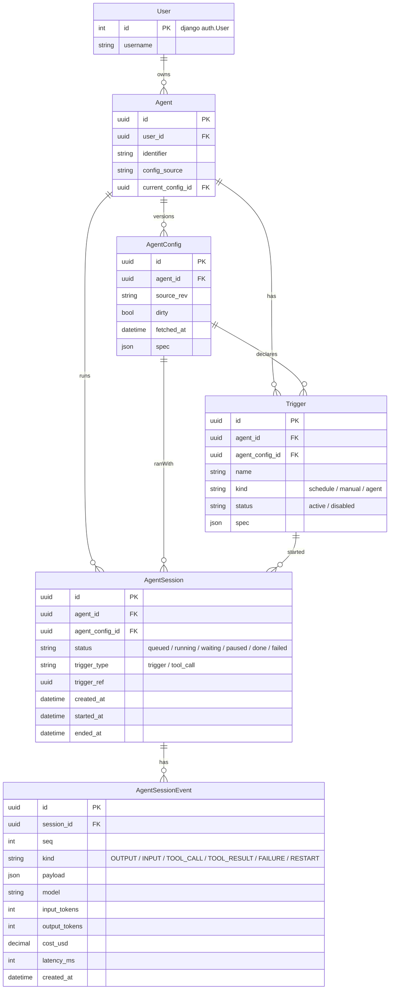

# Chief — Design

## Overview

Chief is an agent orchestrator. The primary goal is to allow multiple agents to be specified and sit and wait for things to be done, then do them.

## Goals

- Agents defined in yaml files
-- Synced from github repos or from file system
-- Agents can update themselves or eachother (and optionally PR back to github)
- Agents can access remote systems
- Agents can get triggered on new items in these remote systems, e.g. new emails
- There is some way to dedupe new things, e.g. a queue where new things come in, and an agent can TAKE it.
- Allow multiple LLM providers, including local
- Allow different agent implementations, so we can later e.g. pull in a Cursor agent to do coding
- Keep the UI as simple as possible, but still allow deep introspection of what is going on. We want the full llm-observability.
- LLM sessins should be resumable


## Non-goals

- We are not building a coding agent (for now)
- Not doing code execution (for now)
- Not building a fancy UI for configuration of the agent. We want to be able to visualize the agents, but config comes from yaml files

## Architecture

### Clean separation

We want to build this application as a set of apps in the backend python project. The apps should
have clearly defined interfaces with clear separation of concerns. Dependencies should only
be in a single direction

### Agent execution & communication

Agents run as **sessions**. Each session executes in a single long-lived Celery
task (on a dedicated agent-runs queue, I/O-bound pool).

- **Checkpointed step loop**: the agent loops one step at a time and persists
  full state to Postgres after each step. State must be reconstructable from the
  DB alone (drives observability + resumability).
- **Keep running**: the task runs continuously while it has work. It only stops
  and yields its worker slot when **waiting for input**. We deliberately do not
  re-queue per step — re-queueing would thrash LLM prompt caches and make runs
  hard to debug.
- **Per-session mailbox** (Redis stream, keyed by session id): inbound actions
  (chat message, pause, resume, tool approval) are POSTed to a normal Django
  view that appends to the mailbox. The agent **drains it at checkpoints** and
  decides to inject context, pause, or abort. Pause = stop after the current
  step and wait (worker slot released); resume = continue.
- **Transport (Option A)**: agent → UI over **SSE** (async Django view tailing
  Redis pub/sub); UI → agent over **htmx POST** to control endpoints. No Django
  Channels for now — the mailbox/event-stream abstractions stay transport-
  agnostic so swapping to websockets later is localized.
- **Triggers/monitors**: Celery beat periodic tasks poll remote systems and push
  deduped items into pipes (separate from agent-run tasks).


### Apps and Data Model

Core entities:

- **User** — **is** Django's `auth.User` (referenced via `AUTH_USER_MODEL`). We
  do not define our own user model nor a wrapper/profile pointing at it; Agents
  FK directly to `auth.User`. Owns many Agents.
- **Agent** — belongs to a User. Holds a stable identifier and the location its
  config is fetched from (e.g. github repo + path, or local fs). Has many
  AgentConfigs but exactly one *current*.
- **AgentConfig** — a concrete, versioned config for an Agent. Created/updated
  from the source (github pull or local edit) and can later be synced back
  (PR). Tracks provenance (source revision, fetched_at, dirty/local-edits).
  Its `spec` is **strongly typed and validated with pydantic** (see
  `AgentConfigSpec` below) — not free-form JSON. Only one is current at a time.
- **Trigger** — a single trigger declared in an AgentConfig spec. Linked to both
  the Agent and the AgentConfig it came from, and **immutable**: when the
  trigger definition in a config changes, a new Trigger row is created rather
  than mutated. Has a `status` (e.g. active/disabled). Triggers are what start
  AgentSessions.
- **AgentSession** — one execution of an Agent, pinned to the exact AgentConfig
  it ran with. Has created_at, started_at, ended_at, status. Records *what
  triggered it* via a reference (a Trigger, or a tool-call event from another
  session — agents triggering agents).
- **AgentSessionEvent** — an ordered, append-only record of something that
  happened in a session: agent OUTPUT, user INPUT, a TOOL_CALL, a TOOL_RESULT,
  and lifecycle events like FAILURE and RESTART. Belongs to one AgentSession.
  Carries per-event **cost accounting** (model, tokens, cost, latency); session
  totals are derived by aggregating its events. This event log is the **source
  of truth** for observability and session resumption.



#### AgentConfig spec (pydantic)

The config `spec` is validated with pydantic on ingest. Tools themselves are
defined in code under `apps.agents` (`tools/`); the spec only declares which
tools and sub-functions a given agent may use. (v0.1: the spec is hardcoded and
assigned on `AgentConfig` creation — see Implementation plan.)

```python
from typing import Literal

from pydantic import BaseModel


class LLMSpec(BaseModel):
    provider: str  # e.g. "openai", "anthropic", "local"
    model: str
    temperature: float | None = None


class TriggerSpec(BaseModel):
    name: str  # stable within the config; identifies the Trigger
    kind: Literal["schedule", "manual", "agent"]
    cron: str | None = None  # when kind == "schedule"


class ToolPermission(BaseModel):
    tool: str  # name of a tool defined in code
    allow: list[str] = ["*"]  # allowed sub-functions
    deny: list[str] = []  # denied sub-functions; wins over allow


class AgentConfigSpec(BaseModel):
    description: str | None = None
    llm: LLMSpec
    system_prompt: str
    triggers: list[TriggerSpec] = []
    tools: list[ToolPermission] = []
```

#### State, cache, and resume

Postgres `AgentSessionEvent` rows are the **source of truth**; Redis only holds
ephemeral cache + transport (live event stream, mailbox). We never assume Redis
is valid:

- **Resume after shutdown**: if a session's task was killed, rebuild working
  state by replaying `AgentSessionEvent` from Postgres — do not trust any
  leftover Redis cache.
- **Frontend attach to a missing session**: if the UI attaches to a session that
  has no Redis data, rebuild that Redis state from `AgentSessionEvent`.
- **Lifecycle as events**: failures and restarts are emitted as
  `AgentSessionEvent` rows (FAILURE, RESTART) so the log fully explains the
  session.

#### Deferred (later sections)

- Pipes / dedup ingest queue.
- Auth, connections, and secret storage for remote systems.
- Concrete tool definitions (the in-code tool registry).

### Components

Django apps with one-directional dependencies (each only imports from the ones
above it). Honors the "clean separation" rule.

- **`apps.agents`** — domain core. `Agent`, `AgentConfig`, `Trigger` models;
  the `AgentConfigSpec` pydantic schema; config ingest (validate spec → persist
  `AgentConfig`, derive `Trigger` rows). Also owns **tool definitions** in a
  `tools/` directory (the in-code tool registry + their types). Rule: **any
  type referenced by `AgentConfigSpec` lives in `agents`** (the spec must not
  depend on `runner`), so tools are declared here even though `runner` invokes
  them. Depends on nothing chief-specific.
- **`apps.sessions`** — `AgentSession`, `AgentSessionEvent`; the append-only
  event log API (append/query) and the **rebuild-state-from-events** helper.
  Depends on `agents`.
- **`apps.bus`** — thin Redis primitives: per-session event **pub/sub** stream
  and per-session **mailbox**. No domain logic. Depends on nothing.
- **`apps.runner`** — the Celery task that executes a session: checkpointed step
  loop; **LLM provider abstraction** in a `providers/` directory (a `base`
  interface + an **OpenAI** implementation for v0.1); tool *invocation* +
  permission enforcement (tools themselves are defined in `agents`); mailbox
  draining; event emission (incl. FAILURE / RESTART) and cost capture. Depends
  on `agents`, `sessions`, `bus`.
- **`apps.web`** — dashboard + session detail (Jinja/htmx/Alpine), SSE view
  tailing `bus`, control endpoints (chat/pause/resume/abort) that write to the
  mailbox and enqueue runner tasks. Depends on all of the above.

Dependency direction: `agents → sessions → runner → web`, with `bus` as a
leaf utility used by `runner` and `web`.

### Data flow

1. Config ingest → `agents` validates spec → upserts `AgentConfig`, creates
   immutable `Trigger` rows. (v0.1: a single **hardcoded** `AgentConfigSpec`
   assigned on `AgentConfig` creation — no yaml/github source yet.)
2. A trigger (manual in v0.1) creates an `AgentSession` (status `queued`) and
   enqueues a runner Celery task.
3. `runner` loads the pinned `AgentConfig`, rebuilds state from
   `AgentSessionEvent`, and runs the step loop — appending events to Postgres
   and publishing them to the `bus` pub/sub stream.
4. The UI opens the session detail page; the SSE view replays existing events
   (rebuilding Redis if needed) then streams live ones over the `bus`.
5. User actions (chat/pause/resume) POST to control endpoints → appended to the
   session mailbox → drained by the runner at the next checkpoint.

## Implementation plan

### v0.1 scope

A single end-to-end vertical slice: **create an agent from a hardcoded spec,
manually start a session, watch it stream, chat with it, and pause/resume it —
with the full event log persisted and resumable.** The first LLM provider is
**OpenAI**.

Explicitly deferred to later versions: config *sources* (yaml from local fs /
github sync / PR-back — v0.1 uses a hardcoded spec), schedule & ingest triggers,
the dedup pipe/queue, auth & secret storage, and a rich tool catalog (v0.1 ships
one or two trivial built-in tools to exercise the tool path).

### Stages

0. **Foundations** — create the app skeletons (`agents`, `sessions`, `bus`,
   `runner`) and their dependency wiring; confirm ASGI/SSE plumbing
   (uvicorn lifespan, an async streaming view spike); switch settings to
   `ASGI_APPLICATION`.
1. **Data model + hardcoded spec** — models + migrations for `agents` and
   `sessions`; `AgentConfigSpec` pydantic + `tools/` registry stub; create an
   `AgentConfig` from a single hardcoded spec (deriving `Trigger`s); register in
   admin.
2. **Session runner (headless)** — the Celery step loop with the OpenAI
   provider (`runner/providers/` base + OpenAI impl); append `AgentSessionEvent`s
   with cost; FAILURE/RESTART events; rebuild-from-events; trigger a session via
   a management command. No UI yet.
3. **Realtime bus** — `bus` pub/sub publish from runner; per-session mailbox;
   runner drains mailbox at checkpoints (chat inject, pause/resume/abort).
4. **UI** — agents/sessions dashboard; session detail with live SSE event
   stream (replay-then-tail), chat box, and pause/resume/abort controls.
5. **Hardening** — verify resume-after-kill and frontend-attach-to-cold-session
   both rebuild correctly; concurrency/queue config for the I/O-bound pool.

## Open questions

- Interrupt-now (cut off an in-progress LLM generation) vs queued injection at
  next checkpoint — start with queued injection only.
