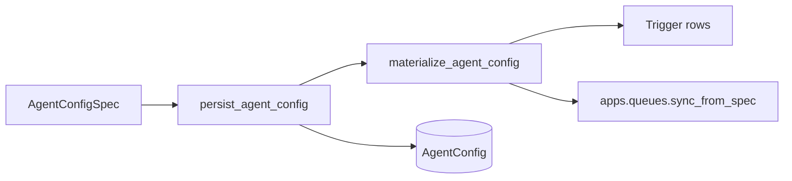

# Chief — Architecture

High-level backend structure and cross-cutting rules. Feature specs live under
`docs/specs/`; this doc is the stable reference for app boundaries and secrets.

---

## Backend layout

```
backend/
  apps/          # Django apps — domain, HTTP, Celery transport
  libs/          # Django-free packages (providers, tools, algorithms)
  chief/         # Project shell (settings, celery, URLs)
```

**Direction:** apps orchestrate; libs compute. Apps import libs; libs never import
`apps.*`. See `AGENTS.local.md` for the per-app import matrix.

| App | Role |
|-----|------|
| `apps.agents` | Agent models, config ingest/materialization, tool wiring |
| `apps.queues` | Agent-scoped queues, sources, items, poll/release tasks |
| `apps.sessions` | Sessions, event log, session services/tasks |
| `apps.runner` | Celery step loop, LLM + tool invocation |
| `apps.bus` | Redis pub/sub + mailbox |
| `apps.keys` | Encrypted credentials (system + user) |
| `apps.web` | Dashboard, SSE, control endpoints |

Each app exposes **`services/queries.py`** (read) and **`services/commands.py`**
(write). Callers use services, not ad-hoc ORM updates.

---

## Libraries (`libs/`)

| Package | Role |
|---------|------|
| `libs/agent_spec` | Pydantic `AgentConfigSpec`, load-time spec migrations (Django-free) |
| `libs/providers` | LLM provider implementations |
| `libs/tools` | Tool definitions + registry |
| `libs/sources` | Source adapter protocol + registry |
| `libs/algorithms` | Reusable algorithms (may call providers) |

Libs stay Django-free. When a lib needs credentials, the **app boundary injects**
callables (`token_supplier`, `secret_supplier`) — libs do not import `apps.keys`.

`libs/agent_spec` holds the **config language** only (types, validation, dict
upgrades). It does not touch the database or call other apps. Today this package
lives under `apps/agents/` (`spec.py`, `spec_migrations/`); it moves to
`libs/agent_spec/` as the schema grows (spec 3+).

---

## Agent configuration

**Spec detail:** [`docs/specs/2026-07-03-agent-config-schema/`](specs/2026-07-03-agent-config-schema/2026-07-03-agent-config-schema-design.md)

The **`AgentConfigSpec`** (YAML/JSON) is the declarative definition of an agent.
Postgres holds an immutable **`AgentConfig`** row per revision plus **derived runtime
rows** (triggers, queues, sources, …) that Celery and tools operate on.

Local disk providers ingest user credentials from
`$CHIEF_LOCAL_DIR/keys/*.yaml` and agent configs from
`$CHIEF_LOCAL_DIR/agents/*.yaml` into Postgres. The database remains the runtime
source of truth, and disk-sourced items are read-only in the UI; update their YAML
files instead.

### Schema evolution

- **`schema_version`** in JSON mirrors **`AgentConfig.spec_version`** on save.
- **Breaking changes** (rename, remove, semantic change) → new step in
  `libs/agent_spec/migrations/` and bump version.
- **Backward-compatible additions** (new optional fields with defaults, e.g.
  `queues: []`) → **no version bump**; pydantic accepts them on the current version.

### Materialization (spec → runtime)

One orchestrator applies a saved config to the platform. **Entry point:**
`apps.agents.services.commands.persist_agent_config` (alias concept:
`apply_agent_config`).



**Rules:**

1. **Orchestrator lives in `apps.agents`** — `materialize.py` (or equivalent) runs
   inside the same `@transaction.atomic` as the new `AgentConfig` row.
2. **Each domain owns its slice** — e.g. `apps.queues.commands.sync_from_spec(agent,
   config, spec.queues)` reconciles `Queue` / `Source` DB rows from the optional
   `queues[]` block. Same pattern for future spec-controlled infra.
3. **Implementers do not orchestrate each other** — only `apps.agents` calls the
   full list, in a documented order.
4. **Consumers never materialize** — `runner`, `web`, and Celery tasks use DB state;
   they do not re-sync from spec mid-session (except loading the pinned
   `agent_config` row the session was started with).

**Intentional dependency:** `apps.agents` imports **`apps.queues`** (and later apps
as needed) for materialization only. `apps.queues` does **not** import `apps.agents`
ingest. Direction remains: domain resource apps are leaves relative to the agents
orchestrator.

### What the spec controls

| Spec section | Materialized? | Where |
|--------------|---------------|--------|
| `triggers[]` | Yes | `Trigger` rows (`apps.agents`) |
| `queues[]` (optional) | Yes | `Queue`, `Source` rows (`apps.queues`) |
| `tools[]` | No | Runtime wiring from spec JSON |
| `credential_ref` | No | Resolve at invoke time (`apps.keys`) |

**Queues are agent-scoped:** declared under `queues[]` on the owning agent’s spec
(optional nested `sources[]` per queue). Config save creates/updates stable DB rows
(by queue **id** slug) so Celery poll tasks and items keep a fixed identity. Another
agent may **`put`** into a queue it does not own; only the owning agent’s sessions
**take** from it (see spec 3 / spec 5).

**Schedule and queue triggers** start agent sessions from Celery beat (and, for queue
triggers, immediately after `put_item` when an item is available). A **`schedule`**
trigger gets a **`django-celery-beat`** `PeriodicTask` on config save (UTC crontab per
trigger cron); a **`queue`** trigger is scanned every 15 s plus immediate dispatch on
`put_item`, until `max_sessions` concurrent sessions (default 1) are in flight. Beat also
runs **`poll_active_sources`** every five minutes to enqueue source polling across the
platform. See [`docs/specs/2026-07-05-agent-scheduling/`](specs/2026-07-05-agent-scheduling/2026-07-05-agent-scheduling-design.md).

---

## Queues & sources

**Spec detail:** [`docs/specs/2026-07-04-sources-and-queues/`](specs/2026-07-04-sources-and-queues/2026-07-04-sources-and-queues-design.md)

Platform ingest: sources discover external items → deduped **queue items** → agents
**take** / **complete** / **fail** via the `queue` tool. Queues replace the original
“pipes” concept.

**Attempt history:** when an item is retried across sessions (stale release, explicit
`fail`, worker pool), **`QueueItemAttempt`** records **every** session that took it —
not only the current taker on `QueueItem`. Operators and debug tooling can list all
sessions that tried an item before it reached `done`, `failed`, or `exhausted`.

---

## Credentials & secrets

**Implementation detail:** [`docs/specs/2026-07-03-key-management/`](specs/2026-07-03-key-management/2026-07-03-key-management-design.md)

Architectural rules (all features must follow):

1. **Encrypted store is primary.** Postgres (`apps.keys`); env vars are dev/ops
   fallback for LLM types only when no stored credential exists.
2. **Refs in config, secrets at runtime.** YAML names credentials with
   **`credential_ref`** (LLM block and tool instances) — never embed values.
3. **Versioned agent config.** `AgentConfigSpec` carries **`schema_version`**;
   **`AgentConfig.spec_version`** mirrors it on the row. **Load:** apply the upgrade
   chain in code so any stored version becomes the current in-memory shape. **Save:**
   always persist at the latest version as a **new** config row. Never rewrite spec JSON
   in Django data migrations; no bulk background upgrade.
4. **Write-only for humans.** UI and admin accept secrets; surfaces show **Set / Not
   set** only — no read-back, hints, or prefilled password fields.
5. **Just-in-time for machines.** Resolve immediately before use; do not retain
   plaintext on session state, config objects, or library client fields.
6. **Type-safe wiring.** Every credential has a `type`; consumers declare
   `expected_type` and reject mismatches.

**Import boundary:** `apps.web` uses metadata queries + commands only (no `resolve_*`).
`apps.runner`, `apps.agents`, and tasks use `resolve_*` / `make_secret_supplier`.
`apps.keys` is a leaf (Django, stdlib, `cryptography` only).

---

## External integrations

**Spec detail:** [Gmail](specs/2026-07-06-gmail-integration/2026-07-06-gmail-integration-design.md) · [ClickUp](specs/2026-07-06-clickup-integration/2026-07-06-clickup-integration-design.md)

Each external service follows the same three-component anatomy:

| Layer | Package | Role |
|-------|---------|------|
| **Client** | `libs/clients/<service>/` | Low-level API wrapper; credentials injected at call time |
| **Source adapter** | `libs/sources/adapters/` | Polls external items → enqueues queue payloads |
| **Tool** | `libs/tools/tools/` | Agent-callable functions gated by `allow` / `deny` |

**`ToolInstance.config`** holds non-secret addressing (mailbox, team id, query filters).
Secrets stay in `apps.keys`; YAML references them via **`credential_ref`** only.

**Queue payload envelope:** source adapters enqueue `{data, ref}` — `data` is the
session-facing summary; `ref` carries stable ids and fetch hints so tools can re-read
full content (e.g. attachments) without bloating the queue item.

**Source dedupe (`config.dedupe`, default `true`):** each adapter maps an upstream item
to a queue **`external_id`** (Gmail message id, ClickUp task id). With dedupe on,
`put_item` is idempotent on `(source, external_id)` — the same item is never enqueued
twice, including after it reaches a terminal state (`done` / `failed`). Poll prefetches
known ids per source so adapters can skip expensive fetches. Set **`dedupe: false`** to
derive `external_id` from a change token (Gmail `historyId`, ClickUp `date_updated`) so
updates can re-enter the queue.

**Gmail (service account + domain-wide delegation):** store the SA JSON as a
`type=gmail` credential; set **`config.subject`** on both the tool and source to
select the impersonated mailbox. Operators must create a Google Cloud service account,
enable the Gmail API, grant **domain-wide delegation** on that SA, and authorize the
client scopes (`gmail.modify`, `gmail.send`) in the Google Workspace admin console for
the SA's client id. Example:
[`backend/libs/agent_specs/examples/gmail-triage.yaml`](../backend/libs/agent_specs/examples/gmail-triage.yaml).

**ClickUp (personal API token):** store the token as a `type=clickup` credential;
set **`config.team_id`** on the tool (and source) for workspace addressing. The
`libs/clients/clickup` client wraps the REST API via **`httpx`**; the source adapter
polls a configured **`list_id`** (with optional status filters) into the queue.
Example:
[`backend/libs/agent_specs/examples/clickup-inbox.yaml`](../backend/libs/agent_specs/examples/clickup-inbox.yaml).
