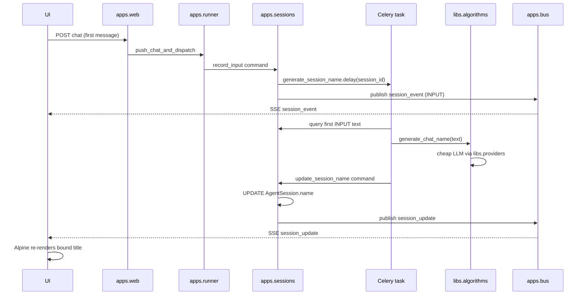

# Chief — Chat names (02)

Status: **spec only** (no implementation yet)

Companion to `../2026-06-23-design/2026-06-23-design-design.md`. When a user starts a new chat, the session
currently shows an opaque id prefix (`a1b2c3d4`). This spec adds automatic
session naming from the first user message, plus the structural groundwork
(libraries, services, notifications) that later features can reuse.

---

## Goal

After the **first user message** of a new session is persisted, Chief should:

1. Analyze that message with a **cheap LLM** and derive a short session name.
2. Save the name on the session row.
3. Push a **real-time update** to any open UI so the title changes without a
   full page reload.

Non-goals for this spec:

- Manual rename UI.
- Renaming when later messages arrive.
- Using the session's agent LLM (may be expensive); naming uses its own model.

---

## End-to-end flow



**Trigger point:** the Celery job is scheduled from the **`record_input` command**
in `apps.sessions`, immediately after the first `INPUT` event is written. That
keeps the runner dumb (it calls session-layer services for event append) and
guarantees the task reads the same canonical text the event log holds.

**Idempotency:** `generate_session_name` is safe to retry. It no-ops when
`AgentSession.name` is already set.

---

## 1. `backend/libs/` — shared libraries

Use **`backend/libs/`** (plural): it is a container for multiple independent
packages (`providers`, `tools`, `algorithms`, …), not a single module. Each
child is its own import root (same pattern as `backend/apps/`).

```
backend/
  apps/                 # Django apps (domain + transport + wiring)
  libs/
    providers/          # LLM provider implementations (moved from runner)
    tools/              # Tool definitions + registry (moved from agents)
    algorithms/         # Pure(ish) algorithms that call providers
  chief/                # Django project shell
```

### Lib dependency rules

Documented in `AGENTS.local.md` and honored in code review:

| Rule | Rationale |
|------|-----------|
| **Libs do not import Django apps** (`apps.*`) | Keeps libs testable without Django |
| **Minimize coupling between libs** | Prefer one-directional deps with explicit interfaces |
| **Cross-lib imports go through public surfaces** | e.g. `libs.algorithms.chat_name`, not internal modules |
| **Apps orchestrate; libs compute** | Celery tasks and HTTP views call app services + lib functions; they do not embed algorithm logic |
| **Apps depend on libs; never the reverse** | Preserves the existing app layering |
| **Inject app-specific deps at the app boundary** | When a lib needs something from Django/domain later, wire it in the owning app (see tools below) |

Allowed dependency graph for this feature:

```
libs/providers          (stdlib + vendor SDKs only)
libs/tools              (stdlib + pydantic; no apps.*)
libs/algorithms    -->  libs/providers
apps/agents        -->  libs/tools (wiring / instantiation)
apps.sessions      -->  agents, bus
apps.sessions.tasks -->  libs/algorithms, apps.sessions.services
apps.runner        -->  libs/providers, libs/tools, agents, sessions, bus
apps.web           -->  all of the above
```

### Move `providers/`

Move **`apps/runner/providers/` → `backend/libs/providers/`** wholesale.

Adjust imports (`apps.runner.providers.*` → `libs.providers.*`). Update tests
accordingly.

**Type boundary:** providers today reference `apps.agents.spec.LLMSpec` and tool
schema types. As part of the move, introduce a **provider-local config
surface** in `libs/providers/types.py` (e.g. `ProviderLLMConfig` with
`provider`, `model`, optional `temperature`). `apps.runner` maps
`AgentConfigSpec.llm` → `ProviderLLMConfig` at the call site. This keeps
`libs/providers` free of `apps.*` imports.

Tool formatting stays on the provider interface; runner passes tool definitions
built from `libs.tools`.

### Move `tools/`

Move **`apps/agents/tools/` → `backend/libs/tools/`** wholesale (base, registry,
schema, builtin implementations).

Rationale: tools are pure invocation logic and benefit from lib-level unit tests
without Django. When a tool later needs app/domain access (DB, secrets, external
APIs wired through Django), **`apps.agents` wires dependencies at instantiation
time** rather than importing apps from inside the lib.

```
apps/agents/
  tools_wiring.py    # builds the runtime tool registry / injects deps (new)
  models.py
  spec.py            # AgentConfigSpec still references tool names as strings
```

Pattern:

- **`libs.tools`** defines tool classes, schemas, and a registry API
  (`register_tool`, `get_tool`, …).
- **`apps.agents.tools_wiring`** (or `apps/agents/wiring/tools.py`) runs at app
  startup (or on first use) to register builtins and inject any callables a tool
  needs.
- **`apps.runner`** imports tools from `libs.tools` (same as today, new path).
- Types referenced by **`AgentConfigSpec`** (`ToolPermission`, tool name strings)
  stay in `apps.agents.spec`; the spec still does not depend on `runner`.

If a tool needs a back-reference into Django later, define a **Protocol / callback
interface** in `libs/tools` and pass the concrete implementation from
`apps.agents` when registering the tool.

---

## 2. `backend/libs/algorithms/` — algorithms library

New package for reusable computation that may call providers but owns no Django
models.

```
backend/libs/algorithms/
  __init__.py
  chat_name.py       # ChatNameConfig + generate_chat_name(...)
  tests/
    test_chat_name.py
```

### Configuration — struct per algorithm, no env vars

Each algorithm module defines its own **pydantic config struct** with sensible
defaults. Callers may override per invocation. Avoid Django settings and env
vars for algorithm tuning — fewer env vars, easier tests.

```python
# libs/algorithms/chat_name.py

class ChatNameConfig(BaseModel):
    provider: str = "openai"
    model: str = "gpt-4o-mini"
    temperature: float = 0.2
    max_title_chars: int = 80
    enabled: bool = True

DEFAULT_CHAT_NAME_CONFIG = ChatNameConfig()

def generate_chat_name(
    first_message: str,
    *,
    config: ChatNameConfig | None = None,
) -> str:
    cfg = config or DEFAULT_CHAT_NAME_CONFIG
    ...
```

- **`apps.sessions.tasks`** passes `DEFAULT_CHAT_NAME_CONFIG` (or a test override).
- Tests override via `generate_chat_name("...", config=ChatNameConfig(model="repeat"))`.
- A future manual "disable auto-naming" is `enabled=False` on the config struct,
  not a new env var.

### `generate_chat_name`

- **Input:** first user message text (plain string).
- **Output:** a short title string (target 3–8 words, hard max from config).
- **Model:** from `ChatNameConfig`, **not** the session agent's LLM.
- **Prompt:** single system + user message asking for a concise chat title; no
  tools; low temperature.
- **Failure handling:** on provider failure or empty/invalid output, return a
  truncated fallback derived from the message (e.g. first 40 chars, ellipsis).
  The task still completes; we prefer a bland title over no title.

Algorithms lib depends only on `libs.providers` (and stdlib/pydantic).

---

## 3. Celery tasks — where they live

### Pattern

Each Django app that needs async work owns **`apps/<app>/tasks.py`**. Tasks are
thin orchestrators:

1. Load domain ids via **service queries** (read-only).
2. Call lib functions for computation.
3. Call **service commands** for mutations + notifications.
4. Never embed raw `Model.objects.update(...)` for domain changes.

Register new task modules in `chief/tasks.py` (same as `apps.runner.tasks`
today). See `AGENTS.local.md` for the full pattern.

### This task: `apps/sessions/tasks.py`

**Recommendation:** put `generate_session_name` in **`apps.sessions`**, not
`apps.runner`.

| App | Why / why not |
|-----|----------------|
| **`apps.sessions` (chosen)** | Owns `AgentSession`, the `name` field, `update_session_name` command, and session notifications. Naming is session metadata, not agent execution. |
| `apps.runner` | Wrong layer — runner executes the step loop; naming is orthogonal side work. |
| `apps.web` | No Celery tasks in the UI app. |
| New `apps.jobs` | Premature; add only when many cross-cutting periodic jobs appear. |

Task sketch (orchestration only):

```python
@shared_task(bind=True, ignore_result=True, max_retries=2)
def generate_session_name(self, session_id: str) -> None:
    if get_session_name(session_id) is not None:
        return
    text = get_first_input_text(session_id)       # services.queries
    if text is None:
        return
    name = generate_chat_name(text)               # libs.algorithms
    update_session_name(session_id, name)         # services.commands
```

Schedule with `.delay()` from the `record_input` command when the appended event
is the session's first `INPUT`.

**Queue:** default Celery queue is fine (short, I/O-bound, unlike `run_session`).

---

## 4. App services — queries + commands

### Why not `actions/` alone?

`actions/` implies mutations only. External callers (runner, web, Celery tasks,
other apps) also need **read/query functions** without side effects. Use a
single app-level **`services/`** package with a clear split:

| Submodule | Purpose | May |
|-----------|---------|-----|
| **`services/queries.py`** | Read-only domain access | Hit DB read-only, return DTOs / models |
| **`services/commands.py`** | Domain mutations | Write DB, publish notifications, schedule tasks |

Convention for external code: import from `apps.<app>.services.queries` or
`.commands`. Do not reach into `models.py` from other apps when a query/command
already exists (migrate opportunistically; v1 adds services for naming only).

This is the **public API surface of an app** toward other apps and tasks.
`views.py` and `tasks.py` are thin transport/orchestration layers over services.

```
apps/sessions/
  services/
    __init__.py          # optional re-exports of common entry points
    queries.py           # get_session_name, get_first_input_text, ...
    commands.py          # record_input, update_session_name
  events.py              # low-level append_event (internal; commands call this)
  notify.py              # publish_session_event / publish_session_update
  tasks.py               # generate_session_name
  models.py
```

### `record_input(session, content) -> AgentSessionEvent` (command)

Called from `apps.runner.backends.django.DjangoSessionBackend` (replacing the
direct `append_event` call for chat `INPUT` in the mailbox drain path).

Responsibilities:

1. Call existing `append_event(..., INPUT, ...)`.
2. Publish the event on the bus (today done by runner immediately after append;
   **move publish responsibility here** so all INPUT side effects live in one
   place).
3. If this is the first `INPUT` for the session (check via query), call
   `generate_session_name.delay(str(session.id))`.

Runner backend change: for INPUT events, call `record_input` and return a
`RecordedEvent` as today; runner loop still calls `publish_event` for OUTPUT /
TOOL_* / FAILURE — only INPUT moves to the command for now. (Later spec can
 unify all publish paths.)

### `update_session_name(session_id, name, *, source="auto") -> None` (command)

Responsibilities:

1. Load session; no-op if `name` already set (preserve first write wins).
2. Validate/normalize (strip, max length 80).
3. `AgentSession.objects.filter(pk=..., name__isnull=True).update(name=...)`.
4. Call **`publish_session_update(session_id, {"name": name})`** (see §5).

Optional later: `source` enum (`auto` / `manual`) on the model; out of scope
for v1.

### Example queries (same feature)

```python
def get_session_name(session_id: UUID) -> str | None: ...
def get_first_input_text(session_id: UUID) -> str | None: ...
def session_has_input(session_id: UUID) -> bool: ...
```

### Field name: `AgentSession.name`

Add to `AgentSession`:

```python
name = models.CharField(max_length=80, null=True, blank=True, default=None)
```

- **`name`** is the right field name — short, matches user mental model ("chat
  name"), distinct from `agent.identifier`.
- **`null`** means "not yet named"; UI falls back to `session.id.hex[:8]`.
- Do **not** store auto-generated names in the event log; the session row is
  the source of truth for metadata.

Display rule (web templates — initial server render):

```jinja
{{ session.name or session.id.hex[:8] }}
```

---

## 5. Real-time UI updates — common notification mechanism

Today SSE carries only **`AgentSessionEvent`** rows (`event: session_event`),
deduped by `seq`. Session `name` is **metadata**, not an event — we need a
reusable channel for backend → UI patches.

### Design: session notifications on the existing bus

Extend the per-session Redis pub/sub channel (`session:{id}:events`) to carry a
**small envelope** instead of raw event dicts only:

```python
# apps/sessions/notify.py (conceptual)

@dataclass
class SessionMessage:
    channel: Literal["session_event", "session_update"]
    payload: dict[str, Any]

# channel == "session_event"  → payload is AgentSessionEvent.to_stream_dict() (has seq)
# channel == "session_update" → payload is a partial session patch, e.g. {"name": "..."}
```

Bus layer (`apps/bus/channels.py`):

- Add **`publish_session_message(session_id, message)`** that JSON-serializes the
  envelope.
- Keep a thin **`publish_event(session_id, event_dict)`** helper that wraps
  `SessionMessage(channel="session_event", ...)` for runner call sites during
  migration.

SSE view (`apps/web/views.py` `session_events_sse`):

- On replay: unchanged (DB events only); emit `event: session_event`.
- On live tail: parse envelope.
  - `channel == "session_event"` → existing dedupe by `seq`, emit
    **`event: session_event`**.
  - `channel == "session_update"` → emit **`event: session_update`**, no seq
    dedupe (use monotonic `revision` or `updated_at` in payload if needed later).

**Naming note:** the envelope channel literals and SSE event types both use
underscore form (`session_event`, `session_update`) for consistency. The
existing frontend listener `session-event` (hyphen) is renamed to `session_event`
as part of this work.

### UI updates on name change — yes, client-side reactive patch

We **do** update the UI when the name arrives. The distinction is *how*:

| Approach | v1 |
|----------|-----|
| **Alpine reactive state** (client patch via SSE) | **Yes** — primary mechanism |
| **HTMX server fragment swap** (new HTML partial from Django) | No — unnecessary for a single string field |

When `session_update` arrives on the open session page:

1. Alpine handler parses `{"name": "..."}`.
2. Updates `sessionName` (and any other bound fields).
3. DOM elements using `x-text="displaySessionName"` re-render immediately — no
   reload, no HTMX round-trip.

Example bindings on the session detail page:

```html
<!-- header title -->
<span x-text="displaySessionName">{{ session.name or session.id.hex[:8] }}</span>

<script>
function sessionView(sessionId, initialName, configModel) {
  return {
    sessionName: initialName,  // seeded from server render
    get displaySessionName() {
      return this.sessionName || sessionId.slice(0, 8);
    },
    ...
    connectStream() {
      ...
      this.source.addEventListener('session_event', (e) => { /* existing */ });
      this.source.addEventListener('session_update', (e) => {
        const patch = JSON.parse(e.data);
        if (patch.name != null) this.sessionName = patch.name;
      });
    },
  };
}
</script>
```

Optional polish (v1): update `document.title` when `sessionName` changes.

**Scope limits:** only pages with an active SSE connection to that session receive
live name updates. The agent-detail session table and dashboard show the new name
on next navigation/reload — live list refresh without reload is out of scope
(deferred).

### Why this is not hacky

- **Single transport:** same Redis channel + same SSE connection the UI already
  holds.
- **Explicit contract:** `publish_session_update` is the one way backend code
  pushes metadata changes to clients.
- **Reusable:** future patches (`status`, `ended_at`, …) use the same
  `session_update` event with different payload keys.
- **Commands own emission:** `update_session_name` writes DB then notifies; Celery
  tasks never call `publish_*` directly.

---

## 6. UI changes (v1)

| Location | Initial render | Live update |
|----------|----------------|-------------|
| Session detail header | `session.name` fallback | **Alpine `session_update` handler** |
| Session detail `<title>` | same | optional `document.title` patch |
| Agent detail session list | fallback | on reload only |
| Dashboard recent sessions | fallback | on reload only |

No new routes required. SSE endpoint unchanged (`/sessions/<id>/events/`).

---

## 8. Testing (required before done)

| Area | Tests |
|------|-------|
| `libs/algorithms/chat_name` | Unit tests with fake/repeat provider; config override; fallback on failure |
| `libs/tools` | Existing tool tests move with package; wiring tested in agents |
| `apps/sessions/services/commands` | `update_session_name` sets name once; publishes update envelope (mock bus) |
| `apps/sessions/services/commands` | `record_input` schedules task on first INPUT only |
| `apps/sessions/services/queries` | `get_first_input_text` |
| `apps/sessions/tasks` | Integration: task → command → name persisted |
| `apps/web` SSE | Live tail delivers `session_update` with correct event type |
| `apps/web` UI | Alpine updates header text when SSE patch arrives |
| Regression | Existing session_event SSE + runner loop unchanged |

Follow parproc naming rules (avoid "error"/"exception" in test names).

---

## 9. Implementation stages

0. **Scaffold libs** — create `backend/libs/`, wire Python path / imports,
   document rules in `AGENTS.local.md`.
1. **Move providers + tools** — relocate packages, add `ProviderLLMConfig`
   boundary, add `apps.agents` tool wiring, update runner + tests.
2. **Algorithms** — `ChatNameConfig` + `generate_chat_name` + tests.
3. **Session model** — add `name` field + migration.
4. **Notifications** — envelope type (`session_event` / `session_update`), bus
   publish, SSE handlers (rename `session-event` → `session_event`).
5. **Services** — queries + commands (`record_input`, `update_session_name`);
   wire runner INPUT path.
6. **Celery task** — `generate_session_name` in `apps.sessions.tasks`,
   register in `chief/tasks.py`.
7. **UI** — template fallbacks + Alpine bindings + `session_update` handler.

Each stage should leave `orunr py test-all` green before the next.

---

## 10. Open questions

1. **Runner publish consolidation** — should all event kinds eventually publish
   via `sessions.services.commands` (single writer for bus + DB)? Deferred; v1
   only moves INPUT.
2. **Manual rename** — add `name_source` + user edit command later?
3. **Dashboard live list** — agent page session table won't update names for
   sessions not currently open unless we add polling or a broader channel.
   Acceptable for v1?
4. **Non-English titles** — should the naming prompt mirror the user's language?
   Default: yes (model infers from message).

---

## Summary of decisions

| Question | Decision |
|----------|----------|
| Lib folder name | `backend/libs/` (plural container) |
| Providers location | `libs/providers/` (moved from runner) |
| Tools location | `libs/tools/` (moved from agents); **`apps.agents` wires/injects deps** |
| Algorithms location | `libs/algorithms/` → depends on providers; **config struct per algorithm, override on call, no env vars** |
| Celery task app | **`apps.sessions`** |
| App public API | **`apps/<app>/services/`** — `queries.py` (reads) + `commands.py` (writes + notify) |
| Session field | **`AgentSession.name`** (`CharField`, nullable) |
| Bus envelope channels | **`session_event`**, **`session_update`** |
| SSE event types | **`session_event`**, **`session_update`** (underscore; rename from `session-event`) |
| UI on name update | **Yes** — Alpine reactive patch on session detail; not HTMX fragment swap |
