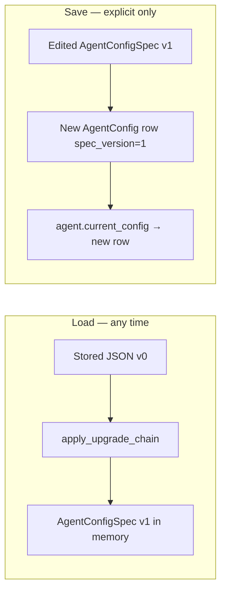
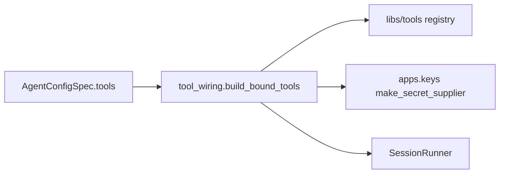

# Agent config schema extensions — Design

Epic: [Inbox cleanup (U1)](../../epics/2026-07-03-inbox-cleanup.md) · Spec **2 of 9** · Item: **Agent config schema extensions**

**Branch:** `feat/2026-07-03-agent-config-schema`

Status: **spec only**

Architecture reference: [`docs/ARCHITECTURE.md`](../../ARCHITECTURE.md) · Credential rules from
[Key management](../2026-07-03-key-management/2026-07-03-key-management-design.md).

Extend `AgentConfigSpec` so YAML can declare **tool instances** (stable id, tool type,
optional **`credential_ref`**, allow/deny per instance) and the same field on the LLM
block. Enables multiple accounts of the same tool type on one agent (e.g. personal vs
work Gmail) and wires instances to `apps.keys` at session start — no secrets in YAML.

**Naming:** use **`credential_ref`** everywhere a config names a stored credential (LLM
and tool instances). Matches `ProviderLLMConfig`, `apps.keys` resolution, and
[`ARCHITECTURE.md`](../../ARCHITECTURE.md). Do not introduce `key_ref` in YAML.

---

## Goal

Chief operators can express in agent YAML (and later the config UI, spec 4):

1. **Multiple tool instances** of the same type on one agent, each with its own id and
   optional named credential.
2. **Per-instance allow/deny** — permissions live on the instance, not a separate global
   permissions list.
3. **Optional LLM credential override** via `credential_ref` on `LLMSpec` (field wired in
   spec 1 but not yet exposed in the schema).
4. **Runtime wiring** — runner resolves credentials just-in-time and exposes distinct
   provider tool names per instance so the LLM can target the right account.
5. **Safe schema evolution** — versioned specs with a **load-time upgrade chain** (old
   configs always load as the current in-memory shape) and **save-time persistence**
   (writes always create a new `AgentConfig` row at the latest version). No bulk upgrade
   command; no spec JSON rewritten inside Django migrations.

Downstream specs (Gmail lib, inbox agent, config UI) depend on this YAML shape and wiring
contract. This spec delivers schema, ingest validation, runner integration, and the
**spec migration framework** only.

### Non-goals

- Agent configuration UI (spec 4).
- New tools (Gmail, ClickUp, queue — specs 3, 6–8).
- Queue / source trigger kinds (spec 3 / 5).
- Credential storage or Settings UI (spec 1 — already shipped).
- Tool implementation details inside `libs/gmail` etc. — only the wiring boundary.
- Bulk / background upgrade of stored configs (conflicts with in-progress edits).

---

## Current state

| Area | Today |
|------|-------|
| Schema | `ToolPermission`: `tool` + `allow` / `deny`; one entry per tool type; **no `schema_version`** |
| LLM keys | `LLMSpec` has no `credential_ref`; runner always uses default for provider type |
| Registry | Stateless singleton tools in `libs/tools/registry` (`clock`, …) |
| Provider names | `{tool}__{function}` e.g. `clock__now` |
| Invocation | Runner looks up tool by type name; no per-instance binding or credentials |
| Ingest | Validates tool type + function names against registry |
| Config rows | `AgentConfig.spec` JSON + versioned rows; **no `spec_version` column yet** |

This blocks U1: an inbox agent cannot bind `gmail-personal` and `gmail-work` on the same
config, and YAML cannot name which credential each instance uses.

---

## Schema changes

### Top-level version (required)

```python
AGENT_CONFIG_SPEC_VERSION = 1  # module constant; equals latest migration's TO_VERSION

class AgentConfigSpec(BaseModel):
    schema_version: Literal[1] = AGENT_CONFIG_SPEC_VERSION
    description: str | None = None
    llm: LLMSpec
    system_prompt: str
    triggers: list[TriggerSpec] = []
    tools: list[ToolInstance] = []
```

- **`schema_version` in JSON** mirrors **`AgentConfig.spec_version`** on save (same integer).
- **Pydantic models describe the current version only** — no legacy fields on `AgentConfigSpec`.
- **Older shapes are upgraded on load**, not accepted directly by `model_validate`.
- **Version numbering starts at 0.** Version **0** is the pre–spec-2 shape (no
  `schema_version`, `tools: [{tool, allow, deny}]`). The first migration file upgrades
  **0 → 1** (tool instances, `credential_ref`, etc.).

### `AgentConfig.spec_version` (DB column)

Add an integer column on `AgentConfig`:

```python
class AgentConfig(models.Model):
    ...
    spec_version = models.PositiveSmallIntegerField(default=0)
    spec = models.JSONField()
```

- Set from `AGENT_CONFIG_SPEC_VERSION` on every **save** (new row).
- Used as a hint on load (`load_spec_dict(..., stored_version=config.spec_version)`).
- Django migration adds the column with `default=0` only — **no RunPython** on `spec` JSON.
- Existing rows stay at `spec_version=0` until the user saves again; load still works via
  the upgrade chain.

### `ToolInstance` (replaces `ToolPermission`)

```python
class ToolInstance(BaseModel):
    id: str           # stable within this agent config; slug [a-z][a-z0-9_-]{0,63}
    type: str         # registry tool name, e.g. "gmail", "clock"
    credential_ref: str | None = None   # optional apps.keys name; omit → default for tool's credential type
    allow: list[str] = ['*']
    deny: list[str] = []
```

Remove `ToolPermission` from the public schema once call sites are updated.

### `LLMSpec.credential_ref`

```python
class LLMSpec(BaseModel):
    provider: str
    model: str
    temperature: float | None = None
    credential_ref: str | None = None   # optional; omit → default for provider type
```

Runner passes `llm.credential_ref` through to `provider_config_from_spec` (already
accepts the parameter).

### YAML example

```yaml
schema_version: 1
description: Inbox triage (sketch — Gmail tool arrives in spec 6)
llm:
  provider: openai
  model: gpt-5.4-mini
  credential_ref: default:openai   # optional; system ref allowed
system_prompt: |
  You triage email. Use personal-gmail for the personal inbox.
triggers:
  - name: manual
    kind: manual
tools:
  - id: personal-gmail
    type: gmail
    credential_ref: gmail-personal
    allow: [list, read, label, archive]
    deny: [send]
  - id: work-gmail
    type: gmail
    credential_ref: gmail-work
    allow: [list, read, label]
  - id: clock
    type: clock
    allow: [now]
```

Tools that need no credential (`clock`) omit `credential_ref`; wiring ignores it.

---

## Config schema migrations (general pattern)

Rolling deploys run **old and new code at the same time**. Rewriting `AgentConfig.spec`
JSON inside a Django `RunPython` migration is unsafe — old workers may read new shapes or
new workers may read unmigrated rows mid-deploy.

Instead: **upgrade in application code on load; persist on explicit save only.**

### Principles

| Principle | Behavior |
|-----------|----------|
| **Load always works** | Apply the upgrade chain whenever a spec is loaded; return the **current** pydantic model |
| **Save upgrades storage** | Persist at `AGENT_CONFIG_SPEC_VERSION` as a **new** `AgentConfig` row |
| **No bulk upgrade command** | Avoids clobbering configs a user is mid-edit in the UI or on disk |
| **Immutable history** | Old rows stay as-is; sessions pinned to them still load via the chain |
| **DB migrations = DDL only** | Add `spec_version` column; never transform `spec` JSON in migrations |
| **One code migration per schema bump** | Each breaking bump adds a tested step; optional-only changes skip a bump (see AGENTS.local.md) |

### Module layout: `apps/agents/spec_migrations/`

```
apps/agents/
  spec.py                              # AgentConfigSpec — current version only
  spec_migrations/
    __init__.py                        # load_spec_dict, detect_version, apply_upgrade_chain
    registry.py                        # discover + order migrations from migrations/
    migrations/
      001_tool_instances.py           # upgrade 0 → 1 (this spec)
      002_….py                          # future: upgrade 1 → 2
  spec_loader.py                       # file/YAML parse → load_spec_dict
```

**Version numbering:** specs start at **0**. Each file `NNN_{short_descriptive_name}.py`
in `migrations/` upgrades **(N−1) → N** where `N` is the three-digit prefix as an integer.
So **`001_tool_instances.py` is by definition the 0 → 1 upgrade.**

**Migration module contract** — each file exports:

```python
# migrations/001_tool_instances.py
FROM_VERSION = 0
TO_VERSION = 1

def upgrade(raw: dict) -> dict:
    """Pure transform; no Django imports."""
    ...
```

**Registry** (`registry.py`) discovers modules under `migrations/`, sorts by `NNN`
prefix, and verifies a contiguous chain (`001` is 0→1, `002` is 1→2, …). Each step’s
`TO_VERSION` must equal the next step’s `FROM_VERSION`. `AGENT_CONFIG_SPEC_VERSION` in
`spec.py` equals the last migration’s `TO_VERSION`.

Discovery runs **once per process** — `_discover_migrations()` is wrapped in
`@functools.cache` so repeated loads in the same worker do not re-import migration modules.

```python
# registry builds something equivalent to:
SPEC_MIGRATIONS = (
    SpecMigration(from_version=0, to_version=1, upgrade=upgrade_001),
    # SpecMigration(1, 2, upgrade_002),
)
```

**`load_spec_dict(raw, *, stored_version: int | None = None) -> dict`**

1. `version = stored_version if stored_version is not None else detect_version(raw)` —
   column hint, else `schema_version` in JSON, else **0** if legacy shape detected
   (`tools[].tool` present).
2. If `version > AGENT_CONFIG_SPEC_VERSION` → raise `UnsupportedSpecVersionError` (need
   newer Chief).
3. Apply chain `version → version+1 → … → CURRENT` using registered steps.
4. Return upgraded dict (still a dict; caller validates with pydantic).

**`AgentConfig.get_spec()`** → `AgentConfigSpec.model_validate(load_spec_dict(self.spec, stored_version=self.spec_version))`.

**`spec_loader.load_agent_config_spec(raw)`** — parse YAML/JSON, then `load_spec_dict`.

All runtime consumers (runner, ingest validation preview, UI read in spec 4) use
**`get_spec()` / `load_spec_dict`** — never `AgentConfigSpec.model_validate(row.spec)` directly.

### Save path

**`save_agent_config(agent, spec: AgentConfigSpec, *, source_rev, …) -> AgentConfig`**
(centralize in `apps/agents/ingest.py` or `services/commands.py`):

1. Spec is already current pydantic (from editor or `load_spec_dict` + edits).
2. Assert `spec.schema_version == AGENT_CONFIG_SPEC_VERSION` (or set it).
3. **Insert** new `AgentConfig` with `spec_version=AGENT_CONFIG_SPEC_VERSION` and
   `spec=spec.model_dump(mode='json')`.
4. Re-derive `Trigger` rows on the new config (same as today’s ingest).
5. Set `agent.current_config` to the new row.
6. **Do not update** the previous row.

First save after a schema bump is the user’s (or operator’s) choice — no automatic
background rewrite.

### Load vs save flow



### `001_tool_instances.py` (0 → 1)

Pure transform (unit-tested):

- Set `schema_version: 1`.
- Each `{tool, allow, deny}` → `{id: tool, type: tool, allow, deny}`.
- Fail if duplicate `tool` names would produce duplicate ids.

### Errors

| Situation | Behavior |
|-----------|----------|
| `stored_version` / JSON version > `CURRENT` | `UnsupportedSpecVersionError` — upgrade Chief |
| Broken intermediate dict after a step | `SpecMigrationError` with step identity |
| Valid upgraded dict | `AgentConfigSpec` at current version |

**Sessions:** runner loads the session’s **pinned** `AgentConfig` row and runs the same
upgrade chain — old stored JSON does not block new code.

### Agent / contributor rules

Documented in **`AGENTS.local.md`**: every `AgentConfigSpec` schema change must add a
numbered file under `spec_migrations/migrations/`, bump `AGENT_CONFIG_SPEC_VERSION`, and
ship tests for the new step. See that file for the checklist.

---

## Tool registry extension

Add an optional class attribute on `Tool`:

```python
class Tool(ABC):
    name: str
    credential_type: str | None = None   # e.g. "gmail"; None → no credential required
```

- `ClockTool`: `credential_type = None`
- Future `GmailTool`: `credential_type = "gmail"`

Ingest and wiring use `credential_type` to decide whether `credential_ref` / default
resolution applies and which `expected_type` to pass to `apps.keys`.

---

## Provider wire names

Each instance gets a **distinct wire name** so the LLM can choose between instances:

| Concept | Format | Example |
|---------|--------|---------|
| Wire name | `{instance_id}__{function}` | `personal-gmail__list` |
| Logical qualified name (events) | `{instance_id}.{function}` | `personal-gmail.list` |

Update `build_tool_definitions` to iterate instances (not bare tool types), resolve the
registry tool by `instance.type`, and emit definitions with `wire_tool_name(instance.id, fn.name)`.

Update `parse_qualified_tool_name` usage in the runner: the **instance id** is the first
segment (same rules as today — `.` or `__` separator).

Event log (`TOOL_CALL` / `TOOL_RESULT`) records:

- `instance_id` — the config instance id
- `type` — registry tool type (for debugging)
- `function` — sub-function name

v0 wire names (`clock__now`) are not used at runtime after upgrade; instance id `clock`
yields wire name `clock__now` when the instance `id` is `clock`.

---

## Runtime wiring

New module: **`apps/agents/tool_wiring.py`** (domain layer — may import `apps.keys`).



### `BoundToolInstance`

```python
@dataclass(frozen=True)
class BoundToolInstance:
    instance_id: str
    tool_type: str
    invoke: Callable[[str, dict], Any]   # (function, arguments) -> result
```

### `build_bound_tools(instances, *, user_id) -> dict[str, BoundToolInstance]`

For each `ToolInstance` in the spec:

1. Resolve registry tool by `instance.type`; fail ingest if missing (already validated).
2. If `tool.credential_type` is set:
   - Build `token_supplier = make_secret_supplier(user_id, name=instance.credential_ref, type=credential_type)`.
   - Call a registry-level **`bind_tool(tool, token_supplier)`** hook (see below) that
     returns a bound invoke callable. Until Gmail exists, only tools without
     `credential_type` use the default `tool.invoke` path.
3. If `credential_type` is `None`, use `tool.invoke` directly.
4. Return map keyed by `instance.id`.

**`bind_tool` pattern (extensibility for spec 6+):**

Default implementation: if tool has no `bind` method, use `tool.invoke`. Credential-aware
tools (Gmail, etc.) implement `bind(self, *, token_supplier) -> Callable` on the `Tool`
subclass. Keeps `libs/*` free of Django; binding runs in `apps.agents` at the boundary.

### Runner changes

At session start (`SessionRunner.__init__` or first tool use):

1. `self.bound_tools = build_bound_tools(spec.tools, user_id=backend.user_id)`
2. `build_tool_definitions(spec.tools, is_allowed=...)` — permission checks use instance
   id (first segment of wire name), not tool type.
3. `_handle_tool_call`: parse wire name → `(instance_id, function)`; look up
   `bound_tools[instance_id]`; call `invoke(function, arguments)`.
4. `_is_allowed(instance_id, function_name)` — find instance by id, apply allow/deny.

**Credential resolution timing:** suppliers resolve on each invocation (inside the bound
tool or lib client), not when building `bound_tools`. No plaintext on runner state.

**Missing credential:** if `make_secret_supplier` returns `None` at invoke time for a tool
that requires credentials, return a structured tool failure JSON (same pattern as permission
denied) — do not crash the session loop.

---

## Ingest validation

All validation runs on the **upgraded, current** spec (`load_spec_dict` then pydantic,
or pydantic after in-memory edit). Extend `validate_spec_tools`:

| Check | Error |
|-------|-------|
| Duplicate `id` | `Duplicate tool instance id '…'` |
| Unknown `type` | `Unknown tool type '…'` |
| Unknown allow/deny entries | existing messages |
| `credential_ref` set but tool has no `credential_type` | `Tool 'clock' does not accept credential_ref` |
| Invalid `id` format | pydantic validation error |

**Optional at ingest (defer to runtime):** existence of `credential_ref` in `apps.keys`.

When `LLMSpec.credential_ref` is set, resolution happens at runtime (not ingest).

**Save:** `create_agent_from_spec` / `save_agent_config` always writes
`spec_version=AGENT_CONFIG_SPEC_VERSION` and current JSON; creates a new config row when
updating an existing agent (spec 4 UI uses the same save helper).

---

## Error handling

| Situation | Behavior |
|-----------|----------|
| Unknown instance id in tool call | Tool failure JSON: `Unknown tool instance '…'` |
| Permission denied | Existing failure JSON |
| Missing credential at invoke | Tool failure JSON: `No credential for type 'gmail'` |
| `credential_ref` type mismatch | Tool failure JSON from `KeyTypeMismatchError` |
| Duplicate instance ids at ingest | `IngestError` before persist |
| Spec version newer than code | `UnsupportedSpecVersionError` on load |

Session continues (tool failure in band) for invoke-time errors; ingest errors block config save.

---

## Testing

| Area | Tests |
|------|-------|
| `apps/agents/spec` | v1 validation; duplicate id rejection |
| `apps/agents/spec_migrations` | registry discovers `001_…`; `001` step; full chain 0→1; rejects future version |
| `apps/agents/spec_migrations` | fixture: load v0 dict → equals hand-written v1 spec |
| `apps/agents/models` | `get_spec()` on row with `spec_version=0` returns v1 model |
| `apps/agents/ingest` | save writes `spec_version=1` + new row; instance validation |
| `apps/agents/tool_wiring` | Bound map keyed by id; clock invokes without credentials |
| `apps/runner/tool_definitions` | Two instances same type → distinct wire names |
| `apps/runner/loop` | Loads pinned v0 config row; runs with upgraded instances |
| `apps/runner/llm_config` | `credential_ref` from LLMSpec passed through |
| Regression | Demo bootstrap + provider tool tests use v1 spec |

Follow parproc naming rules. Mock `make_secret_supplier` for wiring tests.

---

## Implementation stages

**Pre-implementation (Step 0):** checkout `feat/2026-07-03-agent-config-schema`, create
`-revision.md` from superpowers template.

1. **Schema** — `schema_version`, `ToolInstance`, `LLMSpec.credential_ref`; remove `ToolPermission`; update hardcoded spec to v1.
2. **Migrations framework** — `spec_migrations/` package, `migrations/001_tool_instances.py`, registry, `load_spec_dict` + tests.
3. **Model** — `AgentConfig.spec_version` column (DDL migration only, default `0`); `get_spec()` uses load path.
4. **Registry** — `credential_type` on `Tool`; document `bind` hook.
5. **Ingest / save** — `save_agent_config` writes current version; load path everywhere.
6. **Wiring** — `tool_wiring.py` + `build_bound_tools`.
7. **Runner** — wire names, definitions builder, loop invoke path, LLM `credential_ref`.
8. **Docs** — `AGENTS.local.md` checklist for future schema bumps.

Spec 6 (Gmail) will add the first credential-bound tool; until then wiring is covered with
clock (no credential) and unit tests with a test double tool that declares `credential_type`.

---

## Decisions (locked)

| Question | Decision |
|----------|------------|
| LLM vs tool ref field name | **`credential_ref`** everywhere |
| Spec version origin | **0** = initial legacy shape; current after this spec = **1** |
| Migration files | **`spec_migrations/migrations/NNN_{name}.py`**; `001_…` = upgrade **0 → 1** |
| When upgrades run | **On every load** via `load_spec_dict`; in-memory current shape |
| When storage upgrades | **On explicit save only** — new `AgentConfig` row at latest version |
| Bulk upgrade command | **No** — avoids edit conflicts |
| Version in DB | **`AgentConfig.spec_version`** + `schema_version` in JSON (kept in sync on save) |
| Spec JSON in Django migrations | **Never** — DDL for `spec_version` column only |
| Wire name segment | **Instance id** |
| Validate `credential_ref` at ingest? | **No** — runtime failure |
| Where binding lives | **`apps.agents.tool_wiring`** |

---

## References

- [Epic: Inbox cleanup](../../epics/2026-07-03-inbox-cleanup.md)
- [Key management design](../2026-07-03-key-management/2026-07-03-key-management-design.md)
- [Chief design (original AgentConfigSpec)](../2026-06-23-design/2026-06-23-design-design.md)
- [Architecture — credentials & config refs](../../ARCHITECTURE.md)
