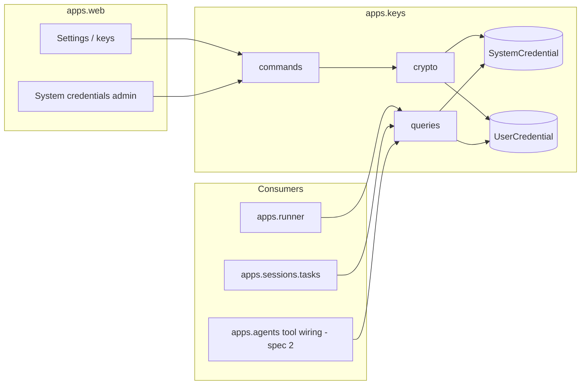

# Key management — Design

Epic: [Inbox cleanup (U1)](../../epics/2026-07-03-inbox-cleanup.md) · Spec **1 of 9** · Item: **Key management**

**Branch:** `feat/2026-07-03-key-management`

Status: **spec only**

Architecture reference (secrets rules): [`docs/ARCHITECTURE.md`](../../ARCHITECTURE.md) ·
also linked from `AGENTS.local.md`.

Encrypted credentials in Postgres are the **primary** secret store. **System**
(platform) and **user** credentials share one resolution model. Env vars remain a
**fallback** for default LLM provider keys when no encrypted credential exists.
Tool instances and agent config reference secrets **by name only** (spec 2) — never
embed values in YAML.

---

## Goal

Chief users and operators can:

1. Store **default LLM credentials** per provider in encrypted storage (user override
   + system fallback); env file supplies keys only when absent from the store.
2. Create **named user credentials** for external services (Gmail, ClickUp, …), each
   tagged with a **service type**.
3. Define **defaults per service type** (e.g. default Gmail account) selectable when
   configuring agents; override per agent or tool instance via `key_ref`.
4. Run agents and background jobs that resolve credentials at runtime — **never**
   from YAML or the event log.
5. **Write secrets once** via UI or admin; **never read them back** to any UI — only
   show whether a slot is set. Plaintext exists only at the moment of use.

Downstream specs reference keys **by name only** (spec 2 tool instances, spec 6–8
libraries). This spec delivers storage, encryption, typed resolution, LLM wiring, and
a settings UI.

### Non-goals

- Tool-instance `key_ref` in `AgentConfigSpec` (spec 2).
- OAuth flows, token refresh, or service-account JSON upload UX (Gmail spec 6 may
  extend payload shape; v1 stores opaque UTF-8 strings).
- Org/shared keys beyond **system** scope, key rotation automation, or audit log
  beyond Django admin.
- Replacing `.env.local` entirely — env vars remain a **dev/ops fallback** when the
  encrypted store has no credential for that provider.
- Viewing, exporting, or editing existing secret values in the UI — **write-only**
  slots (replace or clear only; see secret lifecycle).

---

## Current state

| Area | Today |
|------|-------|
| LLM keys | `OPENAI_API_KEY`, `ANTHROPIC_API_KEY`, `LOCAL_OPENAI_API_KEY` in `.env.local` |
| Resolution | `libs/providers/*` read `os.environ` inside `get_client()` |
| User scope | Single-user dev assumption; all agents share container env |
| UI | Demo bootstrap buttons; no credential settings |
| Algorithms | `generate_session_name` uses hardcoded provider defaults + env keys |

This blocks U1: multiple Gmail accounts, per-user ClickUp tokens, and YAML that names
a key without embedding the secret.

---

## Architecture



**New app:** `apps.keys` — credential domain (system + user scopes). Follows the
project **services/queries + commands** pattern (`AGENTS.local.md`).

**Dependency rule:** `apps.keys` imports only Django/stdlib + `cryptography`. It does
**not** import `runner`, `web`, or `libs.*`. Consumers import `apps.keys.services`.

---

## Secret lifecycle & read policy

Credentials are **write-only from the human side** and **use-on-demand from the
machine side**.

### Write path (UI, admin, commands)

- User submits a secret via password field → command encrypts and persists.
- **Empty submit on a default slot** clears the stored credential (slot becomes unset).
- **Named key “edit”** is replace-only: submit a new secret or delete the row — there
  is no “load current value into the form” step.
- Commands are the **only** write entry point; they never return plaintext (only
  metadata with `is_set=True`).

### Read path (strictly limited)

| Surface | Allowed | Forbidden |
|---------|---------|-----------|
| Settings UI / agent UI | `is_set` (Set / Not set), name, type, role, `updated_at` | Plaintext, partial tails, prefilled password fields |
| Django admin | Same metadata as UI | Decrypt, hint, “view secret”, export |
| `list_*` / `KeyMetadata` queries | Metadata only | Plaintext |
| HTTP / JSON API | None for v1 | Any endpoint that returns a secret |
| Logs, events, Celery results | — | Any secret or substring |
| **`resolve_*` queries** | Decrypt for **immediate operational use** | Returning secrets to callers that cache them |

**There is no “get secret for display” API.** Decrypt functions exist solely so a
consumer can pass plaintext directly into the next operation (HTTP client constructor,
provider SDK call, etc.) in the same call stack.

### Consumer retention (no in-memory secrets)

Secret **consumers must not store plaintext** on objects that outlive a single
operation:

- Hold **`credential_ref`** (or implicit default for a `type`) — never `api_key` on
  session state, agent config, tool instances, or library client fields.
- **Resolve immediately before use**: decrypt → pass to SDK / HTTP layer → discard
  local reference. Do not attach resolved values to `ProviderLLMConfig`, runner loop
  state, or tool instance dataclasses.
- Prefer a **supplier callable** at library boundaries when the consumer makes
  multiple calls:

```python
# libs/gmail/client.py (pattern for spec 6+)
class GmailClient:
    def __init__(self, *, token_supplier: Callable[[], str]) -> None:
        self._token_supplier = token_supplier

    def list_messages(self, ...) -> ...:
        token = self._token_supplier()  # resolve here, not in __init__
        ...
```

- LLM providers: resolve in `stream()` / `collect()` (or factory method invoked per
  call), not when building the runner or parsing YAML.
- If a consumer needs the secret more than once in one operation, it may hold the
  plaintext **only for the duration of that operation** (single tool invocation or
  single LLM request chain) — not for the agent session lifetime.

Wiring (runner, spec 2 tool factory) passes **`user_id` + ref + `expected_type`**, or
a closure over those, into libs/providers — not the decrypted string at construction
time.

---

## Credential scopes

| Scope | Owner | Purpose | Examples |
|-------|-------|---------|----------|
| **System** | Platform (no user FK) | Default LLM keys and future platform-wide secrets | `default:openai`, `default:anthropic` |
| **User** | `AUTH_USER_MODEL` | Per-user defaults and named service credentials | `default:gmail`, `gmail-personal`, `clickup` |

Both scopes store **Fernet-encrypted** values in Postgres. **Encrypted storage is
always consulted first**; env vars are used only when no matching encrypted credential
exists (LLM providers only — see resolution).

**System credentials are referenceable** wherever secrets are referenced (`key_ref`,
agent LLM override, etc.), subject to **type matching** (below).

---

## Data model

### Shared fields (both models)

| Field | Type | Notes |
|-------|------|-------|
| `id` | UUID (uuid7) | PK |
| `name` | `CharField(64)` | Stable identifier; see naming rules |
| `role` | enum | `default` \| `named` |
| `type` | `CharField(32)` | Service this secret is for — see type registry |
| `encrypted_value` | `BinaryField` | Fernet ciphertext of UTF-8 secret |
| `created_at` / `updated_at` | datetime | auto |

**`type`** replaces the earlier `provider`-only notion. It identifies the **service
consumer** that may receive this secret: `openai`, `anthropic`, `local_openai`,
`gmail`, `clickup`, `obsidian`, … LLM types align with `LLMSpec.provider`; external
types align with tool/library ids (spec 6–8). A consumer **must only accept secrets
whose `type` matches** — e.g. `libs/gmail` is wired exclusively with `type=gmail`
credentials; passing an `openai` secret is a wiring error caught at resolve time.

### `SystemCredential`

Platform-scoped rows. No user FK.

**Constraints:**

- `UniqueConstraint(name)` — system names are globally unique.
- `UniqueConstraint(type, condition=Q(role='default'))` — at most one system default
  per service type.

**Indexes:** `(name)`, `(type)` for resolution.

### `UserCredential`

User-scoped rows.

| Field | Type | Notes |
|-------|------|-------|
| `user` | FK → `AUTH_USER_MODEL` | Owner |

**Constraints:**

- `UniqueConstraint(user, name)` — names unique per user.
- `UniqueConstraint(user, type, condition=Q(role='default'))` — at most one user
  default per service type per user.
- Application-level validation: `name` must **not** collide with any existing
  `SystemCredential.name` (reserved system namespace).

**Indexes:** `(user_id, name)`, `(user_id, type)` for resolution hot paths.

### Roles

| Role | Purpose | `name` | Set via |
|------|---------|--------|---------|
| `default` | Default credential for a service **type** | Canonical: `default:<type>` (e.g. `default:openai`, `default:gmail`) | Defaults section in UI (LLM + per-type defaults) |
| `named` | Additional credential for the same or another use | User-chosen slug | Named keys CRUD in UI |

Users never type `default:openai` manually — the UI maps provider/service buttons to
the canonical name. **Named keys** are what YAML `key_ref` values typically use (spec
2); system and user names are both valid refs when type-compatible.

### Naming rules

**System names** (platform-managed, referenceable everywhere):

- Default slots: `default:<type>` where `<type>` is a registered service type.
- Future system named keys (if any): `sys:<slug>` prefix reserved at platform level.

**User named keys:**

- Pattern: `^[a-z][a-z0-9_-]{0,63}$`
- Examples: `gmail-personal`, `clickup`, `obsidian_local`
- **Must not equal any `SystemCredential.name`** — system namespace is reserved.
- **Must not use reserved prefixes:** `default:`, `sys:`

**Uniqueness summary:**

| Collision | Rule |
|-----------|------|
| System ↔ system | Forbidden (`SystemCredential.name` unique) |
| User ↔ user (same owner) | Forbidden (`UniqueConstraint(user, name)`) |
| User ↔ system | Forbidden (validate on create/update; reject with clear error) |
| User ↔ user (different owners) | Allowed — names are per-user; resolution always scopes by `user_id` |

### Type registry

Known types are validated in commands. v1 minimum:

| Type | Consumer | Env fallback (if any) |
|------|----------|----------------------|
| `openai` | `libs/providers/openai` | `OPENAI_API_KEY` |
| `anthropic` | `libs/providers/anthropic` | `ANTHROPIC_API_KEY` |
| `local_openai` | `libs/providers/local_openai` | `LOCAL_OPENAI_API_KEY` |
| `gmail` | `libs/gmail` (spec 6) | — |
| `clickup` | `libs/clickup` (spec 7) | — |
| `obsidian` | `libs/obsidian` (spec 8) | — |

New types are added when a library/tool spec lands. Commands reject unknown `type`
values.

### Secret payload (v1)

Encrypt a **single UTF-8 string** (API key or token). Sufficient for OpenAI,
Anthropic, ClickUp personal token, etc.

**Future extension (not v1):** JSON envelope (`api_key`, `oauth`, `service_account`)
stored as encrypted JSON text; decrypt helper parses by optional `payload_kind`
column. Gmail spec 6 adds upload/validation — do not build envelope UX here.

---

## Encryption

### Algorithm

[Fernet](https://github.com/pycryptography/cryptography) (`cryptography.fernet.Fernet`):
AES-128-CBC + HMAC, timestamped tokens. Standard, well-audited, fits string secrets.

### Master key

| Source | When |
|--------|------|
| `CHIEF_CREDENTIALS_KEY` env var | Production and explicit dev setup |
| HKDF derive from `SECRET_KEY` | Dev-only fallback when env unset |

`CHIEF_CREDENTIALS_KEY` is a url-safe base64 **32-byte** Fernet key (generate with
`Fernet.generate_key().decode()`). Document in `.env.local.example` under
`#[backend]`.

**Rationale:** Separate from `SECRET_KEY` so Django secret rotation does not
invalidate stored credentials. Dev fallback keeps compose working without extra setup.

### Module layout

```
apps/keys/
  models.py            # SystemCredential, UserCredential
  crypto.py            # encrypt(plaintext: str) -> bytes, decrypt(ciphertext) -> str
  types.py             # SERVICE_TYPES registry + validation
  services/
    queries.py         # metadata + resolve_* (decrypt)
    commands.py        # set_*_default, upsert_named, delete_*, system admin commands
  exceptions.py        # KeyNotFoundError, KeyValidationError, KeyTypeMismatchError
  admin.py             # system credentials + user metadata (no decrypt in list view)
```

**Rules:**

- Plaintext exists only in the **resolve → use** call stack for a single operation —
  never ORM, logs, Celery results, `AgentSessionEvent`, or long-lived consumer state.
- `encrypted_value` is opaque bytes; admin and UI show `name`, `role`, `type`, `is_set`,
  `updated_at` only.
- **`apps/web` must not import `resolve_*`** — views call metadata queries and
  commands only.

---

## Services API

Public surface for other apps. **Web layer imports metadata queries and commands
only.** Operational apps (`runner`, tool wiring) import `resolve_*`.

### Metadata queries (no decrypt)

```python
@dataclass(frozen=True)
class KeyMetadata:
    name: str
    scope: Literal["system", "user"]
    role: str
    type: str
    is_set: bool
    updated_at: datetime

def list_system_credentials() -> list[KeyMetadata]: ...

def list_user_credentials(user_id: int) -> list[KeyMetadata]: ...

def list_referenceable_credentials(
    user_id: int,
    *,
    type: str | None = None,
) -> list[KeyMetadata]:
    """System + user credentials the given user may reference.
    Optional filter by service type (for agent/tool picker UI)."""
```

`is_set` is derived from `encrypted_value` non-empty (or row exists for defaults).
No hint, no partial secret material.

### Operational queries (decrypt — consumers only)

**Not imported by `apps.web`.** Call immediately before use; do not cache return value.

```python
def resolve_default_secret(user_id: int, type: str) -> str | None:
    """Resolution order: user default → system default → env fallback (LLM only).
    Returns decrypted secret or None."""

def resolve_secret(
    user_id: int,
    name: str,
    *,
    expected_type: str,
) -> str:
    """Resolve by name (user scope first, then system). Validates type match.
    Raises KeyNotFoundError or KeyTypeMismatchError."""

def make_secret_supplier(
    user_id: int,
    *,
    name: str | None = None,
    type: str,
) -> Callable[[], str]:
    """Factory for lazy resolution. Raises on missing/type mismatch when called,
    not when constructed. Preferred wiring primitive for multi-call libs."""

# Convenience wrapper (same resolution as resolve_default_secret)
def get_llm_default_secret(user_id: int, provider: str) -> str | None: ...
```

### Commands (write)

**User commands** (settings UI):

```python
def set_user_default(user_id: int, type: str, secret: str) -> KeyMetadata: ...

def upsert_user_named(user_id: int, name: str, type: str, secret: str) -> KeyMetadata: ...

def delete_user_credential(user_id: int, name: str) -> None:
    """Idempotent; raises KeyNotFoundError if missing."""
```

**System commands** (staff/admin only — Django admin or management command in v1):

```python
def set_system_default(type: str, secret: str) -> KeyMetadata: ...

def delete_system_credential(name: str) -> None: ...
```

Validation in commands: `type` must be a registered service type; named `name` matches
regex and passes reserved-namespace checks; secret non-empty after strip; max secret
length 16 KiB; `role=default` names are canonicalized to `default:<type>`.

---

## Credential resolution

### Resolution order (defaults)

When no explicit `key_ref` is given (agent LLM block, tool instance without ref, etc.),
resolve **`(user_id, type)`**:

1. **User** `UserCredential` where `role=default` and `type=<type>` (DB decrypt)
2. **System** `SystemCredential` where `role=default` and `type=<type>` (DB decrypt)
3. **Env fallback** — LLM types only (`OPENAI_API_KEY`, `ANTHROPIC_API_KEY`,
   `LOCAL_OPENAI_API_KEY`)
4. `None` → existing `MissingOpenAICredentials` / `MissingAnthropicCredentials` or
   typed error for external services

Encrypted credentials are **always steps 1–2**; env is **never** preferred over a
stored credential.

### Resolution by name (`key_ref`)

When YAML or agent config names a credential:

1. Look up **user** credential `(user_id, name)`; if found, validate `type`.
2. Else look up **system** credential `name`; if found, validate `type`.
3. Else `KeyNotFoundError`.

**Type enforcement:** `resolve_secret(..., expected_type=...)` compares the stored
credential’s `type` to the consumer’s expected type. Mismatch → `KeyTypeMismatchError`
with a clear message (e.g. `key_ref 'gmail-personal' is type clickup, expected gmail`).

```mermaid
sequenceDiagram
  participant Loop as SessionRunner
  participant Keys as apps.keys.queries
  participant Prov as libs.providers

  Loop->>Prov: stream(config with credential_ref)
  Prov->>Keys: resolve_default_secret(user_id, openai)
  alt user default in DB
    Keys-->>Prov: secret
  else system default in DB
    Keys-->>Prov: secret
  else env fallback
    Keys-->>Prov: env secret or None
  end
  Prov->>Prov: build client, call API, discard secret
```

### LLM providers (this spec)

**`ProviderLLMConfig`** (`libs/providers/types.py`) holds **refs only** — no
`api_key` field:

```python
class ProviderLLMConfig(BaseModel):
    provider: str
    model: str
    temperature: float | None = None
    credential_ref: str | None = None  # optional explicit ref; else default for provider
    user_id: int  # set by runner; used for resolution at call time
```

**Runner change** (`apps/runner/loop.py`, `llm_config.py`):

- Pass `user_id` and `credential_ref` (from agent YAML if set) into
  `ProviderLLMConfig`.
- **Do not resolve or inject `api_key` at session start.**
- Provider implementations call `resolve_secret` / `resolve_default_secret` (or
  `make_secret_supplier`) inside `stream()` / `collect()`, build the SDK client, run
  the request, then drop the plaintext reference.
- OpenAI / Anthropic / LocalOpenAI: env remains last fallback inside the provider
  when resolve returns `None` — keeps unit tests simple.

**Algorithms** (`apps/sessions/tasks.generate_session_name`):

- Resolve the session owner’s credential inside the task immediately before
  `generate_chat_name` — same resolution order, no caching on the task or session row.

### Named keys and tool wiring (consumption — refs in spec 2)

This spec implements `resolve_secret`, `make_secret_supplier`, and
`list_referenceable_credentials`. Tool wiring (spec 2) stores **`key_ref`** on each
tool instance — not a decrypted token. The tool factory passes a **`token_supplier`**
(or equivalent) into libs; the lib resolves on each operation.

Gmail/ClickUp/Obsidian libs stay free of `apps.*`; wiring closes over `user_id`, ref,
and `expected_type` in the supplier callable.

### Agent credential selection (spec 4 UI; contract here)

When creating or editing an agent:

- **LLM:** optional credential picker filtered to `type` matching the selected
  provider. Empty selection → default for that provider (`resolve_default_secret`).
- **Tool instances (spec 2):** optional `key_ref` per instance; empty → default for
  that tool’s service type.

Picker options come from `list_referenceable_credentials(user_id, type=...)`, which
includes both user named/default keys and system credentials for that type.

---

## UI — Settings / keys

New authenticated page: **`/settings/keys/`** (`apps.web` views + Jinja template).

Add nav link in `base.html` header: **Keys** (next to username).

### Layout

Three sections on one page (server-rendered; htmx for inline save/delete where
convenient):

**1. LLM defaults (user scope)**

| Provider | Status | Action |
|----------|--------|--------|
| OpenAI | Set / Not set | Empty password field + Save (never prefilled) |
| Anthropic | … | … |
| Local OpenAI | … | … (optional; local often needs no key) |

POST per provider → `set_user_default(type=provider, ...)`. Empty password on Save
with an already-set slot **clears** the user default (falls through to system default,
then env). Password inputs are always blank on GET — no `value=""` from server.

**2. Service defaults (user scope)**

Optional rows per external type the user employs (Gmail, ClickUp, …): Set / Not set
plus empty password field to set or replace; Clear button to unset. Maps to
`UserCredential` with `role=default` for that `type`.

**3. Named keys**

Table: Name · Type · Status (Set / Not set) · Updated · Delete

- **Add key:** name (text) + type (select) + secret (password) + Save
- **Replace secret:** empty password field + Save (never shows existing value)
- **Clear / delete:** remove row or unset secret
- Reject names that collide with system credentials or reserved prefixes

Forms use `<input type="password" autocomplete="new-password">` with **no server-side
value**. Never render decrypted values or partial hints. Success/error flash or inline
message via htmx partial optional.

### System credentials (staff)

Django admin (v1) for `SystemCredential`: write-only secret field on create/replace;
list/detail show Set / Not set only. Same rules as user UI — no decrypt in admin views.
Document that system `default:<type>` names are referenceable in YAML as
`key_ref: "default:openai"`.

### Authorization

- User endpoints `@login_required`; scope queries/commands to `request.user.pk`.
- System commands restricted to staff/superuser.
- No cross-user access; 404 on foreign user key names.
- System credentials readable (metadata + resolve) by all authenticated users; writable
  only by staff.

---

## Env fallback and migration

| Scenario | Behavior |
|----------|----------|
| Fresh install, no encrypted credentials | Same as today — env vars work for LLM |
| System sets OpenAI default in admin | All users without a user default use system key |
| User sets OpenAI key in UI | User default wins over system and env for that user’s sessions |
| User clears OpenAI default | Falls back to system default, then env |
| Multi-user compose | Each user’s agents use that user’s keys, then system, then env |
| External service (Gmail) | No env fallback — must exist in encrypted store |

No automatic migration from env — operators enter system defaults in admin; users
re-enter keys in UI when moving off single-user dev. Document in README /
AGENTS.local.md.

---

## Error handling

| Situation | Behavior |
|-----------|----------|
| Missing LLM credential at session start | Existing provider error → `SessionFailure` in runner |
| Missing named/default key at tool wiring | Fail session start: `No credential for type 'gmail'` |
| Unknown `key_ref` | `Unknown key_ref 'foo'` |
| `key_ref` type mismatch | `KeyTypeMismatchError` → clear session failure message |
| Invalid name on create (reserved / duplicate) | Form validation error |
| Decrypt failure (wrong master key) | Log generic crypto failure; surface “credential storage misconfigured” to admin |
| Delete credential still referenced in YAML | Allow delete; runtime fails on next session until YAML updated (spec 4 UI may warn later) |

---

## Testing

| Area | Tests |
|------|-------|
| `apps/keys/crypto` | Round-trip encrypt/decrypt; wrong key raises |
| `apps/keys/services/commands` | upsert, set defaults, delete; uniqueness + reserved namespace |
| `apps/keys/services/queries` | resolve order (user → system → env); type mismatch; no cross-user leakage; metadata never includes plaintext |
| System + user refs | `resolve_secret` finds system credential by name; user cannot create conflicting name |
| Resolution order | User default overrides system overrides env (`patch.dict` env) |
| `apps/runner` | Provider resolves at call time; no api_key on session or config objects |
| `apps/web` | Keys page requires login; POST sets key; HTML shows Set/Not set only; password inputs never prefilled |
| Consumer retention | Tool/client holds supplier/ref, not plaintext, across mock invocations |
| Regression | Env-only dev path still works when no credential rows |

Follow parproc naming rules (avoid “error”/“exception” in test names).

---

## Implementation stages

0. **Scaffold `apps.keys`** — models, migration, crypto, type registry, register in
   `INSTALLED_APPS`.
1. **Services** — queries + commands + unit tests (system + user, resolution order,
   type validation).
2. **Provider wiring** — `ProviderLLMConfig` refs + `user_id`; providers resolve at
   `stream()`/`collect()`; chat_name task resolves inline; no session-level caching.
3. **UI** — `/settings/keys/`, header link, staff system admin, tests.
4. **Docs** — [`docs/ARCHITECTURE.md`](../../ARCHITECTURE.md) (credentials section),
   `.env.local.example` (`CHIEF_CREDENTIALS_KEY`), trim duplicate detail from
   `AGENTS.local.md` (point at ARCHITECTURE + this spec).

Each stage leaves `orunr py test-all` green.

---

## Downstream contract (for spec 2+)

- Tool instances may set **`key_ref: "<name>"`** — resolves user credential first,
  then system; name must exist and **`type` must match the tool’s service type**.
- Omitting **`key_ref`** uses the **default credential** for that type (user → system
  → env for LLM).
- System credentials are valid refs (e.g. `key_ref: "default:openai"`) when type
  matches.
- LLM block in YAML stays **`provider` + `model`** — no `api_key` field; optional
  **`credential_ref`** names an explicit credential; runtime resolves via typed
  resolution above.
- Agent UI (spec 4) exposes credential pickers filtered by `list_referenceable_credentials(user_id, type=...)` — names and Set/Not set only.
- Libraries (`libs/gmail`, …) accept a **supplier callable** (or resolve per method);
  they never read `apps.keys` directly and never store tokens on `self`.
- Wiring passes `make_secret_supplier(...)` after `expected_type` validation — not
  plaintext at construction time.

---

## Open questions

1. **Local OpenAI default slot** — expose in UI even when Ollama needs no key?
   **Decision:** yes, optional row; empty = system default / env / no key.
2. **Credential picker in agent UI (spec 4)** — show which refs exist when editing
   YAML? **Decision:** yes — use `list_referenceable_credentials` filtered by type
   (names + Set/Not set only; no secret material).
3. **Admin visibility** — Django admin for system credentials + read-only user
   metadata sufficient for v1? **Decision:** yes.
4. **User default for external types** — store inline secret vs pointer to a named
   key? **Decision:** v1 uses `role=default` rows (same as LLM); “pick named key as
   default” can be a UI shortcut that copies ref semantics in spec 4.

---

## Summary of decisions

| Question | Decision |
|----------|----------|
| Primary store | Encrypted Postgres credentials; env is fallback only |
| Scopes | **System** (platform) + **User** (per owner) |
| Tables | `SystemCredential` + `UserCredential` |
| Service identity | **`type`** field (LLM provider or external service id) |
| Roles | `default` (per type) + `named` (user-chosen slug) |
| Default names | Canonical `default:<type>` for both scopes |
| Naming | System names globally unique; user names unique per user; **no overlap** with system namespace; reserved prefixes `default:`, `sys:` |
| Referenceability | System and user credentials addressable by `name` / `key_ref` |
| Type safety | Consumers declare `expected_type`; mismatch is a hard error |
| Resolution (default) | User encrypted → system encrypted → env (LLM only) → missing |
| Resolution (by name) | User by name → system by name; type must match |
| Agent / tool selection | Optional explicit ref; else default for type |
| Master key | `CHIEF_CREDENTIALS_KEY`; HKDF fallback from `SECRET_KEY` in dev |
| Payload v1 | Opaque UTF-8 string; JSON envelope deferred |
| YAML | No secrets; typed refs only (spec 2); LLM keys not inline |
| UI | `/settings/keys/` — write-only slots; **Set / Not set** on reload; no hints |
| Read policy | No decrypt to UI/admin/API; `resolve_*` for operational use only |
| Consumer retention | Refs + lazy suppliers; resolve per operation; no session-level secret fields |
| Providers | Resolve inside `stream()`/`collect()`; config holds `credential_ref` + `user_id` |
