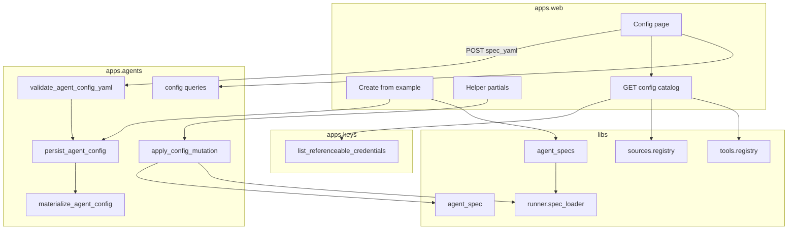
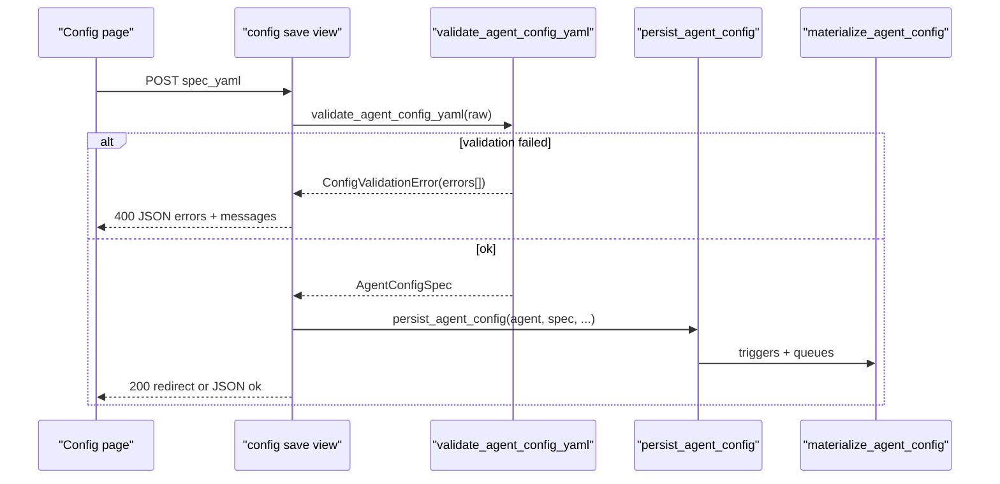

# Agent configuration UI — Design

Epic: [Inbox cleanup (U1)](../../epics/2026-07-03-inbox-cleanup.md) · Spec **4 of 9** · Item: **Agent configuration UI**

**Branch:** `feat/2026-07-04-agent-config-ui`

Status: **implemented**

Architecture reference: [`docs/ARCHITECTURE.md`](../../ARCHITECTURE.md) · Schema from
[Agent config schema](../2026-07-03-agent-config-schema/2026-07-03-agent-config-schema-design.md) ·
Queues from [Sources and queues](../2026-07-04-sources-and-queues/2026-07-04-sources-and-queues-design.md) ·
Credentials from [Key management](../2026-07-03-key-management/2026-07-03-key-management-design.md).

Mermaid display labels: per [`superpowers/brainstorming`](../../../olib/ai/skills/superpowers/brainstorming/SKILL.md)
— **always quote** human-readable node/participant/edge text.

Give operators a **YAML-first** dashboard (approach **C**: YAML editor + structured helpers)
to view and edit the full `AgentConfigSpec` — LLM, prompts, tool instances, triggers, and
queues/sources — without secrets in the UI. The editor reads/writes the same shape the runtime
uses; saves create immutable config revisions and re-materialize triggers and queues. New agents
come from **example specs** in `libs/agent_specs`, not hardcoded bootstrap code.

---

## Goal

Chief users can:

1. **Create agents** from shipped **example specs** (dashboard cards) or import/paste YAML.
2. **View** the current agent spec (upgraded to latest schema on load) and config metadata
   (source, revision, dirty, history).
3. **Edit** in a **proper YAML editor** (indentation, syntax highlighting, schema-aware
   autocompletion) and **Save** — full validation before persist; structured errors returned
   to the UI on failure.
4. **Use server-side helpers** for repetitive sections (LLM, tool instances, triggers,
   queues/sources, credential refs) that **mutate YAML server-side** (parse → patch pydantic
   → re-dump) and push updated text back to the editor.
5. **Sync from a local file path** when `config_source` is file-backed: revision + **dirty**
   when DB edits diverge from the file.
6. **Pick credentials by name** — options from `list_referenceable_credentials` filtered by
   type; **Set / Not set** only.

Downstream specs assume operators can configure agents in the product UI without CLI or admin
JSON editing.

### Non-goals

- **GitHub / remote sync** — poll, webhook, PR-back (TODO follow-on).
- **Queue trigger kind** UI wiring — spec 5; raw YAML remains editable.
- **Replacing YAML** — every runtime field expressible in YAML without the UI.
- **Bulk config upgrade** of stored rows.
- **Live queue ops dashboard** — depth, poll logs, item browser.
- **OAuth / secret upload** — stays on `/settings/keys/`.
- **Validating `credential_ref` at save** — runtime failure (spec 2).
- **Legacy bootstrap / hardcoded agents** — removed; examples replace demo buttons.

---

## Current state

| Area | Today |
|------|-------|
| Agent detail UI | Sessions + chat only |
| Config create | Dashboard **demo model buttons** → `hardcoded.py` / `bootstrap_agent` |
| Config persist | `persist_agent_config` + `materialize_agent_config` |
| Spec load | `AgentConfig.get_spec()` / upgrade chain |
| File load | `spec_loader` — CLI only |
| Models | `config_source`, `source_rev`, `dirty` — unused in UI |
| Keys UI | `/settings/keys/` — credential picker pattern |

---

## Approach: YAML + helpers (locked)

| Piece | Decision |
|-------|------------|
| Canonical state | **Raw YAML string** in the browser editor |
| Helpers | **Server-side** mutations: POST current YAML + mutation → validated patch → new YAML text |
| Helper options | **Server-side catalog** — tool types, adapters, providers, credential lists, schema keys for autocomplete |
| Save | Frontend POSTs **raw YAML**; backend **validates** then calls `persist_agent_config` — no extra save wrapper |
| Create agent | **`libs/agent_specs/examples/*.yaml`** — listed in UI, instantiated via `create_agent_from_spec` |

---

## Example agents (`libs/agent_specs`)

Replace `apps/agents/hardcoded.py` and `apps/web/demo_models.py`.

```
libs/agent_specs/
  __init__.py          # list_examples(), load_example(slug), example metadata
  examples/
    clock-assistant.yaml
    queue-echo.yaml    # optional queues[] + test source sketch
```

**Each example file** is a valid `AgentConfigSpec` YAML plus optional front-matter comment
or sidecar `meta.json` (title, description) — prefer **YAML comments** at top for v1:

```yaml
# title: Clock assistant
# description: Manual-trigger demo with clock tool.
schema_version: 1
...
```

**`list_examples()`** returns `{slug, title, description}` for dashboard cards.

**Create flow:** POST `example_slug` + optional `identifier` → `load_example(slug)` →
`create_agent_from_spec(..., config_source='ui', source_rev='example:<slug>')`.

**Remove:** `HARDCODED_SPEC`, `bootstrap_agent`, `demo_agent_spec`, `bootstrap_agent` view,
`demo_models` module. Tests that used bootstrap switch to `load_example('clock-assistant')`
or inline minimal specs.

**Ship 2–3 examples** covering: basic manual agent (clock), and one with `queues[]` for
queue-tool smoke tests.

---

## YAML editor

Use a **real editor widget**, not a plain `<textarea>`.

**Recommended: CodeMirror 6** (`@codemirror/lang-yaml`, theme matching Chief dark UI):

- Indentation / dedent (Tab, Shift-Tab)
- Syntax highlighting
- Bracket matching, line numbers (optional)
- **Autocompletion** from server-provided **schema manifest** (top-level keys, nested paths
  under `tools[]`, `queues[]`, `triggers[]`, known `kind` values, tool/adapter type names)

**Delivery:** vendored static bundle under `backend/static/web/codemirror/` (or CDN with
pinned versions in template — prefer **vendored** for reproducibility). Init from Alpine or
small `agent_config_editor.js` on the config page only.

**Monaco** is acceptable if CodeMirror autocompletion proves insufficient; default to
CodeMirror for bundle size.

**Editor ↔ helpers:** helpers return `{yaml: "...", errors: [...]}` JSON; client replaces
editor content. **Save** reads `editor.state.doc.toString()` (or equivalent) into POST body
field `spec_yaml`.

**Initial content:** server renders stable YAML dump from `get_spec()` (sorted keys, `|`
for multiline `system_prompt`).

---

## Architecture



**Import boundary (unchanged):** `apps.web` → `apps.agents` commands/queries + `apps.keys`
metadata only. No `resolve_*`.

**New / changed modules:**

| Module | Role |
|--------|------|
| `libs/agent_specs/` | Example YAML library + `list_examples` / `load_example` |
| `apps/agents/services/config_validation.py` | `validate_agent_config_yaml(raw) -> AgentConfigSpec` + structured errors |
| `apps/agents/services/config_mutations.py` | `apply_config_mutation(raw, mutation) -> str` for helpers |
| `apps/agents/services/queries.py` | `get_config_editor_context`, history, catalog payload |
| `apps/agents/services/config_commands.py` | `create_from_example`, `sync_from_file`, `set_file_source` |

**Delete:** `apps/agents/hardcoded.py`, `apps/web/demo_models.py`.

---

## Config catalog (server-side helpers)

Single payload for config page + autocomplete (GET or embedded in page context):

| Section | Source |
|---------|--------|
| `providers` / `models` | `libs.providers` registry (same data demo_models used, moved behind agents/web boundary via catalog) |
| `tool_types` | `libs.tools.registry` — name, `credential_type`, function names |
| `adapter_types` | `libs.sources.registry` — name, `credential_type` |
| `trigger_kinds` | `TriggerSpec` literals |
| `schema_keys` | Static manifest for YAML autocomplete (top-level + common nested paths) |
| `credentials` | `list_referenceable_credentials(user_id)` grouped by type |
| `examples` | `list_examples()` |

Helpers use the same catalog for dropdowns; no duplicated option lists in templates.

---

## Config source modes

| `config_source` | Meaning |
|-----------------|---------|
| `ui` | Created/edited in product UI (default for new agents) |
| `file:<absolute-path>` | Local filesystem YAML; sync reads this path |

**Remove** `hardcoded` as a source value. Migration: existing rows may keep legacy values
until re-saved; UI displays them as **Legacy** badge.

**Revision (`source_rev`):**

- Example create: `example:<slug>`
- UI save: `ui:<iso-timestamp>` or content hash `ui-sha256:<hex>`
- File sync: `sha256:<hex>` of normalized file bytes

**Dirty:** `true` when user saves edited YAML while `file:`-bound and content ≠ file hash.
Clear via **Sync now** (reload file → persist, `dirty=False`).

---

## UI surfaces

### Routes

| Route | Method | Purpose |
|-------|--------|---------|
| `/agents/create/` | GET | Pick example or import YAML |
| `/agents/create/` | POST | `example_slug` or raw YAML → new agent |
| `/agents/<id>/config/` | GET | Editor + metadata + helpers + catalog |
| `/agents/<id>/config/save/` | POST | Body: `spec_yaml` → validate → persist |
| `/agents/<id>/config/mutate/` | POST | Body: `spec_yaml` + mutation → new YAML |
| `/agents/<id>/config/sync/` | POST | File-backed reload |
| `/agents/<id>/config/source/` | POST | Set/clear `file:` path |
| `/agents/<id>/config/history/<config_id>/` | GET | Read-only revision |

Remove `/agents/bootstrap/` (demo model POST).

### Dashboard

Replace per-model bootstrap buttons with **example agent cards** (title, description,
Create button). Link: **Create agent** → `/agents/create/` (examples + import).

### Config page layout

1. **Metadata bar** — source, revision, dirty, spec_version, pinned-session count (info).
2. **Actions** — Save, Sync now (if file), Set file path.
3. **YAML editor** — CodeMirror (see above); validation errors render below editor (field
   path + message list; map line numbers when parser provides them).
4. **Structured helpers** (collapsible; htmx or fetch):
   - LLM — provider, model, temperature, credential picker
   - System prompt — textarea (mutation syncs `system_prompt` in YAML)
   - Tool instances — add/remove row; type + allow/deny + credential
   - Triggers — add/remove; kind + cron
   - Queues — add queue/source; adapter config JSON sub-editor

Each helper POSTs current editor YAML to `/config/mutate/`; response updates editor text.

---

## Save and validation



**`validate_agent_config_yaml(raw: str) -> AgentConfigSpec`** (single validation entry point
for save, mutate, import, sync):

1. Parse YAML/JSON (`load_agent_config_spec` / upgrade chain).
2. `validate_spec_tools(spec)`.
3. Per `queues[].sources[]`: `get_adapter(type).validate_config(config)` when registered.
4. Raise **`ConfigValidationError`** with `errors: list[{path, message, line?}]` — stable
   paths like `tools[1].type`, `queues.inbox.sources[0].config`.

**Save view** — no `save_spec_from_ui` indirection:

1. Read `spec_yaml` from POST (frontend always sends editor text).
2. `validate_agent_config_yaml(spec_yaml)`.
3. Compute `source_rev` + `dirty` (file-backed rules).
4. `persist_agent_config(agent, spec, source_rev=..., dirty=...)`.
5. On error: **400** with JSON `{"errors": [...]}` for fetch/htmx; re-render page with
   error list for full POST.

**Mutate** uses the same validator after patching; return mutation errors without persisting.

---

## Credential pickers

Unchanged from key-management contract: `list_referenceable_credentials(user_id, type=...)`,
Set/Not set badges, empty option = default for type. Catalog preloads grouped credentials
for helper dropdowns.

---

## Config history

Last **10** `AgentConfig` rows; read-only YAML view; **Restore to editor** (client-side only
until user Saves).

---

## File sync

**Sync now:** require `file:` source; read + hash; if unchanged, flash "up to date"; else
`validate_agent_config_yaml` → `persist_agent_config(..., dirty=False)`.

**Set file path:** POST path; verify readable; optional immediate sync.

**Push to file:** deferred v1.

---

## Error handling

| Situation | Response |
|-----------|----------|
| YAML syntax error | `path: ""`, message, `line` when available |
| Pydantic / ingest | structured `path` + message |
| Adapter config | `queues.<id>.sources.<id>.config` + message |
| Unsupported schema version | single error: upgrade Chief |
| Missing file on sync | 400 |
| Save with running sessions | allow; banner with pinned count |

Prefer JSON error bodies for editor Save (htmx/fetch); flash for sync redirects.

---

## Testing

| Area | Tests |
|------|-------|
| `libs/agent_specs` | list/load examples; valid specs |
| `validate_agent_config_yaml` | syntax, tools, adapters, error shape |
| `apply_config_mutation` | add tool instance changes YAML |
| `create_from_example` | agent + materialized rows |
| File sync | dirty flag, idempotent sync |
| `apps/web` | save 400 returns errors JSON; login/404 |
| Regression | remove bootstrap; tests use examples or fixtures |

---

## Implementation stages

**Pre-implementation:** checkout `feat/2026-07-04-agent-config-ui`, `-revision.md` template.

1. **`libs/agent_specs`** — examples + list/load; remove `hardcoded.py`.
2. **Validation** — `validate_agent_config_yaml` + `ConfigValidationError`.
3. **Create flow** — `/agents/create/`, dashboard example cards; delete bootstrap/demo_models.
4. **Catalog + mutations** — queries payload, `apply_config_mutation`.
5. **YAML editor** — CodeMirror bundle + schema autocomplete from catalog.
6. **Config page** — save/mutate routes, error display.
7. **Helpers** — LLM, tools, triggers, queues partials.
8. **File sync** — source path, dirty, sync now.
9. **History + agent detail link** — badges, revision list.
10. **Test migration** — replace `bootstrap_agent` usages.

---

## Decisions (locked)

| Question | Decision |
|----------|------------|
| UI approach | **C — YAML + server-side helpers** |
| Editor | **CodeMirror 6** + YAML lang; schema autocomplete from catalog |
| Save API | POST **`spec_yaml`**; **`validate_agent_config_yaml`** then **`persist_agent_config`** |
| `save_spec_from_ui` | **No** — unnecessary wrapper |
| Validation errors | **Structured JSON** to frontend on every save/mutate/import |
| Helper mutations | **Server-side** parse → patch → dump |
| Helper options | **`config catalog`** server payload |
| Create agent | **`libs/agent_specs/examples/`** — no hardcoded bootstrap |
| `config_source` | **`ui`** + **`file:<path>`**; drop `hardcoded` |
| GitHub sync | Deferred |
| Push DB → file | Deferred v1 |

---

## References

- [Epic: Inbox cleanup](../../epics/2026-07-03-inbox-cleanup.md)
- [Brainstorming — Mermaid labels](../../../olib/ai/skills/superpowers/brainstorming/SKILL.md)
- [Agent config schema](../2026-07-03-agent-config-schema/2026-07-03-agent-config-schema-design.md)
- [Sources and queues](../2026-07-04-sources-and-queues/2026-07-04-sources-and-queues-design.md)
- [Key management](../2026-07-03-key-management/2026-07-03-key-management-design.md)
- [Architecture](../../ARCHITECTURE.md)
- [v0.2 config from files](../../../TODO.md) (§3)
