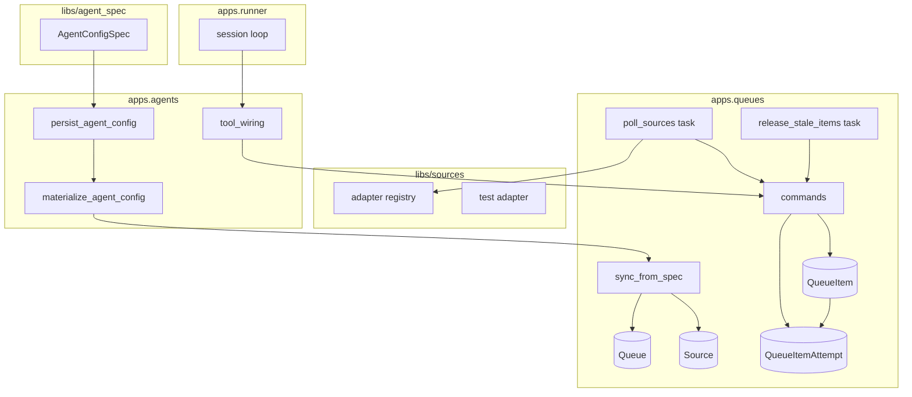
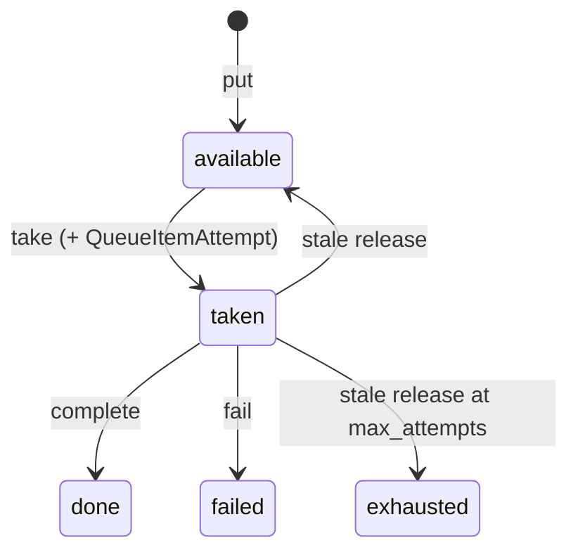

# Sources and queues — Design

Epic: [Inbox cleanup (U1)](../../epics/2026-07-03-inbox-cleanup.md) · Spec **3 of 9** · Item: **Sources and queues**

**Branch:** `feat/2026-07-04-sources-and-queues`

Status: **spec only**

Architecture reference: [`docs/ARCHITECTURE.md`](../../ARCHITECTURE.md) · Agent config schema
(spec 2) · Key management (spec 1).

Deliver the **platform ingest primitive** that replaces the original design doc’s
“pipes”: external **sources** discover items and **enqueue** them; **queues** hold
deduped work items with a robust take/complete/fail lifecycle; agents interact via a
gated **`queue` tool**. Reusable by U2 and later use cases.

This spec is **infrastructure only** — no Gmail adapter (spec 6), no queue **trigger**
dispatch or cron wiring (spec 5), no config UI (spec 4). Those specs consume what
this one defines.

---

## Goal

Chief operators and agents can:

1. **Define named queues** (per user) with configurable retry policy (`max_attempts`,
   hold timeouts).
2. **Define sources** (per user) that point at a target queue and declare
   **adapter-specific filters** in JSON config — not hardcoded inbox rules.
3. **Poll or push items** into a queue with **dedup** on `(source, external_id)`.
4. **Take items atomically** — one session claims an item; no double-claim.
5. **Complete or fail** items — only the taker’s session may terminalize a `taken`
   item.
6. **Recover stuck items** via a periodic stale-release task (minimum hold, early
   release when session is releasable, long-hold safety valve).
7. **Use a `queue` tool** from agent sessions: `put`, `take`, `complete`, `fail`
   (gated by tool instance allow/deny like other tools).

Downstream specs bind agents to queues (spec 5 triggers), add Gmail as the first real
adapter (spec 6), and configure U1 filters in source config (spec 9) — not in adapter
code.

### Non-goals

- **Gmail / ClickUp / webhook adapters** — spec 6+; spec 3 ships a **test/dummy**
  adapter for integration tests only.
- **Queue trigger kind** on `TriggerSpec`, Celery beat dispatch, “start session on
  take” — spec 5.
- **Agent config UI** for sources/queues — spec 4 (admin + management commands OK for
  v1 of this spec).
- **`idle` session lifecycle rename** — epic spec 5; spec 3 defines a **releasable
  session predicate** on today’s statuses and documents the spec-5 alignment.
- Dedicated Celery **`agent-runs` queue** — still deferred (`AGENTS.local.md`).

---

## Current state

| Area | Today |
|------|-------|
| Ingest | No sources, queues, or deduped item store |
| Triggers | `manual`, `schedule`, `agent` kinds; no `queue` kind |
| Sessions | `queued → running → waiting/paused → done`; no item linkage |
| Tools | `clock` only; no queue tool |
| Original design | “Pipes / dedup ingest queue” explicitly deferred |

Spec 2 delivered tool instances and `credential_ref`; agents still cannot receive
external work items or hand off completion to a queue.

---

## Architecture

See also [`docs/ARCHITECTURE.md`](../../ARCHITECTURE.md) (agent materialization, queue
attempt history).



**New Django app:** `apps.queues` — queues, sources, items, attempt log, poll/release
tasks. Follows **services/queries + commands** (`AGENTS.local.md`).

**Config materialization:** optional `queues[]` on `AgentConfigSpec` (no schema version
bump). On config save, `apps.agents.materialize_agent_config` calls
`apps.queues.commands.sync_from_spec` to create/update DB rows by stable queue **id**.

**New library packages:**

- **`libs/agent_spec`** — pydantic schema + spec migrations (extracted from
  `apps/agents` during spec 3; see ARCHITECTURE.md).
- **`libs/sources`** — adapter protocol + registry (Django-free).

**Queue tool:** `libs/tools/queue.py` — **`apps.agents`** registers and **`tool_wiring`**
injects `user_id`, `session_id`, and agent scope.

**Dependency rule:** `apps.queues` imports Django/stdlib + `libs.sources` + `sessions`
(for releasable predicate). It does **not** import `apps.agents` ingest. **`apps.agents`**
imports **`apps.queues.commands`** for materialization only.

---

## Agent config shape (optional `queues[]`)

Backward-compatible addition to **`AgentConfigSpec`** (stays at current
`schema_version`; default `queues: []`):

```yaml
queues:
  - id: inbox
    max_attempts: 3
    min_hold_seconds: 60
    sources:                    # optional — input-only queue may omit
      - id: gmail-main
        type: gmail
        credential_ref: gmail-personal
        config:
          query: "in:inbox -label:x-*"
  - id: overflow
    max_attempts: 1
    # no sources — fed by other agents via queue.put
```

- Queues are **agent-scoped** (owned by the agent whose spec declares them).
- **Multiple sources** may feed one queue.
- **Cross-agent feed:** another agent’s `queue.put` targets `(owner_agent, queue_id)`;
  only the owning agent’s sessions **take**.
- **Worker pool (spec 5):** queue trigger `max_workers` caps concurrent sessions on the
  same agent draining the same queue — not multi-agent take.

---

## Domain model

### `Queue`

Owned by an **agent**; stable **`queue_id`** slug from spec (`id` field).

| Field | Type | Notes |
|-------|------|-------|
| `id` | UUID | pk |
| `agent` | FK → Agent | owner |
| `queue_id` | str | unique per agent; slug `[a-z][a-z0-9_-]{0,63}` |
| `agent_config` | FK → AgentConfig | config revision that last synced this row |
| `max_attempts` | int | default `3`; min `1` |
| `min_hold_seconds` | int | default `60` |
| `early_release_seconds` | int | default `300` |
| `long_hold_seconds` | int | default `3600` |
| `created_at` | datetime | |

Indexes: `(agent_id, queue_id)` unique. DB row persists across config revisions;
`sync_from_spec` updates settings in place.

### `Source`

Child of a queue; declared nested under `queues[].sources` in spec.

| Field | Type | Notes |
|-------|------|-------|
| `id` | UUID | pk |
| `queue` | FK → Queue | |
| `source_id` | str | unique per queue; slug from spec `id` |
| `adapter_type` | str | e.g. `test`, `gmail` (spec 6) |
| `config` | JSON | adapter-validated filters |
| `status` | enum | `active` / `disabled` |
| `credential_ref` | str \| null | optional; resolved at poll time |
| `last_polled_at` | datetime \| null | |
| `created_at` | datetime | |

Indexes: `(queue_id, source_id)` unique.

### `QueueItem`

One unit of work on a queue.

| Field | Type | Notes |
|-------|------|-------|
| `id` | UUID | pk |
| `queue` | FK → Queue | |
| `source` | FK → Source \| null | null for manual / cross-agent `put` |
| `external_id` | str | dedup key when `source` set |
| `payload` | JSON | opaque to platform |
| `status` | enum | see lifecycle |
| `attempt_count` | int | number of takes so far |
| `taken_by_session` | FK → AgentSession \| null | **current** taker only |
| `taken_at` | datetime \| null | current take start |
| `completed_at` | datetime \| null | terminal timestamp |
| `failure_reason` | str \| null | from last explicit `fail` |
| `created_at` | datetime | |

**Dedup:** unique `(source_id, external_id)` when `source_id` is not null.

### `QueueItemAttempt`

**Full session history** for an item — one row per **take**, retained permanently for
debugging and ops (even after the item is `exhausted`).

| Field | Type | Notes |
|-------|------|-------|
| `id` | UUID | pk |
| `item` | FK → QueueItem | |
| `session` | FK → AgentSession | session that took the item |
| `attempt_number` | int | matches `item.attempt_count` at take time (1-based) |
| `outcome` | enum | `in_progress` → terminal outcome |
| `started_at` | datetime | take time |
| `ended_at` | datetime \| null | complete / fail / release time |
| `detail` | str \| null | e.g. `fail` reason, `stale_release`, `long_hold_release` |

**Outcome enum (`QueueItemAttemptOutcome`):**

| Outcome | Set when |
|---------|----------|
| `in_progress` | Row created on `take` |
| `completed` | Taker called `complete` |
| `failed` | Taker called `fail` (`detail` = reason) |
| `released` | Stale release back to `available` |
| `exhausted` | Item marked `exhausted` while this attempt was active |

On **`take`:** create `QueueItemAttempt` with `in_progress`. On **`complete`** /
**`fail`:** close the open attempt for `(item, session)`. On **stale release:** close
attempt with `released` or `exhausted`. Queries:
`list_attempts_for_item(item_id)` returns **all** sessions that tried the item.

**Status enum (`QueueItemStatus`):** (unchanged)

| Status | Meaning |
|--------|---------|
| `available` | Waiting for a taker |
| `taken` | Claimed by a session |
| `done` | Taker called `complete` |
| `failed` | Taker called `fail` (explicit agent decision) |
| `exhausted` | Reached `max_attempts` without `done`; terminal |



**Attempt counting:** increment `attempt_count` on each `take`; append
`QueueItemAttempt` every time — never overwrite prior session links.

---

## Commands & queries

### Queries (`apps/queues/services/queries.py`)

Read-only; no side effects.

- `get_queue(agent_id, queue_id) -> Queue | None`
- `list_queues(agent_id) -> list[QueueMeta]`
- `get_item(item_id) -> QueueItemMeta | None`
- `list_queue_items(queue_id, *, status?, limit?) -> list[QueueItemMeta]`
- `list_attempts_for_item(item_id) -> list[QueueItemAttemptMeta]` — **all sessions**
  that took the item, ordered by `attempt_number`

### Commands (`apps/queues/services/commands.py`)

All writes go through commands (`@transaction.atomic` where noted).

#### `put_item(...) -> PutResult`

```python
def put_item(
    *,
    queue: Queue,
    payload: dict[str, Any],
    source: Source | None = None,
    external_id: str | None = None,
) -> PutResult:  # created: bool, item_id: UUID
```

- Requires `external_id` when `source` is set.
- Dedup: existing `(source, external_id)` → return existing id, `created=False`.
- If existing item is terminal (`done`, `failed`, `exhausted`), return existing without
  re-opening (idempotent no-op). *Re-queue after terminal requires a new external_id or
  explicit future “reopen” command — out of scope.*

#### `take_item(*, queue: Queue, session_id: UUID) -> TakeResult`

**Atomic:** `SELECT … FOR UPDATE SKIP LOCKED` on oldest `available` item in queue, or
single-statement `UPDATE … WHERE id = (subquery …) RETURNING *`.

- Sets `status=taken`, `taken_by_session`, `taken_at`, increments `attempt_count`.
- Creates **`QueueItemAttempt`** (`in_progress`, `attempt_number`, `session`).
- If `attempt_count > queue.max_attempts` after increment, still allow take but stale
  release will immediately exhaust — alternatively reject take when already at max
  before increment. **Decision:** if `attempt_count >= max_attempts` **before** take,
  skip item (mark `exhausted` if was incorrectly `available`, else take and let release
  exhaust). Simpler rule: **on take, if increment would exceed `max_attempts`, set
  `exhausted` immediately and do not assign to session**; continue to next available
  item.

Returns `{item_id, payload, attempt_count}` or empty if queue has no claimable items.

#### `complete_item(*, item_id: UUID, session_id: UUID) -> None`

- Item must be `taken` and `taken_by_session_id == session_id`.
- Sets `done`, `completed_at`.
- Closes open **`QueueItemAttempt`** for this session with outcome `completed`.

#### `fail_item(*, item_id: UUID, session_id: UUID, reason: str = '') -> None`

- Same taker check.
- Sets `failed`, `failure_reason`, `completed_at`.
- Closes attempt with outcome `failed` and `detail=reason`.

#### `release_stale_items(*, now: datetime | None = None) -> ReleaseStats`

Called by Celery beat. For each `taken` item:

1. **`held = now - taken_at`**
2. If `held < queue.min_hold_seconds` → skip.
3. If `held >= queue.long_hold_seconds` → release (or exhaust) regardless of session
   state — **safety valve** for stuck takes.
4. Else if session is **releasable** (see below) and `held >= queue.early_release_seconds`
   → release (or exhaust).
5. **Release:** if `attempt_count >= max_attempts` → `exhausted` and close attempt with
   `exhausted`; else `available`, close attempt with `released`, clear
   `taken_by_session`, `taken_at`.

**Releasable session predicate (spec 3 interim):**

```python
def is_session_releasable(session: AgentSession) -> bool:
    return session.status in {
        AgentSessionStatus.DONE,
        AgentSessionStatus.WAITING,
    } or session.ended_at is not None
```

Spec 5 may introduce explicit **`idle`** semantics; this predicate becomes a thin
wrapper without changing queue release rules.

---

## Source adapters (`libs/sources`)

### Protocol

```python
class SourceAdapter(ABC):
    adapter_type: str

    def validate_config(self, config: dict[str, Any]) -> None:
        """Raise ValueError on invalid config."""

    def poll(
        self,
        *,
        config: dict[str, Any],
        put_item: PutItemCallback,
        credential_supplier: SecretSupplier | None,
    ) -> PollResult:  # items_seen, items_enqueued
        ...
```

- **`put_item`** callback wraps `commands.put_item` with `source` + `external_id` bound.
- Adapters stay Django-free; poll task loads ORM rows and invokes adapter.

### Registry

`libs/sources/registry.py` — `@functools.cache` discovery, same pattern as
`spec_migrations` / tool registry.

### `test` adapter (shipped in spec 3)

- Config: `{ "prefix": "test", "batch_size": 1 }`.
- Each poll enqueues `batch_size` items with external_ids `f"{prefix}-{monotonic}"`.
- Used in tests and manual dev without Gmail.

Gmail adapter registers in spec 6 without changing core models.

### Poll task

`apps/queues/tasks.py`:

```python
@shared_task
def poll_source(source_id: str) -> None: ...

@shared_task
def poll_active_sources() -> None:
    """Beat entry: enqueue poll_source for each active source (or inline poll)."""
```

Spec 5 may bind source poll to agent **schedule** triggers; spec 3 provides the task
and a management command `poll_source <name>` for manual/beat use.

---

## Queue tool (`libs/tools/queue.py`)

Registered in `libs/tools/builtin.py` (or adjacent registry module). **No
`credential_type`** — queue ops are authorized by user + session context, not external
API keys.

| Function | Description | Args (summary) |
|----------|-------------|----------------|
| `put` | Enqueue payload | `queue`, `payload`, optional `external_id` |
| `take` | Claim next item | `queue` |
| `complete` | Mark done | `item_id` |
| `fail` | Mark failed | `item_id`, optional `reason` |

**Wire names:** `{instance_id}__put`, etc. (spec 2 instance id segment).

**Invocation context (injected by wiring, not LLM-visible):**

- `user_id` from agent owner
- `session_id` from current `AgentSession`
- Permission checks via tool instance `allow`/`deny`

**Return shapes (JSON-serializable):**

- `take` → `{ "item_id": "…", "payload": {…}, "attempt": N }` or `{ "item": null }`
- `put` → `{ "item_id": "…", "created": true|false }`
- `complete` / `fail` → `{ "ok": true }`

Errors → tool failure JSON (unknown queue, not taker, unknown item).

Agents reference queues **by name** (scoped to owning user). Spec 5 may restrict which
queue names a given trigger/session may use; spec 3 validates ownership only.

---

## Admin & operability (v1)

Until spec 4 UI:

- Django admin for `Queue`, `Source`, `QueueItem` (read-heavy; item payload visible to
  staff/debug).
- Management commands: `create_queue`, `create_source`, `poll_source`, `queue_stats`.
- Optional: enqueue fixture items for local dev (`orunr django manage enqueue_test_item …`).

---

## Agent config & materialization

Add optional **`queues[]`** to `AgentConfigSpec` — **no `schema_version` bump**
(backward-compatible; default `[]`). See [ARCHITECTURE.md](../../ARCHITECTURE.md).

On `persist_agent_config`, `materialize_agent_config` calls
`apps.queues.commands.sync_from_spec(agent, config, spec.queues)`.

**Queue trigger fields** (`kind: queue`, `max_workers`, …) arrive in spec 5 as optional
trigger extensions — breaking only if we change existing trigger shapes; otherwise
optional on `TriggerSpec` too.

Hardcoded demo agent unchanged (no `queues` block).

---

## Stale release & beat

New Celery beat schedule entry (chief celery config):

- `release_stale_items` — every 1–5 minutes (exact interval in plan).
- `poll_active_sources` — optional every N minutes, or defer to manual/spec 5 cron.

Tasks run on **default** queue (same as agent sessions).

---

## Error handling

| Situation | Behavior |
|-----------|----------|
| Take on empty queue | Tool success with `{ "item": null }` |
| Complete/fail by non-taker | Tool failure JSON |
| Complete/fail wrong status | Tool failure JSON |
| Put duplicate `(source, external_id)` | Idempotent return existing |
| Unknown queue name | Tool failure / command error |
| Invalid source config at create | Validation error at admin/command |
| Adapter poll failure | Log + mark source last error; do not crash beat |

---

## Testing

| Area | Tests |
|------|-------|
| `commands.put_item` | create, dedup, terminal idempotency |
| `commands.take_item` | atomic claim; attempt row created |
| `commands.complete/fail` | taker-only; attempt closed |
| `commands.release_stale_items` | min/early/long hold; attempt outcome `released`/`exhausted` |
| `list_attempts_for_item` | returns every session that tried an item |
| `libs/sources/test` adapter | poll enqueues expected external_ids |
| `libs/tools/queue` | schema / handler unit tests with mocked commands |
| `tool_wiring` + runner | session invokes take → complete round-trip |
| Regression | existing agent/session tests unchanged |

Use `OTransactionTestCase` for concurrency take test (two threads/processes or sequential
assert on locked row).

---

## Implementation stages

**Pre-implementation (Step 0):** checkout `feat/2026-07-04-sources-and-queues`, create
`-revision.md`.

1. **Models + migrations** — `Queue`, `Source`, `QueueItem`, constraints, indexes.
2. **Commands + queries** — put/take/complete/fail/release.
3. **Adapter framework** — `libs/sources`, test adapter, registry.
4. **Poll + release tasks** — Celery tasks, beat entries, management commands.
5. **Queue tool** — `libs/tools/queue.py`, registry, wiring hooks for session context.
6. **Admin** — register models.
7. **Docs** — extend `ARCHITECTURE.md` with sources/queues section.

Spec 6 adds Gmail adapter file + registration only.

---

## Decisions (locked)

| Question | Decision |
|----------|----------|
| App name | **`apps.queues`** (sources + items + attempts) |
| Schema package | **`libs/agent_spec`** (extract during spec 3) |
| Materialization | **`apps.agents.materialize_*`** orchestrates; **`queues.sync_from_spec`** implements |
| Queue ownership | **Agent-scoped**; optional `queues[]` in spec (no version bump) |
| Source placement | **Nested under queue** in spec (`queues[].sources`) |
| Cross-agent feed | **`queue.put`** to another agent’s queue; no shared take |
| Worker pool | **`max_workers`** on queue trigger (spec 5); same agent, multiple sessions |
| Attempt history | **`QueueItemAttempt`** — all sessions per item, never overwrite |
| Adapter package | **`libs/sources`** (Django-free) |
| Dedup key | **`(source_id, external_id)`** unique |
| Terminal item re-put | **No-op** (idempotent return) |
| Attempt increment | **On `take`**, not on release |
| `failed` vs `exhausted` | **`failed`** = explicit `fail`; **`exhausted`** = max attempts |
| Take atomicity | **`SELECT FOR UPDATE SKIP LOCKED`** (or equivalent) |
| Current taker | **`QueueItem.taken_by_session`**; full history on **`QueueItemAttempt`** |
| Queue tool credential | **None** — agent/session scoped |
| Session releasable (v1) | **`done` / `waiting` / `ended_at` set** |
| First real adapter | **Spec 6 Gmail**; ship **`test`** adapter here |

---

## Open questions (resolve before plan)

1. ~~**Payload size limit**~~ — **64 KiB** JSON (locked in plan).
2. ~~**Queue item listing retention**~~ — keep terminal items (locked in plan).
3. ~~**Per-queue vs global defaults**~~ — per-queue fields only (locked in plan).

**Implementation plan:** [`2026-07-04-sources-and-queues-plan.md`](./2026-07-04-sources-and-queues-plan.md)

---

## References

- [Epic: Inbox cleanup](../../epics/2026-07-03-inbox-cleanup.md)
- [Agent config schema (spec 2)](../2026-07-03-agent-config-schema/2026-07-03-agent-config-schema-design.md)
- [Key management (spec 1)](../2026-07-03-key-management/2026-07-03-key-management-design.md)
- [Chief design — deferred pipes](../2026-06-23-design/2026-06-23-design-design.md)
- [Architecture](../../ARCHITECTURE.md)
- [ROADMAP U1](../../ROADMAP.md)
