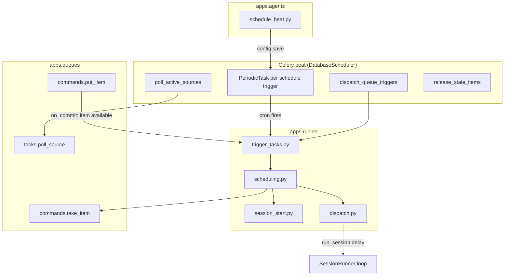

# Agent scheduling — Design

Epic: [Inbox cleanup (U1)](../../epics/2026-07-03-inbox-cleanup.md) · Spec **5 of 9** · Item: **Agent scheduling**

**Branch:** `feat/2026-07-05-agent-scheduling`

Status: **design approved**

Architecture reference: [`docs/ARCHITECTURE.md`](../../ARCHITECTURE.md) · Triggers from
[Agent config schema](../2026-07-03-agent-config-schema/2026-07-03-agent-config-schema-design.md) ·
Queues from [Sources and queues](../2026-07-04-sources-and-queues/2026-07-04-sources-and-queues-design.md).

Mermaid display labels: per [`superpowers/brainstorming`](../../../olib/ai/skills/superpowers/brainstorming/SKILL.md)
— **always quote** human-readable node/participant/edge text.

Wire **schedule** and **queue** triggers to Celery beat and session dispatch. An agent may
declare **multiple trigger entries at once** (e.g. one cron schedule plus several queue
bindings). When a triggered session finishes its turn it returns to **`waiting`** (epic
“idle”) and remains chat-able; stale queue release uses the existing releasable predicate
from spec 3.

This spec is **dispatch and schema only** — no Gmail adapter (spec 6), no inbox triage
workflow (spec 9), no config UI helpers for queue triggers (spec 4 non-goal carries
forward).

---

## Goal

Chief operators can declare in agent YAML:

1. **`schedule` trigger** — cron fires → while active session count is below **`max_sessions`**,
   start a session bound to the trigger → dispatch.
2. **`queue` trigger** — while active session count is below **`max_sessions`**, atomically
   **take** the next available item on a bound queue → start one session per item → dispatch.
   **Immediate path:** when a new item becomes **`available`** on the queue (`put_item`), also
   enqueue a targeted dispatch (same slot logic) so work starts without waiting for the beat
   scan.
3. **Platform source polling** — Celery beat enqueues `poll_source` for every active
   `Source` (deferred from spec 3). New items from polling wake **queue** triggers via the
   immediate `put_item` hook.

Downstream specs (Gmail adapter, inbox triage) bind **queue** triggers for per-email
isolation; **schedule** triggers are optional for periodic sweep sessions. Inbound items
reach queues via **`poll_active_sources`** beat, manual poll, **`queue.put`**, or source
adapters — not via a per-trigger poll flag (deferred; see non-goals).

### Non-goals

- **`agent` trigger kind** dispatch (future: agent-to-agent).
- **`poll_sources` on schedule triggers** — per-trigger “poll my sources before this session”
  (defer; use global **`poll_active_sources`** beat + **`queue`** triggers for v1).
- Dedicated **`agent-runs` Celery queue** — still deferred (`AGENTS.local.md`).
- Config UI helpers for queue triggers — raw YAML remains editable (spec 4).
- Renaming **`waiting`** to **`idle`** in the session model.
- Validating `credential_ref` / source credentials at ingest — runtime only (spec 2/3).

---

## Current state

| Area | Today |
|------|-------|
| Trigger kinds in schema | `schedule`, `manual`, `agent` — no `queue` |
| Trigger dispatch | **Manual only** — dashboard Start → `start_manual_session` |
| Schedule triggers | Schema field `cron` exists; **no beat wiring** |
| Queue ingest | Spec 3 — sources, items, `poll_source` task, stale release beat |
| Queue → session | Agents use **`queue` tool** `take` manually; no auto-dispatch |
| `poll_active_sources` beat | **Deferred** from spec 3 |
| Session idle | Loop ends in **`waiting`**; releasable predicate in spec 3 |

Spec 4 delivered YAML-first config UI; triggers and queues are editable in raw YAML but
**schedule** and **queue** kinds are inert until this spec ships.

---

## Schema (no `schema_version` bump)

Extend **`TriggerSpec`** with backward-compatible optional fields:

```yaml
triggers:
  - name: sweep
    kind: schedule
    cron: "0 * * * *"      # required; standard 5-field cron, UTC
    max_sessions: 1        # optional; default 1
  - name: inbox-worker
    kind: queue
    queue: inbox           # required; must match queues[].id on same agent
    max_sessions: 3        # optional; default 1
  - name: manual
    kind: manual
tools:
  - id: queue
    type: queue
    allow: [take, complete, fail]
queues:
  - id: inbox
    sources:
      - id: gmail-main
        type: gmail
        config: { ... }
```

| Field | Applies to | Notes |
|-------|------------|-------|
| `cron` | `schedule` | Required when `kind == schedule`; validated with **croniter** |
| `max_sessions` | `schedule`, `queue` | Default **`1`**, min **`1`** — max concurrent **agent sessions** for this trigger |
| `queue` | `queue` | Required when `kind == queue`; must exist in `queues[]` |

**Naming:** use **`max_sessions`** on both trigger kinds (not `max_workers` / `max_agents`).
It counts **`AgentSession`** rows tied to this trigger that are still in flight — not Celery
workers, not “number of agents” in the product sense. Same field name, same semantics, on
both kinds.

**Cross-validation on `AgentConfigSpec`:**

- Every `queue` trigger’s `queue` id must appear in `queues[]`.
- Pydantic rejects missing `cron` / `queue` for the respective kinds.

**Materialization:** unchanged pattern — new `Trigger` rows on config save; `TriggerKind`
enum adds **`queue`**.

**New DB field:** `Trigger.last_fired_at` (nullable `DateTimeField`) — updated when a
schedule trigger dispatch runs (session started or skipped at capacity); observability and
ops debugging.

---

## Architecture



**Module responsibilities:**

| Module | Role |
|--------|------|
| `apps.agents.services.schedule_beat` | Sync **`django-celery-beat`** `PeriodicTask` rows per schedule trigger on config save |
| `apps.runner.scheduling` | Per-trigger schedule dispatch + queue dispatch logic |
| `apps.runner.session_start` | Create `AgentSession` rows from a `Trigger` (no dispatch import — avoids cycles) |
| `apps.runner.trigger_tasks` | Thin Celery wrappers → `scheduling` commands |
| `apps.runner.start` | Manual start only; delegates to `session_start` + lazy `dispatch` import |
| `apps.queues.tasks.poll_active_sources` | Enqueue `poll_source` for **all** active sources (platform beat) |
| `apps.queues.commands.put_item` | On commit, if item is **`available`**, enqueue targeted queue dispatch (see below) |

**Active triggers** — dispatch only rows where:

- `Trigger.status == active`
- `Trigger.agent_config_id == Agent.current_config_id`

Older config revisions keep historical trigger rows but are not dispatched.

### What `max_sessions` means

Shared by **`schedule`** and **`queue`** triggers. Count sessions where:

- `trigger_ref == this Trigger.id`
- `status` ∈ `{queued, running, paused, waiting}`

Dispatch (beat or immediate) **only starts a new session while `count < max_sessions`**.

Examples:

- **`max_sessions: 1`** (default) — at most one in-flight session per trigger; a second queue
  item waits until the first session finishes or releases its hold.
- **`max_sessions: 3`** on a **queue** trigger — up to three items triaged in parallel, each
  in its own session.
- **`max_sessions: 1`** on a **schedule** trigger — if last hour’s scheduled session is still
  `waiting`, the next cron tick does not start another (that hour’s tick is skipped; see
  error handling).

Manual triggers are unaffected (dashboard Start has no `max_sessions`).

---

## Dispatch behavior

### Shared slot check

Both schedule and queue dispatch call the same helper:

`active_session_count(trigger) < trigger.max_sessions` (default 1).

### Schedule trigger

**Beat:** one **`django-celery-beat`** `PeriodicTask` per active schedule trigger on the
agent's current config (UTC crontab from `triggers[].cron`). Synced on config materialize
and trigger status changes. Celery beat fires
`apps.runner.trigger_tasks.dispatch_schedule_trigger(trigger_id)` at the cron time.

When the task runs:

1. If trigger is not on `current_config` or not active → disable stale PeriodicTask; return.
2. If `active_session_count >= max_sessions` → skip session (see error handling for
   `last_fired_at`).
3. Create session via `start_trigger_session(agent, trigger)`.
4. Append bootstrap user message (locked text below).
5. `push_chat_and_dispatch(session_id, message)`.
6. Set `Trigger.last_fired_at = now`.

**Bootstrap message (locked):**

```text
Scheduled run started. Execute your configured tasks.
```

### Queue trigger

**Two entry points** (same slot + take logic):

| Entry | When |
|-------|------|
| **Beat scan** | `dispatch_queue_triggers` every **15 s** — all active queue triggers |
| **Immediate** | After `put_item` commits and the item is **`available`** — enqueue `dispatch_queue_triggers_for_queue(queue_id)` |

**Immediate dispatch (latency path):**

- Hook in `put_item` → `transaction.on_commit` → Celery task
  `dispatch_queue_triggers_for_queue` (runner app).
- **Dependency rule:** `apps.queues` must not import `apps.runner` at module load time; use
  `on_commit` + Celery **`send_task`** by task name, or a one-line relay in `queues.tasks`
  that imports runner only inside the task body.
- Runs only queue triggers bound to **that** queue whose agent owns the queue.
- Respects **`max_sessions`** the same as the beat scan — if slots are full, the item stays
  **`available`** until the next release, completion, or beat pass.
- Also fire when **`put_item`** returns an **existing** item that is still **`available`**
  (idempotent dedup re-put), so backlog is not stuck waiting for beat.

**Beat scan algorithm** (also used by the immediate task, scoped to one queue):

1. Resolve `Queue` by `(agent, trigger.queue)`.
2. While `active_session_count(trigger) < max_sessions`:
   - Create session (status `queued`).
   - `take_item(queue, session_id=session.id)`.
   - If no item → delete the empty session; stop for this trigger.
   - Else → bootstrap user message; `push_chat_and_dispatch`.

**Bootstrap message (locked format):** plain-text user message containing:

- Line 1: `Process this queue item.`
- Blank line
- Line: `item_id: <uuid>`
- Blank line
- Line: `payload:` then a newline and the item payload as indented JSON (from `json.dumps(payload, indent=2, sort_keys=True)`)

The agent still calls **`queue.complete`** / **`queue.fail`** via the tool — auto-take does
not skip that contract. Item linkage is via `QueueItem.taken_by_session` (spec 3).

### Source polling (platform beat)

| Entry | Scope | Behavior |
|-------|-------|----------|
| Beat `poll_active_sources` | **All** active sources | Every **300 s**; enqueue `poll_source.delay` each |

New **`available`** items from polling (or any `put_item`) wake **queue** triggers via the
**immediate** `put_item` hook (in addition to the 15 s beat).

---

## Session lifecycle alignment

| Epic term | Chief status | Notes |
|-----------|--------------|-------|
| idle | `waiting` | Loop ends here after a successful turn; session stays chat-able |
| running work | `running` / `queued` | Runner lock may be held |
| releasable (queue hold) | `done`, `waiting`, or `ended_at` set | Unchanged from spec 3 (`is_session_releasable`) |

`run_session` must **not** overwrite `waiting` with `done` when the loop already set
`waiting` (preserve current behavior).

---

## Celery beat (`chief/celery.py`)

**Scheduler:** `django_celery_beat.schedulers:DatabaseScheduler` (`CELERY_BEAT_SCHEDULER` in
`chief/settings.py`). Platform intervals remain in `app.conf.beat_schedule`; schedule triggers
use **`PeriodicTask`** rows in the DB (see `apps.agents.services.schedule_beat`).

| Beat key | Task | Interval |
|----------|------|----------|
| `queues-release-stale-items` | `apps.queues.tasks.release_stale_items` | 120 s (existing) |
| `queues-poll-active-sources` | `apps.queues.tasks.poll_active_sources` | 300 s |
| `runner-dispatch-queue-triggers` | `apps.runner.trigger_tasks.dispatch_queue_triggers` | 15 s |

**Per schedule trigger** (not in `beat_schedule`): `PeriodicTask` →
`apps.runner.trigger_tasks.dispatch_schedule_trigger` at the trigger's cron (UTC).

All tasks run on the **default** Celery queue (`AGENTS.local.md`).

Register new task modules in `chief/tasks.py` (import-only registry).

---

## Validation at save

Extend `validate_agent_config_spec` (in addition to pydantic):

| Check | Error |
|-------|-------|
| `schedule` with invalid cron | path `triggers[N].cron` |
| `queue` referencing unknown queue id | path `triggers[N].queue` |
| Duplicate trigger names | DB constraint on materialize (existing) |

Ingest does not verify that sources/adapters exist at save time beyond spec 3 adapter
registry checks on `queues[].sources`.

---

## Error handling

| Situation | Behavior |
|-----------|----------|
| Schedule trigger on agent with no `current_config` | Skip; log at info |
| Queue trigger references missing `Queue` row | Skip trigger; log warning |
| `take_item` returns no item | Delete empty session; no dispatch |
| `take_item` / session create failure mid-loop | Log; stop filling slots for that trigger |
| Schedule at `max_sessions` capacity | Skip new session; **still** set `last_fired_at` |
| Immediate dispatch while slots full | No-op; item stays `available` for a later pass |
| `poll_source` failure | Existing spec 3 behavior — source `last_error` updated |
| Missing LLM credential at run time | Existing runner failure path |

Dispatch tasks must not crash the beat worker on a single bad trigger.

---

## Example spec

Update `libs/agent_specs/examples/queue-echo.yaml`:

- Add `queue` trigger on `inbox` with `max_sessions: 2`.
- Keeps manual trigger for dashboard testing.

Optional follow-up example (spec 9): inbox triage agent with schedule + queue triggers.

---

## Testing

Verification gate: `./olib/scripts/orunr py test-all` (see `ai/commands/py-checks.md`).

| Area | Tests |
|------|-------|
| `TriggerSpec` / cross-validation | missing cron; unknown queue ref |
| Cron helper | valid/invalid expressions; minute match |
| Schedule dispatch | cron match creates session; same-minute no refire; respects `max_sessions` |
| Queue dispatch | take + bootstrap message + dispatch; respects `max_sessions` |
| Immediate queue dispatch | `put_item` → enqueue dispatch; starts session when slots free |
| `poll_active_sources` | enqueues poll per active source |
| Regression | manual start, queue commands, runner loop, config UI validation |

Follow parproc naming rules (avoid `error`, `exception`, … in test names).

---

## Decisions (locked)

| Question | Decision |
|----------|----------|
| Schema version bump | **No** — optional fields + new enum value only |
| Cron library | **croniter** (new backend dependency) |
| Cron timezone | **UTC** for v1 |
| Schedule dedup | **`Trigger.last_fired_at`** per materialized trigger row |
| Concurrency field | **`max_sessions`** on **both** `schedule` and `queue` triggers; default **`1`** |
| Active session count | `{queued, running, paused, waiting}` for that `trigger_ref` |
| Queue dispatch latency | **Beat (15 s) + immediate on `put_item`** when item is `available` |
| `put_item` → runner coupling | **`on_commit` + Celery task by name** — no `apps.queues` → `apps.runner` import at load time |
| Per-trigger source poll | **Deferred** (`poll_sources` not in v1) |
| Global source beat | **`poll_active_sources`** — all active sources every 300 s |
| Queue auto-take | **Yes** — dispatch calls `take_item` before session runs |
| Idle semantics | **`waiting`** status (no rename) |
| Beat task module | **`apps.runner.trigger_tasks`** (avoid import cycle with `tasks.run_session`) |
| Bootstrap messages | **Locked strings** in spec (above) |
| Dedicated agent-runs queue | **Deferred** |

---

## Open questions

All resolved for v1 (see Decisions table). Revisit in a later spec if needed:

- Per-trigger beat intervals in YAML (use **`django-celery-beat`** `PeriodicTask` per cron).
- **`poll_sources`** on schedule triggers (agent-scoped poll before session).

---

## References

- [Epic: Inbox cleanup](../../epics/2026-07-03-inbox-cleanup.md)
- [Sources and queues](../2026-07-04-sources-and-queues/2026-07-04-sources-and-queues-design.md)
- [Agent config schema](../2026-07-03-agent-config-schema/2026-07-03-agent-config-schema-design.md)
- [Superpowers workflow](../../../olib/docs/specs/01-superpowers/01-superpowers.spec.md)

**Implementation plan:** [`2026-07-05-agent-scheduling-plan.md`](./2026-07-05-agent-scheduling-plan.md)
