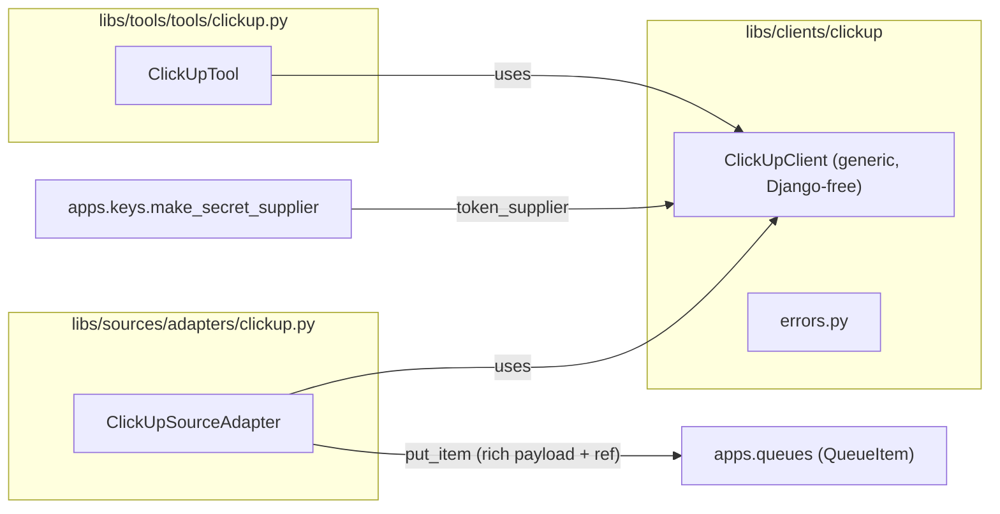

# ClickUp library and tool — Design

Epic: [Inbox cleanup (U1)](../../epics/2026-07-03-inbox-cleanup.md) · Spec **7 of 9** · Item: **ClickUp library and tool**

**Branch:** `feat/2026-07-06-service-integrations`

Status: **spec only**

Architecture reference: [`docs/ARCHITECTURE.md`](../../ARCHITECTURE.md) · Credentials from
[Key management (spec 1)](../2026-07-03-key-management/2026-07-03-key-management-design.md) ·
Tool instances from [Agent config schema (spec 2)](../2026-07-03-agent-config-schema/2026-07-03-agent-config-schema-design.md) ·
Sources/queues from [Sources and queues (spec 3)](../2026-07-04-sources-and-queues/2026-07-04-sources-and-queues-design.md).

Mermaid display labels: per [`superpowers/brainstorming`](../../../olib/ai/skills/superpowers/brainstorming/SKILL.md)
— **always quote** human-readable node/participant/edge text.

Deliver a generic **ClickUp client**, a **ClickUp source adapter** (polls a list → queue),
and a gated **ClickUp tool** (list spaces/lists/tasks, create task, comment, update, delete).
Co-designed with [Gmail (spec 6)](../2026-07-06-gmail-integration/2026-07-06-gmail-integration-design.md)
so the two integrations share one shape.

> **Shared anatomy:** The **`ToolInstance.config`** field, the `tool_wiring` `config`
> threading, and the queue **payload envelope** are defined and built in
> [Gmail (spec 6)](../2026-07-06-gmail-integration/2026-07-06-gmail-integration-design.md)
> (first in build order). This spec **reuses** them unchanged. The "Integration anatomy"
> section is repeated here so the doc reads standalone.

---

## Goal

Chief operators and agents can:

1. Store a **ClickUp personal API token** (`type=clickup`) once and reference it by name
   from a tool instance or source (spec 1 write-only key store).
2. Configure a **ClickUp source** that polls a list for tasks into a queue as work items —
   with **rich payload plus a back-reference** the agent can re-fetch.
3. Give an agent a gated **`clickup` tool** whose functions map to client methods, scoped per
   instance via `allow`/`deny` (delete **denied** by default in examples).
4. Route triage outcomes to ClickUp — the epic's "Todo → ClickUp task in the **INBOX** list"
   uses this tool's `create_task`.

Downstream: the inbox triage agent (spec 9) uses the `clickup` tool to create tasks in an
INBOX list; the source enables ClickUp-driven agents symmetrically with Gmail.

### Non-goals

- **OAuth app install** — v1 uses a **personal API token** (opaque string); OAuth deferred.
- **Gmail / Obsidian** — spec 6 (co-designed) and spec 8 (deferred).
- **Inbox triage routing rules** — spec 9 (this spec ships generic task ops).
- **Webhooks** — v1 polls; ClickUp webhooks are a later spec.
- **Custom fields / attachments / time tracking** — v1 covers core task CRUD + comments.

---

## Current state

| Area | Today |
|------|-------|
| External integrations | None — only `clock`, `queue` tools; `test` source adapter |
| Source adapters | `libs/sources` protocol + `test` adapter + registry (spec 3) |
| Tools | `libs/tools` protocol + registry; credential-backed tools bind a `token_supplier` (spec 1/2) |
| Tool instance addressing | `ToolInstance.config` added by **spec 6** (dependency) |
| Credential types | `clickup` reserved in key-mgmt type registry; no consumer yet |
| HTTP client | Backend has no `httpx`/`requests` dependency yet |

Key management (spec 1) reserves `type=clickup` and notes "personal API token likely
sufficient"; this spec is its first consumer.

---

## Integration anatomy (shared with spec 6)

Every external integration ships **exactly three components** plus a key-mgmt `type`:



**1. Client — `libs/clients/clickup/` (`client.py`, `errors.py`)**

- Generic wrapper over the ClickUp REST API v2 (no official Python SDK → thin `httpx`
  wrapper). Knows nothing about queues or triage.
- Django-free; imports only stdlib + `httpx`.
- Same constructor shape as `GmailClient`:

  ```python
  class ClickUpClient:
      """Thin wrapper over the ClickUp API v2 authenticated by a personal token."""

      def __init__(
          self,
          *,
          token_supplier: Callable[[], str | None],
          config: dict[str, Any] | None = None,
      ) -> None: ...
  ```

- **Resolves the token lazily** — calls `token_supplier()` per request to set the
  `Authorization` header; never stores plaintext on `self` beyond one operation (spec 1
  retention rule).
- Methods return plain dataclasses/dicts; raises a typed `ClickUpError` hierarchy.

**2. Source adapter — `libs/sources/adapters/clickup.py`**

- Implements the spec 3 `SourceAdapter` protocol (`adapter_type='clickup'`,
  `credential_type='clickup'`, `validate_config`, `poll`), registered in the sources registry.
- Holds **service-specific filtering** (list id + status/updated filters).
- Uses the client to list tasks, dedups on ClickUp task id, and calls `put_item` with the
  **rich-payload-plus-reference** envelope (below).

**3. Tool — `libs/tools/tools/clickup.py`**

- Subclass of `Tool` with `name='clickup'`, `credential_type='clickup'`, and
  `bind(*, token_supplier, config)` (same as Gmail).
- Maps LLM-visible `ToolFunction`s to client methods with correct `readonly` flags. **Full
  function set exposed**; gated by per-instance `allow`/`deny`.

### Reused platform field: `ToolInstance.config` (from spec 6)

`ToolInstance` gains `config: dict[str, Any] = {}` in spec 6 (symmetric with
`SourceSpec.config`, no `schema_version` bump). ClickUp uses it for **non-secret addressing**:
`config.team_id` (ClickUp "workspace" id required by some endpoints). Secrets stay in the key
store; `config` never holds tokens. `tool_wiring` passes `inst.config` into `bind` (spec 6).

### Queue payload envelope (shared convention)

Identical shape to Gmail — rich `data` inline plus a `ref` for re-fetch:

```json
{
  "data": {
    "id": "86a...",
    "name": "Follow up with vendor",
    "status": "open",
    "list_id": "901...",
    "url": "https://app.clickup.com/t/86a...",
    "date_updated": "2026-07-06T10:00:00Z",
    "assignees": ["alice"],
    "text_content": "Vendor said..."
  },
  "ref": {
    "service": "clickup",
    "resource_type": "task",
    "resource_id": "86a..."
  }
}
```

- **`data`** — enough to triage without another call.
- **`ref`** — stable locator (service + resource type + id) so the agent can
  `clickup.get_task` / `clickup.create_comment` on the live task. The adapter emits these three
  fields only (spec 3 `poll` receives a `credential_supplier`, not the ref name); the agent
  re-fetches using its own `clickup` tool instance credential/`config`, which addresses the same
  workspace by design.
- Respects the spec 3 payload cap (`MAX_PAYLOAD_BYTES`); very large descriptions are truncated
  in `data` (agent re-fetches via `ref`).

---

## Authentication — personal API token

| Aspect | Decision |
|--------|----------|
| Credential kind | ClickUp **personal API token** (`pk_...`), stored as the `type=clickup` credential string (opaque UTF-8, spec 1) |
| Header | `Authorization: <token>` on every request (ClickUp uses the raw token, no `Bearer` prefix) |
| Workspace addressing | **`config.team_id`** (non-secret) when an endpoint needs a workspace/team scope; else supplied as a function argument |
| Base URL | `https://api.clickup.com/api/v2` (constant; overridable in `config.base_url` for tests) |

Plaintext token exists only for the duration of a request build; the client re-reads
`token_supplier()` each call and does not retain it.

**Validation:** `validate_config` (source) requires `list_id`; `team_id` required only for
functions/polls that need it (validated at use, clear `ValueError`).

---

## ClickUp client (`libs/clients/clickup/`)

`client.py` — generic REST wrapper over `httpx`, no Chief/queue/triage knowledge. Methods
(summary):

| Method | HTTP | Purpose | Notes |
|--------|------|---------|-------|
| `list_teams()` | `GET /team` | Workspaces the token can see | Resolves `team_id` |
| `list_spaces(team_id)` | `GET /team/{id}/space` | Spaces in a workspace | |
| `list_folders(space_id)` | `GET /space/{id}/folder` | Folders | |
| `list_lists(space_id, folder_id=None)` | `GET /.../list` | Lists (folderless + foldered) | |
| `list_tasks(list_id, *, statuses=(), updated_gt=None, page=0)` | `GET /list/{id}/task` | Tasks in a list | Paginated |
| `get_task(task_id)` | `GET /task/{id}` | One task (full) | |
| `create_task(list_id, *, name, description=None, status=None, ...)` | `POST /list/{id}/task` | New task | INBOX routing |
| `update_task(task_id, **fields)` | `PUT /task/{id}` | Update fields/status | |
| `create_comment(task_id, *, text)` | `POST /task/{id}/comment` | Comment | |
| `delete_task(task_id)` | `DELETE /task/{id}` | Delete | Exposed; denied by default |

- **Pagination** helper for `list_tasks` (ClickUp pages by `page` index until `last_page`).
- Timeouts + a single retry on 429/5xx (honor `Retry-After` when present) — details in plan.

`errors.py` — typed hierarchy consumed by both source and tool (parallels Gmail):

| Exception | Raised when |
|-----------|-------------|
| `ClickUpError` | Base |
| `ClickUpAuthError` | 401/403 (bad/again unauthorized token) |
| `ClickUpNotFoundError` | 404 unknown task/list/space |
| `ClickUpAPIError` | Other non-2xx (carries status + `ECODE` + message) |

---

## ClickUp source adapter (`libs/sources/adapters/clickup.py`)

Implements the spec 3 `SourceAdapter`.

**`config` schema (validated in `validate_config`):**

| Key | Type | Notes |
|-----|------|-------|
| `list_id` | str (required) | List to poll for tasks |
| `statuses` | list[str] (optional) | Filter by status names |
| `updated_after` | str/int (optional) | Only tasks updated since (ISO or ms epoch) |
| `include_closed` | bool (default false) | Include closed tasks |
| `max_results` | int (default 50) | Per poll |

**`poll` behavior:**

1. Build client from `credential_supplier` (+ optional `config.team_id`).
2. `list_tasks(list_id, statuses=…, updated_gt=…)` (paginate up to `max_results`).
3. For each task: build the **envelope** (`data` + `ref`).
4. `put_item(payload=envelope, external_id=task_id)` — dedup on task id (spec 3).
5. Return `PollResult(items_seen, items_enqueued)`.

Filtering lives entirely in `config` — the adapter has no triage logic (mirrors the Gmail
adapter and epic constraint).

> **Re-poll semantics:** dedup is on `external_id=task_id`; a task updated after it was already
> enqueued/terminal is a no-op under spec 3's idempotent `put_item`. Re-triaging updated tasks
> (e.g. `external_id = f"{task_id}:{date_updated}"`) is a **v1 config choice noted in the plan**,
> not a platform change.

---

## ClickUp tool (`libs/tools/tools/clickup.py`)

`ClickUpTool(Tool)` with `name='clickup'`, `credential_type='clickup'`, and `bind(*,
token_supplier, config)`. Functions map 1:1 to client methods:

| Function | Client method | `readonly` | Example allow/deny |
|----------|---------------|------------|--------------------|
| `list_spaces` | `list_spaces` | ✅ | allow |
| `list_lists` | `list_lists` | ✅ | allow |
| `list_tasks` | `list_tasks` | ✅ | allow |
| `get_task` | `get_task` | ✅ | allow (re-fetch from `ref`) |
| `create_task` | `create_task` | ❌ | allow (INBOX routing) |
| `update_task` | `update_task` | ❌ | allow |
| `create_comment` | `create_comment` | ❌ | allow |
| `delete_task` | `delete_task` | ❌ | **deny** in examples |

- **`config.team_id`** provides the default workspace; functions may also take `team_id`/`list_id`
  as explicit args.
- Return shapes are JSON-serializable dicts; `ClickUpError`s map to the **same uniform tool
  failure result** as Gmail (`{"ok": false, "error": {"kind": "...", "message": "..."}}`).
- Wire names: `{instance_id}__{function}` (spec 2), e.g. `clickup__create_task`.

**Deny-by-default posture:** example YAML sets `deny: [delete_task]` (or an explicit `allow`
list without it), matching the cross-integration policy.

---

## Example agent spec

`libs/agent_specs/examples/clickup-inbox.yaml` (illustrative):

```yaml
schema_version: 2
llm: {provider: anthropic, model: claude-3-5-sonnet}
system_prompt: "Route items to ClickUp INBOX."
tools:
  - id: clickup
    type: clickup
    credential_ref: clickup
    config: {team_id: "9000000"}
    allow: [list_spaces, list_lists, list_tasks, get_task, create_task, update_task, create_comment]
    deny: [delete_task]
queues:
  - id: clickup-inbox
    sources:
      - id: clickup-list
        type: clickup
        credential_ref: clickup
        config:
          team_id: "9000000"
          list_id: "901000000"
          statuses: [open]
          max_results: 50
triggers:
  - {name: worker, kind: queue, queue: clickup-inbox, prompt: "Process this task.", max_sessions: 2}
  - {name: manual, kind: manual}
```

---

## Dependencies

Add to `backend/pyproject.toml`:

- `httpx` (sync client; also reusable by future REST integrations).

No official ClickUp SDK exists — the client is a thin first-party wrapper. Pin the exact
version in the plan; sync via `orun py sync`.

---

## Error handling

| Situation | Behavior |
|-----------|----------|
| Missing/invalid token | `ClickUpAuthError` → tool failure JSON / source `last_error` (spec 3) |
| Missing `list_id` (source) | `validate_config` raises `ValueError` at ingest |
| Missing `team_id` where required | `ValueError` at use with a clear message |
| Unknown task/list id (tool) | `ClickUpNotFoundError` → tool failure JSON |
| 429 rate limit / 5xx | `ClickUpAPIError` after one honored retry; poll marks `last_error`, no beat crash |
| Denied function invoked | Blocked by allow/deny before client call (spec 2 gating) |
| Payload exceeds cap | Source truncates `data.text_content`; keeps `ref` (agent fetches) |

---

## Testing

Verification gate: `./olib/scripts/orunr py test-all` (see `ai/commands/py-checks.md`).

| Area | Tests |
|------|-------|
| `ClickUpClient` | Methods build correct URLs/headers/bodies + parse responses (HTTP stubbed via transport mock); lazy token resolution; no plaintext retained |
| `errors` mapping | HTTP status → typed `ClickUpError` subclasses; 429 retry path |
| `validate_config` | Requires `list_id`; rejects bad types |
| `poll` | Enqueues envelope (`data` + `ref`); dedups on task id; respects `max_results` + status filter |
| Tool schema/handlers | Function→method mapping; `readonly` flags; `ClickUpError` → uniform failure JSON |
| Wiring round-trip | Session invokes `clickup.list_tasks` → stubbed client (`tool_wiring` supplies `token_supplier` + `config`) |
| Regression | Existing tool/source/wiring tests unchanged |

Stub ClickUp at the HTTP boundary (e.g. `httpx.MockTransport` / injected transport). Follow
parproc naming (avoid `error`/`exception`/`warning` in test names).

---

## Implementation stages

**Pre-implementation (Step 0):** checkout `feat/2026-07-06-service-integrations`, create
`-revision.md`. **Depends on spec 6 step 1** (`ToolInstance.config` + wiring) having landed.

1. **Client** — `libs/clients/clickup/{client,errors}.py`; add `httpx`; unit tests with stubbed
   transport.
2. **Source adapter** — `libs/sources/adapters/clickup.py` + registry registration; envelope +
   dedup tests.
3. **Tool** — `libs/tools/tools/clickup.py` + registry registration; allow/deny + failure
   mapping tests.
4. **Example + docs** — `clickup-inbox.yaml`; extend `ARCHITECTURE.md` (note ClickUp under the
   shared integration anatomy).

---

## Decisions (locked)

| Question | Decision |
|----------|----------|
| Transport | **Thin `httpx` REST wrapper** (no official SDK) — same client shape as Gmail |
| Client location | **`libs/clients/clickup/`** |
| Auth | **Personal API token** (`type=clickup`, opaque string); `Authorization: <token>` |
| Workspace addressing | **`config.team_id`** (non-secret) / function arg |
| Non-secret addressing | Reuses **`ToolInstance.config`** from spec 6 |
| Surface | **Client + source + tool** (all three) |
| Function policy | **Full set exposed**; `allow`/`deny` per instance; **delete denied** in examples |
| Queue payload | **`{data, ref}` envelope** — identical shape to Gmail |
| Filtering | List id + status/updated filters in **source `config`** |
| Retention | Resolve token per request; no plaintext on client `self` |
| Notifications | **Poll** in v1; webhooks deferred |

---

## Open questions

All resolved for v1 (see Decisions). Revisit later:

- ClickUp **webhooks** instead of polling.
- Re-enqueue on task **update** (`external_id` including `date_updated`) — v1 config choice.
- Whether to add `httpx` async support (v1 is sync — matches the poll/tool call model).

---

## References

- [Epic: Inbox cleanup](../../epics/2026-07-03-inbox-cleanup.md)
- [Gmail library and tool (spec 6)](../2026-07-06-gmail-integration/2026-07-06-gmail-integration-design.md)
- [Key management (spec 1)](../2026-07-03-key-management/2026-07-03-key-management-design.md)
- [Agent config schema (spec 2)](../2026-07-03-agent-config-schema/2026-07-03-agent-config-schema-design.md)
- [Sources and queues (spec 3)](../2026-07-04-sources-and-queues/2026-07-04-sources-and-queues-design.md)
- [Agent scheduling (spec 5)](../2026-07-05-agent-scheduling/2026-07-05-agent-scheduling-design.md)
- [Architecture](../../ARCHITECTURE.md)
