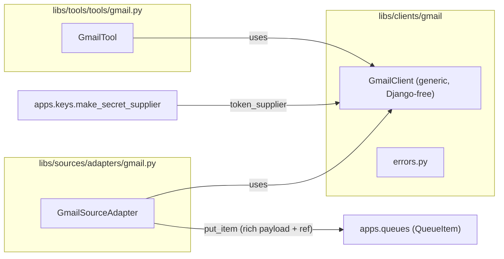

# Gmail library and tool — Design

Epic: [Inbox cleanup (U1)](../../epics/2026-07-03-inbox-cleanup.md) · Spec **6 of 9** · Item: **Gmail library and tool**

**Branch:** `feat/2026-07-06-service-integrations`

Status: **done**

Architecture reference: [`docs/ARCHITECTURE.md`](../../ARCHITECTURE.md) · Credentials from
[Key management (spec 1)](../2026-07-03-key-management/2026-07-03-key-management-design.md) ·
Tool instances from [Agent config schema (spec 2)](../2026-07-03-agent-config-schema/2026-07-03-agent-config-schema-design.md) ·
Sources/queues from [Sources and queues (spec 3)](../2026-07-04-sources-and-queues/2026-07-04-sources-and-queues-design.md).

Mermaid display labels: per [`superpowers/brainstorming`](../../../olib/ai/skills/superpowers/brainstorming/SKILL.md)
— **always quote** human-readable node/participant/edge text.

Deliver the first real external integration: a generic **Gmail client**, a **Gmail
source adapter** (polls a mailbox → queue), and a gated **Gmail tool** (list, read,
label, archive, spam, send). Co-designed with [ClickUp (spec 7)](../2026-07-06-clickup-integration/2026-07-06-clickup-integration-design.md)
so the two integrations share one shape.

> **Shared anatomy:** This spec **defines** the reusable integration pattern (client /
> source / tool + `ToolInstance.config` + queue payload envelope) that ClickUp (spec 7)
> reuses verbatim. The "Integration anatomy" section below is duplicated in the ClickUp
> spec so each reads standalone; the platform mechanics (schema field, wiring) are built
> **once here** (first in build order) and consumed by spec 7.

---

## Goal

Chief operators and agents can:

1. Store a **Gmail service-account credential** (`type=gmail`) once and reference it by
   name from a tool instance or source (spec 1 write-only key store).
2. Configure a **Gmail source** with a search query so untriaged mail flows into a queue
   as work items — with **rich payload plus a back-reference** the agent can re-fetch.
3. Give an agent a gated **`gmail` tool** whose functions map to client methods, scoped
   per instance via `allow`/`deny` (send **denied** by default in examples).
4. Run all of the above with **domain-wide delegation** — no interactive OAuth flow, no
   secrets in YAML, no plaintext retained on client objects.

Downstream: the inbox triage agent (spec 9) binds a Gmail source to a queue trigger
(spec 5) and uses the `gmail` tool to tag/archive/spam.

### Non-goals

- **OAuth installed-app flow / consent UX** — deferred (spec 1); v1 is service account +
  domain-wide delegation only.
- **ClickUp / Obsidian** — spec 7 (co-designed) and spec 8 (deferred).
- **Inbox triage taxonomy / routing** — spec 9 (this spec ships generic label/archive/spam
  ops, not `x-*` rules).
- **Queue trigger dispatch / cron** — spec 5.
- **Sending rich MIME / attachments on send** — v1 `send` supports plain-text/simple MIME;
  attachment upload on send is out of scope.
- **Push/watch (Pub/Sub) notifications** — v1 polls; realtime watch is a later spec.

---

## Current state

| Area | Today |
|------|-------|
| External integrations | None — only `clock`, `queue` tools; `test` source adapter |
| Source adapters | `libs/sources` protocol + `test` adapter + registry (spec 3) |
| Tools | `libs/tools` protocol + registry; credential-backed tools bind a `token_supplier` (spec 1/2) |
| Tool instance addressing | `ToolInstance` = `id`, `type`, `credential_ref`, `allow`, `deny` — **no per-instance config** |
| Credential types | `gmail` reserved in key-mgmt type registry; no consumer yet |
| Google deps | olib uses `googleapiclient` (service account) elsewhere; backend has no google deps |

Key management (spec 1) already reserves `type=gmail` and documents the
`token_supplier` pattern for `libs/gmail`; this spec is its first consumer.

---

## Integration anatomy (shared with spec 7)

Every external integration ships **exactly three components** plus a key-mgmt `type`:



**1. Client — `libs/clients/gmail/` (`client.py`, `errors.py`)**

- Generic wrapper over the vendor SDK. Knows nothing about queues, triage, or `x-*` tags.
- Django-free; imports only stdlib + `google-*`.
- Constructed with a **`token_supplier`** and optional static **`config`**:

  ```python
  class GmailClient:
      """Thin wrapper over the Gmail API v1 for one impersonated mailbox."""

      def __init__(
          self,
          *,
          token_supplier: Callable[[], str | None],
          config: dict[str, Any] | None = None,
      ) -> None: ...
  ```

- **Resolves the secret lazily** (calls `token_supplier()` when it builds a request), never
  storing plaintext on `self` beyond a single operation (spec 1 retention rule). A per-call
  service handle is built from the resolved SA JSON.
- Methods return plain dataclasses/dicts; raises a typed `GmailError` hierarchy.

**2. Source adapter — `libs/sources/adapters/gmail.py`**

- Implements the spec 3 `SourceAdapter` protocol (`adapter_type='gmail'`,
  `credential_type='gmail'`, `validate_config`, `poll`), registered in the sources registry.
- Holds **service-specific filtering** (Gmail search query). U1's `-label:x-*` exclusion is
  **config, never hardcoded**.
- Uses the client to list messages, dedups on Gmail message id, and calls `put_item` with a
  **rich-payload-plus-reference** envelope (below).

**3. Tool — `libs/tools/tools/gmail.py`**

- Subclass of `Tool` with `name='gmail'`, `credential_type='gmail'`, and a
  `bind(*, token_supplier, config)` method matching `tool_wiring`.
- Maps LLM-visible `ToolFunction`s to client methods with correct `readonly` flags. **Full
  function set exposed**; gated by per-instance `allow`/`deny`.

### Platform change: `ToolInstance.config` (built here)

Add an optional field to `ToolInstance` (`libs/agent_spec/spec.py`), **symmetric with
`SourceSpec.config`** which already exists:

```python
class ToolInstance(BaseModel):
    id: str
    type: str
    credential_ref: str | None = None
    config: dict[str, Any] = {}     # NEW — non-secret per-instance addressing
    allow: list[str] = ['*']
    deny: list[str] = []
```

- **Backward-compatible, no `schema_version` bump** (default `{}`), same pattern used to add
  `queues[]` in spec 3.
- Carries **non-secret** addressing only (Gmail: the impersonated mailbox `subject`). Secrets
  stay in the credential store; `config` never holds tokens.
- **Wiring change** (`apps/agents/tool_wiring.py`): pass `inst.config` into `bind(...)` for
  credential-backed tools (today it passes only `token_supplier`). Tools that ignore config
  (clock) are unaffected. `bind` signature becomes
  `bind(*, token_supplier=None, config=None, user_id=..., agent_id=..., session_id=...)` with
  the tool taking what it needs.

### Queue payload envelope (shared convention)

Sources enqueue a **uniform envelope**: as much data as is cheap to fetch **inline**, plus a
**`ref`** block that lets the agent re-fetch the live item (e.g. to download attachments):

```json
{
  "data": {
    "id": "18f...",
    "thread_id": "18f...",
    "from": "alice@example.com",
    "to": ["me@example.com"],
    "subject": "Q3 numbers",
    "snippet": "Here are the...",
    "received_at": "2026-07-06T10:00:00Z",
    "label_ids": ["INBOX", "IMPORTANT"],
    "has_attachments": true,
    "attachments": [{"attachment_id": "ANGj...", "filename": "q3.pdf", "mime_type": "application/pdf", "size": 20481}]
  },
  "ref": {
    "service": "gmail",
    "resource_type": "message",
    "resource_id": "18f..."
  }
}
```

- **`data`** — enough for the LLM to triage without another call in the common case.
- **`ref`** — stable locator (service + resource type + id) so the agent can call
  `gmail.read`/`gmail.get_attachment` for the full body or binary content. The adapter emits
  these three fields only (all it has — spec 3 `poll` receives a `credential_supplier`, **not**
  the ref name). Which mailbox the agent re-fetches from comes from the **triage agent's own
  `gmail` tool instance `config.subject`**, configured against the same account by design; the
  `poll_source` wrapper may optionally enrich `ref` with `source.credential_ref` if a future
  need arises (small platform change, not required for v1).
- Envelope shape is identical across integrations (spec 7 ClickUp uses `resource_type='task'`).
- Respects the spec 3 payload size cap (`MAX_PAYLOAD_BYTES`); large bodies/attachments are
  **not** inlined — the agent fetches via the tool using `ref`.

---

## Authentication — service account + domain-wide delegation

| Aspect | Decision |
|--------|----------|
| Credential kind | Google **service-account JSON key**, stored as the `type=gmail` credential string (spec 1 opaque UTF-8 string holds JSON) |
| Mailbox selection | **Domain-wide delegation**: SA impersonates a specific user via `subject` (the mailbox address) |
| `subject` source | Tool instance / source **`config.subject`** — non-secret; one credential can serve many mailboxes, or one mailbox per named credential |
| Scopes | `https://www.googleapis.com/auth/gmail.modify` (list/read/label/archive/spam). `send` also needs `gmail.send`; requested only when the SA is authorized for it |
| Library | `google-auth` (`google.oauth2.service_account.Credentials.from_service_account_info(...).with_subject(subject)`) + `google-api-python-client` (`build('gmail','v1', credentials=...)`) |

**Client build (per operation):**

```python
info = json.loads(token_supplier())          # SA JSON from key store
creds = service_account.Credentials.from_service_account_info(info, scopes=SCOPES)
creds = creds.with_subject(config["subject"]) # impersonate the mailbox
service = build("gmail", "v1", credentials=creds, cache_discovery=False)
```

Plaintext SA JSON exists only inside this call chain; the client does not cache `service`
across operations beyond a single tool invocation / poll (spec 1 retention rule).

**Validation:** `validate_config` (source) and tool `bind` require `subject` to be a non-empty
string; the SA JSON is validated lazily at first use (parse failure → `GmailAuthError`).

---

## Gmail client (`libs/clients/gmail/`)

`client.py` — generic, no Chief/queue/triage knowledge. Methods (summary):

| Method | Purpose | Notes |
|--------|---------|-------|
| `list_messages(*, query, max_results=100, page_token=None)` | Search messages | Returns ids + `next_page_token`; caller hydrates via `get_message` |
| `get_message(message_id, *, format='metadata'|'full')` | Fetch one message | `metadata` for headers/snippet; `full` for body parts |
| `list_labels()` | List label id↔name | For mapping human names → ids |
| `modify_labels(message_id, *, add=(), remove=())` | Add/remove label ids | Generic label op |
| `archive(message_id)` | Remove `INBOX` label | Convenience over `modify_labels` |
| `report_spam(message_id)` | Add `SPAM`, remove `INBOX` | |
| `trash(message_id)` | Move to trash | Exposed; denied by default in examples |
| `get_attachment(message_id, attachment_id)` | Download attachment bytes | Base64 → bytes; size-guarded |
| `send_message(*, to, subject, body, ...)` | Send plain/simple MIME | Exposed; denied by default; needs `gmail.send` scope |

- **Pagination** helper for `list_messages` (mirrors olib `gdListFiles` loop).
- **Label name resolution:** a small helper maps human label names (`x-act`) to label ids,
  creating user labels on demand where the Gmail API allows (used by the tool, not the client
  core). Kept generic — the client exposes `create_label(name)`; triage naming is spec 9.

`errors.py` — typed hierarchy consumed by both source and tool:

| Exception | Raised when |
|-----------|-------------|
| `GmailError` | Base |
| `GmailAuthError` | SA JSON parse/impersonation/scope failure |
| `GmailNotFoundError` | Unknown message/label id |
| `GmailAPIError` | Other non-2xx from the API (carries status + reason) |

---

## Gmail source adapter (`libs/sources/adapters/gmail.py`)

Implements the spec 3 `SourceAdapter`.

**`config` schema (validated in `validate_config`):**

| Key | Type | Notes |
|-----|------|-------|
| `subject` | str (required) | Mailbox to impersonate |
| `query` | str (required) | Gmail search query, e.g. `in:inbox -label:x-act -label:x-read -label:x-spam -label:x-unimp` |
| `max_results` | int (default 25) | Per poll |
| `include_body` | bool (default false) | If true, inline a truncated plain-text body in `data` (still under payload cap) |

**`poll` behavior:**

1. Build client from `credential_supplier` + `{subject}`.
2. `list_messages(query=config['query'], max_results=…)`.
3. For each id: `get_message(format='metadata')` (+ optional truncated body); build the
   **envelope** (`data` + `ref`).
4. `put_item(payload=envelope, external_id=message_id)` — dedup on message id (spec 3).
5. Return `PollResult(items_seen, items_enqueued)`.

The `x-*` exclusion lives entirely in `config.query` — the adapter has no triage logic
(epic constraint: "U1 Gmail filter via source filter config, not adapter hardcoding").

---

## Gmail tool (`libs/tools/tools/gmail.py`)

`GmailTool(Tool)` with `name='gmail'`, `credential_type='gmail'`, and `bind(*, token_supplier,
config)`. Functions map 1:1 to client methods:

| Function | Client method | `readonly` | Example allow/deny |
|----------|---------------|------------|--------------------|
| `list` | `list_messages` | ✅ | allow |
| `read` | `get_message(format='full')` | ✅ | allow |
| `list_labels` | `list_labels` | ✅ | allow |
| `get_attachment` | `get_attachment` | ✅ | allow (re-fetch from `ref`) |
| `label` | `modify_labels` / `create_label` | ❌ | allow (triage) |
| `archive` | `archive` | ❌ | allow (triage) |
| `mark_spam` | `report_spam` | ❌ | allow (triage) |
| `trash` | `trash` | ❌ | **deny** in examples |
| `send` | `send_message` | ❌ | **deny** in examples |

- **`config.subject`** selects the mailbox the tool acts on (same envelope `ref.credential_ref`
  → same mailbox as the source).
- Return shapes are JSON-serializable dicts; client `GmailError`s are mapped to a uniform tool
  failure result (`{"ok": false, "error": {"kind": "...", "message": "..."}}`) shared with spec 7.
- Wire names: `{instance_id}__{function}` (spec 2), e.g. `gmail-personal__label`.

**Deny-by-default posture:** example YAML (below) sets
`deny: [send, trash]` (or `allow: [list, read, list_labels, get_attachment, label, archive, mark_spam]`),
demonstrating the epic's "deny send by default" while exposing the full surface.

---

## Example agent spec

`libs/agent_specs/examples/gmail-triage.yaml` (illustrative; full triage agent is spec 9):

```yaml
schema_version: 2
llm: {provider: anthropic, model: claude-3-5-sonnet}
system_prompt: "Triage one email per session."
tools:
  - id: gmail-personal
    type: gmail
    credential_ref: gmail-personal
    config: {subject: "me@example.com"}
    allow: [list, read, list_labels, get_attachment, label, archive, mark_spam]
    deny: [send, trash]
queues:
  - id: inbox
    sources:
      - id: gmail-main
        type: gmail
        credential_ref: gmail-personal
        config:
          subject: "me@example.com"
          query: "in:inbox -label:x-act -label:x-read -label:x-spam -label:x-unimp"
          max_results: 25
triggers:
  - {name: inbox-worker, kind: queue, queue: inbox, prompt: "Triage this email.", max_sessions: 2}
  - {name: manual, kind: manual}
```

---

## Dependencies

Add to `backend/pyproject.toml`:

- `google-api-python-client`
- `google-auth`

(Use `google-auth`'s `service_account.Credentials`, **not** the deprecated `oauth2client` in
the olib drive helper.) Pin exact versions in the plan; sync via `orun py sync`.

---

## Error handling

| Situation | Behavior |
|-----------|----------|
| Missing/invalid SA JSON | `GmailAuthError` → tool failure JSON / source poll logs + `Source.last_error` (spec 3) |
| Missing `subject` in config | `validate_config` / `bind` raises `ValueError` at ingest/wiring |
| Impersonation not authorized | `GmailAuthError` (403) surfaced; no retry storm |
| Unknown message id (tool) | `GmailNotFoundError` → tool failure JSON |
| API rate limit / 5xx | `GmailAPIError`; source poll marks `last_error`, does not crash beat |
| Denied function invoked | Blocked by allow/deny before client call (spec 2 gating) |
| Payload exceeds cap | Source omits inline body/attachment bytes; keeps `ref` (agent fetches) |

---

## Testing

Verification gate: `./olib/scripts/orunr py test-all` (see `ai/commands/py-checks.md`).

| Area | Tests |
|------|-------|
| `GmailClient` | Methods build correct API calls + parse responses (SDK stubbed / `build` monkeypatched); lazy token resolution; no plaintext retained |
| `errors` mapping | API failures map to typed `GmailError` subclasses |
| `validate_config` | Requires `subject` + `query`; rejects bad types |
| `poll` | Enqueues envelope (`data` + `ref`); dedups on message id; respects `max_results` |
| Tool schema/handlers | Function→method mapping; `readonly` flags; `GmailError` → uniform failure JSON |
| `ToolInstance.config` | Schema accepts `config`; round-trips YAML; no `schema_version` bump; wiring passes config into `bind` |
| Wiring round-trip | Session invokes `gmail.list` → stubbed client (`tool_wiring` supplies `token_supplier` + `config`) |
| Regression | Existing tool/source/wiring tests unchanged; clock tool ignores new config arg |

Stub Google at the SDK boundary (monkeypatch `build` / inject a fake service). Follow parproc
naming (avoid `error`/`exception`/`warning` in test names).

---

## Implementation stages

**Pre-implementation (Step 0):** checkout `feat/2026-07-06-service-integrations`, create
`-revision.md`.

1. **Schema + wiring** — add `ToolInstance.config`; thread `config` through `tool_wiring`
   `bind`; update wiring tests. *(Shared platform change — must land before spec 7.)*
2. **Client** — `libs/clients/gmail/{client,errors}.py`; deps; unit tests with stubbed SDK.
3. **Source adapter** — `libs/sources/adapters/gmail.py` + registry registration; envelope +
   dedup tests.
4. **Tool** — `libs/tools/tools/gmail.py` + registry registration; allow/deny + failure mapping
   tests.
5. **Example + docs** — `gmail-triage.yaml`; extend `ARCHITECTURE.md` (integration anatomy,
   payload envelope); `.env`/README note on SA setup + delegation.

---

## Decisions (locked)

| Question | Decision |
|----------|----------|
| Transport | **Vendor SDK** (`google-api-python-client` + `google-auth`) |
| Client location | **`libs/clients/gmail/`** |
| Auth | **Service account + domain-wide delegation**; SA JSON as `type=gmail` credential |
| Mailbox addressing | **`config.subject`** (non-secret) on tool instance + source |
| Non-secret addressing | New **`ToolInstance.config`** (symmetric with `SourceSpec.config`; no version bump) |
| Surface | **Client + source + tool** (all three) |
| Function policy | **Full set exposed**; `allow`/`deny` per instance; **send/trash denied** in examples |
| Queue payload | **`{data, ref}` envelope** — rich data inline + back-reference for re-fetch |
| Filtering | Gmail **query in source `config`**, never hardcoded |
| Retention | Resolve secret per operation; no plaintext on client `self` |
| Notifications | **Poll** in v1; Pub/Sub watch deferred |

---

## Open questions

All resolved for v1 (see Decisions). Revisit later:

- Gmail **push/watch** (Pub/Sub) instead of polling.
- Attachment **size cap** for `get_attachment` (set concrete bytes in plan).
- On-demand **user label creation** naming — finalized by triage spec 9.

---

## References

- [Epic: Inbox cleanup](../../epics/2026-07-03-inbox-cleanup.md)
- [ClickUp library and tool (spec 7)](../2026-07-06-clickup-integration/2026-07-06-clickup-integration-design.md)
- [Key management (spec 1)](../2026-07-03-key-management/2026-07-03-key-management-design.md)
- [Agent config schema (spec 2)](../2026-07-03-agent-config-schema/2026-07-03-agent-config-schema-design.md)
- [Sources and queues (spec 3)](../2026-07-04-sources-and-queues/2026-07-04-sources-and-queues-design.md)
- [Agent scheduling (spec 5)](../2026-07-05-agent-scheduling/2026-07-05-agent-scheduling-design.md)
- [Architecture](../../ARCHITECTURE.md)
