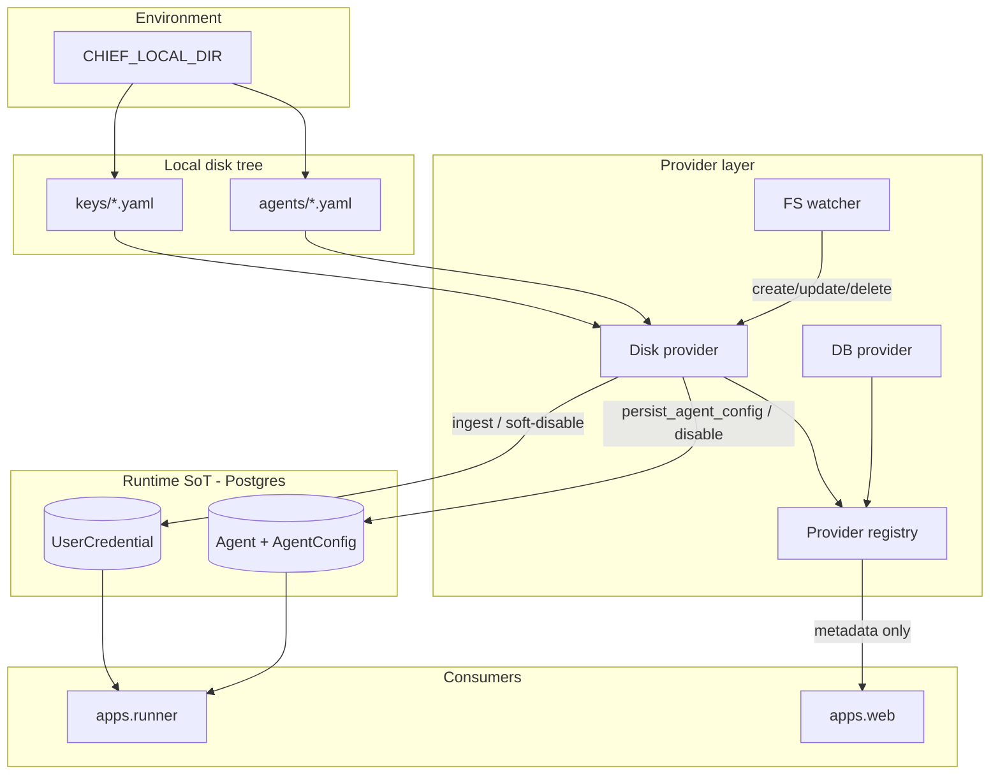
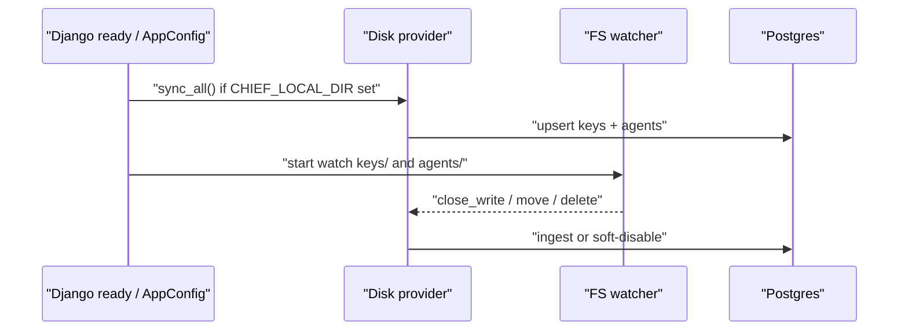

# Local disk providers (keys + agent configs) — Design

Epic: [Inbox cleanup (U1)](../../epics/2026-07-03-inbox-cleanup.md) · Spec **10 of 10** · Item: **Local disk providers (keys + agent configs)**

**Branch:** `feat/2026-07-09-local-disk-providers`

Status: **spec only**

Architecture reference: [`docs/ARCHITECTURE.md`](../../ARCHITECTURE.md) ·
Credentials from [Key management (spec 1)](../2026-07-03-key-management/2026-07-03-key-management-design.md) ·
Agent configs from [Agent configuration UI (spec 4)](../2026-07-04-agent-config-ui/2026-07-04-agent-config-ui-design.md).

Mermaid display labels: per [`superpowers/brainstorming`](../../../olib/ai/skills/superpowers/brainstorming/SKILL.md)
— **always quote** human-readable node/participant/edge text.

Enable **oagent ↔ host** workflows: keys and agent YAML live under one local directory,
load when the server starts, and **hot-reload** when files change. This introduces a
**provider** model for both surfaces so disk is first-class alongside DB (and later
GitHub for configs).

---

## Goal

Operators and agents working on the host (or via oagent mounts) can:

1. Point Chief at a single local root via **`CHIEF_LOCAL_DIR`** in `.env` / `.env.local`.
2. Drop **user credential** YAML files under `keys/` and **agent config** YAML under
   `agents/` — discovered by filename, identified by fields inside the files.
3. Have the server **load on startup** and **watch** those trees in real time: create /
   update → re-ingest into the DB as a new revision; delete → **soft-disable**.
4. Keep the **DB as runtime source of truth** — runners, sessions, and tools never read
   disk at request time. Disk is an ingest/sync provider that updates DB rows.
5. Treat disk-sourced keys and agents as **read-only in the UI** (edit the files instead).

### Non-goals

- **GitHub provider** for agent configs (future; design the registry so it plugs in).
- **System credentials on disk** — system defaults stay in DB + LLM env fallback
  (`.env.local` `OPENAI_API_KEY`, etc.); this spec is **user credentials only**.
- **Two-way sync / write-back** from UI to disk (v1 UI is read-only for disk sources).
- **Writing secrets back** to disk from the DB or UI.
- **Multi-root or per-provider path overrides** — one `CHIEF_LOCAL_DIR` for v1.
- **Encrypting files on disk** — host/oagent volume is trusted; files may hold plaintext
  secrets (same threat model as `.env.local`).
- Inbox triage product behavior (spec 9).

---

## Decisions (locked in brainstorming)

| Topic | Decision |
|-------|----------|
| Local layout | One root `CHIEF_LOCAL_DIR` with `keys/` + `agents/` (more subdirs later) |
| Runtime SoT | **DB wins** — disk-sourced items re-ingest as new DB revisions on change |
| UI vs disk | Disk-sourced → **UI read-only** |
| Key files | One YAML per key; filename = discovery; `name` defaults to stem; **`type` + `value` + `owner` required** |
| Agent files | One YAML per agent (`*.yaml`); filename = discovery; identifier defaults to stem |
| Key scope | **User credentials** only; **`owner` required** (username/email) — no env default |
| File delete | **Soft-disable** agent or key; keep history |
| Packaging | **One combined spec** (shared root + provider model) |

---

## Current state

| Area | Today |
|------|-------|
| Keys | Encrypted `UserCredential` / `SystemCredential` in Postgres; write-only UI |
| Agent configs | Immutable `AgentConfig` rows in DB; YAML editor; `config_source` mostly `ui` |
| Path binding | Removed in spec 4 (non-goal); `source_rev` / `dirty` / `fetched_at` unused for sync |
| Local dir env | None (`CHIEF_LOCAL_DIR` not defined) |
| Watch | No in-process FS watcher for keys/configs |
| Examples | `libs/agent_specs/examples/*.yaml` copied into DB at create time only |

---

## Architecture



**Providers** know how to discover and sync entities; **consumers always read the DB**.
The disk provider is the only component that opens files under `CHIEF_LOCAL_DIR`.

### Approach comparison (resolved)

| Approach | Idea | Verdict |
|----------|------|---------|
| A. Runtime disk overlay | Resolve secrets/configs from disk at use time | Rejected — breaks DB SoT / audit / materialization |
| B. Seed-once import | Copy disk → DB at boot; no watch | Rejected — not live enough for oagent |
| **C. Provider ingest + watch** | Disk syncs into DB; watch updates revisions | **Chosen** |

---

## Local root and layout

### Env

```bash
# .env / .env.local
CHIEF_LOCAL_DIR=/absolute/or/relative/path/to/chief-local
```

- **Optional.** If unset or empty → disk provider is inactive (DB-only; no watcher).
- Resolved relative to the process cwd when not absolute; recommend absolute paths
  in compose/oagent mounts.
- Document in `.env.local.example`.

### Tree

```
$CHIEF_LOCAL_DIR/
  keys/
    work-gmail.yaml
    personal-openai.yaml
  agents/
    inbox-triage.yaml
    queue-echo.yaml
```

Future subdirs (out of scope) may hold prompts, fixtures, etc. under the same root.

---

## Provider model

Introduce a small registry used by boot and sync (not by the request-hot path):

```python
class ConfigProvider(Protocol):
    """Discovers and syncs agent configs into the DB."""

    name: str  # 'disk' | 'db' | future 'github'

    def sync_all(self) -> SyncReport: ...
    # disk: also started via watcher callbacks


class KeyProvider(Protocol):
    """Discovers and syncs user credentials into the DB."""

    name: str

    def sync_all(self) -> SyncReport: ...
```

| Provider | Keys (v1) | Agent configs (v1) |
|----------|-----------|--------------------|
| **db** | Existing UI/admin writes | Existing UI / import / examples |
| **disk** | `keys/*.yaml` | `agents/*.yaml` |
| **github** | — | Deferred |

`db` is not a scanner — it is the storage backend. Disk (and later GitHub) **push**
into DB rows and set provenance fields so the UI can show source + enforce read-only.

---

## Key files (disk)

### Shape

One YAML file per credential under `keys/`. Extension must be `.yaml` or `.yml`.
Filename stem is used for **discovery only**.

```yaml
# keys/work-gmail.yaml
name: work-gmail          # optional; default = filename stem
type: gmail               # required — key-mgmt type registry
owner: alice              # required — Django username (or email if unique)
value: |                  # required — opaque UTF-8 secret payload
  { ... service account json ... }
```

| Field | Required | Notes |
|-------|----------|-------|
| `type` | yes | Must be a registered credential type |
| `value` | yes | Stored via existing encrypt path into `UserCredential` |
| `owner` | yes | Resolved to `User`; missing user → sync error for that file (others continue) |
| `name` | no | Default = file stem; must be unique per owner |

### Provenance on `UserCredential`

Add fields (names may match agents for consistency):

| Field | Purpose |
|-------|---------|
| `source` | `db` (default) \| `disk` |
| `source_path` | Relative path under `CHIEF_LOCAL_DIR` when `source=disk` |
| `source_rev` | Content hash `sha256:…` of normalized file bytes (change detection) |
| `status` | `active` \| `disabled` — soft-disable on file delete |

UI list/detail for disk-sourced keys: metadata only; **no replace/clear of value**
while `source=disk` (file is authoritative). Soft-disabled keys do not resolve.

### Sync rules (keys)

| Event | Behavior |
|-------|----------|
| Create / content change | Upsert `UserCredential` for `(owner, name)`; encrypt `value`; set `source=disk`, `source_rev`, `status=active` |
| Rename file, same identity | Treated as delete of old path + create (if `name`/`owner` change) or path update if identity unchanged |
| Delete file | Set `status=disabled`; keep encrypted row |
| Invalid YAML / unknown type / missing owner user | Log error; skip file; do not disable existing credential unless identity was previously bound to this path and file is gone |

**Conflict:** If a **`source=db`** credential already exists for `(user, name)` and a disk
file targets the same pair → **sync error** for that file (do not overwrite
UI-owned secrets). Operator must rename, change `name`, or delete the DB key first.

**Diff / change detection:** Compare `source_rev` (content hash). mtime/ctime may be
logged for operators but are not the sole change signal (editor save races).

---

## Agent config files (disk)

### Shape

One YAML file per agent under `agents/`. The file is an **`AgentConfigSpec` body**
plus a thin **disk envelope** stripped by the loader before schema validation
(`AgentConfigSpec` today has no `owner` / `identifier` / display `name` — those live
on the `Agent` model / `create_agent_from_spec`).

```yaml
# agents/inbox-triage.yaml
owner: alice                # required — disk envelope (stripped before validate)
identifier: inbox-triage    # optional envelope; default = filename stem
name: Inbox triage          # optional envelope display name; default = identifier
schema_version: 2
description: Triage untagged mail
llm:
  provider: openai
  model: gpt-5.4-mini
system_prompt: |
  ...
triggers: []
tools: []
queues: []
```

| Envelope field | Required | Notes |
|----------------|----------|-------|
| `owner` | yes | Resolved to Django user; agent `user` FK |
| `identifier` | no | Default = file stem; unique per owner |
| `name` | no | Display name on `Agent`; default = identifier |

Remaining keys must validate as `AgentConfigSpec` (upgrade chain + `validate_agent_config_yaml`).

### Provenance on `Agent`

Reuse / extend existing fields:

| Field | Value when disk-sourced |
|-------|-------------------------|
| `config_source` | `disk` (or `disk:<relpath>` if useful for ops — prefer plain `disk` + `source_path`) |
| `source_path` | New optional CharField — relative path under root |
| Existing `AgentConfig.source_rev` | Content hash of file |
| `AgentConfig.dirty` | Always `false` on disk ingest |
| `AgentConfig.fetched_at` | Sync time |

Add **`Agent.status`**: `active` \| `disabled` (soft-disable on file delete). Scheduling
and manual start skip `disabled` agents.

### Sync rules (agents)

| Event | Behavior |
|-------|----------|
| Create | `create_agent_from_spec` / equivalent with `config_source=disk` |
| Content change | `persist_agent_config` → **new** `AgentConfig` revision; rematerialize triggers/queues/beat as today |
| Delete file | Soft-disable agent (`status=disabled`); disable schedule beat tasks; keep config history |
| Invalid YAML | Log error; skip; leave last good config active |

**Conflict:** Disk must not overwrite an agent that already exists for `(user, identifier)`
with `config_source != disk`. Sync error for that file.

**UI:** Editor and save endpoints reject mutations when `config_source == disk`
(HTTP 403 / clear error). Show badge “Disk” + relative path. Provide no Sync button —
watcher is automatic.

---

## Boot and watch lifecycle



1. **Startup:** If `CHIEF_LOCAL_DIR` is set and exists, run full `sync_all` for keys
   and agents (deterministic order: keys first, then agents — so `credential_ref`
   resolution can succeed on first agent materialize when secrets existed only on disk).
2. **Watcher:** Recursive watch on `keys/` and `agents/` (create dirs if missing under
   an existing root; if root missing → log warning, no watch).
3. **Debounce:** Coalesce bursts (e.g. 200–500 ms) per path before syncing that file.
4. **Process model:** Prefer an in-process thread started from `AppConfig.ready()` in
   the web and worker processes that need fresh configs **or** a dedicated lightweight
   management/bootstrap path shared by `runserver` / gunicorn / celery. Document that
   **all** processes that materialize or resolve credentials must either watch or share
   DB updates from a single watcher process (chosen implementation: **one watcher in the
   web process**; Celery/workers read DB only — sufficient because ingest is in web and
   DB is SoT). If oagent runs only Celery without web, allow optional
   `CHIEF_LOCAL_WATCH=1` on worker (implementation detail in plan).
5. **Implementation note:** Reuse or mirror olib `watch_files` / `inotifywait` patterns
   where available; fall back to a polling interval if inotify is unavailable.

---

## Resolution and UI impact

- **`resolve_secret` / suppliers** — unchanged except skip `status=disabled` credentials.
- **Agent dispatch / scheduling** — skip `Agent.status=disabled`.
- **Keys settings UI** — show source badge; hide write controls for `source=disk`.
- **Agent config UI** — read-only YAML viewer for disk agents; no Save.
- **Creating UI agents/keys** — unchanged (`source=db` / `config_source=ui`).

---

## Error handling

| Case | Behavior |
|------|----------|
| `CHIEF_LOCAL_DIR` unset | Disk provider off; no errors |
| Root path missing | Warning at boot; no sync/watch |
| One bad file | Error logged with path; other files sync |
| Owner user not found | Error for that file; no DB write |
| Name collision with db-owned row | Error for that file; no overwrite |
| Watcher dies | Log; optional restart; next process boot full-syncs |

Never log secret `value` contents — only paths, names, types, owners.

---

## Testing

- Unit: YAML parse defaults (name/identifier from stem), owner required, conflict rules.
- Integration: temp `CHIEF_LOCAL_DIR` → sync creates encrypted key + agent revision;
  file edit → new `source_rev` / new `AgentConfig`; delete → soft-disable.
- UI/API: save blocked for disk-sourced agent/key.
- Watcher: simulated FS events (or sync_path API used by watcher) debounce and apply.

---

## Rollout / ops

1. Document `CHIEF_LOCAL_DIR` layout in README / `.env.local.example`.
2. Example `keys/` and `agents/` snippets under `docs/` or `examples/local/` (no real secrets).
3. oagent: mount host folder → same path inside container via env.

---

## Open implementation choices (plan may pick)

- Exact watcher library vs polling.
- Whether `config_source` stores plain `disk` + separate `source_path` (recommended) vs
  encoded `disk:agents/foo.yaml`.
- Soft-disable storage: new `status` fields vs `disabled_at` nullable timestamp.

Defaults preferred in this design: **plain `disk` + `source_path`**, **`status` enum**,
**web-process watcher**.
