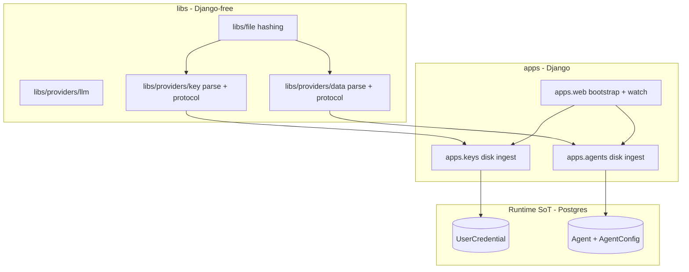
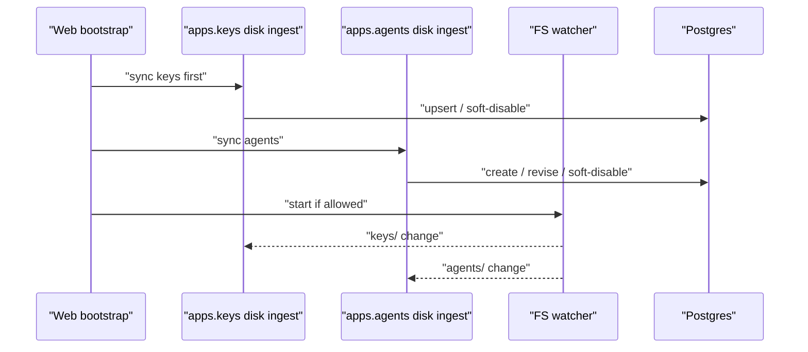

# Local disk providers (keys + agent configs) — Design

Epic: [Inbox cleanup (U1)](../../epics/2026-07-03-inbox-cleanup.md) · Spec **10 of 10** · Item: **Local disk providers (keys + agent configs)**

**Branch:** `feat/2026-07-09-local-disk-providers`

Status: **design revised** (post-impl revision — package layout + review fixes)

Architecture reference: [`docs/ARCHITECTURE.md`](../../ARCHITECTURE.md) ·
Credentials from [Key management (spec 1)](../2026-07-03-key-management/2026-07-03-key-management-design.md) ·
Agent configs from [Agent configuration UI (spec 4)](../2026-07-04-agent-config-ui/2026-07-04-agent-config-ui-design.md).

Mermaid display labels: per [`superpowers/brainstorming`](../../../olib/ai/skills/superpowers/brainstorming/SKILL.md)
— **always quote** human-readable node/participant/edge text.

Enable **oagent ↔ host** workflows: keys and agent YAML live under one local directory,
load when the server starts, and **hot-reload** when files change. This introduces
separate **key provider** and **data provider** surfaces so disk is first-class
alongside DB (and later GitHub for data).

---

## Goal

Operators and agents working on the host (or via oagent mounts) can:

1. Point Chief at a single local root via **`CHIEF_LOCAL_DIR`** in `.env` / `.env.local`.
2. Drop **user credential** YAML under `keys/` and **agent config** YAML under
   `agents/` — discovered by filename, identified by fields inside the files.
3. Have the server **load on startup** and **watch** those trees in real time: create /
   update → re-ingest into the DB as a new revision; delete → **soft-disable**.
4. Keep the **DB as runtime source of truth** — runners, sessions, and tools never read
   disk at request time. Disk providers **ingest** into DB rows.
5. Treat disk-sourced keys and agents as **read-only in the UI** (edit the files instead).

### Non-goals

- **GitHub data provider** (future; registry must allow it).
- **System credentials on disk** — system defaults stay in DB + LLM env fallback.
- **Two-way sync / write-back** from UI to disk (v1 UI is read-only for disk sources).
- **Writing secrets back** to disk from the DB or UI.
- **Multi-root or per-provider path overrides** — one `CHIEF_LOCAL_DIR` for v1.
- **Encrypting files on disk** — trusted host/oagent volume (same threat model as `.env.local`).
- **Recursive nested trees under `keys/` / `agents/`** — v1 is **one-level** `*.yaml` /
  `*.yml` only (document explicitly; recursive can come later).
- Inbox triage product behavior (spec 9).

---

## Decisions (locked)

| Topic | Decision |
|-------|----------|
| Local layout | One root `CHIEF_LOCAL_DIR` with `keys/` + `agents/` (more subdirs later) |
| Runtime SoT | **DB wins** — disk-sourced items re-ingest as new DB revisions on change |
| UI vs disk | Disk-sourced → **UI read-only** |
| Key files | One YAML per key; filename = discovery; `name` defaults to stem; **`type` + `value` + `owner` required** |
| Agent files | One YAML per agent; filename = discovery; identifier defaults to stem; disk envelope |
| Key scope | **User credentials** only; **`owner` required** (username/email) — no env default |
| File delete | **Soft-disable**; keep history |
| Packaging | **One combined spec** |
| **Lib layout** | **`libs/providers/{llm,key,data}`** + **`libs/file`** — **no** `apps.local_disk` |
| **Key vs data** | **Key providers** = credentials only; **data providers** = agents now, static resources later |
| **Django boundary** | Libs are Django-free (parse/protocols/hash); **apps** own ORM ingest + boot/watch |
| Watcher | Web process by default; workers only if `CHIEF_LOCAL_WATCH`; polling v1; `close_old_connections` each loop |
| Boot safety | Never run ORM sync from `AppConfig.ready()` during `migrate` / `makemigrations`; never abort process on sync failure |

---

## Current state (after first impl pass)

| Area | Today on branch |
|------|-----------------|
| Package | Temporary **`apps.local_disk`** Django app (to be **removed**) |
| Keys / agents | Provenance + soft-disable fields landed; disk sync + UI read-only work |
| LLM libs | Still flat **`libs/providers`** (to move under **`libs/providers/llm`**) |
| Review | Open items in [`*-review.md`](./2026-07-09-local-disk-providers-review.md) |

This revision **repackages** that behavior into the target layout and closes review gaps.
It does not change the product rules (DB SoT, disk YAML shapes, soft-disable, UI read-only).

---

## Package architecture



### `libs/providers/` (three families)

| Package | Role |
|---------|------|
| **`libs/providers/llm`** | Existing LLM provider implementations (moved from flat `libs/providers`) |
| **`libs/providers/key`** | Key-provider **protocol** + **disk YAML parse** (no ORM) |
| **`libs/providers/data`** | Data-provider **protocol** + **agent disk envelope/parse** (no ORM); later static resources |

**Key provider** vs **data provider** are separate concepts:

- **Key providers** discover/sync **credentials** only.
- **Data providers** discover/sync **agent configs** and, later, other non-secret resources
  (static data sources, fixtures, etc.).

DB is not a “scanner” provider — it is the **store**. Disk (and later GitHub for data)
**push** into DB rows and set provenance.

### `libs/file/`

Shared filesystem helpers used by key/data disk parsers:

- `normalize_bytes` / `content_hash` (`sha256:…`, CRLF → LF)
- Optional path helpers that take an explicit root `Path` (no `django.conf`)

### Apps (Django)

| Location | Responsibility |
|----------|----------------|
| `apps.keys.services` | Resolve owner user; upsert/soft-disable `UserCredential` from parsed key files |
| `apps.agents.services` | Resolve owner; create/persist/soft-disable agents from parsed data files; rematerialize beat |
| `apps.web` (or `chief`) | Resolve `CHIEF_LOCAL_DIR` from settings; **boot sync** + **watcher**; call key then data ingest |

**Delete `apps.local_disk`** after the move. Update imports; **no** re-export shims.

### Import rules

- `libs/*` never import `apps.*`.
- Key/data libs may depend on `libs/file`, `libs/agent_spec` (data parse), stdlib, PyYAML.
- Type validation for keys may accept a callable / type-name set injected from apps, or
  stay in apps after parse of raw fields — prefer keeping `validate_type` call in the
  **app** ingest layer if it pulls `apps.keys.types`.

---

## Local root and layout

### Env

```bash
CHIEF_LOCAL_DIR=/absolute/or/relative/path/to/chief-local
CHIEF_LOCAL_WATCH=false   # true on Celery-only hosts that must run the watcher
```

- **Optional** root. Unset/empty → disk providers inactive.
- Prefer absolute paths in compose/oagent mounts.

### Tree (v1: one-level globs)

```
$CHIEF_LOCAL_DIR/
  keys/
    work-gmail.yaml
    personal-openai.yaml
  agents/
    inbox-triage.yaml
```

Future subdirs under the same root are allowed for other resources; v1 only scans
`keys/*.{yaml,yml}` and `agents/*.{yaml,yml}` (non-recursive).

---

## Key provider (disk)

### File shape

```yaml
# keys/work-gmail.yaml
name: work-gmail          # optional; default = filename stem
type: gmail               # required
owner: alice              # required — username or unique email
value: |                  # required — opaque UTF-8 secret
  …
```

### Provenance on `UserCredential`

| Field | Purpose |
|-------|---------|
| `source` | `db` \| `disk` |
| `source_path` | Relative path under root when disk |
| `source_rev` | `sha256:…` of normalized file bytes |
| `status` | `active` \| `disabled` |

### Sync rules

| Event | Behavior |
|-------|----------|
| Create / content change | Upsert `(owner, name)`; encrypt; `source=disk`; `status=active` |
| Delete | Soft-disable; keep row |
| Invalid / missing owner / unknown type | Skip file; log path/type/owner only — **never** secret `value` or YAML exception text that may echo secrets |
| Conflict with `source=db` | Sync failure for that file; no overwrite |
| UI `upsert_user_named` | Must **refuse** overwrite when existing row is `source=disk` (defense in depth) |

Soft-disabled keys do not resolve. UI shows source badge + **disabled** status; no write
controls while `source=disk`.

---

## Data provider (disk agents)

### File shape

Disk **envelope** + `AgentConfigSpec` body. Envelope stripped before validate:

```yaml
owner: alice                # required
identifier: inbox-triage    # optional; default = stem
name: Inbox triage          # optional; default = identifier
schema_version: 2
# … AgentConfigSpec …
```

### Provenance on `Agent`

| Field | Value |
|-------|--------|
| `config_source` | `disk` |
| `source_path` | Relative path |
| `AgentConfig.source_rev` | Content hash of file |
| `Agent.status` | `active` \| `disabled` |

### Sync rules

| Event | Behavior |
|-------|----------|
| Create | `create_agent_from_spec(..., config_source='disk')` |
| Content change | New `AgentConfig` revision + rematerialize |
| Delete | `status=disabled` + disable schedule beat |
| Re-add after delete (even **unchanged** `source_rev`) | Set `status=active` **and** re-run `sync_agent_schedule_triggers` so beat is re-enabled |
| Conflict with `config_source != disk` | Sync failure; no overwrite |

UI: read-only editor; save/mutate/profile blocked.

---

## Boot and watch



1. **Order:** keys then agents (so `credential_ref` can resolve after first key ingest).
2. **Boot safety:** Do **not** run ORM sync during `migrate` / `makemigrations` /
   `collectstatic`. Prefer `post_migrate` and/or argv guards. Sync failures must be
   logged and **must not** abort process startup.
3. **Watcher:** Debounced polling (~1s / ~300ms) on `keys/` and `agents/`. Call
   `django.db.close_old_connections()` each loop iteration.
4. **Process model:** Watcher starts from the **web** process when root is set. Celery
   workers start a watcher only if `CHIEF_LOCAL_WATCH=true`. Multi-worker web may run
   one watcher per worker (idempotent ingest); document that. Do not start duplicate
   watchers inside the same process (module lock / autoreload parent skip).

---

## Resolution and UI

- Skip `status=disabled` credentials in `resolve_secret`.
- Skip `Agent.status=disabled` in scheduling, beat sync, and manual start.
- Keys UI: source badge, disabled status, hide writes for disk.
- Agent UI: Disk badge + path; no Save.

---

## Error handling

| Case | Behavior |
|------|----------|
| `CHIEF_LOCAL_DIR` unset | Disk off |
| Root missing | Log; no sync/watch |
| One bad file | Skip; continue others |
| Owner missing | Skip file |
| DB-owned name collision | Skip; no overwrite |
| Watcher / sync failure at boot | Log; process continues |

Never log secret values.

---

## Testing

- Lib unit tests: `libs/file`, key/data parse (no Django where possible).
- App integration: temp `CHIEF_LOCAL_DIR` → ingest, revise, soft-disable, conflict.
- Beat: delete → re-add **unchanged** agent re-enables schedule PeriodicTask.
- Boot: migrate argv does not call ORM sync; sync exception does not crash ready.
- Watcher: debounce + `close_old_connections` invoked (mock/assert).
- UI: disk read-only; disabled key status visible.

---

## Rollout / ops

1. `.env.local.example` documents `CHIEF_LOCAL_DIR` / `CHIEF_LOCAL_WATCH`.
2. `examples/local/keys/` + `examples/local/agents/` (fake secrets).
3. `docs/ARCHITECTURE.md` + `AGENTS.local.md` libs table: `providers/{llm,key,data}`, `file`.
4. oagent: mount host folder → same path via env.

---

## Implementation status vs this revision

| Concern | First impl | This revision |
|---------|------------|---------------|
| Product rules | Done | Unchanged |
| `apps.local_disk` | Present | **Remove**; split into libs + apps |
| LLM package path | `libs/providers` | **`libs/providers/llm`** |
| Review Critical/Important | Open | **Must fix** before merge |
