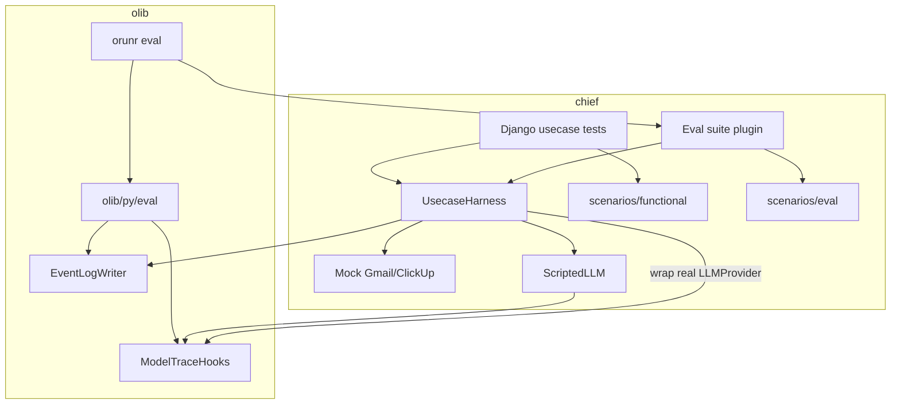

# Usecase tests and evals — Design

Epic: [Inbox cleanup (U1)](../../epics/2026-07-03-inbox-cleanup.md) · Spec **11 of 11** · Item: **Usecase tests and evals**

**Branch:** `feat/2026-07-11-usecase-tests-evals`

Status: **spec only**

Architecture reference: [`docs/ARCHITECTURE.md`](../../ARCHITECTURE.md) ·
Queues/sources: [Sources and queues](../2026-07-04-sources-and-queues/2026-07-04-sources-and-queues-design.md) ·
Scheduling: [Agent scheduling](../2026-07-05-agent-scheduling/2026-07-05-agent-scheduling-design.md) ·
Gmail / ClickUp: [Gmail](../2026-07-06-gmail-integration/2026-07-06-gmail-integration-design.md) ·
[ClickUp](../2026-07-06-clickup-integration/2026-07-06-clickup-integration-design.md) ·
Inbox product: epic item **9** (Inbox triage agent).

Mermaid display labels: per [`superpowers/brainstorming`](../../../olib/ai/skills/superpowers/brainstorming/SKILL.md)
— **always quote** human-readable node/participant/edge text.

---

## Goal

Give Chief (and later other olib projects) a way to:

1. Run **full-stack usecase tests** in-process (real adapters, queues, agents, Celery
   eager) against **mock external clients**, with a **scripted LLM**, as normal Django
   unittests — hard pass/fail for wiring and routing.
2. Run **offline evals** (not under Django unittest) against **separate, harder
   scenarios** and **real models**, including a **model matrix**, with soft scoring.
3. Share one **simple text-based observability harness**: partitioned **event-log
   files** plus **model hooks** for live terminal tracing — without baking eval
   instrumentation into agent code.

Inbox triage (U1) is the **first consumer**: seed emails → agent session(s) → assert
or score Gmail labels / spam / archive / ClickUp INBOX tasks.

### Non-goals

- Selecting mocks from agent YAML / production config (injection is **test/eval only**).
- Adopting Inspect AI / Promptfoo / DeepEval in v1 (revisit when many suites exist).
- Production APM / hosted observability (LangSmith-style).
- Sharing the same scenario files between functional tests and evals.
- Implementing the full inbox triage **product** agent (spec 9) — this spec assumes
  that agent config/prompt exists or lands in parallel; scenarios may land behind
  a minimal triage YAML until spec 9 completes.
- Obsidian or other cancelled U1 integrations.

---

## Decisions (locked)

| Topic | Decision |
|-------|----------|
| Epic home | Stay in **U1** (not a new platform epic) |
| Mock selection | **Test/eval injection only** — no `backend: mock` in agent config |
| Functional vs eval | **Separate** scenario packs and runners |
| Functional LLM | **Scripted / fake** LLM (deterministic); no live API in default CI unittest |
| Eval LLM | **Real models**; matrix over models |
| Eval framework | **Custom**, reusable in **olib** (not Inspect AI for v1) |
| Eval CLI | `orunr eval …` under `olib/py/cli/run/` |
| Eval library | Importable mechanics in `olib/py/eval/` |
| Observability | Shared **event-log file** + **model hooks** → terminal + file |
| Agent instrumentation | **None** for eval tracing — hooks attach at model/wiring boundary |
| Celery | Tests/evals use **eager** mode; beat work invoked **manually** (poll / dispatch / release) |
| First usecase | Inbox triage (Gmail + ClickUp mocks) |

---

## Architecture

**Boundary:** `olib/py/eval` is Django-free and never imports chief. Chief implements
olib protocols (suite loader, sample runner, scorer) and owns the Django pipeline
harness + client mocks.

---

## 1. Shared pipeline harness (chief)

One **`UsecaseHarness`** used by functional tests and eval sample runs:

1. Create user, dummy credentials, and agent from **production-shaped YAML**
   (same `type: gmail` / `type: clickup` as prod — no mock flags).
2. Inject **mock clients** via existing seams (`client_factory` on tools; extend
   source adapters the same way if missing).
3. For functional runs, inject a **scripted LLM** behind the normal provider interface.
4. Rely on Celery **`task_always_eager`** (olib/Django test default).
5. Drive the schedule path **manually**: seed mock mailbox → `poll_source` →
   queue put / dispatch → session run → optional `release_stale_items`.
6. Return a structured **run result**: queue outcomes, mock client state, session
   ids, and session event transcripts.

Functional tests and evals differ only in scenario pack, LLM (scripted vs real),
and pass criteria — not in how the pipeline is started.

---

## 2. Client Protocols and mocks (chief)

For **Gmail** and **ClickUp** (U1):

| Piece | Role |
|-------|------|
| Protocol / ABC | Methods tools and source adapters already call |
| Real client | Production `GmailClient` / `ClickUpClient` |
| In-memory mock | Seedable state; records mutations (labels, archive, spam, tasks, …) |

Rules:

- Production wiring **always** constructs the real client.
- Harness injects mocks only in test/eval setup.
- Credentials in tests may be dummy strings; mocks accept any token / ignore auth.
- Source adapters must use the injected client instance so poll → enqueue matches prod.

---

## 3. Functional tests vs evals

| | Functional | Eval |
|---|---|---|
| Runner | Django `TestCase` / unittest | `orunr eval` (olib CLI) — **not** unittest |
| LLM | Scripted / fake | Real model(s); matrix |
| Scenarios | Small, wiring-focused | Separate, harder / ambiguous |
| Pass criteria | Hard asserts (mock state + queue `done`) | Soft scores; report (CI gate optional later) |
| Location | e.g. `backend/apps/.../tests/usecases/` + `scenarios/functional/` | e.g. `evals/inbox/` + `scenarios/eval/` |

**Scenario contents (both packs):** seed mailbox (+ optional ClickUp state), agent
config reference, expected outcomes (labels, spam/archive, ClickUp fields).
Functional scenarios **also** carry the scripted LLM plan (ordered tool calls /
turn script).

**Eval matrix:** same eval scenarios × N models → score table. Functional suite
never enters that matrix.

---

## 4. olib eval library and CLI

### Library — `olib/py/eval/`

Django-free package responsible for:

- Scenario / suite discovery (paths from project config or CLI args)
- Model matrix orchestration (run sample × model)
- Protocols for project plugins:
  - **Suite**: list samples
  - **Runner**: execute one sample (project harness)
  - **Scorer**: map run result + expected → score(s)
- **EventLogWriter** — partitioned append/write of run transcripts
- **ModelTraceHooks** — hook entrypoints for model generate lifecycle (see §5)
- Aggregation / simple text report (table of scores by scenario × model)

### CLI — `olib/py/cli/run/templates/eval.py` (name may vary; group is **`eval`**)

Read-only-safe commands under `orunr`, e.g.:

- `orunr eval list` — suites / samples
- `orunr eval run` — run suite(s), optional `--model` repeated for matrix
- `orunr eval report` — summarize an existing log/results dir

**Naming:** do **not** use `inspect` (already taken by olib’s inspect CLI group).

### Project plug-in (chief)

Discovered via `config.py` (entrypoint / path — exact config shape decided in plan).
Chief registers:

- Inbox eval suite(s)
- Sample runner that boots Django + `UsecaseHarness` + real LLM + mocks
- Inbox scorers (label match, ClickUp task match, partial credit axes)

Other olib consumers later register their own suites the same way.

### Submodule note

olib changes land in the **olib** submodule (separate commit/PR as needed); this
chief spec documents the contract and the first consumer.

---

## 5. Observability: event logs + model hooks

### Event-log file

Every functional and eval run writes (or appends to) a partitioned event log so
failures are debuggable without a hosted UI.

**Partition keys** (minimum): `kind` (`functional` | `eval`) · suite id · case /
sample id · model id (evals; `scripted` for functional) · run timestamp / run id.

**Payload:** session event transcript (LLM turns, tool calls, tool results) plus
eval scores when applicable. Format: structured text or JSONL under a stable
artifacts directory (e.g. `.output/usecase-logs/` — exact path in plan); must be
easy to locate one slice of a matrix run by eye or grep.

### Model hooks (olib)

Hook protocol owned by olib eval/observability (names illustrative):

- `on_generate_start` / `on_generate_end`
- `on_message` (or equivalent turn/message events)

**Wiring:** harness/eval attaches hooks to the **model/provider** in use (scripted
or real). Hooks fan out to:

1. **Terminal** — simple live text trace
2. **EventLogWriter** — same sink as the file log

**Rules:**

- Agent / runner code does **not** grow eval-specific print/trace paths.
- Differently shaped models later adapt to the same hook entrypoints so they plug
  into one observability harness.
- Tool/session detail still comes from the existing **session event log**, exported
  into the file (and optionally mirrored to the terminal by the harness), not from
  ad-hoc agent logging.

---

## 6. Scripted LLM (chief, functional only)

A test double behind the same interface the runner uses for `LLMProvider`:

- Scenario supplies a deterministic plan (tool calls / messages per turn).
- No network; CI-safe.
- Still emits **model hooks** so functional runs exercise the same observability path.

Evals never use the scripted LLM (unless an explicit dry-run flag is added later —
out of v1 scope).

---

## 7. Inbox first scenarios (sketch)

**Functional (examples):**

- Seed one obvious spam → assert `#x-spam` / spam disposition + queue `done`
- Seed one clear todo → assert ClickUp INBOX task fields + Gmail tag + queue `done`

**Eval (examples, separate files):**

- Ambiguous act-vs-read
- Self-note vs ClickUp routing edge cases
- Multi-signal emails where partial credit matters

Exact taxonomy and expected fields follow epic item 9 / ROADMAP U1 once the triage
agent prompt lands; this spec owns the **harness and scenario format**, not the
final triage policy text.

---

## 8. Build order (within this spec)

| Phase | Delivers |
|-------|----------|
| A | `olib/py/eval` core: hooks, EventLogWriter, protocols, matrix runner |
| B | `orunr eval` CLI group |
| C | Chief client Protocols + in-memory Gmail/ClickUp mocks + injection seams |
| D | `UsecaseHarness` + scripted LLM + event-log integration |
| E | Functional inbox scenarios + Django usecase tests |
| F | Chief eval plugin + eval scenario pack + scorers + model matrix smoke |

Phases A–B can proceed without the triage agent. E–F need a triage agent YAML
(spec 9 or a minimal stand-in).

---

## Error handling and flakiness

- Functional: deterministic scripted LLM; failures are assertion failures; no retries.
- Eval: record per-sample errors in the log; matrix continues other cells; non-zero
  exit only when the run infrastructure fails or when an optional strict gate is set.
- Missing API keys for evals: fail fast with a clear CLI message (do not silently skip
  the whole matrix unless `--allow-skip` is explicit — decide default in plan).

---

## Testing this spec

- olib: unit tests for EventLogWriter partitioning, hook dispatch, matrix expansion.
- chief: mock client unit tests; harness tests with scripted LLM; at least one
  end-to-end functional usecase test.
- Manual: `orunr eval run` on a tiny inbox eval suite with one model.

Required quality gate for chief Python changes remains `orunr py test-all`.
olib changes follow olib’s own `orunr py test-all` in the submodule.

---

## Constraints

- No mock backends in production agent YAML.
- olib eval must not import Django or chief.
- One session per email (existing U1 constraint) remains true in harness runs.
- Never commit usecase logs that contain live secrets; artifacts dir stays gitignored.

---

## References

- [U1 epic](../../epics/2026-07-03-inbox-cleanup.md)
- [ROADMAP U1](../../ROADMAP.md)
- [olib orun skill](../../../olib/ai/skills/orun/SKILL.md)
- Existing seams: `GmailTool.bind(..., client_factory=…)`, Celery eager via olib
  Django settings, `poll_source` / queue dispatch tasks
