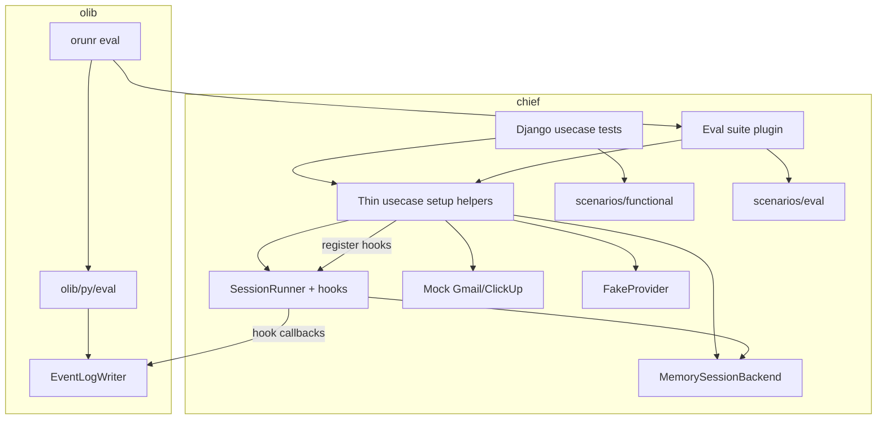

# Usecase tests and evals — Design

Epic: [Inbox cleanup (U1)](../../epics/2026-07-03-inbox-cleanup.md) · Spec **11 of 11** · Item: **Usecase tests and evals**

**Branch:** `feat/2026-07-11-usecase-tests-evals`

Status: **done**

Architecture reference: [`docs/ARCHITECTURE.md`](../../ARCHITECTURE.md) ·
Queues/sources: [Sources and queues](../2026-07-04-sources-and-queues/2026-07-04-sources-and-queues-design.md) ·
Scheduling: [Agent scheduling](../2026-07-05-agent-scheduling/2026-07-05-agent-scheduling-design.md) ·
Gmail / ClickUp: [Gmail](../2026-07-06-gmail-integration/2026-07-06-gmail-integration-design.md) ·
[ClickUp](../2026-07-06-clickup-integration/2026-07-06-clickup-integration-design.md) ·
Inbox product: epic item **9** (Inbox triage agent).

Mermaid display labels: per [`superpowers/brainstorming`](../../../olib/ai/skills/superpowers/brainstorming/SKILL.md)
— **always quote** human-readable node/participant/edge text.

---

## Goal

Give Chief (and later other olib projects) a way to:

1. Run **usecase functional tests** that drive the **same `SessionRunner`** as
   production, against **mock external clients** and a **scripted / fake LLM**, as
   normal Django unittests — hard pass/fail for wiring and routing.
2. Run **offline evals** (not under Django unittest) against **separate, harder
   scenarios** and **real models**, including a **model matrix**, with soft scoring.
3. Share one **simple text-based observability** path: partitioned **event-log
   files** plus **hooks registered on `SessionRunner`** for live terminal tracing —
   without baking eval/test instrumentation into agent product logic.

Inbox triage (U1) is the **first consumer**: seed emails → `SessionRunner` → assert
or score Gmail labels / spam / archive / ClickUp INBOX tasks.

### Non-goals

- A parallel **`UsecaseHarness` runner** that reimplements the agent loop.
- Selecting mocks from agent YAML / production config (injection is **test/eval only**).
- Adopting Inspect AI / Promptfoo / DeepEval in v1 (revisit when many suites exist).
- Production APM / hosted observability (LangSmith-style).
- Sharing the same scenario files between functional tests and evals.
- Implementing the full inbox triage **product** agent (spec 9) — this spec assumes
  that agent config/prompt exists or lands in parallel; scenarios may land behind
  a minimal triage YAML until spec 9 completes.
- Obsidian or other cancelled U1 integrations.

---

## Decisions (locked)

| Topic | Decision |
|-------|----------|
| Epic home | Stay in **U1** (not a new platform epic) |
| Agent execution | Always **`SessionRunner`** — same loop as prod / CLI |
| Session persistence in usecases | Prefer existing **`MemorySessionBackend`** (no DB user required); extend or add a backend only if memory cannot express a needed seam |
| Django user | **Not required** for default usecase runs (`user_id=None` → env-only / mocks ignore auth) |
| Mock selection | **Test/eval injection only** — no `backend: mock` in agent config |
| Functional vs eval | **Separate** scenario packs and runners |
| Functional LLM | Existing **`FakeProvider`** (or thin extension) with scenario plans; no live API in default CI unittest |
| Eval LLM | **Real models**; matrix over models |
| Eval framework | **Custom**, reusable in **olib** (not Inspect AI for v1) |
| Eval CLI | `orunr eval …` under `olib/py/cli/run/` |
| Eval library | Importable mechanics in `olib/py/eval/` |
| Observability hooks | **Generic hook system on `SessionRunner`**; callers register hooks; tests/evals register observability hooks |
| Event logs | Partitioned file writer (olib utility); fed by SessionRunner hooks + session events |
| Source → queue path | Optional **thin setup helpers** (not a second runner); agent usecases default to Memory backend + mailbox prompt |
| First usecase | Inbox triage (Gmail + ClickUp mocks) |

---

## Architecture

**Boundary:** `olib/py/eval` is Django-free and never imports chief. Chief implements
olib protocols (suite loader, sample runner, scorer). **`SessionRunner` owns hooks**;
olib supplies reusable log/report utilities that chief hooks invoke.

---

## 1. Execution model: SessionRunner (not a parallel harness)

**There is no `UsecaseHarness` agent loop.** Production, CLI (`run_agent`), functional
tests, and evals all execute turns via **`SessionRunner`**.

What tests/evals still need (thin **setup helpers**, not a runner):

1. Load production-shaped agent **spec** (YAML / example) into
   **`MemorySessionBackend(spec, user_id=None)`** — no Django `User` / `Agent` row
   required for the default path.
2. Inject **mock clients** via existing seams (`client_factory` on tools; extend
   source adapters if a scenario needs poll).
3. Functional: inject **`FakeProvider`** (scenario plan) via the same
   `make_provider` seam tests already patch today.
4. Push the turn prompt onto the backend mailbox (chat input), mirroring how a
   queue trigger would supply “Triage this email…”.
5. Construct `SessionRunner(backend)`, **register observability hooks**, call
   `run()`.
6. Assert / score from **mock client state** + `backend.events()`.

### Do we need a user?

**No** for the default usecase path. `MemorySessionBackend` already documents
`user_id=None` → env-only credential resolution and no `apps.keys` lookup. Mocks
ignore auth. Evals with real models use env (or optional explicit `user_id` later
if a scenario must exercise stored keys).

### Do we need a new backend?

**Prefer not.** Start with **`MemorySessionBackend`**. Add or extend a backend only
if a concrete usecase needs persistence/control-plane behavior memory cannot
provide. Do **not** invent a second runner.

### Source → queue → dispatch

Still valuable, but it is **not** the agent loop:

- Cover with **focused helpers/tests** that call `poll_source` / put / dispatch under
  Celery eager when we want that coverage.
- Default inbox **routing** usecases seed the mock mailbox and drive
  `SessionRunner` directly so harness complexity does not grow with every agent
  scenario.

---

## 2. Client Protocols and mocks (chief)

For **Gmail** and **ClickUp** (U1):

| Piece | Role |
|-------|------|
| Protocol / ABC | Methods tools and source adapters already call |
| Real client | Production `GmailClient` / `ClickUpClient` |
| In-memory mock | Seedable state; records mutations (labels, archive, spam, tasks, …) |

Rules:

- Production wiring **always** constructs the real client.
- Setup helpers inject mocks only in test/eval setup.
- Credentials may be omitted / dummy; mocks accept any token or ignore auth.
- If a scenario polls a source, the adapter must use the injected client instance.

---

## 3. Functional tests vs evals

| | Functional | Eval |
|---|---|---|
| Agent loop | `SessionRunner` | `SessionRunner` |
| Backend | `MemorySessionBackend` (default) | `MemorySessionBackend` (default) |
| Outer runner | Django unittest | `orunr eval` (olib CLI) — **not** unittest |
| LLM | `FakeProvider` + scenario plan | Real model(s); matrix |
| Scenarios | Small, wiring-focused | Separate, harder / ambiguous |
| Pass criteria | Hard asserts on mock state (+ events) | Soft scores; report (CI gate optional later) |
| Location | e.g. `backend/.../tests/usecases/` + `scenarios/functional/` | e.g. `evals/inbox/` + `scenarios/eval/` |

**Scenario contents (both packs):** seed mailbox (+ optional ClickUp state), agent
spec reference, expected outcomes (labels, spam/archive, ClickUp fields).
Functional scenarios **also** carry the **FakeProvider** plan.

**Eval matrix:** same eval scenarios × N models → score table. Functional suite
never enters that matrix.

---

## 4. olib eval library and CLI

### Library — `olib/py/eval/`

Django-free package responsible for:

- Scenario / suite discovery (paths from project config or CLI args)
- Model matrix orchestration (run sample × model)
- Protocols for project plugins:
  - **Suite**: list samples
  - **Runner**: execute one sample (chief: setup + `SessionRunner`)
  - **Scorer**: map run result + expected → score(s)
- **EventLogWriter** — partitioned append/write of run transcripts (utility sink)
- Aggregation / simple text report (table of scores by scenario × model)

olib does **not** own SessionRunner hooks (those live in chief). It may define a
small **log record / sink interface** that chief hook callbacks write into.

### CLI — `olib/py/cli/run/templates/eval.py` (group name **`eval`**)

Read-only-safe commands under `orunr`, e.g.:

- `orunr eval list` — suites / samples
- `orunr eval run` — run suite(s), optional `--model` repeated for matrix
- `orunr eval report` — summarize an existing log/results dir

**Naming:** do **not** use `inspect` (already taken by olib’s inspect CLI group).

### Project plug-in (chief)

Discovered via `config.py` (entrypoint / path — exact shape in plan). Chief
registers inbox suites, a sample runner built on setup helpers + `SessionRunner`,
and scorers.

### Submodule note

olib changes land in the **olib** submodule (separate commit/PR as needed); this
chief spec documents the contract and the first consumer.

---

## 5. SessionRunner hooks (chief) + event logs

### Generic hooks on `SessionRunner`

Add a **robust, generic hook registry** to `SessionRunner` (or a small collaborator
it owns). Callers that construct the runner **register** hooks; the runner invokes
them at well-defined lifecycle points. Product agent code does not special-case
tests or evals.

Illustrative hook points (exact set refined in plan; keep stable and documented):

| Point | When |
|-------|------|
| `on_run_start` / `on_run_end` | Enter / leave `run()` |
| `on_generate_start` / `on_generate_end` | Before / after provider `collect` |
| `on_tool_call_start` / `on_tool_call_end` | Before / after tool invoke |
| `on_event` | After `backend.append_event` (or publish) — covers INPUT/OUTPUT/TOOL_*/FAILURE |
| `on_status` | Status transitions |

Registration API sketch: `runner.add_hook(HookSet(...))` or typed callbacks per
point. Hooks must be **side-effect free w.r.t. control flow** (observability /
metrics only); they must not decide abort/pause or mutate tool results in v1.

**Why on SessionRunner (not only on the LLM):** tool calls, status, and event log
already live in the runner; one registry covers models of different shapes and
keeps tracing off the agent prompt/product path.

### Test / eval observability hooks

Functional tests and eval sample runners register hooks that:

1. Print a **simple live text trace** to the terminal
2. Append to the **partitioned event-log file** (via olib `EventLogWriter`)

Partition keys (minimum): `kind` (`functional` | `eval`) · suite id · case /
sample id · model id (evals; `fake` / `scripted` for functional) · run id.

Artifacts dir (e.g. `.output/usecase-logs/` — exact path in plan) stays gitignored.

Later, differently shaped models still go through `SessionRunner` generate hooks,
so the same observability harness keeps working.

---

## 6. Fake / scripted LLM (functional only)

Reuse / extend **`libs.providers.llm.fake_provider.FakeProvider`** (already used by
`SessionRunner` unit tests):

- Scenario supplies a deterministic plan (tool calls / messages per turn).
- No network; CI-safe.
- Observability comes from **SessionRunner hooks**, not from custom agent logging.

Evals use real providers; they still register the same SessionRunner hooks.

---

## 7. Inbox first scenarios (sketch)

**Functional (examples):**

- Seed one obvious spam → FakeProvider plan labels/spam → assert mock Gmail state
- Seed one clear todo → plan creates ClickUp INBOX task + Gmail tag → assert mocks

**Eval (examples, separate files):**

- Ambiguous act-vs-read
- Self-note vs ClickUp routing edge cases
- Multi-signal emails where partial credit matters

Exact taxonomy follows epic item 9 / ROADMAP U1. This spec owns **execution,
hooks, mocks, scenario format**, not the final triage policy text.

---

## 8. Build order (within this spec)

| Phase | Delivers |
|-------|----------|
| A | `SessionRunner` generic hook registry + unit tests |
| B | `olib/py/eval` core: EventLogWriter, protocols, matrix runner |
| C | `orunr eval` CLI group |
| D | Client Protocols + in-memory Gmail/ClickUp mocks + injection seams |
| E | Thin usecase setup helpers + FakeProvider scenario plans + observability hooks |
| F | Functional inbox scenarios + unittest suite |
| G | Chief eval plugin + eval scenario pack + scorers + model matrix smoke |

Phases A–C can proceed without the triage agent. F–G need a triage agent YAML
(spec 9 or a minimal stand-in).

---

## Error handling and flakiness

- Functional: deterministic FakeProvider; failures are assertion failures; no retries.
- Eval: record per-sample errors in the log; matrix continues other cells; non-zero
  exit only when the run infrastructure fails or when an optional strict gate is set.
- Missing API keys for evals: fail fast with a clear CLI message (do not silently skip
  the whole matrix unless `--allow-skip` is explicit — decide default in plan).
- Hook exceptions: log and continue the session (observability must not fail the run)
  unless a debug flag says otherwise — decide default in plan.

---

## Testing this spec

- chief: SessionRunner hook unit tests; mock client tests; at least one end-to-end
  functional usecase with MemorySessionBackend + FakeProvider + log file output.
- olib: EventLogWriter partitioning, matrix expansion, CLI smoke.
- Manual: `orunr eval run` on a tiny inbox eval suite with one model.

Required quality gate for chief Python changes remains `orunr py test-all`.
olib changes follow olib’s own `orunr py test-all` in the submodule.

---

## Constraints

- No mock backends in production agent YAML.
- No second agent loop alongside `SessionRunner`.
- olib eval must not import Django or chief.
- One session per email (existing U1 constraint) remains true for inbox usecases.
- Never commit usecase logs that contain live secrets; artifacts dir stays gitignored.

---

## References

- [U1 epic](../../epics/2026-07-03-inbox-cleanup.md)
- [ROADMAP U1](../../ROADMAP.md)
- [olib orun skill](../../../olib/ai/skills/orun/SKILL.md)
- Existing: `SessionRunner`, `MemorySessionBackend`, `FakeProvider`,
  `GmailTool.bind(..., client_factory=…)`, Celery eager via olib Django settings
