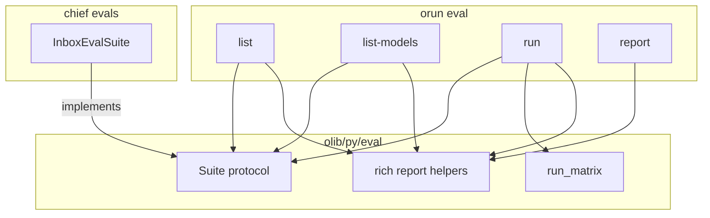

# Eval CLI polish — Design

Epic: [Inbox cleanup (U1)](../../epics/2026-07-03-inbox-cleanup.md) · Follow-on to
[Usecase tests and evals](../2026-07-11-usecase-tests-evals/2026-07-11-usecase-tests-evals-design.md)

**Branch:** `feat/2026-07-12-eval-cli-polish`

Status: **design**

---

## Goal

Tighten the eval CLI and suite contract so:

1. Tables from `orun eval list|list-models|run|report` render with **rich**.
2. Each suite declares its **allowed models** and a **default model**.
3. `orun eval list-models` lists those models (project-provided via suites).
4. `eval run` skips a suite when any requested matrix model is not in that suite’s list.
5. Usecase observability uses **logging** (not `print`) so Django tests stay clean at verbosity 0.
6. `evals/` unit tests are actually discovered by `orunr py test`.

### Non-goals

- Structured model metadata beyond opaque id strings (provider/label objects).
- Changing SessionRunner or scoring semantics.
- Suppressing JSONL event logs (only terminal `print` → logger).
- Adding a dedicated `PyRoot('./evals')` (not required once package discovery works).

---

## Decisions

| Topic | Decision |
|-------|----------|
| Model catalog home | **Per suite** — `models()` + `default_model` |
| `eval run` without `--model` | Use each suite’s **`default_model` only** |
| Matrix mismatch | If any requested model ∉ suite.models → **skip suite** + message |
| Table rendering | **rich** helpers in `olib/py/eval/report.py` (CLI prints them) |
| Observability terminal | `logging` logger, not `print` |
| Evals unittest discovery | Add `evals/inbox/tests/__init__.py` under existing `PyRoot('.')` |

---

## Architecture



---

## 1. Suite protocol

Extend `olib.py.eval.types.Suite`:

```python
@property
def default_model(self) -> str:
    """Model id used when eval run omits --model."""

def models(self) -> list[str]:
    """Model ids this suite may run against (must include default_model)."""
```

**Invariants**

- `default_model` ∈ `models()` (suite factory / CLI may assert; tests cover inbox).
- Model ids stay opaque strings (e.g. `openai:gpt-4o`); the sample runner already parses them.
- Fake suites in olib CLI tests implement the new members.

**Inbox** (`evals/inbox/suite.py`) declares a concrete `models()` list and `default_model` appropriate for real eval runs (implementer chooses ids that `_provider_config_from_model_string` accepts).

---

## 2. CLI behavior

### `eval list`

Rich table columns: suite key, name, samples, default model, models (comma-joined or multi-line).

### `eval list-models` (new)

Rich table aggregating configured suites:

| suite | model | default |
|-------|-------|---------|
| inbox | openai:… | yes/no |

Optional `--suite` repeats filter like `eval run` (omit → all suites).

### `eval run`

- `--model` becomes **optional** (repeatable when present).
- If omitted: for each selected suite, matrix = `[suite.default_model]`.
- If provided: for each suite, if `set(requested) ⊆ set(suite.models())` → run with those models; else **skip** and print:

  `Skipping suite {suite_key} due to model mismatch (missing: …)`

  (name may be suite key or `suite.name`; include missing ids). Do not record failure cells for skipped suites.
- After all suites: rich score table (same columns as today’s TSV: sample, model, score, notes). Exit 1 if any run cell failed (unchanged). Skipping alone does not force exit 1.

### `eval report`

Rich table from log dir (suite, sample, model, score, notes). Empty root → header-only table.

### Rendering contract

Helpers in `olib/py/eval/report.py` build `rich.table.Table` and render via `rich.console.Console` to a string (or print to stdout). Prefer one shared style (box, header) consistent with olib inspect tables. Unit tests assert on rendered text (substring / column headers), not TSV tabs.

---

## 3. Observability logging

In `backend/apps/runner/usecases/observability.py`:

- Default sink is `logging.getLogger('apps.runner.usecases.observability').info(...)`.
- Keep an optional injectable callable only if tests need it; default must not be `print`.
- `build_memory_session_runner` keeps registering these hooks; functional tests no longer pollute verbosity-0 progress lines.
- JSONL `EventLogWriter` behavior unchanged.

---

## 4. Evals test discovery

Today `orunr py test` discovers start dir `evals` under `PyRoot('.')` but finds **0** tests because `evals/inbox/tests/` is not a package.

**Fix:** add empty `evals/inbox/tests/__init__.py`. No new root in `config.py`.

Verify with `unittest discover -s evals` from repo root (2 scorer tests) and that `py.test` / `py.test-all` includes them.

---

## 5. Testing

| Area | Coverage |
|------|----------|
| Suite protocol / inbox | default ∈ models; list-models rows |
| CLI skip | requested model missing → skip message, no cells |
| CLI default | no `--model` → runs default only |
| Report rich | headers present; FAIL / score rows |
| Observability | no stdout from hooks during functional usecase test (or logger mock) |
| Discovery | evals scorer tests collected |

---

## Out of scope / deferred

- `log_ignore` for kombu hostname warning (separate; already ignored by LogMonitorMixin).
- Changing `--allow-skip` semantics for model mismatch (mismatch is skip-not-fail, independent of allow-skip).
