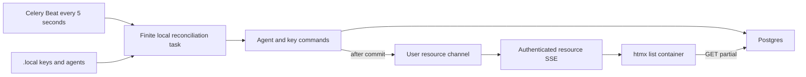

# Celery local sync and resource events

**Branch:** `feat/2026-07-18-celery-local-sync-events`
Status: **review**

## Goal

Move local disk reconciliation out of Django web-process startup and deliver
live, user-scoped refreshes when agent or credential lists change.

The web process must not read local provider files or perform startup ORM work.
Agent and key list containers should update without a full-page reload while
preserving unrelated page state.

## Context

Uvicorn imports Django's ASGI application from an active asyncio event-loop
thread. The current `AppConfig.ready()` bootstrap calls synchronous ORM code,
which Django rejects with `SynchronousOnlyOperation`. A thread-based fix is
possible, but it leaves filesystem polling and synchronization lifecycle inside
each web worker.

Chief already runs Celery workers, Celery Beat, Redis pub/sub, htmx, and SSE.
Compose mounts `.local/` at `/mnt/local` in the backend, worker, and beat
containers. Postgres remains the runtime source of truth.

This design supersedes the narrow thread-coordination fix in GitHub PR #11.
Leave that PR open until the replacement implementation PR exists, then close it
as superseded rather than merging both approaches.

## Architecture

### Periodic reconciliation

Add a short, idempotent Celery task owned by `apps.web`'s local-provider
orchestration module (or a focused `apps.local_sync` app if implementation
reveals that the web app boundary is misleading). Register it through
`chief/tasks.py`.

Celery Beat enqueues the task every five seconds. The task:

1. Returns immediately when `CHIEF_LOCAL_DIR` is unset or missing.
2. Acquires a Redis lease scoped to local reconciliation.
3. Synchronizes keys before agents.
4. Releases the lease in `finally`.

The lease prevents overlapping scans across worker processes when one run takes
longer than the Beat interval. It uses a unique owner token and compare-and-delete
release so one worker cannot release another worker's renewed lease. A bounded
TTL recovers from worker death.

The task remains a finite unit of work. It does not contain a long-running
filesystem watcher and does not occupy a worker slot indefinitely.

Remove local sync and watcher startup from Django `AppConfig.ready()`. Remove the
process-local polling watcher and its ASGI/thread coordinator once the Celery
path has equivalent reconciliation coverage. Migration and collectstatic guards
become unnecessary because those processes no longer initiate sync.

### Resource event bus

Add a generic user-scoped resource channel in `apps.bus`, separate from the
existing session-scoped channel:

```text
{CACHE_PREFIX}user:{user_id}:resources
```

Messages use a small refresh-hint envelope:

```json
{
  "channel": "resource_update",
  "resource": "agents"
}
```

`resource` is initially `agents` or `keys`. Events carry no secret values or
authoritative row data. They may be coalesced or lost; clients recover by
fetching the current Postgres-backed partial.

Agent and key command services publish after successful commits with
`transaction.on_commit`. The architecture dependency table will explicitly
allow these domain apps to use the foundational `apps.bus` publisher while
preserving the rule that `apps.bus` imports no domain apps.

Emit events for list-visible mutations from both UI and disk flows:

- agent create, update/config change, restore, disable, and delete;
- user credential create, replace, restore, disable, and delete.

Unchanged periodic scans emit nothing. Disk synchronization results therefore
need to distinguish an actual mutation from a successful no-op and identify the
affected user. Multiple changes for one user/resource during one reconciliation
run may be collapsed into one event.

### Authenticated resource SSE

Add an authenticated SSE endpoint such as `/events/`. It:

1. Resolves the authenticated user id synchronously through `sync_to_async`.
2. Subscribes only to that user's resource channel.
3. Emits named `resource_update` SSE messages.
4. Unsubscribes and closes Redis resources on disconnect.

No replay store is needed. A page load already renders current database state,
and each event only tells the browser which partial to refetch.

`base.html` opens one `EventSource` for authenticated pages. On a resource event
it dispatches an htmx trigger on `document.body`, for example
`chief:agents-changed` or `chief:keys-changed`. The connection closes on page
teardown and reconnects using native `EventSource` behavior.

### Partial page refreshes

Add authenticated, query-service-backed partial endpoints:

- dashboard agent-list partial;
- settings key-list partial.

The dashboard wraps the Agents section in an htmx container that reloads on
`chief:agents-changed from:body`.

The keys page wraps only the existing key table/list in an htmx container that
reloads on `chief:keys-changed from:body`. The add-key form stays outside that
container so an event cannot erase a secret or partially completed form.

Endpoints enforce the same authentication and ownership rules as their parent
pages. Views continue to call services rather than querying models directly.

## Data flow



## Failure handling

- Celery or Redis unavailable: reconciliation is delayed; web startup and page
  rendering continue normally.
- One malformed file: retain current per-file containment and safe logging;
  continue processing other files.
- Task failure: log the failure and rely on the next Beat run; do not retry in a
  tight loop.
- Lease holder death: TTL permits a later run.
- SSE disconnect or dropped event: native reconnect plus the next event/page
  load restores current state.
- Partial fetch failure: htmx leaves the existing DOM in place.

## Security

- Resource channels are user-scoped and the SSE endpoint derives identity from
  the authenticated session, never a request parameter.
- Messages contain resource names only; credential values and config bodies are
  never published.
- Partial endpoints apply authentication and user filtering.
- Existing safe logging rules for credential parsing remain unchanged.

## Testing

- Celery task no-ops when local sync is unconfigured.
- The Redis lease prevents overlapping reconciliation and releases safely.
- Reconciliation preserves keys-before-agents ordering.
- Changed, restored, disabled, and deleted resources emit one user-scoped event;
  unchanged scans emit none.
- UI-owned agent/key command paths emit after commit.
- The SSE endpoint rejects unauthenticated requests and subscribes only to the
  authenticated user's channel.
- Dashboard and key partial endpoints enforce ownership and return the expected
  containers.
- Templates connect resource events to the correct htmx triggers; a key-list
  refresh does not replace the add-key form.
- Existing local provider, web, and session SSE tests continue to pass.

## Acceptance criteria

- Web and management-process `AppConfig.ready()` paths perform no local-provider
  filesystem or ORM synchronization.
- A local file change is reflected in Postgres within one five-second Beat
  interval when Celery and Redis are healthy.
- Concurrent task deliveries cannot overlap reconciliation.
- Agent/key events are user-isolated and emitted only for committed,
  list-visible changes.
- Open dashboard and keys pages refresh their relevant list containers without
  a full-page reload.
- No key secret or agent config payload is sent over the resource event channel.
- PR #11 is closed as superseded when the replacement PR is opened.
