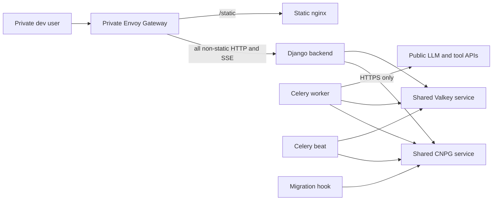

# Chief dev hosting — Design

**Branch:** `feat/2026-07-18-chief-dev-hosting`
Status: **review**

**ClickUp:** https://app.clickup.com/t/868kdw1ge
**ClickUp branch field:** `feat/2026-07-18-chief-dev-hosting`

Follow the `clickup` skill for status/tag/Branch updates.

Architecture reference: [`docs/ARCHITECTURE.md`](../../ARCHITECTURE.md)

---

## Goal

Make Chief buildable and deployable to the private `dev` Kubernetes cluster as
`chief-stage`, served at `https://chief.dev.oivindloe.com`. Follow the established
Hello and Floors build/ArgoCD patterns while giving Chief its own focused Helm chart
and a least-privilege network boundary.

This effort spans the Chief and infrabase repositories. Use the declared branch name
in both repositories so both pull requests map one-to-one to the ClickUp ticket.

### Success criteria

- Chief's CLI can build and deploy a `chief-stage` target to the dev registry and
  env repository.
- ArgoCD deploys the backend, Celery worker, Celery beat, static server, secrets,
  database/Valkey initialization, and migrations into a `chief-stage` namespace.
- The private Gateway serves the dashboard and SSE endpoint through Django and
  `/static` through nginx at `chief.dev.oivindloe.com`.
- Every pod starts under default-deny network policy and receives only the specific
  ingress and egress paths required by its role.
- Production startup does not run migrations, create a default administrator, or
  enable autoreload.

### Non-goals

- A `pub` or kind-test deployment target.
- Public Gateway or external DNS publication.
- Autoscaling, high availability, or production sizing.
- Generalizing the Hello or Floors chart into a shared application chart.
- NFS storage or a hosted `CHIEF_LOCAL_DIR`; hosted agents and credentials use
  Postgres and the existing UI.
- Automatically creating the first administrator.
- Automatically provisioning Vault values.

---

## Chosen approach

Create a dedicated `charts/chief` chart in infrabase. Reuse the proven conventions
from Hello for ArgoCD, database initialization, migration hooks, services, and private
Gateway routing, and from Floors for separate Celery worker/beat workloads, Valkey
prefix initialization, static serving, and workload-specific network policies.

This is preferred over generalizing Hello because chart abstraction would enlarge the
task and couple two applications' deployment evolution. Reusing Floors directly would
couple Chief to unrelated frontend, media, email, and social-auth resources.

---

## Repository changes

### Chief

`config.py` gains `buildArgoService` configuration and a `chief-stage` cluster:

- app category/name: `apps/chief`;
- cluster: `dev`;
- release: `chief-stage`;
- registry: `registry.dev.oivindloe.com`;
- host: `https://chief.dev.oivindloe.com`;
- images: `backend`, `celery-worker`, `celery-beat`, and `static`;
- all three Python workloads reuse the same immutable production backend image;
- versioning uses debug increments without pushing release tags; and
- stage environment splitting reads `.env`, `.env.production`, and
  `.env.production.stage`.

Chief adds:

- a non-root production backend image containing application code and locked runtime
  dependencies;
- a static nginx image containing config-generated `collectstatic` output;
- production/stage environment declarations for Django, Postgres, Valkey, allowed
  hosts, CSRF origin, and file-backed secrets; and
- production-safe entrypoint behavior.

Image construction follows the existing Floors split between build orchestration and
Docker packaging. Scheduling the static image through `config.py` first runs the
existing `django.collectstatic::backend` job, then a single-stage nginx Dockerfile
copies `backend/.output/static` into the image. The Dockerfile does not install Python,
uv, or application dependencies and does not run `collectstatic`.

The backend image likewise uses a single Python stage, adapted to Chief's root uv
workspace lock. Hardening remains explicit: Python, nginx, and uv inputs are pinned by
digest; dependency export and installation are frozen and hash-verified; apt avoids
recommended packages and removes package indexes; temporary installer artifacts are
removed; and both images run as unprivileged users.

Compose keeps its development behavior. In production, the web process starts uvicorn
without autoreload and without startup migrations or administrator creation. The
migration hook is the sole schema-migration owner. The first administrator is created
explicitly after deployment with a Django management command.

### Infrabase

Add a dedicated `charts/chief` chart with:

- backend, Celery worker, Celery beat, and static nginx Deployments;
- backend and static ClusterIP Services;
- a private-Gateway HTTPRoute;
- ExternalSecrets and file mounts;
- a migration hook;
- service account and chart helpers; and
- default-deny plus workload-specific NetworkPolicies.

Add `charts/core-apps/templates/chief.yml` to compose the Chief chart with monochart
database and Valkey initialization. Add disabled Chief defaults to core-apps values and
enable only `chief-stage` in `apps/core/core-apps-dev.yaml`. No Chief entry is added to
the pub or kind-test applications.

The ArgoCD application reads generated image tags and ConfigMap values from
`env/chief/chief-stage/values.yml`, following Hello and Floors.

---

## Runtime architecture

The backend remains the only externally reachable application process. The worker and
beat have no Services and accept no ingress. Static nginx serves immutable collected
assets only. No workload mounts `.local/`, and `CHIEF_LOCAL_DIR` remains unset.

### Gateway routing

The HTTPRoute attaches only to `gateway-private` and has no external-DNS annotation:

- `/static` routes to the static Service on TCP 8000;
- `/` and every other path route to the backend Service on TCP 8000.

Routing all non-static paths to Django preserves the server-rendered dashboard, admin,
authentication, control endpoints, and long-lived SSE responses without a separate
frontend proxy.

---

## Secrets and configuration

Non-secret stage settings are split into the generated backend ConfigMap. Secret values
come from Vault through External Secrets:

| Vault path | Mounted secret | Purpose |
|---|---|---|
| `secret/data/apps/chief/postgres` | `postgres` | database username, password, and database |
| `secret/data/apps/chief/redis` | `redis` | Valkey username, password, and key prefix |
| `secret/data/apps/chief/django` | `django` | Django secret key |
| `secret/data/apps/chief/credentials` | `credentials` | Chief credential-encryption key |

The ConfigMap points settings at mounted files using the existing `*_FILE` convention.
The Postgres and Valkey URLs address the shared in-cluster services. The stage env sets:

- `DEBUG=false`, production execution, and structured logging;
- `ALLOWED_HOSTS=chief.dev.oivindloe.com` plus the backend Service name;
- `CSRF_TRUSTED_ORIGINS=https://chief.dev.oivindloe.com`;
- file-backed Django and Chief encryption keys; and
- file-backed database and Valkey fields with a Chief-specific Redis prefix.

Missing ExternalSecrets prevent dependent pods and the migration hook from becoming
ready. The chart never places secret values in ConfigMaps, generated env-repo values,
image layers, or command arguments.

---

## Network security

The namespace starts with a policy selecting every pod and denying all ingress and
egress. Additional rules are separated by destination and port; a namespace selector
never implicitly grants every port.

| Workload | Allowed ingress | Allowed egress |
|---|---|---|
| Backend | Envoy Gateway namespace → TCP 8000 | kube-dns UDP/TCP 53; CNPG namespace TCP 5432; Valkey namespace TCP 6379 |
| Celery worker | None | kube-dns UDP/TCP 53; CNPG TCP 5432; Valkey TCP 6379; public IPv4 TCP 443 excluding RFC1918 ranges |
| Celery beat | None | kube-dns UDP/TCP 53; CNPG TCP 5432; Valkey TCP 6379 |
| Migration | None | kube-dns UDP/TCP 53; CNPG TCP 5432 |
| Static nginx | Envoy Gateway namespace → TCP 8000 | None |

Public HTTPS egress belongs only to the worker because provider and tool calls execute
there. The rule excludes private IPv4 ranges to prevent a configured agent tool from
using the generic HTTPS allowance to reach internal services. Explicit future private
integrations require a narrowly scoped policy change.

The Gateway is selected by its namespace, not by unrestricted same-cluster ingress.
Database and Valkey access is constrained to their namespaces and service ports. No
LoadBalancer or NodePort Service is created.

---

## Deployment ordering and failure behavior

ArgoCD applies resources in this order:

1. wait for External Secrets, registry proxy, Gateway, CNPG, and Valkey dependencies;
2. initialize the Chief database and Chief Valkey prefix through monochart;
3. synchronize ExternalSecrets, ConfigMap, and NetworkPolicies;
4. run the versioned migration hook;
5. roll out backend, worker, beat, and static Deployments; and
6. expose backend/static Services through the private HTTPRoute.

The migration Job uses the same pinned backend image as the application. A failed
dependency wait, database/Valkey initialization, secret synchronization, or migration
fails the ArgoCD sync instead of starting a partially configured release. Deployments
use startup, readiness, and liveness probes based on the existing health endpoints;
failed new pods do not replace ready old pods.

`restoreMode` remains available as an operational chart value, matching Hello and
Floors: it skips initialization/migration and scales application workloads down while a
restore is in progress.

---

## Testing and verification

### Chief

- Test that the CLI exposes `chief-stage` with the expected release, cluster, registry,
  image, host, version, and env configuration.
- Test production entrypoint behavior separately from Compose: no migration, no default
  administrator, no autoreload, and correct web/worker/beat command selection.
- Verify target-specific static collection is included in the static image.
- Run the required Python `test-all` checks and configured JavaScript unit, lint, and
  type-check checks through `orunr`.

### Infrabase

Render the chart and core-apps application with dev values and assert:

- only private-Gateway routing is generated;
- backend/static Services and all four runtime Deployments/hooks use the pinned images;
- ConfigMap and secret mounts match each process;
- migration and initialization sync ordering is preserved;
- no pub or kind-test Chief application is enabled; and
- every NetworkPolicy allowance matches the table above, including DNS protocol/port,
  database and Valkey ports, Envoy-only ingress, and worker-only public HTTPS.

Run Helm lint/template checks and the infrabase repository's existing chart test suite.

---

## Acceptance criteria

1. A `chief-stage` build publishes backend and static images and writes
   `env/chief/chief-stage/values.yml`.
2. Dev core-apps creates a healthy `chief-stage` ArgoCD application while pub and
   kind-test remain unchanged.
3. `https://chief.dev.oivindloe.com` serves the dashboard, authentication/admin paths,
   SSE, and static assets through the private Gateway.
4. Backend, worker, beat, migration, and static pods have only their documented network
   paths; rendered policies contain no broad namespace-wide port grants.
5. Database migrations run once as an Argo hook before rollout.
6. No hosted process creates `admin/nimda`, uses uvicorn autoreload, or reads `.local/`.
7. Missing required Vault material or failed migration causes a visible failed sync
   rather than an insecure or partial deployment.
