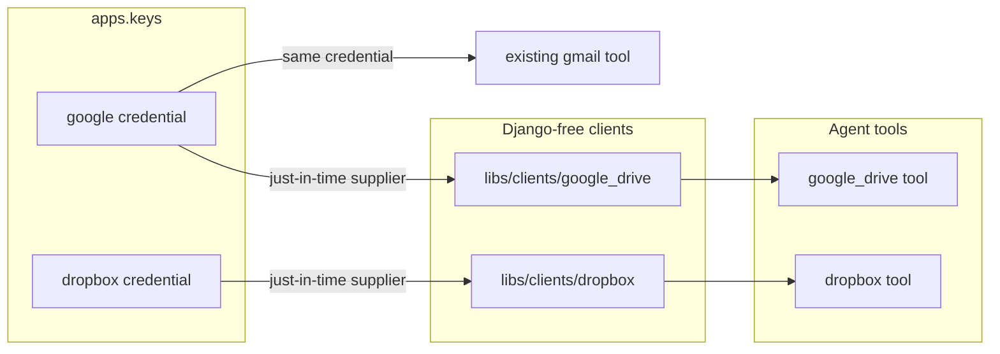

# Dropbox and Google Drive metadata integrations — Design

**Branch:** `feat/2026-07-18-cloud-file-integrations`
Status: **review**

**ClickUp:** https://app.clickup.com/t/868kduv64
**ClickUp branch field:** `feat/2026-07-18-cloud-file-integrations`

Follow the `clickup` skill for status/tag/Branch updates.

Architecture reference: [`docs/ARCHITECTURE.md`](../../ARCHITECTURE.md) · Credentials:
[`docs/specs/2026-07-03-key-management/`](../2026-07-03-key-management/2026-07-03-key-management-design.md) ·
Existing integration pattern:
[`docs/specs/2026-07-06-gmail-integration/`](../2026-07-06-gmail-integration/2026-07-06-gmail-integration-design.md)

---

## Goal

Give Chief agents read-only, metadata-only access to explicitly approved Dropbox and
Google Drive trees. An agent can:

1. list its configured roots;
2. navigate one folder level at a time;
3. inspect file or folder metadata; and
4. run provider-native name/full-text search within one configured root.

Google Drive must support an explicit mix of:

- an impersonated Workspace user's **My Drive**;
- **Shared Drives** visible to that user or service account; and
- individual files/folders from **Shared with me** or explicitly shared to the service
  account.

Dropbox must support a connected account and, when configured, a team-space namespace.

### Non-goals

- Reading, downloading, exporting, previewing, or parsing file content.
- Uploading, editing, moving, deleting, or sharing files/folders.
- Permission or collaborator management.
- Recursive whole-tree dumps.
- Source adapters, queue ingestion, change feeds, or webhooks.
- Interactive OAuth or provider connection UI.
- Cross-provider merged search.

---

## Current state

Chief already has the reusable external-integration anatomy:

- Django-free clients under `libs/clients/`;
- agent tools under `libs/tools/tools/`;
- encrypted named credentials in `apps.keys`;
- shared `integrations[]` config referenced by tool instances;
- just-in-time secret suppliers and injectable client factories for tests; and
- uniform tool failure results in the Gmail and ClickUp tools.

The Gmail client already depends on `google-auth` and `google-api-python-client`, but its
service-account credential is registered as the service-specific type `gmail`. Dropbox has
no credential type, dependency, client, or tool.

This feature needs clients and tools only. It does not need a new Django app, model/schema
migration, source adapter, or agent-spec schema change. The credential rename does require
a narrow data migration of existing key rows.

---

## Architecture

Use separate provider tools with matching operation names. Provider identifiers, search
semantics, pagination, and authentication differ enough that one `cloud_files` tool would
leak its provider abstraction.



### Components

| Component | Responsibility |
|-----------|----------------|
| `libs/clients/google_drive/` | Drive v3 auth, listing, metadata, search, pagination, root enforcement, typed failures |
| `libs/clients/dropbox/` | Dropbox SDK auth/refresh, listing, metadata, search, pagination, root enforcement, typed failures |
| `libs/tools/tools/google_drive.py` | LLM-visible schemas and dispatch to `GoogleDriveClient` |
| `libs/tools/tools/dropbox.py` | LLM-visible schemas and dispatch to `DropboxClient` |
| `apps.keys` registry/guides | Canonical Google and Dropbox credential setup |

Both clients remain Django-free. Both tools use `ToolContext.secret_supplier_factory` and
`ToolContext.client_factories` exactly like Gmail and ClickUp.

---

## Shared Google credential

Rename the service-account credential type from **`gmail`** to **`google`**. Gmail and
Google Drive consume the same service-account JSON because the identity/key material is
Google-wide; each client independently creates credentials with only its required scopes.
Keeping two encrypted copies would add rotation risk without creating a security boundary.

| Consumer | Scopes created by the client |
|----------|------------------------------|
| Gmail | Existing `gmail.modify` and `gmail.send` scopes |
| Google Drive | `https://www.googleapis.com/auth/drive.metadata.readonly` only |

For domain-wide delegation, the Workspace admin authorizes the union of scopes needed by
the enabled tools for the service account's client ID. Tool instances may use different
`config.subject` values while referencing the same named Google credential.

The implementation performs a deliberate pre-v1 credential cutover:

- register canonical key type `google` and remove `gmail` from current setup choices;
- update both `GmailTool.credential_type` and `GmailSourceAdapter.credential_type` to
  `google`;
- migrate both `UserCredential` and `SystemCredential` rows whose type is `gmail` to
  `google` without decrypting or rewriting their secret value;
- rename the canonical system-default row from `default:gmail` to `default:google`;
- update disk-key examples/docs from `type: gmail` to `type: google`; and
- keep integration/tool type `gmail` unchanged—the rename applies only to credential type.

No permanent credential-type alias is retained. A local YAML key still declaring
`type: gmail` fails validation with migration guidance instead of silently creating a
credential that Gmail can no longer resolve. The migration is deliberately irreversible:
after the cutover, newly created `google` rows may serve Drive, Gmail, or both and cannot
be safely classified as former `gmail` rows. It preflights conflicting `google` system
defaults or a pre-existing `default:google` name and fails with actionable guidance rather
than violating uniqueness constraints.

---

## Authentication

### Google Drive

The encrypted `google` credential is the complete service-account JSON.

- With `config.subject`, the client calls `with_subject(subject)` and acts as that
  Workspace user. It can address the user's My Drive, files/folders shared with the user,
  and Shared Drives where the user is a member.
- Without `subject`, the service-account identity can address files/folders explicitly
  shared to it and Shared Drives where it is a member. A service account has no useful
  user-owned My Drive storage.
- Drive calls use `supportsAllDrives=true` and `includeItemsFromAllDrives=true` where
  applicable.
- Searches use corpus `user` for My Drive/shared items and corpus `drive` plus `driveId`
  for a Shared Drive.

The client builds a Drive service per tool invocation and does not retain plaintext JSON or
the built service on a long-lived object.

### Dropbox

The encrypted `dropbox` credential is JSON containing the app key, app secret, and offline
refresh token. Chief does not implement the authorization-code flow in this version;
operators provision the refresh token outside Chief.

- The Dropbox app requests `files.metadata.read` only.
- The app must use Full Dropbox access when configured roots include pre-existing account
  content; App Folder access remains usable when all roots are inside that app folder.
- The official Dropbox Python SDK refreshes short-lived access tokens from the stored
  refresh token.
- Optional non-secret `config.namespace_id` establishes the Dropbox path root for a team
  space. All configured paths are interpreted inside that namespace.

The client does not retain an access token beyond the SDK operation.

---

## Configuration and required roots

Every tool instance must resolve to a non-empty `config.roots`. Roots use operator-chosen
aliases so prompts and tool calls do not need to repeat provider locators.

```yaml
integrations:
  - id: work-google
    type: google_drive
    credential_ref: work-google
    config:
      subject: agent@example.com
      roots:
        - {id: my-drive, file_id: root, corpus: user}
        - {id: company, file_id: "shared-drive-root-id", drive_id: "shared-drive-id"}
        - {id: shared-project, file_id: "shared-folder-id", corpus: user}
        - {id: shared-brief, file_id: "shared-file-id", corpus: user}

  - id: team-dropbox
    type: dropbox
    credential_ref: team-dropbox
    config:
      namespace_id: "optional-team-namespace-id"
      roots:
        - {id: projects, path: "/Projects"}

tools:
  - {id: drive, integration: work-google}
  - {id: dropbox, integration: team-dropbox}
```

Google root records require `id` and `file_id`. `corpus` defaults to `user`; `drive_id`
selects and implies a Shared Drive corpus. Dropbox root records require `id` and an
absolute normalized `path`.

A root may be a file, folder, My Drive root, or Shared Drive root. Individual file roots
appear in `list_roots` and work with `get_metadata`, but cannot be listed or searched as
folders.

Malformed, duplicate, missing, or inaccessible roots fail tool binding or root resolution
with a clear configuration failure.

---

## Tool contract

`google_drive` and `dropbox` expose the same four functions. Every
`ToolFunction.readonly` flag is `True`.

| Function | Purpose |
|----------|---------|
| `list_roots()` | Return metadata for configured roots only |
| `list_folder(root, folder_ref?, cursor?, max_results?)` | List direct children; omitted `folder_ref` means the root |
| `get_metadata(root, item_ref)` | Fetch one item after proving it remains under the selected root |
| `search(root, query, kinds?, cursor?, max_results?)` | Provider-native name/full-text search under one root |

`root` is always a configured alias. `item_ref` and `folder_ref` are opaque
provider-specific references returned by a prior tool result. Passing an arbitrary valid
provider ID/path does not bypass the ancestry check.

Defaults and limits:

- `max_results` defaults to 50 and is capped at 100;
- folder listing is one level only;
- provider-page scanning per invocation is bounded;
- cursors are opaque and include the tool instance ID so they are bound to the same tool
  instance, root, operation, and query; and
- deterministic ordering is requested where the provider supports it.

### Normalized metadata

Single-item calls return `{item: ...}`. Listing and search return:

```json
{
  "items": [
    {
      "provider": "google_drive",
      "root": "company",
      "id": "opaque-provider-id",
      "name": "Quarterly reports",
      "kind": "folder",
      "mime_type": "application/vnd.google-apps.folder",
      "size": null,
      "modified_at": "2026-07-18T12:00:00Z",
      "parent_refs": ["opaque-parent-id"],
      "path": null,
      "web_url": null,
      "provider_metadata": {}
    }
  ],
  "next_cursor": null
}
```

The normalized core is stable across providers. `path` is populated for Dropbox and null
when Google cannot provide one cheaply. `web_url` is nullable: Drive may return its
metadata `webViewLink`, while Dropbox remains null because creating or retrieving a shared
link would require a non-metadata operation and additional scope. `provider_metadata` is
intentionally small and contains only unavoidable provider-specific metadata such as Drive
ID or Dropbox revision.

No content body, export link, thumbnail, preview, temporary download URL, or permission
list is returned.

---

## Root enforcement

Required roots are an authorization boundary in addition to the provider's own
permissions.

### Google Drive

- Configured locators such as My Drive's special `file_id: root` are resolved to the
  provider's canonical file ID before ancestry comparisons.
- Direct lookups walk `parents` until they reach the selected configured root or a storage
  boundary.
- Traversal is cycle-safe and depth-bounded.
- Shared Drive searches use `corpora=drive`; My Drive/shared-item searches use
  `corpora=user`.
- Drive cannot recursively constrain a provider-native search to an arbitrary folder, so
  every bounded search result is ancestry-checked and out-of-root results are discarded.
- Shortcuts are returned with `kind=shortcut` metadata. Their targets are not followed and
  cannot become traversal edges outside the approved tree.

### Dropbox

- The SDK's normalized `path_lower` is checked using path segments, never raw string
  prefixes (`/Projects2` is not beneath `/Projects`).
- Namespace selection happens before root/path checks.
- Listing and search use the selected root path; returned paths are checked again before
  serialization.

Changing provider-side parentage can invalidate a previously returned reference. Every
operation rechecks the current ancestry/path rather than trusting earlier results.

### Implementation corrections incorporated at plan time

The implementation follows these seven clarifications discovered while mapping the existing
Gmail, source, key, and tool patterns:

1. The shared Google credential cutover includes `GmailSourceAdapter`, not only the Gmail
   tool.
2. The data migration covers both credential tables and renames `default:gmail`.
3. The migration is irreversible and preflights conflicting system rows.
4. Legacy disk YAML surfaces explicit `type: gmail` → `type: google` guidance without
   logging credential values.
5. Drive's special `root` locator is canonicalized before authorization comparisons.
6. Cursor envelopes carry the tool instance ID in addition to root/operation/query binding.
7. `web_url` is nullable, with Dropbox returning null rather than creating shared links.

---

## Search semantics

Search is provider-native rather than a client-side recursive crawl:

- Google Drive maps `query` to Drive `name`/`fullText` search expressions and uses the
  selected root's corpus.
- Dropbox maps `query` to `files_search_v2` with the selected root path.
- Optional `kinds` filters to files and/or folders where provider capabilities permit.

Provider ranking and tokenization can differ; the common contract promises bounded,
root-safe metadata results, not identical ranking. A result page can contain fewer than
`max_results` after Google ancestry filtering.

---

## Failure handling

Client-specific failures map to a common tool result:

```json
{"ok": false, "error": {"kind": "outside_root", "message": "..."}}
```

Supported kinds are:

| Kind | Meaning |
|------|---------|
| `auth` | Missing, malformed, expired, or unauthorized credential |
| `forbidden` | Provider identity lacks permission |
| `outside_root` | Valid provider item is not beneath the selected configured root |
| `not_found` | Item/root no longer exists or is not visible |
| `rate_limited` | Provider limit remains after bounded retry |
| `invalid_cursor` | Cursor does not belong to this operation/root/query |
| `config` | Tool integration/root/namespace configuration is invalid |
| `api` | Other provider or transport failure |

429 and transient 5xx responses receive bounded retry/backoff, honoring provider retry
headers where available. Authentication, authorization, root, and validation failures do
not retry. Logs exclude credentials, provider response bodies, and file search results.

---

## Testing

Verification gate: `./olib/scripts/orunr py test-all`.

| Area | Coverage |
|------|----------|
| Google auth | Shared credential type; delegated and non-delegated service accounts; Drive-only scope |
| Google locations | My Drive, Shared Drive, shared file/folder request parameters and corpus selection |
| Dropbox auth | Credential JSON, refresh-token construction, metadata-only scope assumptions |
| Dropbox namespace | Team namespace path root and normalized path behavior |
| Clients | Listing, metadata, search, pagination, normalization, typed provider failures |
| Root boundary | Sibling-prefix attempts, moved items, arbitrary refs, cycles, shortcuts, filtered search |
| Tools | Matching schemas, dispatch, all functions read-only, uniform failure results |
| Wiring | Registry, credential guides, shared Google credential, injected mock clients |
| Migration | Stored `gmail` credential rows become `google`; local `gmail` YAML gets clear guidance |
| Regression | Existing Gmail/ClickUp tools, key resolution, and agent examples remain valid after updates |

Google API services and the Dropbox SDK are stubbed at their client boundaries. Tests must
not call external provider APIs.

---

## Implementation stages

1. **Google credential cutover** — add canonical `google` type and guide, migrate stored
   `gmail` rows, update Gmail credential expectation and examples/tests.
2. **Google Drive client** — auth, location-aware metadata/list/search, normalization,
   pagination, root enforcement, and tests.
3. **Google Drive tool** — schemas, dispatch, registry wiring, mock client, and tests.
4. **Dropbox credential/client** — guide, official SDK dependency, refresh auth,
   namespace-aware operations, root enforcement, mock client, and tests.
5. **Dropbox tool** — schemas, dispatch, registry wiring, and tests.
6. **Examples/docs** — metadata-browser agent example, setup instructions, and
   `docs/ARCHITECTURE.md` external-integration table.

No feature branch is created during design. Implementation starts from the branch declared
at the top of this document.

---

## Decisions

| Question | Decision |
|----------|----------|
| Tool shape | Separate `google_drive` and `dropbox` tools with matching functions |
| Surface | `list_roots`, `list_folder`, `get_metadata`, `search` |
| Access | Read-only metadata; no file-content access |
| Scope | Explicit non-empty roots required per integration |
| Google locations | My Drive, Shared Drives, and shared files/folders |
| Google identity | Service account, optionally with Workspace delegated subject |
| Google credential | Canonical shared `google` type used by Gmail and Drive |
| Drive OAuth scope | `drive.metadata.readonly` |
| Dropbox identity | Offline refresh-token credential provisioned outside Chief |
| Dropbox scope | `files.metadata.read` |
| Dropbox team access | Optional namespace ID; paths interpreted within that namespace |
| Search | Provider-native with root post-filtering where required |
| Responses | Normalized metadata core plus small provider-specific block |
| Queue/source support | Deferred |

## Deferred questions

- File-content reads, including Google-native export and binary/text handling.
- Interactive Google or Dropbox OAuth connection flows.
- Source adapters/change notifications.
- Whether a third storage provider justifies extracting a common client adapter protocol.

---

## Acceptance criteria

1. One encrypted `google` service-account credential can be referenced by both Gmail and
   Google Drive tool instances without duplicating key material.
2. A delegated Google Drive tool can navigate/search configured roots spanning My Drive,
   Shared Drives, and shared files/folders.
3. A non-delegated service account can navigate/search configured items explicitly shared
   to it and Shared Drives where it is a member.
4. A Dropbox tool can navigate/search configured account or team-namespace roots using an
   offline refresh-token credential.
5. Both providers return the documented normalized, paginated metadata shape.
6. Every lookup and search result is revalidated against the selected configured root.
7. No function fetches or returns file content, and every exposed function is marked
   read-only.
8. Credential setup, examples, architecture docs, and tests reflect the canonical shared
   `google` credential type.
