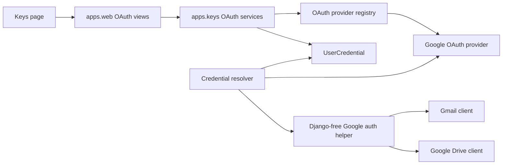
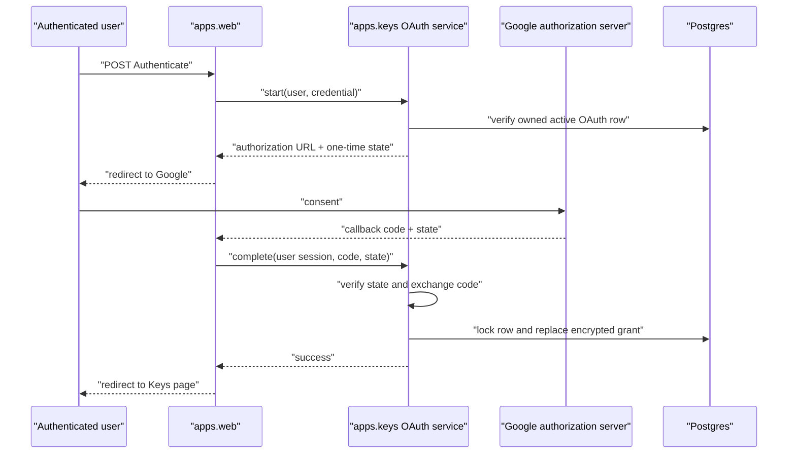

# Google OAuth credentials — Design

**Branch:** `feat/2026-07-18-google-oauth`
Status: **review**

**ClickUp:** https://app.clickup.com/t/868kdw0yb
**ClickUp branch field:** `feat/2026-07-18-google-oauth`

Follow the `clickup` skill for status/tag/Branch updates.

Architecture reference: [`docs/ARCHITECTURE.md`](../../ARCHITECTURE.md) ·
Credential storage:
[`docs/specs/2026-07-03-key-management/`](../2026-07-03-key-management/2026-07-03-key-management-design.md) ·
Google clients:
[`docs/specs/2026-07-18-cloud-file-integrations/`](../2026-07-18-cloud-file-integrations/2026-07-18-cloud-file-integrations-design.md)

---

## Goal

Allow a user-owned `google` credential to use either:

1. the existing service-account JSON; or
2. a Google OAuth grant created through Chief.

Agent integrations continue to reference the credential by name. Gmail and Google Drive
select the correct Google authentication mechanism from that credential without exposing a
different tool, integration, or credential type.

OAuth credentials can be declared on the Keys page or in `.local/keys/*.yaml`. Chief
provides a provider-pluggable OAuth framework, but Google is the only provider implemented
in this feature.

### Success criteria

- A user can create a Google OAuth credential, select its capabilities, complete consent,
  and use it with Gmail or Google Drive.
- Reauthentication atomically replaces the current grant only after a successful callback.
- A disk declaration owns credential identity and configuration while its encrypted OAuth
  grant remains in Postgres.
- Existing static and service-account credentials continue to work unchanged.
- Human-facing metadata, logs, URLs, and provider failures never disclose refresh tokens,
  OAuth app secrets, authorization codes, or service-account material.

### Non-goals

- OAuth providers other than Google.
- OAuth for `SystemCredential`; OAuth grants are user-owned in this version.
- Multiple grants or grant history for one credential.
- Arbitrary provider scope URLs.
- Background token-health checks or automatic consent renewal.
- Persisting short-lived access tokens after an operation.
- Replacing the existing deployment secret system.

---

## Current state

`UserCredential` stores a type and one encrypted string. The UI creates only static
credentials, and disk YAML requires `value`. Metadata intentionally does not decrypt
credentials.

Both Google clients receive the same lazy string supplier and currently parse every
`google` credential as service-account JSON. Gmail applies `config.subject` for domain-wide
delegation; Drive applies it when present.

This means OAuth cannot be inferred safely for the Keys page: doing so would require
decrypting secret payloads merely to render metadata. An unconnected OAuth declaration also
needs to exist before it has any encrypted grant.

---

## Architecture



### Component boundaries

| Component | Responsibility |
|-----------|----------------|
| `apps.keys.oauth` | Provider protocol, registry, capability validation, authorization lifecycle, grant storage, and runtime materialization |
| `apps.keys.oauth.providers.google` | Google endpoints, capability catalog, code exchange, grant validation, and app-secret lookup |
| `apps.keys.services` | Credential creation/reconciliation/resolution and metadata-only queries |
| `apps.web` | Authenticated HTTP parsing, redirects, messages, and templates only |
| Shared Django-free Google auth helper | Parse operation-local service-account or OAuth payload and build Google credentials |
| Gmail and Drive clients | Use the shared helper and retain no plaintext credential beyond one operation |

`apps.web` never imports decrypt/resolve functions. OAuth provider code remains in
`apps.keys`, where encrypted credentials and deployment secrets are already authorized for
operational use. The Google client helper stays under `libs/` and never imports Django or
`apps.*`.

---

## Credential model

Add these fields to `UserCredential`:

| Field | Type | Meaning |
|-------|------|---------|
| `auth_kind` | enum string | `static` or `oauth`; existing rows default to `static` |
| `auth_config` | JSON object | Validated non-secret provider configuration; `{}` for static credentials |

`encrypted_value` keeps its existing role:

- static credential: current opaque secret, including service-account JSON;
- connected OAuth credential: versioned encrypted provider grant payload;
- unconnected OAuth credential: empty bytes.

No OAuth state is inferred by decrypting `encrypted_value`.

### Metadata contract

`KeyMetadata` adds `auth_kind` and validated OAuth capability IDs. `is_set` continues to
mean that encrypted credential material exists. The Keys page presents OAuth rows as
**Connected** or **Not connected** from this metadata.

Connected is deliberately not a provider-health claim. A revoked grant remains Connected
until an operation fails or the user disconnects/reconnects it.

### OAuth grant payload

The encrypted Google grant is versioned and contains only data obtained for that user's
authorization, including the refresh token and provider-returned grant metadata needed for
safe validation. OAuth application client credentials are not copied into every user row.

The runtime resolver combines this encrypted grant with deployment-provided app credentials
only in the immediate resolve-to-use call stack. The operation-local payload passed to the
Django-free helper is also versioned so it cannot be confused with service-account JSON.

---

## Provider framework

The OAuth provider protocol exposes:

- provider identifier and supported credential type;
- a catalog of capabilities with stable ID, label, description, provider scope URL, and
  current/future support status;
- validation and expansion of capability IDs into provider scope URLs;
- authorization URL creation;
- authorization-code exchange and granted-scope validation;
- serialization of the encrypted grant payload; and
- operation-local materialization using deployment app credentials.

The registry rejects duplicate provider IDs and unknown providers. Capability IDs, not raw
scope URLs, are accepted from forms and disk YAML. This keeps each provider's allowed
security surface in code.

Only the Google provider is registered initially. The generic boundary is intentionally
small: token revocation, device flows, and provider-specific account discovery are not
prematurely standardized.

---

## Google capabilities

The Google provider exposes these checkboxes. The UI shows the label and description, not
only the capability ID. All capabilities default off.

| Capability ID | UI label and description | Google scope | Chief support |
|---------------|--------------------------|--------------|---------------|
| `gmail_read` | **Read Gmail** — view messages and Gmail settings without changing or sending mail. | `https://www.googleapis.com/auth/gmail.readonly` | Current read operations |
| `gmail_modify` | **Manage Gmail** — read mail, change labels/archive/trash, and compose/send mail. Google includes sending in this scope. | `https://www.googleapis.com/auth/gmail.modify` | Current Gmail operations |
| `gmail_send` | **Send Gmail** — send mail without granting mailbox read access. | `https://www.googleapis.com/auth/gmail.send` | Current send operation |
| `drive_metadata` | **Read Drive metadata** — list/search file names and metadata without downloading content. | `https://www.googleapis.com/auth/drive.metadata.readonly` | Current Drive tool |
| `drive_read` | **Read Drive files** — search, view, and download all visible Drive files without changing them. | `https://www.googleapis.com/auth/drive.readonly` | Reserved for file-content support |
| `drive_file` | **Manage selected Drive files** — create or modify only files opened with or explicitly shared with Chief. This needs a future Google Picker/share flow. | `https://www.googleapis.com/auth/drive.file` | Reserved for picker-scoped file support |
| `drive_manage` | **Manage all Drive files** — search, read, create, update, move, and delete all visible Drive files. | `https://www.googleapis.com/auth/drive` | Reserved for full file operations |
| `docs_read` | **Read Google Docs** — read all visible Google Docs documents. | `https://www.googleapis.com/auth/documents.readonly` | Reserved; no Docs tool yet |
| `docs_write` | **Manage Google Docs** — read, create, edit, and delete all visible Google Docs documents. | `https://www.googleapis.com/auth/documents` | Reserved; no Docs tool yet |
| `sheets_read` | **Read Google Sheets** — read all visible spreadsheets. | `https://www.googleapis.com/auth/spreadsheets.readonly` | Reserved; no Sheets tool yet |
| `sheets_write` | **Manage Google Sheets** — read, create, edit, and delete all visible spreadsheets. | `https://www.googleapis.com/auth/spreadsheets` | Reserved; no Sheets tool yet |

At least one capability is required. Selecting a reserved capability obtains consent but
does not add a Chief tool or operation. The UI marks it as future support so users do not
mistake authorization for implemented functionality.

Google does not provide a Gmail "modify but cannot send" scope: `gmail.modify` includes
compose/send permission. `gmail_send` is useful as a send-only alternative, while
`gmail_read` is the true read-only option. Chief's tool-instance `allow`/`deny` policy
remains the application-level control that can hide or block the send function when a
broader grant is needed for label/archive operations.

`drive_read` supports broad content reads and search. `drive_manage` is required for
arbitrary configured-root writes and moves. `drive_file` is the least-privilege write scope,
but it applies only to files selected/opened through an app-aware sharing flow that Chief
does not yet implement.

The callback verifies that the returned grant covers every requested scope. A partial grant
does not replace an existing credential.

The selected capability IDs are stored in `auth_config`; the refresh grant remains
encrypted. Changing the capability set clears the current grant and requires consent again,
because the previous grant does not prove the new authorization set.

---

## Keys page

For credential type `google`, the add form offers:

- **Service account** — existing secret textarea behavior; or
- **OAuth** — capability checkboxes with provider-supplied labels, descriptions, and
  current/future support indicators; no secret textarea.

Saving OAuth creates an unconnected `UserCredential`. Each OAuth row provides:

- **Authenticate** when unconnected;
- **Reauthenticate** when connected; and
- **Disconnect** when connected.

Reauthentication preserves the old grant until a new callback succeeds, then replaces it
atomically. Disconnect clears only `encrypted_value`; it retains identity, type,
`auth_kind`, and capabilities.

Static credentials retain current replace/delete behavior. Disk-owned OAuth rows keep their
metadata read-only, but Authenticate, Reauthenticate, and Disconnect may update their grant;
these are authorization lifecycle operations rather than edits to the disk-owned
declaration.

---

## Local OAuth declarations

The disk parser accepts either a static `value` or OAuth `source`, never both:

```yaml
name: work-google
type: google
owner: user@example.com
source: oauth
scopes:
  - drive_metadata
  - gmail_read
```

Here `source: oauth` is the user-facing authentication declaration. It is distinct from the
model's existing internal `CredentialSource.DISK`, which continues to record provenance.
`scopes` contains capability IDs from the provider registry.

Reconciliation behavior:

1. New declaration: create an active, disk-owned, unconnected OAuth row.
2. Same normalized auth kind and capabilities: update disk revision/provenance while
   preserving the encrypted grant.
3. Changed auth kind or capabilities: update metadata and clear the grant.
4. Missing declaration: retain the row but mark it disabled under existing disk-sync rules.
5. Restored declaration: reactivate it; preserve a grant only when the normalized OAuth
   declaration is unchanged.

Whitespace or YAML formatting changes alone do not clear a grant. A static declaration
continues to require `value`, including an explicitly empty value where current disk-sync
semantics allow it.

---

## Authorization flow



### State and callback security

- Start is an authenticated, CSRF-protected POST.
- State is signed, short-lived, bound to the current Django session, and single-use.
- State identifies the user, credential UUID, provider, nonce, and an auth-config
  fingerprint; it contains no secret.
- The callback verifies every binding before exchanging the authorization code.
- Before writing, the service locks the credential row and rechecks owner, active status,
  provider, auth kind, and config fingerprint.
- Authorization codes, provider responses, grants, and app secrets are never logged.
- Callback redirects are fixed internal routes; callers cannot supply an arbitrary return
  URL.
- Failure or denied consent leaves the previous encrypted grant untouched.

The callback uses the existing session cookie. Its top-level GET navigation is compatible
with the current `SameSite=Lax` setting.

---

## OAuth application credentials

Compose reads:

```dotenv
GOOGLE_OAUTH_CLIENT_ID=
GOOGLE_OAUTH_CLIENT_SECRET=
```

from `.env.local` under the backend group. The Google OAuth feature reports a configuration
failure only when a user starts or completes that provider's flow; deployments that do not
enable OAuth still start normally.

Production stores both values in one structured secret:

```text
$KNOX/chief/oauth/google
```

with keys:

- `client_id`
- `client_secret`

The deployment secret system maps those keys to the two application environment settings.
Chief does not read Knox directly.

The Google OAuth app registers Chief's fixed callback URL for each deployed origin. HTTPS
is required outside local development.

---

## Google client behavior

A shared Google helper recognizes:

- service-account JSON with Google's existing service-account shape; or
- Chief's versioned operation-local OAuth envelope.

Service-account behavior remains unchanged. `config.subject` enables delegation and remains
required by Gmail's service-account path.

OAuth credentials act as the consenting Google user:

- `config.subject` is not used for impersonation;
- an existing integration may retain `subject` while switching credential kind;
- Gmail requests continue to use `userId='me'`; and
- Drive uses the consenting user's visible My Drive, shared items, and Shared Drives,
  subject to configured roots and granted scope.

The helper builds `google.oauth2.credentials.Credentials` from the refresh grant, selected
scopes, and operation-local OAuth app credentials. Google refreshes access tokens as needed
during the operation. Chief does not persist refreshed access tokens.

Both Gmail and Drive continue to resolve credentials lazily per operation and discard
credential/provider objects afterward. Existing tool and source wiring still supplies one
named `google` credential regardless of its auth kind.

---

## Failure handling

| Situation | Behavior |
|-----------|----------|
| OAuth app secret missing | Safe configuration failure when starting/completing OAuth |
| Unknown capability or empty set | Reject before creating/updating the credential |
| Consent denied or callback provider failure | Redirect with safe message; preserve old grant |
| State expired, replayed, or mismatched | Reject callback without exchanging/writing |
| Credential changed during consent | Fingerprint/row check fails; preserve current row |
| Google omits a requested scope | Reject grant; preserve old grant |
| Refresh token missing or malformed | Reject callback payload or fail operation safely |
| Grant revoked later | Google auth failure; user can Reauthenticate |
| Service-account JSON selected | Existing service-account path remains unchanged |
| OAuth credential used without a grant | Typed missing-credential failure |
| Disk OAuth declaration removed | Existing disk-sync disabled state prevents resolution |

Messages and logs may include provider, credential name, and failure category. They exclude
codes, tokens, client secrets, raw provider bodies, and decrypted credential payloads.

---

## Testing

Verification gate: `./olib/scripts/orunr py test-all`.

| Area | Coverage |
|------|----------|
| Model migration | Existing rows become `static`; OAuth rows allow an empty encrypted value |
| Metadata | Auth kind/capabilities/status exposed without decrypting grant content |
| Provider registry | Duplicate/unknown providers and unknown/raw scopes rejected |
| Google provider | Capability expansion, authorization URL, code exchange, complete-scope validation |
| OAuth services | Ownership, active state, start/complete/disconnect, atomic replacement |
| State security | Signature, expiry, session/user/credential binding, nonce replay, config fingerprint |
| Keys page | Static/OAuth choice, checkbox labels/descriptions/support status, connected state, buttons, CSRF, safe messages |
| Disk parser | Static vs OAuth forms, mutual exclusion, capability validation |
| Disk reconciliation | Preserve unchanged grant; clear on semantic change; disable/restore |
| Google auth helper | Service-account and OAuth envelopes build the correct credential class |
| Gmail | OAuth uses consenting user; service-account delegation remains supported |
| Drive | OAuth and service-account credentials both retain configured root enforcement |
| Secret handling | No token/app secret in metadata, rendered HTML, logs, URLs, or failures |
| Regression | Existing static keys, Gmail source/tool, Drive tool, and local sync remain green |

Google authorization and API requests are stubbed at provider/client boundaries. Tests never
contact Google.

Follow parproc naming rules: avoid highlighted failure-related words in test names.

---

## Implementation stages

1. **Credential metadata** — model fields, generated Django migration, metadata and command
   validation.
2. **Provider framework** — protocol, registry, Google capabilities, and OAuth services.
3. **Disk declarations** — parser and reconciliation semantics that preserve unchanged
   grants.
4. **Authorization UI** — create mode, connect/reconnect/disconnect endpoints, secure state,
   callback, and tests.
5. **Google runtime auth** — operation-local materialization plus shared service-account /
   OAuth helper used by Gmail and Drive.
6. **Configuration and docs** — Compose env example, Knox structured-secret contract,
   callback setup, and architecture updates.
7. **Regression verification** — full Python checks and explicit secret-leak assertions.

No feature branch is created during design. Implementation starts from the branch declared
at the top of this document.

---

## Acceptance criteria

1. Existing user credentials migrate to `auth_kind=static` without changing encrypted
   values or runtime behavior.
2. The Keys page can create a Google OAuth credential with one or more allowlisted
   capabilities.
3. Authenticate and Reauthenticate use short-lived, session-bound, one-time state.
4. A successful callback stores the refresh grant encrypted; an unsuccessful callback
   preserves the previous grant.
5. Disconnect clears the grant while retaining the credential declaration.
6. A `.local/keys` OAuth declaration stores no grant on disk and preserves its Postgres
   grant across non-semantic file changes.
7. Capability/auth-kind changes clear the old grant and require consent again.
8. Gmail and Drive accept either a service-account or OAuth-backed `google` credential by
   the same reference name.
9. Google OAuth scopes come only from provider-defined, human-described capabilities,
   including Gmail read/manage/send; Drive metadata/read/selected-file/full-management; and
   future Docs/Sheets read/write choices.
10. Compose uses `.env.local`; production uses the structured
    `$KNOX/chief/oauth/google` secret with `client_id` and `client_secret` keys.
11. No human-facing or logged surface exposes credential values, grants, codes, access
    tokens, refresh tokens, or OAuth app secrets.
12. `./olib/scripts/orunr py test-all` passes.

---

## Decisions

| Question | Decision |
|----------|----------|
| User-visible credential type | Keep one `google` type |
| Auth mechanisms | Existing service account plus user OAuth |
| Model shape | Explicit `auth_kind` and non-secret `auth_config` on `UserCredential` |
| Grant storage | Current encrypted value on the same credential row |
| Genericity | Provider registry/framework; Google plugin only |
| Scope selection | Provider-defined capability checkboxes with descriptions/support status; no arbitrary URLs |
| Gmail permissions | Read-only and send-only choices exist; Google's modify scope inherently includes send |
| Drive permissions | Metadata, broad read, selected-file management, and full management choices |
| Docs/Sheets permissions | Read/write capabilities exposed now and clearly marked as future tool support |
| Reauthentication | Replace atomically after successful consent |
| Disk OAuth | YAML owns definition; encrypted Postgres row owns grant |
| Disk semantic change | Clear grant when auth kind/capabilities change |
| Google subject | Delegation for service accounts; ignored for OAuth authentication |
| Access tokens | Refresh per operation; do not persist |
| OAuth app secret in Compose | Two settings in `.env.local` |
| OAuth app secret in production | One `$KNOX/chief/oauth/google` structured secret |
