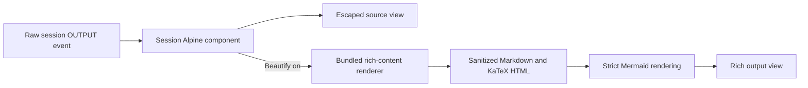

# Chief rich content rendering

**Branch:** `feat/868kdvye9-rich-content-rendering`
Status: **review**
**ClickUp:** https://app.clickup.com/t/868kdvye9
**ClickUp branch field:** `feat/868kdvye9-rich-content-rendering`

Follow the `clickup` skill for status/tag/Branch updates.

## Goal

Render agent `OUTPUT` event content as readable Markdown with Mermaid diagrams and
mathematical formulas on the session page. Users can switch immediately between
the rich view and the exact source Markdown.

The feature is complete when:

- ordinary Markdown in an `OUTPUT` event is rendered with useful session-page styling;
- fenced `mermaid` blocks render diagrams;
- `$...$` and `$$...$$` render inline and block formulas;
- a top-right **Beautify** control toggles all outputs between rich and source views;
- beautification defaults to on independently for every page load;
- malformed rich content degrades locally without interrupting the event stream; and
- untrusted model output cannot inject executable markup or unsafe links.

## Scope

Only agent `OUTPUT` events receive rich rendering. User `INPUT`, tool calls,
tool results, and failures keep the current escaped, literal `<pre>` display.
The setting is page-local: it is not stored in browser storage, the database, or
the session model.

This work does not change event persistence, SSE payloads, Django services,
models, or backend rendering. It does not support raw HTML embedded in Markdown,
additional TeX delimiters such as `\(...\)`, or rich rendering outside the
session event log.

## Chosen approach

Use a pinned, bundled browser renderer. The session already receives live raw
events over SSE, so client rendering handles replayed and newly arriving events
through one path without adding a rendering endpoint or splitting behavior
between Python and JavaScript.

The static package will use:

- `markdown-it` for Markdown parsing with raw HTML disabled;
- KaTeX integration for `$...$` and `$$...$$`;
- Mermaid for fenced `mermaid` blocks;
- DOMPurify for final HTML and SVG sanitization; and
- esbuild for split JavaScript, CSS, and KaTeX font assets delivered through
  Chief's external generated-assets lane.

A server-rendered approach was rejected because Mermaid would still require
browser work and live SSE events would need a second rendering path. A dedicated
rendering endpoint was rejected because it would add latency, requests, and
failure state for a presentation-only transformation.

## Architecture

The renderer is a focused static module under
`backend/apps/web/static/web/`. It accepts a target element and an untrusted
Markdown string; it owns parsing, sanitization, Mermaid hydration, link policy,
and local fallback behavior. The session Alpine component owns only page state
and invokes that narrow interface.

Renderer source, tests, package metadata, and the pnpm lock remain in Git.
Generated JavaScript, CSS, legal-attribution files, and fonts do not:
`js.rich-content-build` writes them to `/mnt/infra-assets/chief/js/gen`.
Compose mounts that directory read-only at
`/etc/storage/public/static/web/rich-content`, preserving browser URLs under
`/static/web/rich-content/` without copying vendor bundles into the repository
or Django's collectstatic output.

This delivery contract is **Compose-only**. Chief has no Kubernetes or hosted
static-image target in this feature. The future immutable static-image hosting
effort must build or copy these generated assets into its image without NFS and
must verify the hosted asset URLs as part of that separate implementation.
Cache-busting fixed entry filenames is deferred to that effort; current Compose
Nginx caching is limited to 300 seconds.

The build first emits into an isolated staging directory. It publishes hashed
dependencies with per-file atomic renames, publishes the fixed JS/CSS entries
last, and immediately removes obsolete fixed/root artifacts. Unreferenced files
under `assets/` remain available for 24 hours before garbage collection. This
retention exceeds the 300-second fixed-entry cache and normal session lifetime,
so existing pages can finish lazy-loading old split chunks. The build never
replaces `/mnt/infra-assets/chief/js/gen` itself because that directory is a
live Docker bind mount whose inode must remain stable.

Each output keeps two presentation branches:

1. A source `<pre>` populated with `x-text`, which is always safe and preserves
   the exact event content.
2. A rich-content container populated only through the renderer.

Non-output events retain the existing single source `<pre>`.

## Rendering pipeline and safety

For each rich output, the renderer:

1. Parses Markdown with embedded HTML disabled.
2. Converts formula syntax through KaTeX.
3. Replaces fenced Mermaid blocks with inert placeholders whose source is held
   as text, not executable markup.
4. Sanitizes generated HTML before insertion.
5. Applies a fail-closed Mermaid source preflight before `mermaid.render()`.
   Configuration/frontmatter, custom style/class/link/click directives, images,
   explicit or relative resource URLs, dangerous schemes, and CSS-escaped
   `url(...)` forms preserve source with a local failure status instead.
6. Renders accepted Mermaid placeholders with strict security and secure locks
   on theme, theme CSS/variables, font, HTML-label, and core security settings.
7. Sanitizes generated SVG before it becomes final page content.
8. Turns Markdown images into inert visible source text.
9. Accepts only explicit HTTP/HTTPS Markdown anchor destinations, then applies
   `target="_blank"` with `rel="noopener noreferrer"`.
10. Removes external-resource SVG elements, attributes, and CSS references while
   retaining only same-document fragments whose target IDs survived sanitization.

Model output is always untrusted. No path uses unsanitized `innerHTML`, permits
script-capable URLs, or enables Markdown raw HTML.

Rendering calls use a per-element generation token. If asynchronous Mermaid
work finishes after a newer render or state transition, the stale result is
discarded instead of overwriting current content.

## Beautify interaction

The event toolbar gains a **Beautify** button beside the existing **Follow**
button in the top-right of the event panel.

- It starts active on every session-page load.
- It exposes pressed/active state through `aria-pressed`, visible styling, and
  text that remains understandable without color.
- Turning it off immediately shows source `<pre>` elements for every output.
- Turning it on renders existing outputs and applies rich rendering to future
  SSE outputs.
- The control does not alter event data, follow/scroll state, or SSE state.

No preference is persisted. Reloading or navigating to another session restores
the default-on state.

## Styling

Rich output uses the existing dark session theme and remains contained within
its event card. Styles cover headings, paragraphs, lists, blockquotes, links,
inline and fenced code, tables, horizontal rules, KaTeX overflow, and responsive
Mermaid SVGs.

Source mode retains the current monospace, whitespace-preserving appearance.
Wide code, formulas, tables, and diagrams scroll inside the event card rather
than expanding the overall page width.

## Failure handling

Rich rendering is isolated per output event.

- Invalid Markdown falls back to escaped source.
- Invalid formula or Mermaid blocks preserve their source and show a compact
  local rendering-failure indicator.
- A failed diagram does not prevent surrounding Markdown or other events from
  rendering.
- Renderer failures do not escape into the SSE listener or stop later events.
- Source mode remains available regardless of rich-rendering failures.

The browser does not send rendering failures back to Django and does not include
untrusted source in console logging.

## Testing

JavaScript unit tests cover:

- ordinary Markdown and code-fence rendering;
- inline and block formulas;
- Mermaid placeholder extraction and successful hydration;
- pre-render rejection of configuration, style, navigation, image, URL, scheme,
  relative-resource, and CSS-escaped resource forms without invoking Mermaid;
- malformed formulas and diagrams;
- raw HTML rejection and sanitizer behavior;
- unsafe and safe external links;
- exact source fallback; and
- stale asynchronous render suppression.

A Vitest Browser Mode smoke uses the Playwright provider and package-managed
Chromium to build into an isolated temporary lane, load the actual split ESM
entry and dynamic Mermaid chunks, and exercise readiness, the lifecycle bridge,
Markdown, KaTeX, and a real Mermaid arrow marker. Its server-side probe records
all CSS/image resource requests, not only `fetch`/XHR, and verifies malicious
Mermaid samples make zero probe requests. `pnpm run test` runs unit tests and
this browser smoke, so `./olib/scripts/orunr js test-unit` cannot pass without
the integration. Clean hosts bootstrap browser binaries and system libraries
with `pnpm run setup:browser`; browser absence is a hard failure, never a skip.

Django web tests cover:

- bundled asset inclusion on the session page;
- rich rendering being routed only to `OUTPUT` events;
- literal rendering for all other event kinds;
- default-on, non-persisted Beautify state;
- accessible button state and placement beside Follow; and
- continued use of the existing SSE event contract.

Verification must run the repository-required Python and JavaScript test, lint,
and type-check commands. It must also run
`./olib/scripts/orun job js.rich-content-build`, confirm bundles and font
assets under `/mnt/infra-assets/chief/js/gen`, and verify Compose mounts that
generated lane read-only. Run the build twice and confirm the inode and fresh
inventory remain stable, recent stale hashed dependencies remain available, and
artificially aged dependencies beyond 24 hours are removed.

## Acceptance criteria

1. A live or replayed agent output containing headings, lists, code, a Mermaid
   fence, and both formula forms renders correctly without a page reload.
2. Beautify is on at initial load; toggling it off reveals exact source for all
   outputs, and toggling it back on restores rich views.
3. Reloading the page resets Beautify to on.
4. INPUT, tool, and failure events remain escaped literal content.
5. Raw HTML, script URLs, event attributes, and unsafe generated SVG cannot
   execute or navigate.
6. One malformed formula or diagram displays a local fallback while later SSE
   events continue to appear.
7. Existing follow scrolling, session controls, cost display, and SSE reconnect
   behavior continue to work.
