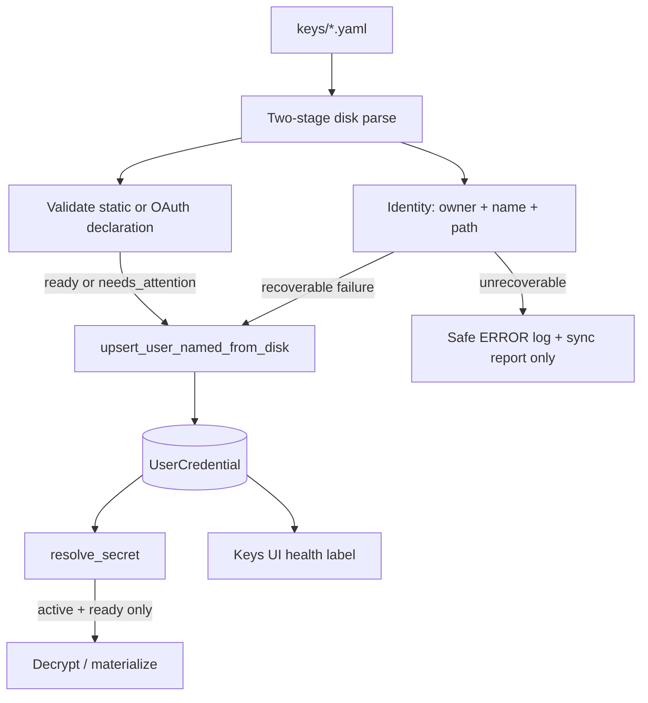

# Credential disk health — Design

**Branch:** `feat/2026-07-19-credential-disk-health`
Status: **review**

Architecture reference: [`docs/ARCHITECTURE.md`](../../ARCHITECTURE.md) ·
Key management:
[`docs/specs/2026-07-03-key-management/`](../2026-07-03-key-management/2026-07-03-key-management-design.md) ·
Local disk providers:
[`docs/specs/2026-07-09-local-disk-providers/`](../2026-07-09-local-disk-providers/2026-07-09-local-disk-providers-design.md) ·
Google OAuth:
[`docs/specs/2026-07-18-google-oauth/`](../2026-07-18-google-oauth/2026-07-18-google-oauth-design.md)

---

## Goal

Stop treating recoverable disk-credential problems as silent log noise. When a
`.local/keys/*.yaml` file can be identified (owner + name), Chief must load a
credential row even if the declaration is not yet usable, and expose a durable
machine-readable health issue in the database and Keys UI.

Valid OAuth declarations remain canonical YAML via `source: oauth` + `scopes`.
`auth_kind` is **not** a disk YAML field and is never accepted, aliased, or
inferred from disk files.

### Success criteria

- Recoverable invalid disk declarations create/update a `UserCredential` row with
  `health_status=needs_attention` and a stable `health_code`.
- Valid static credentials with an explicitly empty `value` load with
  `health_code=value_empty`.
- Valid OAuth declarations without a grant load with
  `health_code=oauth_not_connected`; connecting clears health to `ready`.
- Runtime resolution requires lifecycle `active` **and** health `ready`.
- Routine recoverable validation failures do not emit ERROR logs; unrecoverable
  file/identity failures still log safely without secret material.
- Keys UI shows actionable health labels (e.g. "Value empty", "OAuth not
  connected", "Invalid declaration").

### Non-goals

- Accepting `auth_kind` in disk YAML (UI form field remains unrelated).
- Persisting malformed YAML that cannot establish a row identity.
- A separate file-status table for every path under `keys/`.
- Auto-fixing operator YAML (e.g. rewriting `type: gmail` → `google`).
- Changing OAuth application setup or consent flow beyond health field updates.

---

## Current state

Disk sync (`apps.keys.services.disk_sync.sync_key_path`) parses a file, validates
type/owner/auth, and on any `ValueError` / YAML / validation failure logs:

```text
Credential file sync failed for keys/….yaml (ValueError)
```

and returns a failed sync item **without writing a row**.

Observed local OAuth stubs illustrate the gap:

```yaml
name: google-loelabs
type: gmail
owner: admin
source: oauth
```

Missing `scopes` fails the disk parser’s field-set check (`ValueError`). Even a
valid OAuth declaration today becomes an `ACTIVE` row with empty ciphertext and
no durable “not connected” health signal beyond UI inference from `is_set`.

`UserCredential.status` is only `active` / `disabled` (soft-delete when the file
disappears). That lifecycle flag must not absorb declaration health.

---

## Architecture



**Approach:** keep lifecycle `status` separate from **health fields**. Disk ingest
becomes two-stage: extract identity first; validate credential usability second.
Recoverable failures still upsert when owner and name resolve.

---

## Data model

### Lifecycle (unchanged meaning)

| `status` | Meaning |
|----------|---------|
| `active` | Disk file currently present (or DB-owned row) |
| `disabled` | Disk file missing; soft-disabled by sync |

### Health (new)

| Field | Type | Notes |
|-------|------|-------|
| `health_status` | `CharField` choices | `ready` \| `needs_attention` |
| `health_code` | `CharField` nullable/blank | Stable machine code when not ready; empty when ready |

**Codes (v1):**

| Code | When |
|------|------|
| `value_empty` | Static declaration accepted; secret string empty after normalize |
| `oauth_not_connected` | Valid OAuth declaration; encrypted grant empty |
| `invalid_declaration` | Identity known; YAML shape/fields invalid (including unknown keys such as `auth_kind`, missing `scopes`, bad capability lists) |
| `unknown_type` | Identity known; `type` not in registry (or retired aliases such as `gmail` that today only emit rename guidance) |

Default for new healthy rows: `health_status=ready`, `health_code=''`.

DB-owned create paths (`upsert_user_named`, `create_user_oauth`) set health
consistently: static non-empty → `ready`; OAuth unconnected →
`needs_attention` / `oauth_not_connected`.

### Metadata

Extend `KeyMetadata` with `health_status` and `health_code` (no plaintext). UI maps
codes to labels; never shows raw exception text from parsers.

---

## Disk YAML contract

Canonical forms remain as documented in `docs/docs/agents.md`:

- **Static:** `name?`, `type`, `owner`, `value` (key required; string may be empty).
- **OAuth:** `name?`, `type`, `owner`, `source: oauth`, `scopes: [capability ids…]`.

`auth_kind` is **not** part of the disk schema. Any presence of `auth_kind` (or other
extra keys) makes the declaration invalid. If owner + name can still be resolved,
sync persists `invalid_declaration` rather than inventing OAuth/static semantics
from `auth_kind`.

Do **not** add an `auth_kind` compatibility alias.

---

## Ingest behavior

### Recoverable (persist row)

Preconditions: YAML is a mapping; `owner` resolves to a user; credential `name`
validates (filename stem fallback allowed as today).

| Outcome | `status` | Health | Secret / auth_config |
|---------|----------|--------|----------------------|
| Valid static, non-empty value | `active` | `ready` | Encrypt value; clear auth_config |
| Valid static, empty value | `active` | `value_empty` | Encrypt empty; clear auth_config |
| Valid OAuth, grant empty / new | `active` | `oauth_not_connected` | Empty ciphertext; normalized auth_config |
| Valid OAuth, grant retained (semantic match) | `active` | `ready` if grant set else `oauth_not_connected` | Preserve grant when semantics match (existing rule) |
| Invalid fields / unknown type / bad scopes | `active` | matching code | Do **not** store raw invalid secret text; do not clear a prior grant unless ownership-relevant semantics change under existing OAuth rules — for `invalid_declaration` / `unknown_type`, keep previous ciphertext when the row already existed, but resolution still blocked by health |

Conflict with an existing **DB-owned** row of the same name remains a hard sync
failure (no overwrite), same as today.

Duplicate identity across two disk files: first wins; later files remain
report-only failures (no second row).

### Unrecoverable (report + safe ERROR log only)

- Non-mapping / unparseable YAML
- Missing or unresolvable owner
- Invalid credential name
- Duplicate identity for a later file
- IO / Unicode failures reading the file

These do not create rows. Logs continue to omit secret material (exception type /
safe detail only).

### Logging policy

| Class | Log level |
|-------|-----------|
| Recoverable validation → row written with health | No ERROR (optional debug/info without values) |
| Unrecoverable identity/file failure | ERROR, safe message as today |

---

## Runtime resolution

`resolve_secret` (and OAuth authorize/disconnect helpers that require a usable
declaration) must require:

1. `status == active`
2. `health_status == ready`

Otherwise raise the existing typed errors (`KeyNotFoundError` / validation errors)
with messages that do not leak secrets. Unconnected OAuth already raises
`credential not connected`; keep that behavior aligned with
`oauth_not_connected` health.

OAuth **connect** success: set health to `ready` when grant ciphertext is non-empty.
OAuth **disconnect**: set `needs_attention` / `oauth_not_connected`.

Authorize start requires a structurally valid OAuth declaration. Rows with
`invalid_declaration` / `unknown_type` must not start consent; UI should hide or
disable Authenticate for those codes.

---

## UI

Keys table Status column priority:

1. `status == disabled` → "Disabled"
2. Else if `health_status == needs_attention` → label from `health_code`
3. Else existing oauth Connected / Not connected or Set / Not set (Not connected
   should not appear when health already shows `oauth_not_connected` — prefer the
   health label as the single source)

Suggested labels:

| Code | Label |
|------|-------|
| `value_empty` | Value empty |
| `oauth_not_connected` | OAuth not connected |
| `invalid_declaration` | Invalid declaration |
| `unknown_type` | Unknown type |

Disk-sourced invalid rows remain read-only (edit YAML on disk).

---

## Testing

| Area | Coverage |
|------|----------|
| Disk parse / sync | Empty static value → `value_empty`; valid oauth without grant → `oauth_not_connected`; missing scopes / extra `auth_kind` with resolvable owner → row + `invalid_declaration`; unknown type → `unknown_type`; unparseable YAML → no row + ERROR |
| Grant retention | Semantic oauth match still preserves grant and sets `ready` |
| Recovery | Fixing YAML on next scan clears health to `ready` / appropriate code |
| Resolve | `needs_attention` rows are not resolvable even if ciphertext remains |
| OAuth connect/disconnect | Updates health fields |
| UI | Partial shows health labels; no secret leakage in logs/tests |
| Logging | Recoverable path does not call ERROR logger |

Follow parproc naming rules (avoid “error” / “exception” in test names).

---

## Docs

Update `docs/docs/agents.md` (and ARCHITECTURE credentials note if needed) to
describe health codes and that invalid-but-identified disk keys appear in the UI
as needs-attention rather than vanishing into worker logs. Keep OAuth YAML as
`source: oauth` only.

---

## Acceptance criteria

1. A disk file with resolvable owner/name that fails credential validation still
   produces an `active` row with `health_status=needs_attention` and a stable code.
2. Empty static `value` loads as `value_empty` and is not resolvable.
3. Valid oauth without grant loads as `oauth_not_connected`; Connect → `ready`;
   Disconnect → `oauth_not_connected`.
4. `auth_kind` in disk YAML is never treated as valid OAuth/static syntax.
5. Recoverable validation no longer floods worker ERROR logs.
6. Missing disk files still soft-disable via lifecycle `status` only.
7. `./olib/scripts/orunr py test-all` passes.

---

## Summary of decisions

| Question | Decision |
|----------|----------|
| Canonical OAuth YAML | `source: oauth` + `scopes` only |
| Disk `auth_kind` | Unsupported; never aliased |
| Status vs health | Lifecycle `status` unchanged; add `health_status` + `health_code` |
| Persist scope | Recoverable when owner+name known |
| Empty static value | Persist with `value_empty` |
| Unconnected oauth | Persist with `oauth_not_connected` |
| Resolution gate | `active` + `ready` |
| Logging | No ERROR for recoverable health writes |
)
