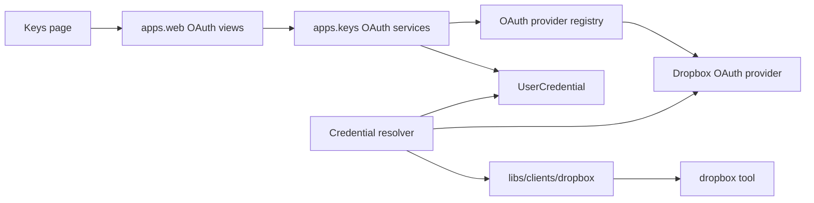
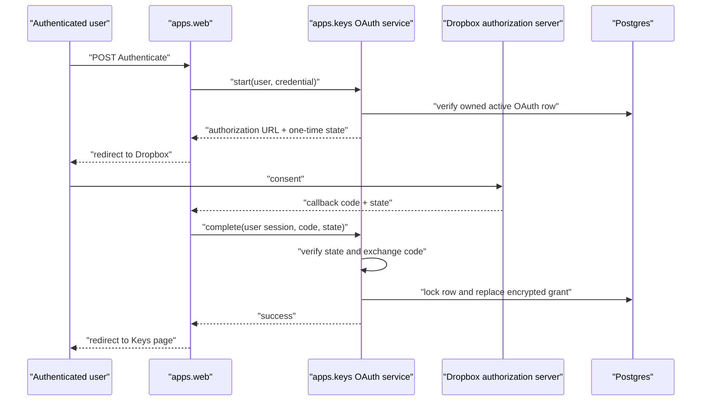

# Dropbox OAuth credentials — Design

**Branch:** `feat/2026-07-19-dropbox-oauth`
Status: **review**

Architecture reference: [`docs/ARCHITECTURE.md`](../../ARCHITECTURE.md) ·
Credential storage:
[`docs/specs/2026-07-03-key-management/`](../2026-07-03-key-management/2026-07-03-key-management-design.md) ·
Google OAuth framework:
[`docs/specs/2026-07-18-google-oauth/`](../2026-07-18-google-oauth/2026-07-18-google-oauth-design.md) ·
Dropbox tool:
[`docs/specs/2026-07-18-cloud-file-integrations/`](../2026-07-18-cloud-file-integrations/2026-07-18-cloud-file-integrations-design.md)

---

## Goal

Allow a user-owned `dropbox` credential to use either:

1. the existing static JSON (`app_key`, `app_secret`, `refresh_token`); or
2. a Dropbox OAuth grant created through Chief.

Agent integrations continue to reference the credential by name. The Dropbox tool and
client select the correct authentication mechanism from that credential without exposing a
different tool, integration, or credential type.

OAuth credentials can be declared on the Keys page or in `.local/keys/*.yaml`. This feature
registers Dropbox as a second provider in the existing OAuth provider framework (Google
already ships).

### Success criteria

- A user can create a Dropbox OAuth credential, select its metadata capability, complete
  consent, and use it with the Dropbox metadata tool.
- Reauthentication atomically replaces the current grant only after a successful callback.
- A disk declaration owns credential identity and configuration while its encrypted OAuth
  grant remains in Postgres.
- Existing static Dropbox JSON credentials continue to work unchanged.
- Human-facing metadata, logs, URLs, and provider failures never disclose refresh tokens,
  OAuth app secrets, authorization codes, or static credential JSON.

### Non-goals

- New Dropbox tool operations (content read, upload, sharing, mutations).
- Scopes beyond `files.metadata.read` (content or write scopes may be reserved later).
- OAuth for `SystemCredential`; OAuth grants remain user-owned.
- Multiple grants or grant history for one credential.
- Arbitrary provider scope strings from forms or disk YAML.
- Background token-health checks or automatic consent renewal.
- Persisting short-lived access tokens after an operation.
- Replacing the existing deployment secret system.
- ClickUp ticket bookkeeping for this design (deferred by product request).

---

## Current state

The OAuth provider registry, authorization lifecycle services, Keys UI connect/disconnect
controls, disk `source: oauth` parsing, and signed callback state already exist for Google.

`dropbox` credentials today are static JSON with app key, app secret, and offline refresh
token. Operators provision the refresh token outside Chief. The Dropbox client builds the
official SDK from that JSON per operation. Docs describe the manual OAuth code exchange
and state that Dropbox does not use a Chief callback URL.

---

## Architecture



### Component boundaries

| Component | Responsibility |
|-----------|----------------|
| `apps.keys.oauth.providers.dropbox` | Dropbox endpoints, capability catalog, code exchange, grant validation, app-secret lookup |
| `apps.keys.oauth` registry/services | Existing provider-neutral lifecycle; register Dropbox beside Google |
| `apps.keys.services` | Credential creation/reconciliation/resolution and metadata-only queries |
| `apps.web` | Authenticated HTTP parsing, Dropbox callback route, redirects, messages, templates |
| `libs/clients/dropbox` | Accept static JSON or Chief OAuth runtime envelope; build SDK per operation |

`apps.web` never imports decrypt/resolve functions. OAuth provider code remains in
`apps.keys`. The Dropbox client stays Django-free and never imports `apps.*`.

---

## Credential model

No new `UserCredential` fields. Reuse `auth_kind` and `auth_config`:

| Kind | `encrypted_value` |
|------|-------------------|
| static | Existing opaque JSON with `app_key`, `app_secret`, `refresh_token` |
| OAuth connected | Versioned encrypted grant: refresh token and granted scopes only |
| OAuth unconnected | Empty bytes |

OAuth application credentials are never copied into every user row. The runtime resolver
combines the encrypted grant with deployment app credentials only in the immediate
resolve-to-use call stack.

`KeyMetadata` already exposes `auth_kind` and capabilities. Connected means encrypted
grant material exists — not a live provider-health claim.

---

## Dropbox capabilities

| Capability ID | UI label and description | Dropbox scope | Chief support |
|---------------|--------------------------|---------------|---------------|
| `files_metadata` | **Read Dropbox metadata** — list/search file and folder names and metadata without downloading content. | `files.metadata.read` | Current Dropbox tool (`list_roots`, `list_folder`, `get_metadata`, `search`) |

At least one capability is required. Dropbox’s API assigns `files.metadata.read` to both
folder listing and search, so this single capability covers the entire metadata tool.

Capability IDs are stored in `auth_config`; the refresh grant remains encrypted. Changing
capabilities clears the grant and requires consent again.

Future content or write scopes may be added later as catalog entries marked `future`; they
are out of scope for this feature.

---

## Keys page

For credential type `dropbox`, the add form offers:

- **Static JSON** — existing secret textarea behavior; or
- **OAuth** — capability checkbox with provider-supplied label/description/support status;
  no secret textarea.

Saving OAuth creates an unconnected `UserCredential`. Each OAuth row provides Authenticate,
Reauthenticate, and Disconnect using the existing provider-neutral routes. Reauthentication
preserves the old grant until a new callback succeeds. Disconnect clears only
`encrypted_value`.

Disk-owned OAuth rows keep declaration metadata read-only; grant lifecycle buttons remain
allowed.

---

## Local OAuth declarations

```yaml
name: team-dropbox
type: dropbox
owner: user@example.com
source: oauth
scopes:
  - files_metadata
```

`source: oauth` is distinct from `CredentialSource.DISK` provenance. `scopes` holds
capability IDs from the Dropbox provider catalog.

Reconciliation matches Google OAuth:

1. New declaration → active, disk-owned, unconnected OAuth row.
2. Same auth kind and capabilities → update revision/provenance; preserve grant.
3. Changed auth kind or capabilities → update metadata; clear grant.
4. Missing declaration → disabled under existing disk-sync rules.
5. Restored unchanged declaration → reactivate; preserve grant when semantics match.

Static declarations continue to require `value` (the three-field JSON).

---

## Authorization flow



### State and callback security

Reuse the existing Google OAuth security contract:

- Start is an authenticated, CSRF-protected POST.
- State is signed, short-lived, session-bound, and single-use.
- State identifies user, credential UUID, provider, nonce, and auth-config fingerprint.
- Callback verifies every binding before exchanging the code.
- Before writing, lock the credential row and recheck owner, active status, provider, auth
  kind, and config fingerprint.
- Codes, tokens, grants, and app secrets are never logged.
- Callback redirects are fixed internal routes.

Register the exact callback URL for each deployed origin:

```text
https://<origin>/settings/keys/oauth/dropbox/callback/
```

including the trailing slash. HTTPS is required outside local development. Production
ingress must omit the OAuth callback query string before Django, matching the Google
callback hardening already documented in `docs/ARCHITECTURE.md`.

Authorization URL requirements for Dropbox:

- `response_type=code`
- `token_access_type=offline` so a refresh token is returned
- `scope` expanded from selected capabilities (`files.metadata.read`)
- registered `redirect_uri` matching Chief’s fixed callback

---

## OAuth application credentials

Compose reads:

```dotenv
DROPBOX_OAUTH_APP_KEY=
DROPBOX_OAUTH_APP_SECRET=
```

from `.env.local` under the backend group. Configuration failure is reported only when a
user starts or completes Dropbox OAuth; deployments that omit Dropbox OAuth still start
normally.

Production stores both values in one structured secret:

```text
$KNOX/chief/oauth/dropbox
```

with keys:

- `app_key`
- `app_secret`

Deployment maps those keys to the two environment settings. Chief does not read Knox
directly.

One Dropbox API app serves all users for a deployment. Operators still choose Full Dropbox
versus App Folder access in the Dropbox App Console based on configured roots; that app
setting is not part of the per-user grant payload.

---

## Dropbox client behavior

The client’s credential builder recognizes:

- legacy static JSON with non-empty `app_key`, `app_secret`, and `refresh_token`; or
- Chief’s versioned operation-local OAuth envelope (for example
  `chief_dropbox_oauth: 1` plus app key/secret, refresh token, and scopes).

Static behavior remains unchanged. OAuth credentials use the consenting Dropbox user.
Optional `config.namespace_id` and required `config.roots` continue to apply after SDK
construction.

The SDK refreshes short-lived access tokens as needed during the operation. Chief does not
persist refreshed access tokens. Credential and SDK objects remain operation-local.

---

## Failure handling

| Situation | Behavior |
|-----------|----------|
| Dropbox app secret missing | Safe configuration failure when starting/completing OAuth |
| Unknown capability or empty set | Reject before creating/updating the credential |
| Consent denied or callback provider failure | Redirect with safe message; preserve old grant |
| State expired, replayed, or mismatched | Reject callback without exchanging/writing |
| Credential changed during consent | Fingerprint/row check fails; preserve current row |
| Dropbox omits refresh token or requested scope | Reject grant; preserve old grant |
| Grant revoked later | Dropbox auth failure; user can Reauthenticate |
| Static JSON selected | Existing static path remains unchanged |
| OAuth credential used without a grant | Typed missing-credential failure |
| Disk OAuth declaration removed | Existing disk-sync disabled state prevents resolution |

Messages and logs may include provider, credential name, and failure category. They exclude
codes, tokens, app secrets, raw provider bodies, and decrypted credential payloads.

---

## Testing

Verification gate: `./olib/scripts/orunr py test-all`.

| Area | Coverage |
|------|----------|
| Provider registry | Dropbox registered beside Google; unknown providers rejected |
| Dropbox provider | Capability expansion, offline auth URL, code exchange, scope validation, materialize |
| OAuth services | Start/complete/disconnect for Dropbox; atomic grant replacement |
| State security | Existing bindings apply with Dropbox provider id and callback path |
| Keys page | Static/OAuth choice for `dropbox`, capability UI, connect lifecycle, safe messages |
| Disk parser | Static vs OAuth forms for Dropbox; mutual exclusion; capability validation |
| Disk reconciliation | Preserve unchanged grant; clear on semantic change |
| Dropbox client | Static JSON and OAuth envelope both build the SDK; secrets cleared on failure |
| Dropbox tool | Named `dropbox` credential works for either auth kind |
| Secret handling | No token/app secret in metadata, HTML, logs, URLs, or failures |
| Regression | Google OAuth, static Dropbox, cloud-files browser example remain green |

Dropbox authorization and API requests are stubbed at provider/client boundaries. Tests
never contact Dropbox.

Follow parproc naming rules: avoid highlighted failure-related words in test names.

---

## Implementation stages

1. **Dropbox OAuth provider** — capability catalog, settings, registry registration, unit
   tests.
2. **Authorization UI** — Dropbox callback route, Keys page static/OAuth mode for
   `dropbox`, connect lifecycle wiring, tests.
3. **Disk declarations** — Dropbox OAuth YAML accepted by parser/reconciliation with grant
   preserve/clear semantics.
4. **Client dual auth** — recognize static JSON and operation-local OAuth envelope.
5. **Configuration and docs** — `.env.local.example`, Knox contract, `oauth-apps.md`,
   `ARCHITECTURE.md`, credential guides/examples.
6. **Regression verification** — full Python checks and secret-leak assertions.

No feature branch is created during design. Implementation starts from the branch declared
at the top of this document.

---

## Acceptance criteria

1. Existing static Dropbox credentials continue to resolve and power the metadata tool.
2. The Keys page can create a Dropbox OAuth credential with the `files_metadata` capability.
3. Authenticate and Reauthenticate use short-lived, session-bound, one-time state.
4. A successful Dropbox callback stores the refresh grant encrypted; an unsuccessful
   callback preserves the previous grant.
5. Disconnect clears the grant while retaining the credential declaration.
6. A `.local/keys` Dropbox OAuth declaration stores no grant on disk and preserves its
   Postgres grant across non-semantic file changes.
7. Capability/auth-kind changes clear the old grant and require consent again.
8. The Dropbox tool accepts either a static or OAuth-backed `dropbox` credential by the
   same reference name.
9. Dropbox OAuth scopes come only from the provider-defined `files_metadata` capability
   (`files.metadata.read`).
10. Compose uses `.env.local`; production uses the structured
    `$KNOX/chief/oauth/dropbox` secret with `app_key` and `app_secret` keys.
11. No human-facing or logged surface exposes credential values, grants, codes, access
    tokens, refresh tokens, or OAuth app secrets.
12. `./olib/scripts/orunr py test-all` passes.

---

## Decisions

| Question | Decision |
|----------|----------|
| User-visible credential type | Keep one `dropbox` type |
| Auth mechanisms | Existing static JSON plus user OAuth |
| Model shape | Reuse `auth_kind` and `auth_config`; no new fields |
| Grant storage | Encrypted value on the same credential row |
| Genericity | Existing provider registry; add Dropbox plugin |
| Scope selection | Single capability `files_metadata` → `files.metadata.read` |
| Listing and search | Covered by `files.metadata.read` |
| Reauthentication | Replace atomically after successful consent |
| Disk OAuth | YAML owns definition; encrypted Postgres row owns grant |
| App secret in Compose | `DROPBOX_OAUTH_APP_KEY` / `DROPBOX_OAUTH_APP_SECRET` in `.env.local` |
| App secret in production | One `$KNOX/chief/oauth/dropbox` structured secret |
| Access tokens | Refresh per operation; do not persist |
| ClickUp | Deferred for this design |
