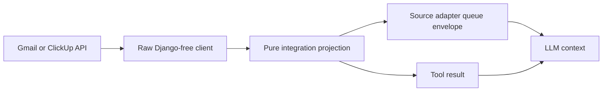

# Compact Integration Records — Design

Epic: [Agent Context and Activity Clarity](../../epics/2026-07-26-agent-context-activity-clarity.md) · Spec **1 of 3** · Item: **Compact integration records**

**Branch:** `feat/2026-07-26-compact-integration-records`

Status: **review**

## Goal

Give LLMs compact, decoded, semantically useful Gmail and ClickUp records
instead of verbose provider-native responses. The same stable projection must
serve source/queue payloads and tool results so an agent sees consistent fields
regardless of how it obtained a resource.

The feature is complete when:

- Gmail message content and encoded headers are decoded into readable text;
- Gmail retains normalized delivery-authentication and address-alignment
  signals useful for identifying phishing or fraud;
- ClickUp retains task content, people, planning metadata, relationships,
  attachments, bounded subtasks, and bounded recent comments;
- provider bookkeeping is absent from every LLM-facing read result;
- mutation results are compact acknowledgements; and
- every truncation or optional-section failure is explicit.

## Scope

Normalization applies to:

- Gmail and ClickUp source-adapter queue payloads;
- read and list functions exposed by the Gmail and ClickUp tools; and
- successful mutation results, which become compact acknowledgements.

Low-level clients continue returning provider-native dictionaries internally.
No raw-result option or diagnostic raw tool is added. This spec does not change
credential handling, queue deduplication, tool permissions, or UI rendering.

## Architecture

Each integration gains pure, Django-free projection helpers alongside its
client package. Clients own transport, authentication, pagination, and provider
failure mapping. Projections own decoding, field selection, normalization,
limits, and advisories. Source adapters and tools call the same projections.

Projection outputs are ordinary JSON-compatible dictionaries with stable field
names. Provider response shape changes therefore stop at the projection
boundary. Shared structures such as people, attachments, truncation metadata,
and advisories use small typed helpers rather than ad hoc filtering at each
call site.

## Gmail projection

### Message shape

A normalized full message contains:

- stable message and thread IDs;
- label IDs;
- decoded `From`, `To`, `Cc`, `Reply-To`, `Return-Path`, `Subject`,
  `Message-ID`, and date values where present;
- a normalized received timestamp when Gmail supplies one;
- decoded body text and its source form (`plain` or `html_to_text`);
- lightweight attachment entries: attachment ID, filename, media type, and
  byte size; and
- normalized authentication and address-alignment signals.

The body is limited to **32,000 characters**. Truncation preserves the prefix
and adds structured metadata containing `truncated: true`, omitted character
count when known, and the message reference needed to fetch again. Attachment
lists are limited to **25** entries with included/total/omitted counts.

Metadata/list projections use the same field names but omit unavailable body
content rather than inventing empty content.

### MIME and header decoding

The decoder:

1. decodes RFC 2047 encoded-word headers;
2. traverses multipart MIME structure without returning the provider payload
   tree;
3. handles Gmail base64url/base64 and quoted-printable transfer encodings;
4. decodes declared character sets with a safe replacement fallback;
5. prefers a non-attachment `text/plain` part;
6. otherwise converts a non-attachment `text/html` part to readable text;
7. avoids duplicating multipart-alternative representations; and
8. records a compact advisory for malformed or unsupported parts while
   preserving other readable content.

HTML conversion extracts text only. It does not expose markup, scripts, remote
resources, tracking pixels, or executable URLs to the LLM.

### Authentication signals

The projection parses relevant Gmail headers into normalized signals:

- SPF verdict and authenticated/envelope domain;
- DKIM verdicts and signing domains;
- DMARC verdict, policy, and evaluated header-from domain;
- ARC chain verdict where available; and
- normalized From, Reply-To, and Return-Path domain alignment indicators.

Verdicts retain provider terms such as `pass`, `fail`, `softfail`, `neutral`,
`temperror`, `permerror`, or `unknown`. Missing/malformed evidence is
`unknown`, not `pass`. The projection reports evidence; it does not label a
message as phishing, fraudulent, or safe.

Raw `Authentication-Results`, `Received-SPF`, ARC header blocks, full
`Received` chains, generic headers, raw MIME trees, encoded body data,
`historyId`, size estimates, and provider bookkeeping are excluded.

### Other Gmail functions

- Message search remains a compact page of message IDs and next-page token.
- Label listing returns only stable ID, display name, and provider label type
  when useful.
- Attachment fetch keeps decoded content only because the caller explicitly
  requested that attachment; it never returns the provider's encoded data.
- Label/archive/spam/trash/send mutations return success, message ID, and only
  the resulting labels or provider reference needed by the caller.

## ClickUp projection

### Task shape

A normalized full task contains:

- stable task ID and custom ID when present;
- name, text/Markdown description, status, URL, and compact list/folder/space
  location;
- creator, assignees, watchers, and mentioned users represented by stable ID,
  display name, and email when supplied;
- priority, tags, start/due dates, time estimate, points, and custom fields;
- parent reference, dependencies, linked-task summaries, and checklist
  summaries;
- attachment metadata and links;
- bounded subtask summaries; and
- bounded recent comments.

Custom fields contain stable field ID, display name, field type, and normalized
value. Provider rendering configuration and unrelated option metadata are
discarded.

The ClickUp client requests subtasks for full task reads and gains the bounded
comment-list operation required by the projection. These remain raw client
operations; the tool returns only their combined normalized projection.

### Bounds

- Primary task description/text: **32,000 characters**.
- Recent comments: newest **10**, each limited to **4,000 characters**.
- Subtasks: **25**, each summarized as ID, custom ID, name, status, assignees,
  priority, due date, and URL.
- Attachments: **25**, each containing filename, media type, byte size,
  uploader, creation time, and provider view/download URL where supplied.

All bounded collections include included and total counts when ClickUp exposes
the total, plus `truncated` and `omitted_count`. A result never silently
pretends that the included subset is complete.

### Lists and mutations

Task-list results use a smaller summary shape with ID/custom ID, name, status,
assignees, priority, due date, URL, and update timestamp. Space and list results
retain identifiers, names, archived state, and the minimum parent reference
needed for navigation.

Create/update/comment/delete mutations return success, affected task ID, URL
when available, and relevant resulting state. They do not echo full task,
workspace, or user objects.

### Excluded ClickUp fields

The projection excludes colors, legacy/order indexes, avatars and profile
presentation internals, permission objects, duplicated hierarchy objects,
custom-field `type_config`, provider feature flags, workspace settings, and
transport bookkeeping. Stable IDs needed for later tool calls remain.

## Source and tool consistency

Source payloads keep the existing `{data, ref}` envelope. `data` uses the
integration's normalized summary shape; `ref` remains the stable fetch hint.
Full read tools return the normalized full shape. Summary fields have identical
names and semantics in both paths.

Source polling does not perform expensive follow-up requests for comments or
full bodies. It projects fields already available from the provider's listing
or metadata response. Agents use the stable reference with `read`/`get_task`
when full content is required.

## Failure handling

- Primary authentication, transport, and not-found failures retain the existing
  `{ok: false, error: {kind, message}}` envelope.
- A malformed Gmail part produces replacement text or a local advisory without
  discarding successfully decoded parts.
- Unsupported content that cannot be represented safely is omitted with an
  advisory.
- If optional ClickUp comment retrieval fails after the task succeeds, the task
  is returned with a comments advisory rather than converted into total
  failure.
- Invalid provider field types are ignored or represented as `unknown`; raw
  values are not leaked as a fallback.
- Projection failures never include credentials, authorization headers, or
  private provider exception bodies.

## Testing

Gmail fixtures cover plain text, HTML-only, multipart alternative, nested
multipart, attachments, RFC 2047 headers, multiple character sets, base64url,
quoted-printable, malformed payloads, and body/attachment bounds. Security
fixtures cover SPF, DKIM, DMARC, ARC, multiple signatures, domain alignment,
missing evidence, and malformed headers.

ClickUp fixtures cover full and partial tasks, every retained field group,
simplified custom fields, parent/subtask/dependency/link/checklist relations,
attachment metadata, comment ordering, optional comment failure, and all
bounds.

Contract tests run the same provider fixtures through source and tool paths and
assert common summary fields. Allowlist tests assert that known noisy provider
fields never reach LLM-facing results. Mutation tests assert compact
acknowledgements.

Repository-required Python checks run after implementation. Agent schema and
operator documentation are updated only if implementation introduces new
tool/source configuration fields; this design requires no new configuration.

## Acceptance criteria

1. A MIME-encoded Gmail message is returned as readable text without encoded
   payload data or raw MIME structure.
2. Gmail results preserve normalized SPF, DKIM, DMARC, ARC, and address
   alignment evidence without making a safety verdict.
3. A ClickUp full-task result includes all selected content, people, planning,
   relationship, attachment, subtask, and comment information in the bounded
   normalized shape.
4. Source and tool summary fields use the same names and semantics.
5. Oversized text and collections report truncation and omitted counts.
6. Optional-section failures are explicit and do not discard the primary
   resource.
7. Raw provider bookkeeping and excluded fields do not appear in LLM context.
8. Mutations return compact acknowledgements rather than full provider
   responses.
