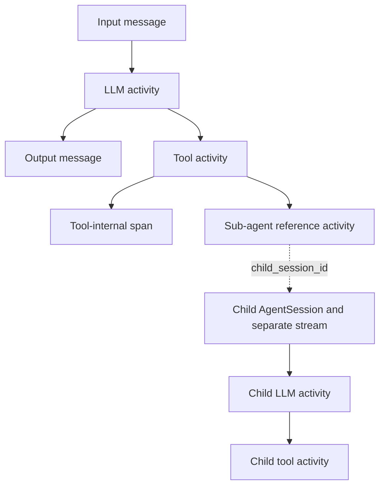

# Hierarchical Session Activities — Design

Epic: [Agent Context and Activity Clarity](../../epics/2026-07-26-agent-context-activity-clarity.md) · Spec **2 of 3** · Item: **Hierarchical session activities**

**Branch:** `feat/2026-07-26-hierarchical-session-activities`

Status: **review**

## Goal

Represent agent execution as a persisted tree of typed lifecycle activities
rather than a flat stream whose relationships must be inferred. Any activity
may own children. Tool calls, LLM calls, spans, and status notes can therefore
describe nested work, while sub-agent nodes refer to separately persisted child
sessions.

The feature is complete when:

- a tool call is one activity that transitions from running to a terminal
  state;
- LLM calls, tool calls, spans, status notes, and sub-agent references can nest
  under any activity;
- each sub-agent has its own session and activity stream;
- top-level sessions have no parent and sub-agent sessions point to their
  direct parent session;
- persistence and SSE support both activity creation and updates;
- provider message reconstruction retains current behavior; and
- existing flat session history is migrated into the new representation.

## Scope

This spec covers the session/activity data model, migration, runner recording,
tool-facing recording API, sub-agent session linkage, service boundaries,
stream protocol, provider-message reconstruction, usage aggregation, and
backend tests.

It does not add a particular user-facing sub-agent tool or redesign the session
page. The nested UI is spec 3. Integration-result normalization is spec 1.

## Data model

### AgentSession ancestry

`AgentSession` gains a nullable self-referential `parent_session` foreign key:

- a top-level session has `parent_session_id = null`;
- every sub-agent session points to its direct parent session;
- ancestry is immutable after session creation;
- parent and child sessions must belong to the same user;
- a child may run a different agent/config owned by that user; and
- creation services reject self-parenting and ancestry cycles.

The parent relation is indexed and exposed through a reverse child-session
query. Parent deletion follows the session lifecycle's existing cascade
semantics, so a deleted parent cannot leave an inaccessible orphan tree.
Having a parent is the canonical marker that a session is a sub-agent session;
no duplicate boolean flag is stored.

### AgentSessionActivity

The canonical persisted record becomes `AgentSessionActivity`, replacing the
flat `AgentSessionEvent` concept. It keeps the useful existing event fields and
adds explicit hierarchy and lifecycle data:

| Field | Purpose |
|-------|---------|
| `id` | Stable activity identity |
| `session_id` | Owning session and stream |
| `parent_id` | Nullable parent activity in the same session |
| `seq` | Immutable creation order within the session |
| `revision` | Monotonic revision for idempotent live updates |
| `kind` | Typed activity vocabulary |
| `status` | Lifecycle state |
| `name` | Stable machine-oriented operation name |
| `summary` | Curated one-line human detail |
| `details` | Kind-specific JSON with curated and raw-safe data |
| `model`, usage, cost, latency | Existing LLM/usage metadata |
| `started_at`, `ended_at`, `created_at` | Lifecycle timing |
| `child_session_id` | Nullable one-to-one child session for sub-agent nodes |

The existing `(session, seq)` uniqueness remains. Services validate that a
parent belongs to the same session; cross-session nesting occurs only through a
sub-agent activity's `child_session_id`. A child session may be referenced by
exactly one parent activity.

`revision` starts at one and increments atomically on each update. Terminal
activities are immutable except for narrowly defined reconciliation of their
linked child-session summary/status. Details must never contain credentials or
other values forbidden by the originating integration/tool contract.

### Kinds

The initial kinds are:

- `input` and `output` — conversational messages;
- `tool` — one external/internal tool invocation lifecycle;
- `llm` — one provider generation lifecycle;
- `span` — a named internal operation/container;
- `status` — a compact progress or note item;
- `subagent` — a reference to one child session;
- `failure` — a session-level failure; and
- `restart` — a session restart boundary.

The first four non-message activity types requested for instrumentation are
tool, LLM, span, and status. `subagent` is a reference/container required by
the session model. Existing failure and restart semantics remain explicit.
Kinds share the common envelope, so later kinds do not require another
hierarchy mechanism.

Lifecycle statuses are `pending`, `running`, `succeeded`, `failed`, and
`cancelled`. Immutable message/status/restart records are created directly in
their terminal state. A failure record uses `failed`.

## Tree and execution semantics

Any activity may own children. The caller establishes an activity scope, and
operations created within that scope inherit its activity ID as `parent_id`.
Children retain independent creation order and lifecycle.

The dotted boundary is intentional: the parent activity table does not contain
the child session's activity rows. Consumers load the referenced session
separately.

Tree structure is observational and must not alter provider conversation
semantics. Provider-message reconstruction orders LLM-visible input, output,
and tool activities by immutable `seq`, ignoring container-only LLM/span/status
records and tree indentation.

## Tool lifecycle

A tool invocation is recorded before execution:

1. Create and publish a `tool` activity with status `running`, qualified
   instance/function name, call ID, curated arguments, and start time.
2. Run the bound tool inside that activity scope so nested spans, LLM work,
   notes, or sub-agents automatically become children.
3. On success, atomically update the same activity with curated result,
   raw-safe result details, latency, end time, and `succeeded`.
4. On denied, unknown, or raised calls, update the same item to `failed` with
   the current uniform failure result.

There is no separate tool-result activity for new work. Message reconstruction
expands the unified record back into the provider's required assistant
tool-call plus tool-result messages.

## LLM lifecycle

Each provider collection is represented by an `llm` activity created before
the call and completed afterward with model, token usage, cost, latency, and
status. Generated output messages and requested tool activities are children
of that LLM activity. If a tool or future sub-agent implementation invokes
another LLM through the activity-aware API, that LLM activity nests beneath
the current tool/span without special cases.

Provider errors complete the LLM activity as failed before the existing
session failure activity is recorded. Output content remains in a distinct
`output` child so conversational reconstruction and rich-content rendering
stay direct.

## Instrumentation API

Runner/backend services expose a small activity recorder rather than allowing
tools or Django-free libraries to write ORM rows:

- start/complete/fail an activity;
- enter a scoped `span` or LLM/tool operation;
- emit a terminal status note; and
- link a newly created child session through a sub-agent activity.

`ToolContext` receives a recorder protocol implemented by the runner backend.
Django-free tools may use that protocol but do not import session models or
services. The in-memory backend implements the same contract for tests and
evals. A no-op recorder is available only where a tool is legitimately invoked
outside a session.

The API requires concise names and summaries. Raw arguments/results are
optional, secret-free details; the recorder never introspects arbitrary local
variables or exceptions.

## Sub-agent creation and linkage

The session start service accepts optional `parent_session_id` and
`parent_activity_id` inputs. For a sub-agent start it performs one atomic
operation that:

1. authorizes the parent session and selected child agent for the same user;
2. creates a `subagent` activity in the parent tree;
3. creates the child session with `parent_session_id` set;
4. assigns the child session to the activity's `child_session_id`; and
5. schedules the child through the existing runner dispatch boundary.

The parent activity stores display summary and child status, but never copies
the child's activities. Child status changes reconcile the parent reference
activity and publish a patch on the parent stream. This gives a collapsed
parent page live status without subscribing to the child until its node is
expanded.

If child startup fails before creation completes, the transaction leaves no
half-link. Runtime child failure remains part of the child stream and updates
the parent reference to failed. Deleting or losing authorization to a child is
handled as an unavailable reference by consumers rather than exposing data.

## Persistence services

Session services remain the public persistence boundary:

- queries return authorized session metadata, ordered activities, children,
  and parent breadcrumbs;
- commands create terminal records, start lifecycle records, atomically update
  lifecycle records, and create linked child sessions; and
- views, tasks, runner code, and tools do not mutate activity ORM rows directly.

Activity creation validates parent/session consistency. Lifecycle updates use
row locking or compare-and-update revision checks so duplicate task delivery
cannot regress a terminal state or overwrite a newer revision.

## Streaming protocol

The existing session-scoped SSE transport gains activity upsert envelopes.
Each envelope contains:

- operation (`upsert`);
- full current activity representation;
- activity ID, parent ID, session ID, sequence, and revision; and
- child session reference when applicable.

Create and update use the same idempotent operation. Clients keep the highest
revision seen per activity. Reconnect replay reads authoritative current rows
in creation order, so missed Redis notifications converge without a separate
event-history protocol.

Only the requested session's activities appear on its stream. Parent streams
receive status patches for their sub-agent reference nodes, not child
activities. Child streams retain the existing authenticated ownership checks.

## Historical migration

Django migration tooling generates the schema and data migration. The migration:

1. preserves each existing event ID, session, sequence, timestamps, payload,
   and usage fields where possible;
2. maps input/output/failure/restart rows to terminal activities;
3. groups `TOOL_CALL` and `TOOL_RESULT` rows by session and `call_id`;
4. keeps the tool-call row as the unified tool activity, moves result content
   and latency into its details, and removes the paired result row;
5. marks a paired legacy call succeeded unless its structured result is a
   failure;
6. preserves orphan tool calls as failed legacy activities with an advisory;
   and
7. preserves orphan results as legacy status activities rather than dropping
   unknown data.

Sequence gaps created by paired-result removal are valid; sequence values are
ordering keys, not counts. Historical records have no inferred parents unless
the old data contains an unambiguous relationship. The migration does not
invent LLM or span containers around flat history.

Compatibility re-export modules are not retained. Call sites move to the
canonical activity model/service paths in the same change.

## Rebuild, hooks, and aggregation

Provider-message rebuild treats unified tool activities as the old call/result
pair and otherwise preserves current input/output/failure/restart boundaries.
Container-only activity kinds do not become provider messages.

Runner hooks move from append-only event callbacks to activity-created and
activity-updated callbacks while preserving enough adapters for the existing
eval observability output within the implementation change. Hourly usage counts
terminal LLM activities for iterations and tool activities for tool-call
counts; costs and token totals are not double-counted from output children.

## Failure handling

- An invalid parent or cross-session parent is rejected before persistence.
- Revision conflicts retry or return the newer terminal state; they never
  regress it.
- Tool and LLM failures leave their lifecycle activity terminal and then
  follow existing session failure behavior.
- A broken child-session reference is represented as unavailable without
  reading another user's session.
- Stream publication remains an on-commit, best-effort hint; Postgres is
  authoritative.
- Recursive session ancestry is cycle-checked at creation even though normal
  immutable construction cannot produce a cycle.

## Testing

Model/service tests cover arbitrary parentage, same-session validation,
lifecycle transitions, revision idempotency, terminal immutability, sequence
ordering, and child-session uniqueness. Session-start tests cover root and
sub-agent ancestry, same-user authorization, transaction rollback, status
reconciliation, and cycle rejection.

Runner tests cover running/terminal tool patches, nested recorder scopes,
failed tools, LLM containers with output/tool children, message reconstruction,
usage aggregation, hooks, and in-memory/Django backend parity.

Migration tests begin from representative pre-migration rows and verify paired,
failed, and orphan tool records plus preservation of message/usage data. SSE
tests cover create/update revisions, reconnect replay, parent reference updates,
and strict separation of parent and child streams.

Repository-required Python checks run after implementation. Django migrations
are generated with the repository's Django tooling, never written manually.

## Acceptance criteria

1. Any activity can persist ordered children without placing them in another
   session.
2. A tool call appears as one record that streams running and terminal
   revisions.
3. LLM calls own their output/tool work and can themselves nest beneath a tool
   or span.
4. A sub-agent node stores only its child session reference and summary; the
   child activities exist solely in the child session.
5. Root sessions have null `parent_session_id`; child sessions point to their
   direct parent and expose a parent breadcrumb.
6. Parent streams receive reference-status updates but never child activity
   rows.
7. Provider reconstruction and usage totals remain correct.
8. Existing flat histories migrate without silently dropping orphan data.
9. Replayed and live upserts are idempotent by activity ID and revision.
