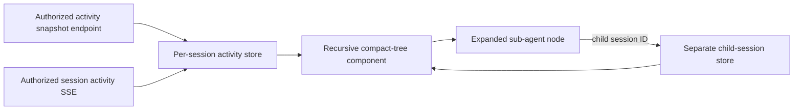

# Nested Activity UI — Design

Epic: [Agent Context and Activity Clarity](../../epics/2026-07-26-agent-context-activity-clarity.md) · Spec **3 of 3** · Item: **Nested activity UI**

**Branch:** `feat/2026-07-26-nested-activity-ui`

Status: **design**

## Goal

Present session execution as a compact recursive activity tree without
overwhelming users with arguments, provider payloads, or copied sub-agent
history. Tool calls and other execution items are concise when collapsed;
sub-agent streams load from their own sessions only when visualized.

The feature is complete when:

- session messages and nested execution relationships are easy to scan;
- tool, LLM, span, and completed sub-agent items start collapsed;
- running sub-agents expand and stream their own sessions live by default;
- every expanded sub-agent loads its child session rather than parent-embedded
  event data;
- arbitrary recursive sub-agents use the same component;
- curated details and optional raw JSON are available on demand; and
- replay, live patches, scrolling, rich output, accessibility, and responsive
  behavior remain reliable.

## Scope

This spec covers the session-page activity store, recursive Alpine component,
snapshot and SSE consumption, compact-tree markup/styles, expansion behavior,
sub-agent navigation, accessibility, failure states, and browser/Django tests.

It consumes the activity/session contracts from spec 2. It does not alter
activity persistence, add a sub-agent tool, normalize integration payloads, or
change rich-content parsing.

## Chosen layout

Use the approved **compact tree**:

- input and output messages remain visually prominent;
- child activities sit below their parent with compact rows, indentation, and
  connector lines;
- execution metadata stays on one scan-friendly line when possible; and
- expansion reveals details in place.

Messages are not forced into the same dense treatment as operations. Existing
rich rendering remains available for output content. The tree communicates
execution ownership without turning every activity into a large nested card.

## Architecture

The session page remains server-rendered Jinja with Alpine behavior. The
existing large inline session controller is split so a focused static
activity-tree module owns normalization, parent/child indexing, revisions,
expansion state, child-session loading, and subscription cleanup. The page
controller continues to own page lifecycle, follow scrolling, session metadata,
and chat controls.

Each loaded session has its own store keyed by session ID. A store contains
activities keyed by ID, highest revision per activity, ordered root IDs,
ordered child IDs, temporarily unresolved children, session status, and
subscription state. Child-session stores are never merged into the parent's
activity map.

## Data loading

### Root session

Initial page load obtains the authoritative root-session activity snapshot,
then opens the existing authenticated SSE channel for upserts and session
status changes. An upsert is applied only when its revision is newer than the
stored revision.

### Child sessions

A sub-agent activity exposes `child_session_id` and the current child status.
Expanding it:

1. authorizes and fetches that child's snapshot from a dedicated session
   activity query endpoint;
2. constructs a separate child store;
3. renders its roots beneath the sub-agent row; and
4. opens the child's SSE stream only while the child is non-terminal and the
   node remains expanded.

For a completed child, the snapshot is sufficient and no persistent stream is
opened. When a running child becomes terminal, the client applies the final
patch and closes its stream. Collapsing a running child closes the stream and
releases its rendered descendants. Reopening always refreshes the authoritative
snapshot before resuming live updates.

Recursive sub-agents follow exactly the same process. Parent streams supply
only the sub-agent reference's status revision; they never carry child
activities.

## Tree construction and updates

Activities are ordered by immutable sequence within each sibling group. An
upsert may create an activity or update an existing row in place. Expansion
state is keyed by activity ID and therefore survives status, summary, timing,
and result patches.

If a child arrives before its parent, the store keeps it in an unresolved
bucket keyed by `parent_id`. Arrival of the parent attaches and orders the
waiting children. A missing parent after authoritative snapshot completion
renders the item under a compact “unresolved activity” group rather than
hiding data or breaking the tree.

Changing a parent relation after creation is not supported by spec 2. If a
malformed patch attempts it, the client rejects the patch and refreshes that
session's snapshot.

## Row presentation

### Collapsed execution row

A collapsed tool, LLM, span, or status row shows:

- kind label/icon;
- stable operation name;
- backend-provided curated one-line summary;
- running, succeeded, failed, or cancelled state; and
- duration when available.

Examples:

- `TOOL · clickup.get_task · Task CU-184 · Succeeded · 420ms`
- `LLM · claude-sonnet · Succeeded · 1.2s`
- `SPAN · decode MIME message · Running`

The UI does not derive summaries by guessing which arbitrary argument keys are
important. Activity producers provide safe summaries under the spec 2
contract. Missing summaries simply omit that segment.

### Expanded details

Expansion shows kind-specific curated details first:

- tool arguments and result;
- LLM model, usage, cost, timing, and failure details;
- span/status metadata; or
- sub-agent identity, session status, and nested child tree.

A separate **Raw JSON** disclosure shows the activity's stored, raw-safe
details object formatted as JSON. It is collapsed independently and never
includes data that spec 2 prohibited from persistence. Large values remain
within a bounded, scrollable `<pre>`; the browser does not reinterpret them as
HTML.

### Sub-agent row

A sub-agent row shows child agent/session display name, curated purpose,
status, and duration. It always includes a normal link to the child's
standalone session page. Parent-session breadcrumbs on the child page link
back to its direct parent, allowing navigation in either direction without
requiring the nested view.

Unavailable, deleted, or unauthorized child sessions show a local “Child
session unavailable” state. The UI does not distinguish not-found from
unauthorized responses.

## Default expansion and user intent

On each page load:

- tool, LLM, span, status, and completed sub-agent activities start collapsed;
- running sub-agents start expanded; and
- input/output messages remain visible.

If a user manually collapses a running sub-agent, live parent-reference updates
do not reopen it. If a user manually expands an item, terminal status updates
do not collapse it. User intent lasts for the page lifetime only and is not
stored in local storage or Postgres.

New running sub-agents arriving live auto-expand unless an ancestor is
manually collapsed. Expanding that ancestor later reveals the child in its
default state.

## Deep nesting and responsive behavior

Each level uses a connector and modest indentation. Visual indentation is
capped after six levels; deeper rows retain connector styling and show a
compact depth marker so ancestry remains clear without shrinking content to an
unusable width. The logical DOM nesting remains complete.

On narrow screens, metadata wraps beneath the operation name, details scroll
within the event panel, and controls retain touch-sized targets. The whole page
does not gain horizontal overflow because of tree depth or raw JSON.

## Accessibility

Every expandable row uses a real button with:

- an accessible label naming the activity;
- `aria-expanded`;
- `aria-controls` referencing its detail/child container; and
- visible focus treatment.

Nested activities use semantic lists and headings where appropriate. The UI
does not claim ARIA `tree` semantics because rows contain interactive links,
disclosures, and rich message content that do not behave like a single-select
tree widget. Status is conveyed by text as well as color/icon.

Live changes do not move keyboard focus. Important terminal failure state is
available in row text; routine streaming updates do not create a noisy live
region.

## Follow, rich content, and totals

The existing Follow behavior responds to rendered height changes from
expansion and new activities. Manual expansion does not force Follow back on.
When Follow is active, live root or expanded-child additions keep the event
panel at the bottom.

Beautify continues to affect output message content only, including output
messages inside loaded child stores. Tool arguments/results, raw JSON, spans,
and status notes remain escaped literal content.

The page's existing model and total-cost header continues to describe the
current session only. Child-session costs remain visible inside the child
activity tree or on the child page and are not silently added to the parent's
total.

## Lifecycle and resource management

The page keeps at most one live subscription per expanded running session.
Repeated expansion reuses a currently healthy store but performs an
authoritative refresh after a prior close. Session IDs and activity IDs, not
DOM positions, key all state.

Subscriptions close on:

- manual collapse of their owning sub-agent;
- child transition to a terminal state;
- root page `pagehide`;
- Alpine component destruction; or
- local stream failure before a bounded reconnect.

BFCache restoration refreshes the root and each still-expanded child snapshot
before reconnecting. Reconnect backoff is bounded and scoped per session so one
broken child does not interrupt the parent or siblings.

## HTTP and authorization

The activity snapshot endpoint follows the existing view → service → model
boundary. It authenticates the request, verifies session ownership through a
service query, and returns session metadata plus current activity rows. The
SSE endpoint applies the same ownership rule independently for every child
session request.

Responses expose no child data through a parent authorization shortcut. Same
user ownership is enforced at creation by spec 2 and checked again at read
time.

## Failure handling

- Snapshot failure affects only the requested session subtree and offers a
  retry control.
- A child SSE failure leaves its last snapshot visible, marks live updates
  disconnected, and retries with bounded backoff while expanded.
- Malformed or stale upserts are ignored; structural inconsistencies trigger a
  session-scoped snapshot refresh.
- Failure to format raw JSON falls back to escaped string content.
- One unavailable recursive child never stops parent/sibling streams.
- Excessive nesting uses the depth treatment rather than recursion-dependent
  layout assumptions; rendering protects against accidental ancestry cycles
  with a visited-session/activity guard.

## Testing

JavaScript unit tests cover:

- snapshot indexing and ordered roots/children;
- create/update revision idempotency;
- unresolved-child buffering and recovery;
- expansion state across patches;
- all default expansion rules and manual overrides;
- separate parent/child stores;
- recursive child loading;
- snapshot refresh and subscription open/close behavior;
- terminal child cleanup;
- malformed cycles and unavailable children;
- deep-level indentation/depth markers; and
- escaped curated/raw detail formatting.

Django tests cover snapshot authentication/ownership, stable serialized
activity fields, child-session separation, parent breadcrumbs, inaccessible
child equivalence, and continued SSE authorization.

Browser-level tests exercise keyboard expansion, focus stability, responsive
nesting, live tool completion, running child auto-expansion, recursive child
updates, collapse cleanup, Follow behavior, Beautify on nested outputs, and
BFCache lifecycle handling.

Implementation runs the repository-required Python and configured JavaScript
unit, lint, and type-check commands.

## Acceptance criteria

1. The approved compact-tree layout renders messages and arbitrary nested
   activity relationships clearly.
2. Tool, LLM, span, status, and completed sub-agent rows start collapsed;
   running sub-agents auto-expand unless manually collapsed.
3. A collapsed tool row shows name, curated detail, status, and duration
   without dumping arguments/results.
4. Expanded rows show curated details and an independent raw-JSON disclosure.
5. Expanding a sub-agent fetches its separately authorized child session;
   parent data contains no copied child activities.
6. Running expanded children stream live recursively, and collapse/terminal
   transitions close their subscriptions.
7. Upserts modify rows without losing user expansion state; stale revisions
   cannot regress the display.
8. Missing parents and unavailable children remain visible as local states
   without breaking other activity.
9. Keyboard, screen-reader, deep nesting, and narrow-screen behavior meet the
   stated accessibility/responsive contracts.
10. Follow scrolling, rich output, session controls, and current-session cost
    totals retain their existing semantics.
