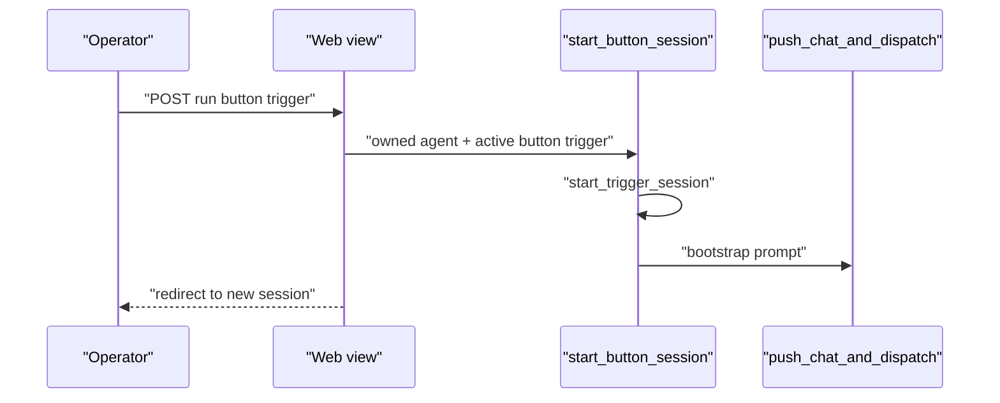

# Button triggers — Design

**Branch:** `feat/2026-08-02-button-triggers`
Status: **review**

Architecture reference: [`docs/ARCHITECTURE.md`](../../ARCHITECTURE.md) · Trigger schema from
[Agent config schema](../2026-07-03-agent-config-schema/2026-07-03-agent-config-schema-design.md) ·
Schedule/queue dispatch from
[Agent scheduling](../2026-07-05-agent-scheduling/2026-07-05-agent-scheduling-design.md).

Mermaid display labels: per [`superpowers/brainstorming`](../../../olib/ai/skills/superpowers/brainstorming/SKILL.md)
— **always quote** human-readable node/participant/edge text.

Add a **`button`** trigger kind: YAML-declared quick actions with a short
`button_text` label and a fixed `prompt`. Buttons render above the shared chat
box on agent and session pages; clicking always starts a **new** session with
that prompt (manual-like lifecycle — stays chatable after the turn).

---

## Goal

Operators can declare button triggers in agent YAML and run canned prompts with
one click above the chat box, without typing the message each time.

### Non-goals

- Injecting the prompt into the **current** session (always new session).
- Per-button icons, colors, confirm dialogs, or keyboard shortcuts.
- Celery beat / automatic firing (buttons are user-initiated only).
- `schema_version` bump (backward-compatible addition).
- Changing schedule/queue automated-terminate behavior.

---

## Current state

| Area | Today |
|------|-------|
| Trigger kinds | `manual`, `schedule`, `queue`, `agent` (agent reserved, no dispatcher) |
| Chatbox | Shared partial on agent detail + session detail; free-text start/continue |
| Schedule fire | Beat → `dispatch_schedule_trigger` → `start_trigger_session` + prompt |
| Manual start | `start_manual_session` — optional user message; stays `WAITING` after turn |
| Lifecycle | Schedule/queue auto-`DONE` at waiting; manual stays `WAITING` |
| Config helper | Kind select + prompt + cron (schedule only) |

---

## Schema (no `schema_version` bump)

```yaml
triggers:
  - name: triage-now
    kind: button
    button_text: Triage inbox
    prompt: Triage the inbox now. Summarize what you did.
```

| Field | Rule |
|-------|------|
| `kind` | New value `button` on `TriggerSpec` and `TriggerKind` |
| `button_text` | Required when `kind == button`; stripped non-empty; **max 40** chars |
| `prompt` | Required (same as schedule/queue); not allowed empty |
| `cron` / `queue` | Must not be set for `button` |
| `max_sessions` | Default **`null`** (unlimited), same as `manual` |
| Materialize | Existing path; full dict (incl. `button_text`) stored in `Trigger.spec` |

Config helper prompt placeholder / default prefill: **`add prompt here`**.

Update **`docs/docs/agents.md`** trigger kinds table in the same change.

---

## Start / dispatch



1. Authenticated owner POSTs to e.g. `/agents/<agent_id>/triggers/<trigger_id>/run/`.
2. Resolve agent (owned) + trigger: current config, `kind == button`, `ACTIVE`,
   agent `ACTIVE`.
3. Thin `start_button_session(agent, trigger)` (alongside `start_manual_session`):
   - Reuse `start_trigger_session`.
   - `push_chat_and_dispatch(session.id, trigger_prompt(trigger))`.
   - Update `last_fired_at` on success.
4. Redirect to the new session detail page.
5. Honor optional `max_sessions` when set; default unlimited.
6. Apply the same budget gate used by other starts; fail cleanly when blocked.
7. **Do not** add `button` to `_AUTOMATED_TERMINATE_KINDS` — sessions stay
   `WAITING` after the turn (manual-like).
8. No beat wiring.

From **session detail**, the same POST still starts a **new** session and
navigates there; the current session is unchanged.

---

## UI

- Shared chatbox context includes active button triggers for the agent’s current
  config, in YAML / materialization order.
- Render a row of short controls **above** the textarea on **agent detail** and
  **session detail**, labeled with `button_text`.
- Each control POSTs to the run endpoint (CSRF). Style with existing `frame-btn`
  patterns — no card chrome.
- When there are no button triggers, omit the row (chatbox unchanged).
- When the agent is not `ACTIVE`, do not offer clickable buttons (hide or
  disable — prefer hide to avoid dead controls).

---

## Config helper

- Add `button` to `catalog.trigger_kinds`.
- When kind is `button`, show required **Button text** input (max 40).
- Prompt row stays visible/required; placeholder / helper default:
  `add prompt here`.
- Cron row remains schedule-only; no queue field for button.
- `add_trigger` mutation writes `button_text` into the YAML entry.

---

## Testing

| Area | Coverage |
|------|----------|
| Spec | `button` requires `button_text` + `prompt`; rejects empty/overlong text; rejects cron/queue; `max_sessions` default null |
| Start | Creates session bound to button trigger; prompt dispatched; stays `WAITING` after turn (not auto-DONE) |
| Web | Buttons render on agent + session pages; POST redirects to new session; ownership 404; inactive agent rejected |
| Helper | Kind toggle shows `button_text`; mutation includes field |

---

## Acceptance criteria

1. YAML with `kind: button`, `button_text`, and `prompt` validates and materializes.
2. Buttons appear above the chat box on agent and session views for active agents.
3. Click starts a new session with the configured prompt and lands on that session.
4. After the turn, the session remains chatable (`WAITING`, not auto-`DONE`).
5. Config helper can add a button trigger with button text + prompt.
6. `docs/docs/agents.md` documents the new kind.

---

## Out of scope / follow-ups

- Injecting button prompts into an open session.
- Visual customization beyond label text.
- Rate limiting beyond optional `max_sessions` / existing budget gates.
