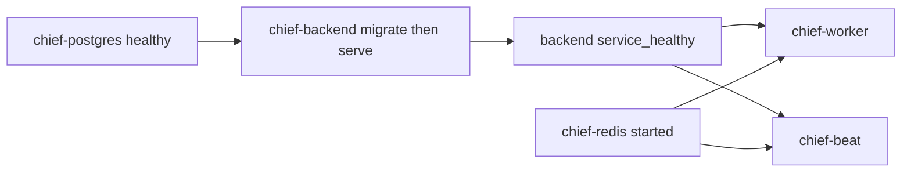

# Compose Celery waits for migrations

**Branch:** `feat/2026-08-02-compose-celery-migrate-gate`
Status: **plan**

## Goal

On a fresh Docker Compose stack, Celery Beat and the Celery worker must not start
until Django migrations have created required tables (including
`django_celery_beat_*`), so Beat does not crash with missing-relation errors.

## Context

`backend/entrypoint.sh` runs `./manage.py migrate --noinput` only for the
`web-server` entrypoint, before uvicorn starts. `chief-beat` currently depends
only on Redis (`service_started`). `chief-worker` depends on
`chief-backend` with `service_started`, which does not wait for migrate to
finish. On first start (empty Postgres volume), Beat queries
`django_celery_beat_crontabschedule` immediately and fails with
`ProgrammingError: relation ... does not exist`.

`chief-backend` already exposes a Compose healthcheck on `/health/livez`. Because
migrate completes before uvicorn listens, a healthy backend implies the schema
is applied for this compose bootstrap path.

## Design

In `infra/docker/docker-compose.yml`:

1. **`chief-beat`**: add `depends_on` on `chief-backend` with
   `condition: service_healthy`; keep Redis at `service_started`.
2. **`chief-worker`**: change the backend dependency from `service_started` to
   `service_healthy`; keep Redis at `service_started`.

No entrypoint, Dockerfile, or health-endpoint changes. Migrations remain owned
by the web-server compose bootstrap path.

## Scope

- Compose dependency conditions for beat and worker only.
- Document that healthy backend is the migrate gate for local compose.

## Out of scope

- Dedicated one-shot migrate service.
- Retry/wait loops in Celery entrypoints.
- Changing `livez` / `readyz` semantics.
- Kubernetes or hosted migration hooks.

## Verification

- Fresh compose (empty Postgres volume): Beat and worker containers remain
  waiting until backend is healthy, then start without
  `django_celery_beat_crontabschedule` missing-relation failures.
- Restart of an already-migrated stack still starts normally.
- Required Python checks (`./olib/scripts/orunr py test-all`) after any
  incidental code changes; this change is YAML-only if implemented as designed.

## Acceptance criteria

- `chief-beat` and `chief-worker` both require `chief-backend` with
  `condition: service_healthy`.
- First-start compose no longer fails Beat on missing celery-beat tables.
- No new migrate ownership outside the existing web-server entrypoint path.
