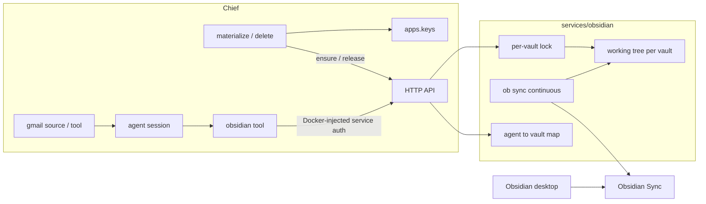
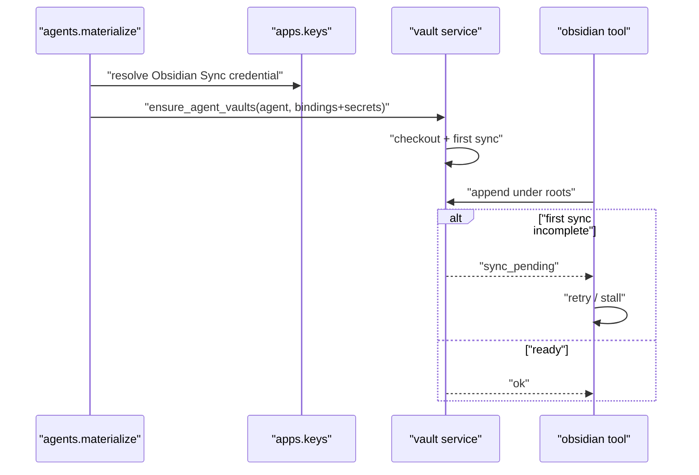

# Obsidian vault service — Design

**Branch:** `feat/2026-08-02-obsidian-vault-service`
Status: **plan**

Architecture reference: [`docs/ARCHITECTURE.md`](../../ARCHITECTURE.md) · Credentials:
[`docs/specs/2026-07-03-key-management/`](../2026-07-03-key-management/2026-07-03-key-management-design.md) ·
Tool/integration pattern:
[`docs/specs/2026-07-18-cloud-file-integrations/`](../2026-07-18-cloud-file-integrations/2026-07-18-cloud-file-integrations-design.md) ·
Agent materialize/delete lifecycle: `apps.agents.materialize`, `apps.agents.delete`

---

## Goal

Give Chief agents path-gated `list` / `read` / `write` / `append` access to
**Obsidian Sync** vaults so an agent can, for example, take journal emails from
Gmail and append them as markdown notes that appear in the operator’s Obsidian
desktop app.

Vault transport is **Obsidian Sync** (not Git). Chief never runs the Obsidian
desktop app. A dedicated **vault service** participates in Sync via official
**Obsidian Headless** (`ob`), materializes one working tree per vault, and
exposes an HTTP file API. Chief talks to that service; the vault service never
reads Chief’s Postgres.

### Non-goals (v1)

- Delete, move, rename, or explicit mkdir-as-primary ops (parents may be created
  on write/append).
- Binary / attachment blob APIs.
- Obsidian desktop CLI, Local REST API, or plugin APIs.
- Per-agent working-tree checkouts (one checkout **per vault**).
- Git (or other) mirrors of the vault as an alternate sync fabric.
- Vault service access to Chief’s database.
- Mixing Chief→vault **inter-service** auth with `apps.keys` provider credentials
  (Google, Obsidian Sync, etc.).
- Journal-specific platform parsers or hard-coded journal paths (agent skill +
  configured roots).
- Interactive Obsidian OAuth UI in the vault service.

---

## Current state

- Agents already ingest Gmail via sources/tools and write nowhere Obsidian-shaped.
- Cloud file tools (`google_drive`, `dropbox`) are metadata-only and use remote
  provider APIs — not a pattern for Sync-backed local trees.
- Local disk under `.local/` / `CHIEF_LOCAL_DIR` is for **keys/agents YAML
  providers**, not arbitrary vault content.
- Compose mounts `.local/` into backend/worker; there is no separate app service
  package yet (`services/` does not exist).
- Official **obsidian-headless** (`ob`) can `sync-setup` and
  `sync --continuous` without a GUI (open beta; requires Sync subscription).

---

## Architecture

### Split of responsibility

| Piece | Owns |
|-------|------|
| **Vault service** (`services/obsidian/`) | Headless Sync lifecycle; **one working tree per vault**; agent→vault binding map; path-root enforcement; per-vault locks; file HTTP API; first-sync readiness |
| **Chief backend** | `obsidian` tool + HTTP client; `apps.keys` for **Obsidian Sync** secrets; materialize/delete **ensure/release** notifications; path roots in agent config |
| **Compose / deploy** | `chief-obsidian` container; volume for trees + headless config; inject **inter-service** URL + token into backend/worker and vault service |



### Repo layout

```text
chief/
  backend/
    libs/clients/obsidian/     # HTTP client to vault service
    libs/tools/tools/obsidian.py
    apps/agents/               # ensure/release on materialize + delete
  services/
    obsidian/                  # Python HTTP service supervising `ob`
      Dockerfile               # Python + Node 22+ (for obsidian-headless)
  infra/docker/                # chief-obsidian Compose service + volume
```

### Checkout and sharing model

- **One working checkout per vault** (remote Sync vault identity), not per agent.
- Multiple agents may share a vault; each binding carries its own **path roots**.
- The vault service **refcounts** agents per vault. When the last agent releases a
  vault, tear down continuous sync and the working tree (no idle retain in v1).

---

## Vault service

### Runtime

- **Language:** Python HTTP service (framework chosen at plan time) that supervises
  `ob`.
- **Image:** Python base **plus Node 22+** with `obsidian-headless` on `PATH`.
- **Persistence:** Compose volume for vault working trees and headless local
  config/login state.
- **No Postgres / no Chief DB.** Bindings and readiness live in the vault
  service’s own process state (and on-disk checkout metadata as needed).

### HTTP API (v1)

Paths are vault-relative. Reject `..`, absolute paths, and escapes.

| Op | Semantics |
|----|-----------|
| Control: ensure agent vaults | Upsert bindings for an agent (vault id, roots, Sync secret material); start/reuse checkout + headless sync; refcount |
| Control: release agent vaults | Drop all bindings for an agent; tear down vaults with refcount 0 |
| `GET` vault status | Sync health, whether **initial full sync** completed, continuous process alive |
| `GET` list directory | Non-recursive list under a path (within roots) |
| `GET` file content | UTF-8 text read |
| `PUT` file content | Create/overwrite |
| `POST` append | Append text; create file (and parents) if missing |

Exact URL shapes are plan/implementation detail; semantics above are normative.

### First-sync gate

Until a vault’s **initial full sync** completes successfully:

- File ops (`list` / `read` / `write` / `append`) return a **retryable**
  `sync_pending` (or equivalent) error.
- After first sync is marked complete, ops proceed; later Sync blips may use the
  same retryable class where appropriate.

### Concurrency

- One **mutex per vault** around mutating file ops (and consistency with readiness).
- Continuous `ob sync` runs in the background; after a successful write/append,
  rely on continuous sync (and/or an explicit sync nudge if needed) to publish to
  Obsidian Sync. Status endpoint exposes last sync ok/error for debugging.

### Multi-vault

One service process may host N vaults (N trees + N supervised `ob` children or
equivalent). Container-per-vault remains a later deploy option; the API stays the
same.

---

## Auth and secrets

### Two distinct auth planes

| Plane | Mechanism | Storage |
|-------|-----------|---------|
| **Chief → vault service** (inter-service) | Shared service token (or equivalent) | **Docker/Compose (or deploy) env injection** into backend, worker, and vault service. **Not** `apps.keys`. |
| **Obsidian Sync** (headless login / E2E vault password) | Normal provider credential | **`apps.keys`** via `credential_ref` on the agent’s obsidian integration/tool. |

### Secret push (no DB on vault service)

On lifecycle **ensure**:

1. Chief resolves the Obsidian Sync credential with existing `resolve_*` /
   health-gated rules.
2. Chief **pushes** vault identity + secret material + path roots to the vault
   service over the control API (authenticated with the inter-service token).
3. Vault service retains only what it needs to run headless Sync for that vault.
4. Tool **invoke** paths do **not** re-send Obsidian secrets; they call file APIs
   for an already-provisioned agent/vault binding.

---

## Agent lifecycle (Chief notifies vault service)

Extend the existing agent materialize / delete lifecycle (same family as queues
`sync_from_spec`).

| Event | Chief | Vault service |
|-------|-------|---------------|
| Config materialize (obsidian tools present/changed) | `ensure_agent_vaults(agent_id, bindings[])` with resolved Sync secrets + roots | Upsert bindings; start/reuse one checkout+sync **per vault**; refcount |
| Config materialize (obsidian tools removed or roots/vault changed) | Ensure with the **desired** set only | Drop obsolete bindings; tear down vaults at refcount 0 |
| Agent deleted | `release_agent_vaults(agent_id)` from delete path | Remove all bindings for agent; tear down unused vaults |



Path roots are declared on the Chief tool instance, pushed at ensure time, and
**enforced by the vault service** on every file op (hard gate).

---

## Chief `obsidian` tool

**Type name:** `obsidian`.

### Config (tool instance / integration)

| Field | Role |
|-------|------|
| `vault` | Remote Sync vault id/name known to the vault service |
| `credential_ref` | `apps.keys` credential for Obsidian Sync |
| `roots` | Non-empty list of allowed path prefixes (Drive/Dropbox root spirit) |

### Functions (v1)

- `list` — directory listing under a path within roots
- `read` — file text
- `write` — create/overwrite
- `append` — append (create if missing)

Results use the shared integration `{ok, …}` / typed error shape.

### Retry / stall

On `sync_pending` and other **retryable** vault-service errors, the tool
implementation retries with backoff until success or the session/tool timeout.
Callers should treat this as stall-until-ready, not an immediate hard failure.

### Wiring

- `libs/clients/obsidian/` — Django-free HTTP client; base URL + inter-service
  token from **settings/env** (Compose inject).
- `libs/tools/tools/obsidian.py` — tool namespace; injectable client for tests.
- Document type-specific config in `docs/docs/agents.md` when implemented.

---

## Journal email use case (composition)

Not a special platform mode:

1. Gmail **source** enqueues journal messages (existing).
2. Agent session takes the item and drafts markdown.
3. Agent calls `obsidian.append` / `write` under a configured root (e.g.
   `Journal/…` via skill/prompt convention).
4. Vault service writes the working tree; headless Sync publishes; desktop
   Obsidian receives the note.

No new Gmail adapter is required for v1.

---

## Error handling

| Condition | Vault service | `obsidian` tool |
|-----------|---------------|-----------------|
| First sync incomplete | Retryable `sync_pending` | Stall/retry with backoff |
| Path outside roots / traversal | `outside_root` / `forbidden` | Hard failure |
| Missing file on read | `not_found` | Hard failure |
| Sync/process unhealthy after ready | Retryable where appropriate | Retry then fail |
| Bad inter-service auth | 401 | Hard failure |
| Missing/unhealthy Sync credential at ensure | Chief fails ensure / materialize path | Tool unavailable until fixed |

---

## Testing

- **Vault service:** unit tests for path gates, first-sync gate, ensure/release
  refcount and teardown; `ob` supervisor mocked.
- **Chief:** client + tool retry on `sync_pending`; materialize/delete hooks
  call ensure/release against a mocked vault service.
- **Compose smoke** (optional, later): not required to land the first
  implementation slice.

Verification uses `orunr` per project norms (`py test-all` for backend; vault
service test command defined when `services/obsidian` lands).

---

## Acceptance criteria

1. An agent configured with an `obsidian` tool, Sync credential, and roots can
   `append`/`write` a markdown file under an allowed root **after** first sync
   completes; tool calls may stall/retry until then.
2. Two agents bound to the **same** vault share **one** checkout; differing roots
   cannot access each other’s trees.
3. Removing the obsidian tool from a config (or deleting the agent) releases
   bindings; when the last agent releases a vault, sync and checkout are torn
   down.
4. `chief-obsidian` runs in Compose **without** Chief DB credentials; backend and
   worker call it over HTTP using Docker-injected inter-service auth.
5. Obsidian Sync secrets live in `apps.keys` and are pushed only on ensure — never
   mixed into the inter-service auth plane.

---

## Implementation notes (for planning)

- Prefer thin slices: vault service skeleton + ensure/release + first-sync gate;
  then file API; then Chief client/tool; then materialize/delete hooks; then
  Compose wiring.
- Update `docs/ARCHITECTURE.md` briefly when the `services/` boundary and
  `chief-obsidian` Compose service become real.
- Keep YAGNI: no delete/move, no per-agent checkouts, no separate secret store UI
  on the vault service in v1.
