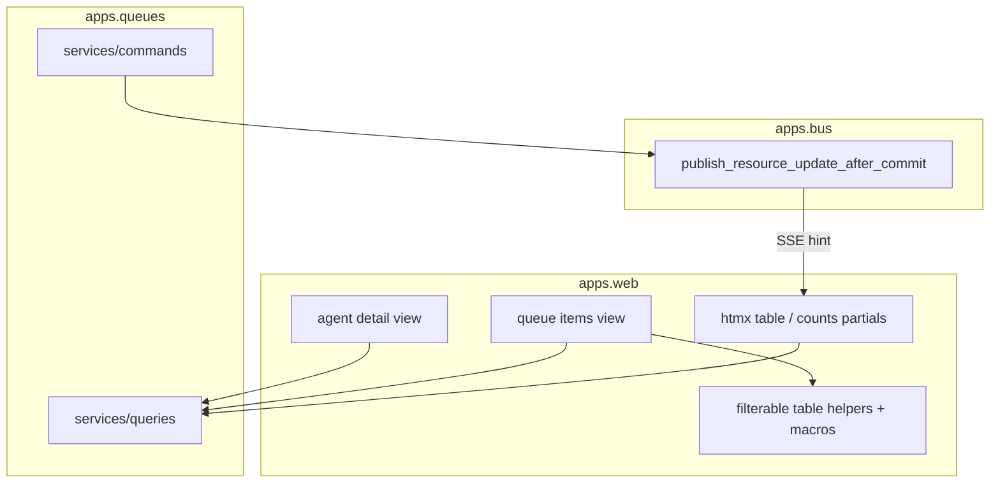

# Queue items UI — Design

**Branch:** `feat/2026-08-02-queue-items-ui`

Status: **plan**

Architecture reference: [`docs/ARCHITECTURE.md`](../../ARCHITECTURE.md) · Queues:
[`2026-07-04-sources-and-queues`](../2026-07-04-sources-and-queues/2026-07-04-sources-and-queues-design.md)
· Agent config UI (explicitly deferred live queue browser):
[`2026-07-04-agent-config-ui`](../2026-07-04-agent-config-ui/2026-07-04-agent-config-ui-design.md).

Mermaid display labels: per brainstorming skill — **always quote** human-readable
node/participant/edge text.

Give operators a path from the **agent screen** to a **per-queue items table** that
shows all items (including processed), with status and content, **server-side**
filter/sort/pagination, and **live** refresh via scoped resource SSE hints. Ship a
**reusable filterable-table primitive** under `apps.web` so later list screens reuse
the same query contract, macros, and htmx refetch pattern.

---

## Goal

Chief operators can:

1. See which queues an agent has from **agent detail**, with per-status item counts.
2. Open one queue at `/agents/<id>/queues/<queue_id>/` and browse **all** items
   (`available`, `taken`, `done`, `failed`, `exhausted`).
3. **Filter and sort** via URL query params (server-authoritative).
4. Scan a **truncated payload** preview and expand a row for full pretty-printed JSON.
5. See the table (and agent-detail counts) **update live** when queue mutations land,
   without a full page reload.
6. Rely on a **generalized table/filter stack** for this screen and future tables.

### Non-goals

- Migrating the existing Sessions table on agent detail to the new primitive (optional
  follow-up).
- Item mutations from the UI (requeue, force-fail, manual put) — read-only browser.
- Attempt-history detail page (attempts column + session link is enough for v1).
- Client-side-only filter/sort of the full queue.
- Session-style per-item SSE payloads (row merge); hints + refetch only.
- Cross-agent / global queue dashboard.
- Changing queue lifecycle semantics or payload envelope shape.

---

## Current state

| Area | Today |
|------|--------|
| Agent detail | Usage + Sessions + chat; **no Queues section** |
| Queue domain | `Queue` / `Source` / `QueueItem` / `QueueItemAttempt`; queries include `list_queues`, `list_queue_items` (status + limit only) |
| Web tables | Ad-hoc HTML tables; no shared filter/sort/pagination helper |
| Resource SSE | `resource_update` for `agents` \| `keys` only; `apps.queues` does **not** publish |
| Architecture | `apps.queues` may import Django/stdlib, `libs.sources`, sessions releasable predicate — **not** `bus` |

---

## Approach (locked): C — scoped hint + debounced table partial

| Piece | Decision |
|-------|----------|
| Navigation | Agent detail **Queues** section → one page per queue |
| Table data | Server-rendered; filter/sort/page via GET query params |
| Reuse | Shared web **filterable table** schema + macros + list-result type |
| Payload | Truncated cell; Alpine expand for full JSON (preserve expand id across swap) |
| Live updates | Extend `resource_update` with `queues` + optional `agent_id` / `queue_id`; debounced htmx refetch |

Rejected: coarse unscoped `queues` refetch only (A); session-style live row stream (B).

---

## Architecture



### Layering

- **Views (`apps.web`)**: auth, ownership, parse query string via table helper, call
  services, render templates / htmx partials. No ORM.
- **Queue queries (`apps.queues.services.queries`)**: owned-agent queue listing with
  status counts; filtered/sorted/paginated item listing returning a list-page DTO
  compatible with the web table helper.
- **Queue commands**: after successful mutations (and `sync_from_spec` when queues
  change), publish scoped resource hints (see Live updates).
- **Bus**: extend `ResourceName` / envelope validation; still secret-free, no row data.

### Architecture doc delta (implement with this feature)

Update [`docs/ARCHITECTURE.md`](../../ARCHITECTURE.md):

1. Allow **`apps.queues` → foundational `bus` publishers** (same class of import as
   `agents` / `keys`).
2. Document `resource_update` resource `"queues"` and optional scoping fields
   `agent_id`, `queue_id` (UUID strings). Postgres remains authoritative; hints are
   best-effort refetch signals.

---

## Pages and navigation

### Agent detail — Queues section

Path unchanged: `/agents/<uuid:agent_id>/`.

Add a **Queues** card/section:

| Column | Content |
|--------|---------|
| Queue | `queue_id` (link to queue page) |
| Counts | total plus breakdown by status (available / taken / done / failed / exhausted) |

Empty state when the agent has no queues. Section is an htmx-swappable partial so live
hints can refresh counts without reloading sessions/chat.

### Queue items page

`GET /agents/<uuid:agent_id>/queues/<slug:queue_id>/`

- Same agent frame chrome (name, config link, back to agent).
- Ownership: must own the agent; unknown `queue_id` → 404.
- Main: filter form + sortable table + pagination (table region is an htmx partial).
- Optional lightweight partial URL for refetch-only:
  `GET /agents/<id>/queues/<queue_id>/partials/items/` (same query params).

---

## Generalized filterable table (web primitive)

First consumer: queue items. Designed so a second screen can register a schema and
reuse templates without copying query parsing.

### Query contract

Shared parser in `apps.web` (e.g. `apps.web.tables` or `apps.web.services.table_query`):

| Param | Role |
|-------|------|
| `sort` | Allowlisted column key |
| `dir` | `asc` \| `desc` |
| `page` | 1-based page index |
| *(filters)* | Declared per table schema (`status`, `source`, `q`, …) |

Each page supplies a **TableSchema**: allowlisted sort keys (map to ORM/`order_by`),
default sort, page size, and typed filter declarations. **Never** pass raw client field
names into ORM `order_by`.

### List result

Frozen DTO shared by views/templates, e.g.:

- `rows`, `total`, `page`, `page_size`, `sort`, `dir`, `filters` (echo of applied values)

Domain query functions accept the parsed params and return this shape (or a thin wrapper).

### Templates

Jinja macros/partials under `templates/web/macros/` / `partials/`:

- Filter form (GET; preserves unknown-safe params)
- Sortable column headers (toggle `dir`, reset `page`)
- Pagination controls
- Table shell; **domain template fills columns/row cells only**

### Client helpers

Minimal shared behavior (Alpine and/or small static JS):

- Debounced htmx refetch of the table region on resource events
- Preserve expanded row id across swap (e.g. `data-expanded-id` or query/hash)
- No React; no full client-side dataset

---

## Queue table columns and filters

### Columns (v1)

| Key | Sortable | Display |
|-----|----------|---------|
| `status` | yes | Pill: available / taken / done / failed / exhausted |
| `created_at` | yes | Timestamp (default sort: **desc**) |
| `payload` | no | Truncated preview; expand → pretty JSON |
| `external_id` | yes | Text |
| `source` | yes | `source.source_id` or `—` |
| `attempt_count` | yes | Integer |
| `taken_by` | yes | Session link when `taken_by_session` set |
| `taken_at` | yes | Timestamp or empty |
| `completed_at` | yes | Timestamp or empty |
| `failure_reason` | no | Truncated; full via title and/or expand |

### Filters

| Param | Behavior |
|-------|----------|
| `status` | One status or all (omit / empty = all). Multi-select not required for v1. |
| `source` | Exact `source_id` or all |
| `q` | Case-insensitive contains on `external_id`, `failure_reason`, and a bounded string form of `payload` (implementation may use `Cast`/`::text` with a length cap — document chosen approach in plan) |

### Pagination

Fixed page size **50**. Out-of-range `page` clamps to last page or empty last page
consistently with other Chief list UIs (pick one in plan; prefer empty-safe clamp).

---

## Payload expand UX

- Collapsed: single-line (or few-line) truncated JSON/text preview.
- Expanded: in-row or immediately below-row `<pre>` with pretty-printed JSON.
- Toggle via Alpine on the row; only one expanded row required for v1.
- On live table swap, restore expansion if that item id is still on the page.

---

## Live updates

### Envelope

Extend validated resource messages:

```json
{
  "channel": "resource_update",
  "resource": "queues",
  "agent_id": "<uuid>",
  "queue_id": "<uuid>"
}
```

- `agent_id` / `queue_id` optional but **should be set** by queue commands when known.
- Unscoped `queues` hints are allowed; clients treat them as “refetch if any queue UI
  is visible.”
- No item payloads, secrets, or filter state in the envelope.

### Publishers

From `apps.queues` commands (after commit), using `agent.user_id`:

- `put_item`, `take_item`, `complete_item`, `fail_item`
- Stale release path when items change
- `sync_from_spec` when queue/source rows change (counts / existence)

Prefer one hint per committing unit of work; coalesce naturally via debounce on the
client.

### Client

- `base.html` (or shared resource script): map `queues` → `chief:queues-changed`.
- Queue page: on event, if hint matches this `agent_id`+`queue_id` (or unscoped),
  debounced htmx GET of the items partial **with current query string**.
- Agent detail: on event matching this `agent_id` (or unscoped), refetch Queues
  counts partial.
- Tolerate lost/coalesced hints; next hint or navigation converges.

---

## Error handling

| Case | Behavior |
|------|----------|
| Not authenticated | Login redirect (existing) |
| Agent not owned / missing | 404 |
| Queue slug missing for agent | 404 |
| Invalid `sort` / `dir` / `page` | Fall back to schema defaults (no 500) |
| Invalid filter enum | Ignore or treat as “all” (no 500) |
| SSE / Redis down | Page still works via manual refresh; hints best-effort |

---

## Testing

- **Web**: owned vs foreign agent/queue 404; table renders items including terminal
  statuses; filter/sort/pagination query params change ordering/membership; partial
  endpoint returns table fragment; invalid params fall back safely.
- **Table helper unit tests**: schema allowlist rejects unknown sort keys; dir
  normalization; page clamping.
- **Queues queries**: filtered list + counts match fixtures across statuses/sources.
- **Bus / SSE**: `queues` resource accepted; scoped fields round-trip; unknown resource
  still rejected; client event name wiring covered like agents/keys tests.
- **Commands**: mutation publishes after-commit hint with expected agent/queue ids
  (mock publisher).
- Browser/Playwright only if existing Chief UI tests already cover similar htmx
  partials; otherwise Django client + JS unit coverage is enough for v1.

---

## Acceptance criteria

1. Agent detail lists that agent’s queues with status counts and links.
2. Queue page shows all item statuses in a table with the columns above.
3. Filter/sort/pagination work via URL and survive live refetch.
4. Payload expands to full pretty JSON; expansion can survive a live swap for an
   on-page row.
5. Queue mutations cause a debounced table (and agent counts) refresh for the
   matching scoped hint.
6. Shared table schema/macros/helpers exist and are used by the queue page (not a
   one-off copy-paste stack).
7. `ARCHITECTURE.md` documents `queues` resource hints and `apps.queues` → `bus`.

---

## Implementation notes (for planning)

- Prefer extending `list_queue_items` (or a new `list_queue_items_page`) rather than
  querying from web.
- Resolve `user_id` for publish via `queue.agent.user_id` (select_related as needed).
- Keep page size and debounce constants named and documented in one place.
- Do not invent a second SSE endpoint; reuse `/events/` user resource stream.
