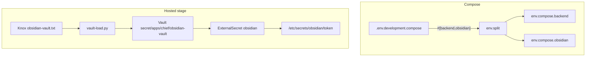

# Obsidian vault inter-service token — Design

**Branch:** `feat/2026-08-29-obsidian-vault-token`
**Infrabase branch:** `feat/2026-08-29-obsidian-vault-token`

Status: **implementing**

Architecture reference: [`docs/ARCHITECTURE.md`](../../ARCHITECTURE.md) · Vault
service: [`docs/specs/2026-08-02-obsidian-vault-service/`](../2026-08-02-obsidian-vault-service/2026-08-02-obsidian-vault-service-design.md) · Hosting:
[`docs/specs/2026-07-18-chief-dev-hosting/`](../2026-07-18-chief-dev-hosting/2026-07-18-chief-dev-hosting-design.md)

---

## Goal

Give Compose a **hardcoded, well-known** inter-service bearer token so
`chief-obsidian` and backend/worker/Beat share auth without `.env.local`. Give
hosted deployments a **Vault-backed auto-created secret** (never a git
hardcode), mounted the same way as Django/`CREDENTIALS_KEY`.

Ship **two PRs**:

| PR | Repo | Branch |
|----|------|--------|
| Compose + production `_FILE` path + docs | **chief** | `feat/2026-08-29-obsidian-vault-token` |
| vault-load + ExternalSecret + chart mounts | **infrabase** | `feat/2026-08-29-obsidian-vault-token` |

**Merge order:** merge **infrabase first** (or the same day, before the next
stage env deploy). Chief’s production layer will set
`OBSIDIAN_VAULT_TOKEN_FILE`; if that env ships while Helm still lacks the
mount, FileAwareEnv fails stage pods. Compose does not wait on infrabase.

### Success criteria

- `orun docker compose` bakes a non-empty `OBSIDIAN_VAULT_TOKEN` into both
  `.output/env.compose.backend` and `.output/env.compose.obsidian` **without**
  `.env.local`.
- The value is declared in tracked `.env.development.compose` (env.split
  generates `.output/`; do not edit generated files).
- `.env.local` may still override; `.env.local.example` must **not** assign a
  blank token (that would wipe the compose default).
- Hosted Python workloads (backend, worker, Beat) receive
  `OBSIDIAN_VAULT_TOKEN_FILE=/etc/secrets/obsidian/token` from `.env.production`.
- `vault-load.py` auto-creates `$KNOX/chief/{cluster}/obsidian-vault.txt` on
  `dev` (`create_source_if_missing`) and loads Vault path
  `secret/apps/chief/obsidian-vault`.
- The Chief Helm chart ExternalSecret + volume mount that file; migration and
  static do **not** get it.
- Docs (`ARCHITECTURE.md`, `docs/docs/agents.md`) distinguish compose hardcode
  vs Knox/Vault for hosted.

### Non-goals

- Deploying an Obsidian vault **workload** on Kubernetes.
- Setting `OBSIDIAN_VAULT_URL` in production (backend continues to skip vault
  ensure when URL is empty).
- Putting the inter-service token in `apps.keys`.
- Changing bearer-auth behavior in the vault service (already requires a
  non-empty token at import).
- Auto-creating Google/Dropbox OAuth app secrets (operator-provided; different
  plane).

---

## Current state

- Compose injects `OBSIDIAN_VAULT_URL=http://chief-obsidian:8100` in
  `infra/docker/docker-compose.yml`. The **token is not** in that YAML.
- `.env.development.compose` has `#[obsidian]` with **blank**
  `OBSIDIAN_VAULT_TOKEN=` so the obsidian env group always exists.
- Operators are told to set the real value in `.env.local` under
  `#[backend,obsidian]`. Blank compose default means the vault container
  refuses to start until that file exists.
- Django `settings.OBSIDIAN_VAULT_TOKEN` defaults to `''`. Vault service
  `main.py` raises if the env is empty.
- `.env.production` has no `OBSIDIAN_VAULT_TOKEN_FILE`. Chart secrets are
  postgres, redis, django, credentials only. `vault-load` has no
  `chief-obsidian-vault` entry.

---

## Architecture



Two auth **sources**, one env **name**:

| Environment | Token source | Mechanism |
|-------------|--------------|-----------|
| Compose | Tracked well-known string | `#[backend,obsidian]` in `.env.development.compose` |
| Hosted | Auto-generated per cluster | Knox file → Vault → ESO → `*_FILE` |

Chief never reads Knox. Deployment tooling and Helm materialize env/files.

### Compose (Chief PR)

Replace the blank `#[obsidian]` token with a **shared group** assignment:

```text
#[backend,obsidian]
OBSIDIAN_VAULT_TOKEN=compose-obsidian-vault-token
```

Keep a short comment: this is local-only (same class as `POSTGRES_PASSWORD=nimda`);
do not use it in hosted clusters.

`#[backend,obsidian]` is enough for env.split to emit both group files. Do not
leave a second blank `OBSIDIAN_VAULT_TOKEN=` in the same compose file.

`.env.local.example`: drop the live `OBSIDIAN_VAULT_TOKEN=` line. Comment that
an optional `#[backend,obsidian]` override is possible; copying a blank
assignment would override the compose default because later files win.

### Hosted env (Chief PR)

`.env.production` (backend group) adds:

```text
OBSIDIAN_VAULT_TOKEN_FILE=/etc/secrets/obsidian/token
```

`FileAwareEnv` already supports `*_FILE`. No settings.py change unless tests
need it. Do **not** hardcode a token value in `.env.production`.

Architecture + agents docs: production structured secret
`$KNOX/chief/{cluster}/obsidian-vault.txt` key `token` →
`OBSIDIAN_VAULT_TOKEN` / `OBSIDIAN_VAULT_TOKEN_FILE`. Compose uses the
well-known string above.

### Infrabase PR

`runbooks/vault/vault-load.py` — new secret after `chief-credentials`:

| Field | Value |
|-------|--------|
| `name` | `chief-obsidian-vault` |
| `vault_path` | `secret/apps/chief/obsidian-vault` |
| `source_file` | `$KNOX/chief/{cluster}/obsidian-vault.txt` |
| `format` | `env` |
| `fields` | `token`: `key=token`, `length=32`, `min_length=16` |
| `create_source_if_missing` | `True` |
| `clusters` | `['dev']` |

Chart `values.yaml`: `vault.obsidianVaultPath: "secret/data/apps/chief/obsidian-vault"`
(same `secret/data/…` prefix as existing Chief paths).

`templates/externalsecrets.yaml`: add dict
`name: obsidian`, path `.Values.vault.obsidianVaultPath`, keys `token`.

`templates/deployment.yaml`: for backend, celery-worker, celery-beat only —

- volume `obsidian-secrets-volume` from secret `obsidian`
- mount `/etc/secrets/obsidian` read-only

Do **not** mount on static or the migration hook (migration does not call the
vault service).

`validate_chief_vault_load` and `validate_chief_render_contract` (`app_secrets`)
must include the new secret. README tables in `charts/chief` and
`charts/core-apps` list `chief-obsidian-vault`.

---

## Error handling

- Compose: vault service still fails fast on empty token (defense if someone
  blanks `.env.local` over the default).
- Hosted: missing file at `OBSIDIAN_VAULT_TOKEN_FILE` fails Django settings
  load (same as other `_FILE` secrets). That is why Helm must mount before
  the Chief env change is deployed.
- Backend with token but empty `OBSIDIAN_VAULT_URL`: existing skip-ensure
  behavior; no new failure.

---

## Testing

**Chief**

- `test_compose_config.py`: without `.env.local`, both `backend` and
  `obsidian` groups have `OBSIDIAN_VAULT_TOKEN=compose-obsidian-vault-token`;
  obsidian group still must not contain Postgres/`CREDENTIALS_KEY`/LLM/OAuth
  keys.
- `.env.local.example` has no `OBSIDIAN_VAULT_TOKEN=` assignment.
- `test_deployment_config.py`: production dict includes
  `OBSIDIAN_VAULT_TOKEN_FILE=/etc/secrets/obsidian/token`.
- Architecture tests: Knox path + compose hardcode language (exact strings
  pinned in tests like Google OAuth).

**infrabase**

- Extend `validate_chief_vault_load` with the `chief-obsidian-vault` contract.
- `app_secrets` includes `obsidian`; python deployments mount it; static and
  migration do not.

---

## Acceptance

- Two PRs on `feat/2026-08-29-obsidian-vault-token` (one per repo).
- Local compose vault auth works from tracked env alone.
- Stage can receive a generated token via Vault/ESO without committing it.
- No Obsidian k8s Deployment in this work.
