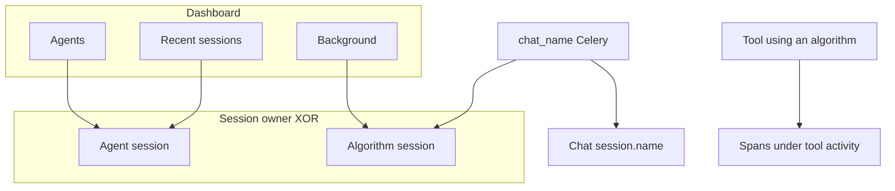
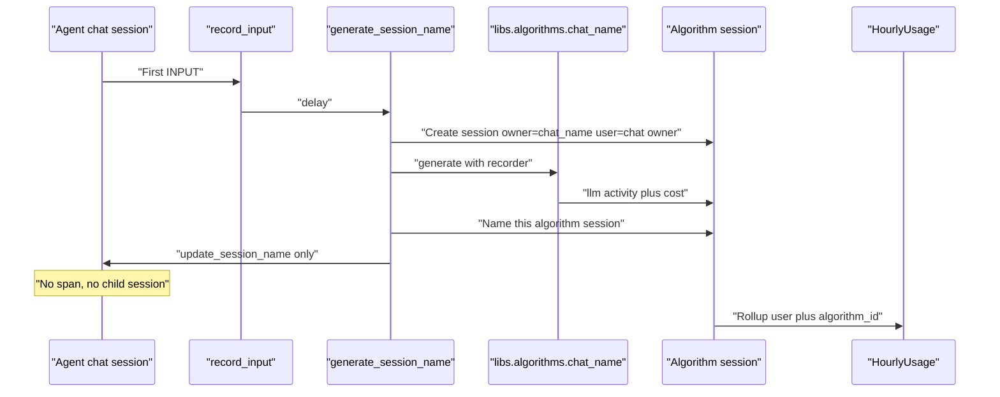

# Background algorithms — Design

**Branch:** `feat/2026-08-30-background-algorithms`
Status: **implementing**

Architecture reference: [`docs/ARCHITECTURE.md`](../../ARCHITECTURE.md) · Chat names:
[`docs/specs/2026-07-01-chat-names/`](../2026-07-01-chat-names/2026-07-01-chat-names-design.md) ·
Activity trees: [`docs/specs/2026-07-26-hierarchical-session-activities/`](../2026-07-26-hierarchical-session-activities/2026-07-26-hierarchical-session-activities-design.md)

---

## Goal

Give platform **algorithms** (one-shot LLM jobs such as session naming) the same
operator surface agents already have — a catalog, per-user **sessions**, activity
traces, and spend — without turning them into Agents.

After this spec:

1. The dashboard has a **Background** section listing registered algorithms.
2. Opening an algorithm shows **usage** (this user) and **that algorithm’s
   sessions**.
3. One-off algorithm work (e.g. chat naming) runs in a session **owned by the
   algorithm**, which names that session and records LLM cost there.
4. That spend rolls into **user** daily/monthly totals and **never** into the
   conversational **agent’s** spend.
5. Dashboard **Recent sessions** stays **agent-only**.

### Non-goals (v1)

- Algorithm rows in the Agents list, YAML config, queues, chat composer, or
  `run_session` runner loop.
- Emitting algorithm sessions (or spans) into the **agent** activity tree for
  one-off jobs such as rename.
- Creating a second algorithm session when an algorithm runs **inside a tool**
  (spans nest under that tool).
- Mixing algorithm sessions into dashboard Recent sessions.
- Counting algorithm spend against agent daily/monthly caps.
- Manual algorithm session start from the UI.
- Per-algorithm spend limits (user rolling cap only).

---

## Current state

- `libs/algorithms/chat_name.py` is the only algorithm. `generate_session_name`
  calls `provider.collect()` with the chat owner’s credentials, writes
  `AgentSession.name` on the **chat**, and records **no** activity, tokens, or
  `cost_usd`.
- Spend and run counts come from `AgentSessionActivity` (kinds `llm` / `tool`)
  rolled into `HourlyUsage` keyed by **`agent_id`**. User totals are
  `HourlyUsage` filtered by `agent__user_id`. Anything that bypasses the runner
  is invisible to traces, dashboards, and budgets.
- `AgentSession` **requires** `agent` and `agent_config`. There is no algorithm
  owner.

---

## Decisions (locked)

| Topic | Choice |
|-------|--------|
| Abstraction | Algorithms stay libs + a code registry. They are **not** Agents. |
| One-off runs | Own `AgentSession` (same table / activity tree). Owner is the algorithm. |
| In-tool runs | Inject `ActivityRecorder`. Spans belong to the **tool**. No algorithm session. |
| Agent chat tree | Rename (and other one-offs) do **not** appear there. Chat only gets a name patch. |
| Spend | **User** totals include algorithm sessions. **Agent** totals do not. |
| Recent sessions | Agent-owned sessions only. |
| Catalog | Code registry, always listed (including zero runs). Not user-created YAML. |

---

## Architecture

### Two invocation modes

**One-off / background** — Celery (or later cron) creates an algorithm-owned
session, attaches a session `ActivityRecorder`, runs the lib, persists traces
and cost on that session, then applies any side effect on another domain object
(e.g. chat `name`). `parent_session` is null. Optional `details` may store
`target_session_id` for operators; that is **not** a subagent link and must not
create `child_session_id` on the chat.

**Inside a tool** — Caller already has an agent session and a tool activity.
The algorithm is a function plus `ActivityRecorder`. Nested `span` / `llm`
rows use the current parent scope. **Do not** open an algorithm session (that
would duplicate the run under Background).

Tools are algorithms invoked from an agent turn. Background algorithms are the
same compute with a different recorder owner.

### Catalog

`libs.algorithms` exports a registry of stable string ids (v1: `chat_name`)
with display name and the existing pydantic config struct. The dashboard lists
the registry for the logged-in user and left-joins that user’s usage/session
counts. No Django `Algorithm` table in v1 unless implementation finds a FK
helpful; stored ids must match the registry.

---

## Data model

Keep a single session table. Extend `AgentSession`:

| Field | Agent session | Algorithm session |
|-------|---------------|-------------------|
| `agent` / `agent_config` | Required; config belongs to agent | **Null** |
| `algorithm_id` | **Null** | Required; registry id (e.g. `chat_name`) |
| `user` | Optional denormalize, or keep deriving from `agent.user` | **Required** (billed user / key owner) |
| `parent_session` | Allowed (subagents) | **Null** for v1 one-offs |
| `trigger_type` | `trigger` / `tool_call` | New value **`algorithm`** |

Check constraint: **exactly one** of (`agent_id` set and `algorithm_id` null)
or (`algorithm_id` set and `agent_id` null and `user_id` set). Algorithm
sessions skip agent-config ancestry checks. Owner fields stay immutable after
create (extend the existing freeze set with `algorithm_id` / `user_id`).

Session lifecycle for v1 jobs: create `running`, finish `done` (or `done` with
a failed `llm` activity). Not dispatched through `apps.runner.tasks.run_session`.

### `HourlyUsage`

Today: unique `(agent, hour, model)`, user spend via `agent__user_id`.

Change:

- `user` required on every row (backfill from `agent.user` for existing rows).
- `agent` nullable; `algorithm_id` nullable (same XOR as sessions).
- Unique agent buckets: `(agent, hour, model)` where `agent_id` is set.
- Unique algorithm buckets: `(user, algorithm_id, hour, model)` where
  `algorithm_id` is set.

`aggregate_hourly_usage` continues to roll up terminal `llm` / `tool`
activities. Agent-owned activities populate agent buckets; algorithm-owned
activities populate algorithm buckets. **Never** copy algorithm-session cost
onto the chat’s agent.

Budget queries:

- `agent_daily_spend` / `agent_monthly_spend` — `agent_id=…` (unchanged
  meaning; algorithm rows excluded).
- `user_daily_spend` / `user_monthly_spend` — `user_id=…` (agents **and**
  algorithms).

Runner limit checks for **agent** sessions keep using agent rollup + user
rollup. Naming does **not** consume the conversational agent’s remaining
budget. If the **user** rolling cap is already exhausted, skip the LLM and use
the existing fallback title; still allowed to write a short algorithm session
with a failed/skipped activity so the miss is visible under Background.

---

## Chat naming (first algorithm)

Replace the current fire-and-forget `collect()` with:

1. Load chat session + owner `user_id` (unchanged).
2. Create algorithm session `algorithm_id=chat_name`, `user_id=…`.
3. Run `generate_chat_name` with a recorder and `ProviderLLMConfig` (same
   cheap model / user key as today).
4. Persist `llm` (and optional `span`) with tokens, `cost_usd`, latency.
5. Set **this** session’s `name` (algorithm names its own session — typically
   the generated title, else fallback).
6. `update_session_name` on the **chat** as today (idempotent; SSE
   `session_update`). No activity on the chat.

Lib boundary: keep Django out of `libs.algorithms`. Return structured result
(title + usage) and/or accept an injected recorder. The Celery task owns
session create/complete.

Idempotency: if the chat already has a name, no-op (no extra algorithm
session). Retries after a partial create must not leave duplicate billed LLM
calls without a story — prefer create session first, then LLM, then both name
writes; treat “chat already named” as abort without a second provider call.

---

## UI

**Dashboard**

- New **Background** card (below Agents, above Usage): one row per registry
  algorithm — name, this user’s daily (and/or monthly) spend, session count or
  latest run. Click → algorithm detail.
- **Recent sessions**: query `agent_id` is not null only.
- User Usage section already uses `user_*_spend`; it will include algorithms
  once rollup lands.

**Algorithm detail** (`/algorithms/<algorithm_id>/` or equivalent)

- Same spirit as agent detail: usage numbers for **this user + this
  algorithm**, then a sessions table linking to existing session detail.
- No configuration, queues, delete-agent, or chatbox.

**Session detail**

- Reuse the activity tree, SSE, cost header.
- If owner is an algorithm: hide composer / agent chrome; breadcrumb back to
  Background / that algorithm. Do not show a parent chat breadcrumb unless we
  later add an explicit operator link from `details` (not v1).

Access: same logged-in user as `session.user` / `session.agent.user`.

---

## App boundaries

No new Django app required in v1.

| Place | Responsibility |
|-------|----------------|
| `libs.algorithms` | Registry, configs, generate functions, optional recorder protocol |
| `apps.sessions` | Session XOR owner, usage rollup, `generate_session_name`, queries |
| `apps.web` | Background list, algorithm detail, session page mode, agent-only recents |
| `apps.runner` | Unchanged for algorithm jobs; user spend queries start including algorithm buckets |

Update [`docs/ARCHITECTURE.md`](../../ARCHITECTURE.md): `AgentSession` owner
XOR, `HourlyUsage` user + algorithm buckets, sessions tasks for algorithm
runs, dashboard Background. `apps.sessions` may import `libs.algorithms` from
tasks **and** commands that start algorithm sessions.

---

## Error handling

- Provider failure: existing fallback title on the chat; algorithm session
  records failed `llm` with whatever usage the provider returned.
- User cap exhausted: fallback title; optional skipped session (see above).
- Chat already named: no algorithm session, no LLM.

---

## Testing

- Session model: XOR constraint; algorithm session without agent_config;
  agent session unchanged; ancestry still agent-only.
- Aggregation: algorithm `llm` cost in user totals, absent from
  `agent_*_spend` of the related chat’s agent; no double count.
- `generate_session_name`: creates algorithm session with cost; names both
  sessions; no chat activities; idempotent when chat named.
- Dashboard / queries: recents exclude algorithm sessions; Background lists
  registry; algorithm detail scoped to user.
- Tool path (unit): algorithm with recorder does not create a session (can be
  a chat_name-with-recorder test; no product tool must call it in v1).

Avoid the words **error / exception / warning / deprecated** in test names
(parproc). Use failure / raises / invalid / legacy.

---

## Acceptance criteria

- Background lists `chat_name` (and later registry entries) for a logged-in
  user, including zero-run.
- After a first chat message, a `chat_name` session exists with an `llm`
  activity and cost when the provider succeeded; the chat title still updates
  via SSE; the chat activity tree has no rename span or child session.
- User daily/monthly spend includes that cost; the chat agent’s spend does
  not.
- Recent sessions on `/` shows only agent sessions.
- Algorithm session page shows the trace and no chat composer.
- In-tool algorithm use (when it exists) does not create a Background session.

---

## Implementation notes

- Generate Django migrations with `orunr django manage makemigrations`; do not
  hand-write schema files.
- Do not add env vars for algorithm tuning (existing chat-name config struct).
- Do not add license headers (pre-commit).
- Feature work lands on **`feat/2026-08-30-background-algorithms`**, not
  `main`.
