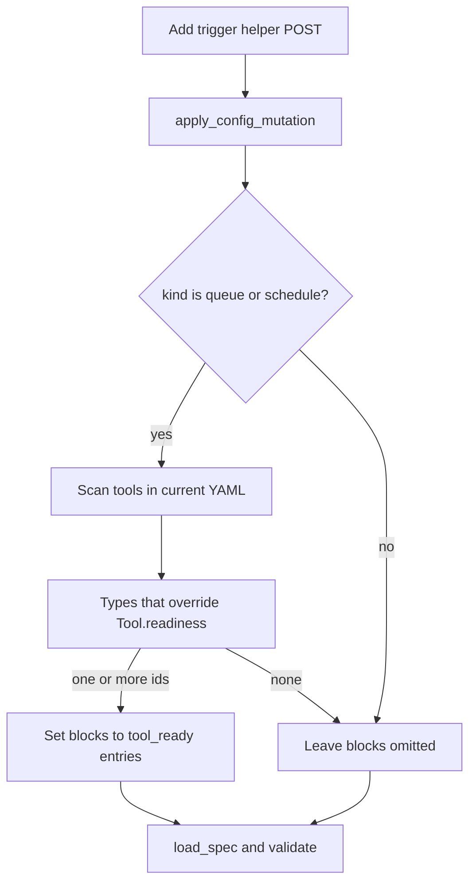

# Config helper auto-gates queue/schedule triggers on tool readiness — Design

**Branch:** `feat/2026-08-30-helper-trigger-tool-ready`
Status: **plan**

Architecture reference: [`docs/ARCHITECTURE.md`](../../ARCHITECTURE.md) · YAML helpers from
[Agent configuration UI](../2026-07-04-agent-config-ui/2026-07-04-agent-config-ui-design.md) ·
Trigger `blocks` / `tool_ready` from
[Trigger block conditions](../2026-08-30-trigger-block-conditions/2026-08-30-trigger-block-conditions-design.md).

Mermaid display labels: per [`superpowers/brainstorming`](../../../olib/ai/skills/superpowers/brainstorming/SKILL.md)
— **always quote** human-readable node/participant/edge text.

When the config editor **Add trigger** helper inserts a **queue** or **schedule**
trigger, automatically attach `tool_ready` blocks for every tool instance already in
the spec whose type reports readiness (today: Obsidian). Operators should not have to
remember the YAML for the journal-worker pattern. Manual and button triggers stay
ungated. Editing or removing blocks stays YAML-only.

---

## Goal

An operator who already added an Obsidian (or other readiness-reporting) tool, then
uses **Add trigger** for a queue or schedule worker, gets a trigger that will not
start sessions until those tools are ready — the same `blocks` shape documented in
`docs/docs/agents.md`.

### Non-goals

- A helper form field, dropdown, or “no gate” control for `blocks`.
- Auto-patching **existing** triggers when a readiness-reporting tool is added later.
- Auto-gating **manual**, **button**, or **agent** triggers.
- A general block-condition editor (multiple kinds, reorder, edit, remove).
- Queue id / `max_sessions` helper fields (pre-existing helper gaps).
- Changing runtime `blocks` evaluation or Obsidian `readiness()`.

---

## Current state

| Area | Today |
|------|-------|
| Runtime | Trigger `blocks` with `tool_ready` is ingested and evaluated (trigger-block-conditions on `main`) |
| `Tool.readiness` | Default always ready; `ObsidianTool` overrides and probes vault status |
| Add trigger helper | Server mutation writes name, kind, prompt, cron, button_text, optional queue / max_sessions |
| Helper UI | Kind, prompt, cron, button text — **no** `blocks` |
| Opt-out | Only by editing YAML after insert (or never using the helper) |

Helper mutations already re-validate the whole document after patch
(`apply_config_mutation` → `load_spec` → `validate_agent_config_spec`), so injected
`blocks` fail the same way as hand-written YAML (unknown tool id, unknown kind).

---

## Approach (locked)

**Server-side auto-inject in `add_trigger`.** No new UI. Eligibility is “this
registered tool type overrides `Tool.readiness`”, not a hardcoded `'obsidian'`
string in the mutation layer.

---

## Architecture



| Piece | Change |
|-------|--------|
| `apps.agents.services.config_mutations` | On `add_trigger`, after building the trigger map, if `kind` is `queue` or `schedule`, attach `blocks` from the current document’s tools |
| Helper HTML / JS | **None** |
| Catalog | **None** — eligibility is computed from the YAML + tool registry at mutation time |
| Schema / runtime gate | **None** |

`apps.agents` already imports `libs.tools`. Look up `get_tool(type)` and treat the
type as readiness-reporting when `type(tool).readiness is not Tool.readiness`.
Unknown or unregistered types are not eligible (same as always-ready defaults).
Do not import `apps.obsidian`.

---

## Injection rules

Apply only when **all** of:

1. Mutation `action` is `add_trigger`.
2. Mutation `kind` is `queue` or `schedule`.
3. The in-memory YAML document already has a `tools` list with at least one
   eligible instance.

Then set:

```yaml
blocks:
  - kind: tool_ready
    tool: <id>
```

one entry per eligible instance, in **document `tools[]` order** (AND, matching
runtime). Omit the `blocks` key entirely when the eligible set is empty — do not
write `blocks: []`.

| Input | Result |
|-------|--------|
| Clock-only spec + schedule trigger | No `blocks` |
| One Obsidian tool `journal-vault` + queue trigger | One `tool_ready` for `journal-vault` |
| Two Obsidian tools + schedule trigger | Two `tool_ready` entries, spec order |
| Manual or button + Obsidian tools present | No `blocks` |
| Queue/schedule added **before** any Obsidian tool | No `blocks` (add the tool first, or edit YAML) |
| `tools:` valueless / missing | Treat as empty; no `blocks` |
| Tool row missing `id` or `type` | Skip that row |

Do not merge with caller-supplied `blocks` on the mutation payload: the helper never
sends that field. Computed blocks are the only source for this path.

Instances whose `type` is registered but still uses the base `readiness`
implementation (clock, gmail, …) are **not** eligible, even if someone later
calls `readiness()` at dispatch (it would always pass).

---

## Error handling

- Injected blocks go through the existing spec validator. A `tool_ready` pointing at
  an id that is not in `tools[]` cannot occur if we only copy ids from that list.
- If the rest of the trigger is invalid (e.g. queue kind without `queue`), validation
  fails as today; do not special-case `blocks`.
- Mutation still preserves comments via ruamel round-trip.

---

## Operator docs

In the same implementation change, add a short note under **Block conditions** in
[`docs/docs/agents.md`](../../docs/agents.md): the config editor **Add trigger**
helper auto-inserts `tool_ready` blocks for queue and schedule triggers when the
spec already contains readiness-reporting tools; other kinds and later edits are
YAML-only. Keep the schema tables in that file aligned if helper text is the only
addition (no new fields).

---

## Testing

All in `apps.agents.tests.test_config_mutations` (existing helper mutation suite):

- Schedule (or queue) add with an `obsidian` tool already in YAML → dumped trigger
  includes `kind: tool_ready` and that tool id.
- Same add with only `clock` (or no tools) → dump has no `blocks` / `tool_ready`.
- Manual (and button) add with an Obsidian tool present → no `blocks`.
- Two Obsidian instances → both ids appear, in tools-list order.
- Valueless `tools:` + schedule add → no `blocks`, mutation still succeeds for a
  valid schedule trigger.
- Existing comment-preservation and valueless-`triggers:` cases still pass.

No new Playwright coverage: the form does not change.

---

## Acceptance criteria

1. Adding a queue or schedule trigger via the helper, when the current YAML already
   has at least one Obsidian (or other readiness-overriding) tool, writes
   `blocks: [{kind: tool_ready, tool: <id>}, …]` for those instances.
2. Adding the same kinds with only always-ready tools (or no tools) does not write
   `blocks`.
3. Manual and button helper inserts never get auto `blocks`.
4. Adding a readiness-reporting tool **after** a queue/schedule trigger does not
   rewrite that trigger.
5. No new helper controls; opt-out is delete the YAML `blocks` after insert.
6. `docs/docs/agents.md` describes this helper default.

---

## Out of scope / follow-ups

- Helper field to opt out at insert time.
- When adding an Obsidian tool, backfill `blocks` onto existing queue/schedule
  triggers.
- Auto-gating other trigger kinds.
- Exposing `reports_readiness` in the config catalog (unnecessary while eligibility
  is mutation-only).
