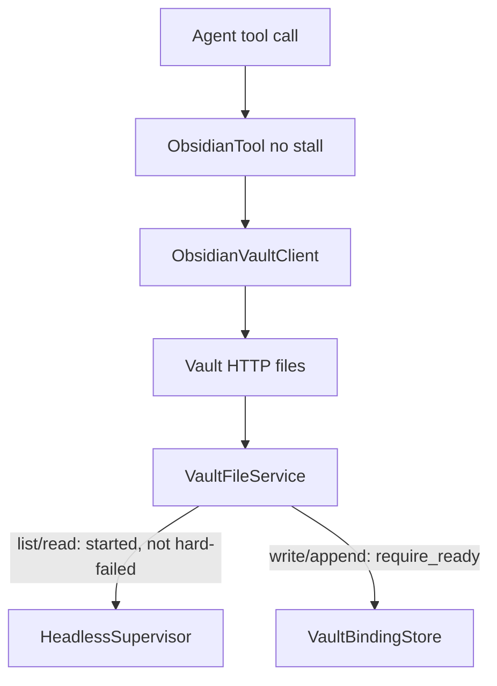

# Obsidian list/read during first sync — Design

**Branch:** `feat/2026-08-30-obsidian-read-during-first-sync`
Status: **plan**

Architecture reference: [`docs/ARCHITECTURE.md`](../../ARCHITECTURE.md) · Vault service:
[`docs/specs/2026-08-02-obsidian-vault-service/`](../2026-08-02-obsidian-vault-service/2026-08-02-obsidian-vault-service-design.md) ·
Status tool: [`docs/specs/2026-08-30-obsidian-vault-status/`](../2026-08-30-obsidian-vault-status/2026-08-30-obsidian-vault-status-design.md) ·
Session gate: [`docs/specs/2026-08-30-trigger-block-conditions/`](../2026-08-30-trigger-block-conditions/2026-08-30-trigger-block-conditions-design.md)

---

## Goal

Stop treating first-sync **pending** as a blanket file-op denial. Agents (and
operators) may **`list` / `read` a partial checkout while the initial Sync is
still running**. **`write` / `append` stay forbidden until first full Sync
completes** (today’s `ready` / `.sync-ready` — not a live “caught up” signal).

Waiting for a *complete* vault before work starts is **trigger `blocks` /
`tool_ready`**, not a ~30s tool stall. This spec **removes file-op retry** on
`sync_pending` / `unavailable` so a session that did start does not sleep on
not-ready writes. That supersedes the trigger-block design’s non-goal that
tool retry “remains a backstop.”

### Non-goals (v1)

- A stronger Sync “caught up / idle” signal (`ob sync-status`, log scraping).
- Changing `GET /v1/vaults/{vault_id}/status` fields or `tool_ready` semantics.
- Making `ensure_vault` HTTP return before one-shot `ob` finishes (the ensure
  request may still block; other requests must not wait on that work).
- Allowing writes during first sync, timeout leftovers, or hard `ob` failure.
- Vault-service webhooks, new tool functions, or `schema_version` bump.

---

## Current state

- Every file op calls `VaultBindingStore.require_ready` and returns retryable
  `sync_pending` until `.sync-ready` flips store `ready`.
- `ObsidianTool` retries `sync_pending` / `unavailable` ~30s, then surfaces the
  failure to the LLM.
- `ensure_vault` holds the **same per-vault lock** as file IO for the whole
  one-shot `ob sync-setup` + `ob sync`, so skipping `require_ready` alone would
  still stall `list`/`read` behind first sync.
- `ready` means first full Sync completed, not live catch-up.

---

## Behavior

| Vault state | `list` / `read` | `write` / `append` | `status` / trigger `tool_ready` |
|-------------|-----------------|--------------------|----------------------------------|
| Sync never started (no ensure / never entered supervisor) | `sync_pending` immediately | `sync_pending` immediately | `ready: false` |
| First sync in progress (one-shot running; partial tree) | Allowed (partial / racy OK) | `sync_pending` immediately | `ready: false` |
| Setup/sync **hard failure** (non-zero `ob`, not timeout) | `unavailable` | `unavailable` | `ready: false` |
| Timeout leftover (partial tree, not marked ready) | Allowed | `sync_pending` immediately | `ready: false` |
| First sync complete (`.sync-ready`) | Allowed | Allowed | `ready: true` |
| Auth / no binding / vault HTTP down | existing `auth` / `unavailable` | same | fail-closed for blocks |

Missing paths in a partial tree stay `not_found`. Outside roots stay
`outside_root`. `status` is unchanged: `ready: false` is a successful
observation, not `sync_pending`.

---

## Architecture

### Vault service — two gates

- **Write gate:** `require_ready` on `write` / `append` only. Same meaning as
  today (store `ready` after `.sync-ready`).
- **Read gate:** agent is bound **and** first sync has **started**, **and** the
  vault is not in **hard-failed**. No `require_ready`. Supervisor tracks
  started/failed independently of the ready marker (set “started” when
  `ensure_vault` begins; set “failed” on non-zero `ob`; timeout is not failed).

### Vault service — locks

Keep a per-vault **lifecycle** lock so two ensures cannot double-start `ob`,
and a per-vault **file** lock for **mutating** file ops (`write` / `append`).

- Do **not** hold the file lock (or the lifecycle lock) across one-shot
  `ob sync-setup` / `ob sync` waits. `list` / `read` must proceed while that
  work runs.
- Lifecycle lock covers: decide start vs reuse, record started/failed/ready,
  start/stop the continuous child, write/clear `.sync-ready`.
- `list` / `read` take neither lock for the duration of `ob`. Torn reads of
  files `ob` is rewriting are accepted. `stop_vault` may race in-flight reads
  the same way.

### Chief tool

Remove `_call_with_retry` from **all** file ops (`list` / `read` / `write` /
`append`). `status` already does not retry. Typed failures including
`sync_pending` and `unavailable` map through `_failure` on the first response.

Trigger `tool_ready` still uses `GET .../status` → `ready` only.

### Docs

- `docs/docs/agents.md` and ARCHITECTURE: until first full Sync, `list`/`read`
  may see a **partial** tree; `write`/`append` return `sync_pending`
  immediately; the tool does **not** stall; session delay is trigger `blocks`.

---

## Error handling

| Condition | Kind | HTTP (vault service) |
|-----------|------|----------------------|
| Write/append before `ready` (pending, timeout leftover, never started) | `sync_pending` | 503 |
| List/read never started | `sync_pending` | 503 |
| Hard `ob` failure | `unavailable` | 500 |
| No agent binding | `unavailable` (unchanged) | 500 |
| Auth | `auth` | 401 |
| Path outside roots | `outside_root` | 403 |
| Missing file/dir | `not_found` | 404 |

No new error `kind`. Tool does not sleep between attempts.

---

## Testing

- File service: `list`/`read` succeed while `FakeSupervisor(auto_complete=False)`
  after `ensure_vault`; `write`/`append` still raise `SyncPendingError`.
- File service: never-started (bound but supervisor not entered) → list/read
  `SyncPendingError`; hard-failed → `unavailable` mapping.
- API: list during in-progress first sync returns entries; write returns
  `sync_pending` without waiting for ready.
- Supervisor: one-shot wait does not hold the file lock — a list/read issued
  while a fake `ob` is blocked in `wait()` returns (does not deadlock).
- Tool: `list`/`read`/`write`/`append` on `sync_pending` or `unavailable` make
  **one** client call and do not invoke injected sleep. Remove or replace tests
  that expect the 30s stall schedule for file ops.
- Mock client: list/read allowed on a not-ready seeded vault; write/append
  still raise `ObsidianSyncPendingError` until marked ready.

---

## Acceptance

- While first sync is in progress, `list`/`read` return vault data (possibly
  partial) without `sync_pending` and without the tool sleeping.
- `write`/`append` before `.sync-ready` return `sync_pending` immediately.
- Sync never started, or hard `ob` failure: `list`/`read` fail (`sync_pending`
  vs `unavailable` as in the table), not silent empty success.
- `status.ready` / trigger `tool_ready` still mean first full Sync only.
- Operator docs no longer describe a ~30s file-op stall as the wait for first
  sync.
