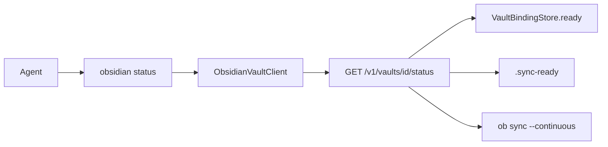

# Obsidian vault `status` tool function — Design

**Branch:** `feat/2026-08-30-obsidian-vault-status`
Status: **design**

Architecture reference: [`docs/ARCHITECTURE.md`](../../ARCHITECTURE.md) · Vault service:
[`docs/specs/2026-08-02-obsidian-vault-service/`](../2026-08-02-obsidian-vault-service/2026-08-02-obsidian-vault-service-design.md) ·
Operator schema: [`docs/docs/agents.md`](../../docs/agents.md)

---

## Goal

Give agents a read-only **`status`** function on the existing `obsidian` tool so
they can observe first-sync readiness and whether the continuous headless Sync
child is alive, without stalling like file ops. With instance id `vault`, the
wire name is **`vault__status`**.

Default payload is the vault service's existing
`GET /v1/vaults/{vault_id}/status` body, wrapped in the tool's `{ok: true, …}`
shape. Vault id comes from the tool instance `config.vault`.

### Non-goals (v1)

- Calling `ob sync-status` or `ob sync-config` (those dump **link/config**, not
  live Sync health).
- Inferring “caught up / idle” from `sync.log`, `state.db`, or `.sync.lock`.
- New vault-service endpoints or extra status fields.
- Triggering sync, ensure, or file IO from `status`.
- Changing file-op stall/retry behavior.

---

## Current state

- Vault service already implements `GET /v1/vaults/{vault_id}/status` returning
  `vault_id`, `ready`, `initial_sync_complete`, `sync_process_alive`.
- `ready` is an in-memory first-sync gate on `VaultBindingStore`, flipped when
  the supervisor sees `{data_dir}/vaults/{id}/.sync-ready` (written after
  successful `ob sync-setup` + one-shot `ob sync`). It is **not** from `ob`.
- `ObsidianVaultClient` has ensure/release and file methods only — no status.
- `ObsidianTool` exposes `list` / `read` / `write` / `append` and retries
  `sync_pending` / `unavailable` for ~30s. Agents that want to *observe*
  not-ready cannot do so without blocking.

---

## Architecture

| Piece | Change |
|-------|--------|
| Vault service | **None.** Reuse the existing status route. |
| `ObsidianVaultClient` + protocol + mock | Add `get_status(vault_id=...)` → typed dict. |
| `ObsidianTool` | Add readonly `status` with empty argument object; **no** stall retry. |
| Operator docs / journal example | Document the function; add `status` to explicit `allow` where we list functions. |

### Semantics of returned fields

These are the only live facts we currently know:

| Field | Source | Meaning |
|-------|--------|---------|
| `vault_id` | request + response | Configured Sync vault id/name |
| `ready` | in-memory store | File ops are allowed (`require_ready` would pass) |
| `initial_sync_complete` | `.sync-ready` exists | Setup + one-shot `ob sync` succeeded at least once this checkout |
| `sync_process_alive` | `Popen.poll() is None` | Continuous `ob` child is still running |

`ready: false` with `initial_sync_complete: false` is a **successful** status
read, not `sync_pending`. The status HTTP route returns 200 for unknown vaults
as all-false flags; the client must not map that to a typed failure.

### Tool contract

- **Wire name:** `{instance_id}__status` (e.g. `vault__status`).
- **Arguments:** `{}` only (`additionalProperties: false`, no required keys).
- **Readonly:** yes.
- **Dispatch:** `client.get_status(vault_id=config.vault)` once. Do **not** wrap
  in `_call_with_retry`. Transport/`unavailable` and other typed failures map
  through `_failure` immediately.
- **Success:** `{ok: true, vault_id, ready, initial_sync_complete, sync_process_alive}`.
- **Failure:** existing `{ok: false, error: {kind, message}}` kinds.

Agents with an explicit `allow` list must include `status` to call it (`*` still
allows all). Update `journal-obsidian.yaml` to include `status`.

### Client parsing

`get_status` GETs `/v1/vaults/{vault_id}/status` with the same bearer auth as
other methods. Success body must be a dict with:

- `vault_id`: non-empty `str`
- `ready`, `initial_sync_complete`, `sync_process_alive`: real `bool` (reject
  `0`/`1`/missing)

Otherwise raise `ObsidianUnavailableError`. Reuse existing error mapping for
non-2xx.

### Mock

`MockObsidianVaultClient.get_status` must **not** apply the file-op root/ready
gate. Unseeded vault ids return the all-false 200-equivalent dict. Seeded
vaults: `ready` from the record; `initial_sync_complete` same as `ready`;
`sync_process_alive` defaults to `True` when the vault is seeded (override via
an explicit setter if tests need a dead child).

---

## Testing

- Client: GET path, query-less URL, parsed bools, invalid body → unavailable,
  401 → auth (same as other methods).
- Mock: implements protocol; unseeded → all false; not-ready seed → `ready`
  false without raising `ObsidianSyncPendingError`.
- Tool: schema includes `status`; empty args dispatch; extra/unknown args
  config failure; `sync_pending`/`unavailable` from `get_status` are **not**
  retried (sleep list stays empty, one client call).

---

## Acceptance

- Agent can call `vault__status` with no args and receive the four fields above.
- File ops still stall/retry; `status` never sleeps on `sync_pending`.
- No `ob` subprocess on the status path.
- `docs/docs/agents.md` lists `status` and states clearly that this is Chief
  first-sync/process liveness, not Obsidian Sync “caught up”.
