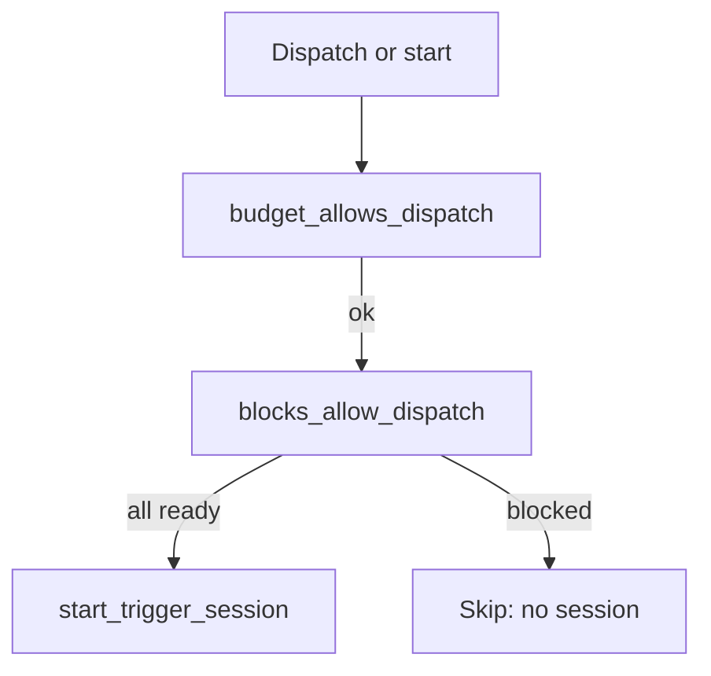

# Trigger block conditions — Design

**Branch:** `feat/2026-08-30-trigger-block-conditions`
Status: **design**

Architecture reference: [`docs/ARCHITECTURE.md`](../../ARCHITECTURE.md) · Trigger schema from
[Agent config schema](../2026-07-03-agent-config-schema/2026-07-03-agent-config-schema-design.md) ·
Dispatch from
[Agent scheduling](../2026-07-05-agent-scheduling/2026-07-05-agent-scheduling-design.md) ·
Button starts from
[Button triggers](../2026-08-02-button-triggers/2026-08-02-button-triggers-design.md) ·
Obsidian first-sync from
[Obsidian vault service](../2026-08-02-obsidian-vault-service/2026-08-02-obsidian-vault-service-design.md).

Mermaid display labels: per [`superpowers/brainstorming`](../../../olib/ai/skills/superpowers/brainstorming/SKILL.md)
— **always quote** human-readable node/participant/edge text.

Let any trigger declare **block conditions** that must all pass before Chief starts a
session. First condition kind is **`tool_ready`** (Obsidian vault first-sync). The
evaluator registry is open so later kinds need not be tools.

---

## Goal

An operator can keep a queue (or other trigger) from firing until a dependency is
useful — for example, do not take journal queue items until the Obsidian vault has
finished first sync. File ops already return `sync_pending`; this spec gates **session
start**, so the agent does not burn LLM turns against an empty or incomplete vault.

### Non-goals

- Named agent-level condition aliases (`conditions:` + trigger references).
- Vault-service webhooks or a new Celery beat for readiness.
- Catch-up for a blocked **schedule** tick (skip until the next cron).
- Pausing or cancelling **in-flight** sessions if readiness later drops.
- Timeouts that auto-disable the agent or trigger.
- `blocks` on sources, integrations, or queues themselves.
- `schema_version` bump (optional field only).
- Changing file-op retry inside `ObsidianTool` (remains a backstop).

---

## Current state

| Area | Today |
|------|-------|
| Vault readiness | Vault service gates **file** HTTP with `sync_pending` until first sync; `GET /v1/vaults/{vault_id}/status` reports `ready` |
| Obsidian tool | Retries `sync_pending` / `unavailable` ~30s, then returns the failure to the LLM |
| Queue dispatch | `put_item` + 15s beat fill slots; `take_item` then start session — **no** vault check |
| Schedule dispatch | Cron beat → capacity + budget → start; `last_fired_at` updated on the attempt |
| Manual / button | `start_manual_session` / `start_button_session`; budget gate on button |
| Lifecycle hooks | `apps.obsidian` registers materialize/delete; `apps.agents` must not import `apps.obsidian` |
| `Tool` base | No readiness API |

---

## Schema (no `schema_version` bump)

```yaml
triggers:
  - name: journal-worker
    kind: queue
    queue: journal
    prompt: Process the next journal item.
    blocks:
      - kind: tool_ready
        tool: journal-vault   # tools[].id
  - name: daily-check
    kind: schedule
    cron: "0 8 * * *"
    prompt: Run the daily check.
    blocks:
      - kind: tool_ready
        tool: journal-vault
  - name: triage
    kind: button
    button_text: Triage inbox
    prompt: Triage now.
    # omitted blocks → current behavior
```

| Field | Rule |
|-------|------|
| `blocks` | Optional list; omit or `[]` means no extra gates |
| Each entry | `kind` required (slug `^[a-z][a-z0-9_]*$`) plus kind-specific fields |
| Semantics | **AND** of all entries; evaluation order is list order (short-circuit on first not-ready) |
| `tool_ready` | Requires `tool`: a `tools[].id` on **this** spec |
| Unknown `kind` | **Ingest error** (typos must not silently never-block) |
| Extra fields | Rejected for the kinds we know |

Known kinds live in `libs.agent_spec` as an allowlist (starts as `tool_ready` only).
Adding a kind is a code + `docs/docs/agents.md` change in the same PR; still **no**
`schema_version` bump unless an existing kind’s fields change incompatibly.

`Trigger.spec` JSON already stores the trigger dict; materialize persists `blocks`
unchanged.

Update **`docs/docs/agents.md`** (trigger fields + `tool_ready`) in the implementation
change.

---

## Runtime: registry and gate



**`blocks_allow_dispatch(agent, trigger) -> BlockGateResult`** lives in **`apps.agents`**
so web can render blocked UI without importing `apps.runner`. Runner calls it next to
`budget_allows_dispatch`, **before** creating a session and **before** `take_item`.

**Kind registry** (same isolation as agent lifecycle hooks):

- `register_block_kind(kind, evaluate)` from `AppConfig.ready()`.
- `evaluate(agent, trigger, block) -> BlockResult(ready: bool, reason: str)`.
- `reason` is operator-facing; no secrets.
- **Fail closed:** missing handler, exception, or timeout → `ready=False`.

Built-in **`tool_ready`** (registered from agents or tools wiring, not from
`apps.obsidian`):

1. Resolve `tools[].id` from the agent’s current spec.
2. Call `Tool.readiness(ctx, instance) -> BlockResult`.
3. Default on `Tool`: `ready=True`.
4. `ObsidianTool.readiness` uses the same client factory as file ops and
   `GET /v1/vaults/{vault_id}/status` (`ready` true only when the vault reports ready).
   Extend `ObsidianVaultClientProtocol` / HTTP client / mock with `vault_status`.
   If `OBSIDIAN_VAULT_URL` is unset, treat as not ready (same skip-ensure idea as
   lifecycle, but fail closed for dispatch).

Later non-tool kinds (e.g. local-sync idle) register the same way Obsidian registers
materialize/delete; YAML only adds another `kind`. `apps.agents` / `apps.runner` still
do not import `apps.obsidian`.

---

## Per-kind dispatch

Evaluate blocks **outside** the trigger row lock when the probe is I/O (vault HTTP),
same as budget queries. Re-check under the lock only if we add a cheap cached bit
later; v1 re-probes once per dispatch attempt.

| Trigger kind | If blocked |
|--------------|------------|
| `queue` | Do **not** `take_item`. Do **not** create a session. Item stays `available`. Retry via existing **on-put** dispatch and **15s** `runner-dispatch-queue-triggers` beat. |
| `schedule` | Do **not** start a session. **Do** update `last_fired_at`. **No catch-up** on the 15s queue beat; next opportunity is the **next cron**. |
| `manual` / `button` | Raise `StartSessionError` including `reason`. No session row. |
| `agent` | No dispatcher; unchanged. |

No new beat. No vault→Chief “now ready” webhook in v1.

Capacity (`max_sessions`) is unchanged: a skipped fire does not occupy a slot.

---

## UI

- Button triggers that are blocked stay **visible**; click still hits start and returns
  the error, **or** the control is disabled with the `reason` when
  `blocks_allow_dispatch` is false at render (prefer disable + reason so the operator
  does not think the click failed mysteriously).
- No new SSE channel. Render-time probe is enough (one status GET per distinct
  Obsidian tool on the page). Optional short in-process cache is an implementation
  detail if the same agent page would probe repeatedly.
- Do not persist a “blocked” column in v1; Postgres remains session/trigger truth
  without a derived readiness row.

---

## Error handling

- Ingest: invalid `blocks` fail config save the same way other `TriggerSpec` errors do.
- Runtime logs at **info**: trigger id, block kinds, reasons (mirrors budget gate).
- Vault 5xx / network / `sync_pending` on status → not ready, not an exception out of
  the gate.

---

## Testing

- Spec: `blocks` optional; `tool_ready` requires a real `tools[].id`; unknown kind
  rejected; extra fields rejected; no `schema_version` bump.
- Queue: not ready → no take, item still available; ready → take and start.
- Schedule: blocked → no session, `last_fired_at` set; 15s queue dispatch does not
  start the missed schedule session.
- Button / manual: `StartSessionError` includes reason; budget still checked first
  (existing order: budget then blocks).
- `ObsidianTool.readiness` uses status + client factory; default `Tool.readiness` is
  ready.
- Registry: a test-registered kind can block without Obsidian.

---

## Acceptance criteria

- A queue trigger with `blocks: [{kind: tool_ready, tool: <obsidian id>}]` does not
  take items or start sessions while vault status is not ready; it does once ready,
  without a new beat.
- A schedule trigger with the same block skips that cron tick when not ready and does
  not run later until the next cron.
- Manual/button triggers honor `blocks` with a visible reason.
- Agents without `blocks` behave as today.
- `docs/docs/agents.md` documents `blocks` and `tool_ready`.
